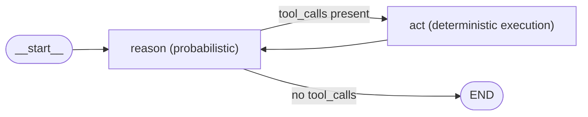

# Part 1: The Anatomy of an Agent

> Series roadmap: this Part builds the skeleton — state, model, loop, graph. Part 2 replaces the placeholder tool with real, type-safe tools. Part 6 wraps the graph in a Next.js app. Part 7 adds observability on top of the transcript this Part produces for free. Everything downstream depends on getting the shape right here, so we're going to move slower than a typical "hello world" and explain *why* each piece exists before we write it.

## 1. Deterministic vs Probabilistic — where this Part sits

Strip away the framework branding and an "agent" is a surprisingly narrow idea: **a system where an LLM decides, at runtime, what the next action is.** Not what the final answer is — what the *next step toward* the answer is. That single decision, made over and over, is the entire probabilistic core of the system. It's the one moment where you hand control to a model and accept that you don't fully know what it will do.

Everything else in this series — the graph plumbing, the state schema, the tool interface, the retry logic, the observability hooks — exists for one purpose: to make that one probabilistic decision **safe, observable, and resumable**. Worth sitting with that, because it reframes what you're actually building. You are not writing "an AI feature." You are writing a thin, deterministic harness around a small number of non-deterministic decision points, and the quality of your agent is mostly a function of how well that harness constrains, logs, and recovers from those decisions — not how clever the prompt is.

This matters for a practical reason too: it tells you where to put your engineering effort. Bugs in production agents are rarely "the model reasoned badly." They're almost always harness bugs — state getting clobbered, a tool call retried against a non-idempotent API, no ceiling on loop length, no record of what happened. Fix the harness first.

## 2. The ReAct Pattern

ReAct (**Rea**son + **Act**) is a loop, not a single call. It's easy to read a ReAct diagram once and think "sure, obviously," and then get the implementation subtly wrong because the loop has more structure than it first appears:

1. **Reason** — the model produces a thought about what to do next, given the current state and the tools available to it.
2. **Act** — the model emits a tool call: a name and a set of arguments, not a free-text guess.
3. **Observe** — the tool actually executes, and its real-world output is appended back into state.
4. **Repeat** from step 1 until the model decides it has enough information to answer, or a stop condition (max steps, a hard error, a cost ceiling) is hit.

The subtlety is in what's deterministic and what isn't. Reason and the model's choice of tool are probabilistic — an LLM call, full stop. But the *loop control* — whether to go around again, whether to stop, whether to force an answer — should not be. If you let the model decide when the loop ends purely through its own judgment, with no external ceiling, you've built a system with no upper bound on latency or spend. That's the single most common "it worked in the demo, it burned $400 in prod" bug in agent systems.

**Staff Engineer note:** naive ReAct has no upper bound on steps by construction — the loop above says "repeat until," and "until" is a promise, not a guarantee. Every production ReAct agent needs a hard step ceiling *and* a cost ceiling, enforced in code, not in the prompt. We'll build the step ceiling into the graph itself in section 6, and revisit why prompt-only enforcement isn't good enough in section 10.

## 3. Project Setup

```bash
pnpm init
pnpm add @langchain/langgraph @langchain/core @langchain/openai zod
pnpm add -D typescript tsx @types/node
```

A brief word on why these four runtime packages and no more: `@langchain/langgraph` gives us the graph engine (state machine + reducers + conditional routing); `@langchain/core` gives us the message types (`BaseMessage`, `HumanMessage`, etc.) that every node passes around; `@langchain/openai` gives us an OpenAI-compatible chat client, which — as you'll see in section 5 — is really a thin adapter, not a hard dependency on OpenAI itself; and `zod` is here now even though we don't use it until Part 2, because tool schemas are worth designing for from day one rather than bolting on later.

**tsconfig.json** (minimal, ESM, Node16 module resolution):

```json
{
  "compilerOptions": {
    "target": "ES2022",
    "module": "Node16",
    "moduleResolution": "Node16",
    "strict": true,
    "esModuleInterop": true,
    "skipLibCheck": true,
    "outDir": "dist"
  },
  "include": ["src"]
}
```

`strict: true` is non-negotiable for agent code specifically. Loose typing on a tool's arguments is how you end up with a model-generated string silently coerced into a number three layers deep in a function call, discovered only when a downstream API 500s. Type errors at compile time are cheap; type errors surfacing as a failed tool call at 2am in production are not.

Folder structure for the whole series — this is the shape every later Part extends, so it's worth internalizing now rather than re-learning it Part by Part:

```
src/
  agent/
    state.ts         <- graph state schema
    graph.ts          <- StateGraph wiring
    nodes/
      reason.ts
      act.ts
    model.ts          <- swappable LLM client
  tools/
    index.ts
  app/                 <- Next.js App Router (introduced Part 6+)
```

Notice what's *not* here yet: no `db/`, no `auth/`, no `observability/`. Those arrive exactly when they're needed (Parts 6 and 7). Resist the urge to scaffold for future Parts now — a lean skeleton makes it much easier to see, in this Part, exactly which four files are doing the actual agentic work.

## 4. Defining Graph State

LangGraph state is a typed, append-reducible object that flows through every node in the graph. Get this wrong and your agent silently drops history — this is the single most common bug in hand-rolled agent loops, and it's the actual reason most people reach for LangGraph instead of a plain `while` loop with an array. A hand-rolled loop makes you responsible for correctly appending to that array in every single code path; LangGraph makes the append behavior part of the schema, so it's structurally impossible to forget.

**src/agent/state.ts:**

```typescript
import { Annotation } from "@langchain/langgraph";
import type { BaseMessage } from "@langchain/core/messages";

export const AgentState = Annotation.Root({
  messages: Annotation<BaseMessage[]>({
    reducer: (current, update) => current.concat(update),
    default: () => [],
  }),
  stepCount: Annotation<number>({
    reducer: (_current, update) => update,
    default: () => 0,
  }),
  maxSteps: Annotation<number>({
    reducer: (_current, update) => update,
    default: () => 6,
  }),
});

export type AgentStateType = typeof AgentState.State;
```

**Why a reducer per field, not a plain object merge?** LangGraph re-invokes nodes with *partial* state updates — a node returns only the slice of state it touched, not the whole object. Without an explicit reducer, LangGraph's default behavior on a returned `{ messages: [newMsg] }` would be to overwrite `state.messages` entirely with that one-element array, destroying everything that came before it. The `concat` reducer above is what turns "the last thing a node returned" into "an append-only transcript."

That transcript is not a side effect — treat it as a first-class output of the system. It is your audit log, for free, with zero extra instrumentation code. It's exactly what Part 7's Langfuse integration reads from to render a trace view. If you design your state shape carelessly now, you'll be retrofitting observability later; design it as a transcript now, and observability in Part 7 becomes "point a viewer at data that already exists" rather than "add new instrumentation."

Note also the asymmetry between the three fields: `messages` accumulates, but `stepCount` and `maxSteps` *replace* on update (`(_current, update) => update`). That's deliberate — a step counter that concatenated would be nonsensical. The lesson generalizes: don't reach for `concat` reflexively on every field. Ask what "combining an old value with a new one" should actually mean for *this* piece of state, per field.

## 5. The Swappable Model Client

**src/agent/model.ts:**

```typescript
import { ChatOpenAI } from "@langchain/openai";

// OpenAI-compatible client. Point baseURL at Ollama, vLLM, Groq, or OpenAI itself.
// This is the ONLY file that changes when you swap model providers.
export function getModel() {
  return new ChatOpenAI({
    model: process.env.AGENT_MODEL ?? "gpt-4o-mini",
    temperature: 0,
    apiKey: process.env.AGENT_API_KEY ?? "ollama",
    configuration: {
      baseURL: process.env.AGENT_BASE_URL ?? "https://api.openai.com/v1",
    },
  });
}
```

**.env.example:**

```
AGENT_MODEL=gpt-4o-mini
AGENT_API_KEY=sk-...
AGENT_BASE_URL=https://api.openai.com/v1

# Local alternative (Ollama), uncomment to use:
# AGENT_MODEL=llama3.1
# AGENT_API_KEY=ollama
# AGENT_BASE_URL=http://localhost:11434/v1
```

The design goal of this file is isolation: every other file in `src/agent/` imports `getModel()` and never touches `ChatOpenAI`, an API key, or a base URL directly. That means swapping providers — moving from a hosted API to a local Ollama instance for offline dev, or from `gpt-4o-mini` to a larger model for a harder task — is a one-file, one-line change. If you find yourself importing `ChatOpenAI` anywhere outside this file later in the series, that's a sign the abstraction has leaked and it's worth pulling back into `model.ts`.

**On `temperature: 0`:** this is a deliberate trade-off, not a default left unexamined. Temperature 0 sacrifices creativity for reproducibility. For a ReAct agent, the model's job at each step is narrow — pick the right tool and the right arguments — not to write prose creatively. Reproducibility wins here: you want the same input to reliably produce the same tool call, both so your tests are meaningful (see Appendix B) and so that a failure in production is *reproducible* rather than a one-off ghost. If a later Part in this series has the model doing open-ended writing (drafting a summary, generating creative content), that's the signal to raise temperature for that specific call — but the tool-selection calls in the Reason node should stay at 0.

## 6. The Reason Node and the Act Node

These two files are the literal embodiment of "Reason" and "Act" from section 2 — not a metaphor, but a 1:1 mapping from pattern to code.

**src/agent/nodes/reason.ts:**

```typescript
import { getModel } from "../model.js";
import type { AgentStateType } from "../state.js";
import { toolDefinitions } from "../../tools/index.js";

export async function reasonNode(state: AgentStateType) {
  if (state.stepCount >= state.maxSteps) {
    // Hard ceiling — this is the guardrail against runaway loops/cost.
    return {
      messages: [
        {
          role: "assistant",
          content: "Step limit reached before a final answer was produced.",
        },
      ],
    };
  }

  const model = getModel().bindTools(toolDefinitions);
  const response = await model.invoke(state.messages);

  return {
    messages: [response],
    stepCount: state.stepCount + 1,
  };
}
```

Two things worth flagging here beyond the obvious. First, `bindTools(toolDefinitions)` is what turns a plain chat model into one that can emit structured tool calls instead of only free text — this is the mechanism, not just the syntax, that makes "Act" possible in section 2's loop. Second, the ceiling check happens *before* the model is even called, which means once you're at the limit you save the cost of an LLM call entirely — you don't invoke the model and then discard its answer, you just short-circuit. That's a small detail with real cost implications at scale.

**src/agent/nodes/act.ts:**

```typescript
import { ToolNode } from "@langchain/langgraph/prebuilt";
import { toolDefinitions } from "../../tools/index.js";

// ToolNode inspects the last AIMessage's tool_calls, executes matching
// tools, and appends ToolMessage results back into state.messages.
export const actNode = new ToolNode(toolDefinitions);
```

`ToolNode` is doing more than the comment suggests at first glance: it's the "Observe" step from section 2 as well as "Act." It doesn't just call the tool — it takes the tool's real return value and appends it back into `state.messages` as a `ToolMessage`, which is exactly what makes it visible to the *next* Reason call. Without that append step, the model would have no memory of what the tool returned, and every loop iteration would be reasoning in the dark.

## 7. Wiring the Graph

The routing decision — go back to Act, or stop — is expressed as a plain, deterministic function of state, with no LLM call inside it. This function is the entire "agentic" branching logic of the system reduced to code, and it's worth reading slowly:

**src/agent/graph.ts:**

```typescript
import { StateGraph, END } from "@langchain/langgraph";
import { AgentState, type AgentStateType } from "./state.js";
import { reasonNode } from "./nodes/reason.js";
import { actNode } from "./nodes/act.js";

function routeAfterReason(state: AgentStateType): "act" | typeof END {
  const lastMessage = state.messages[state.messages.length - 1] as any;
  const hasToolCalls =
    lastMessage?.tool_calls && lastMessage.tool_calls.length > 0;
  return hasToolCalls ? "act" : END;
}

const graph = new StateGraph(AgentState)
  .addNode("reason", reasonNode)
  .addNode("act", actNode)
  .addEdge("__start__", "reason")
  .addConditionalEdges("reason", routeAfterReason)
  .addEdge("act", "reason");

export const compiledAgent = graph.compile();
```

Here's the shape of the whole loop, laid out visually:



If the model's last message contains `tool_calls`, route to Act; otherwise the model has decided it's done, and we route to `END`. The pairing to internalize: **Reason is probabilistic** — an LLM decides — while **routeAfterReason is deterministic** — a pure function of state, inspecting a boolean-ish condition on the last message and returning one of two fixed strings. No randomness, no model call, fully unit-testable with a hand-constructed state object and no network access.

That pairing — one probabilistic node feeding a deterministic router — is the core LangGraph design idiom, and you'll see it recur in every later Part with more nodes added to the graph (a validation node, a human-approval node, a summarization node) but the same underlying shape: something the model decides, followed immediately by something code decides based on what the model produced.

## 8. Running It

**src/run.ts:**

```typescript
import { compiledAgent } from "./agent/graph.js";
import { HumanMessage } from "@langchain/core/messages";

const result = await compiledAgent.invoke({
  messages: [new HumanMessage("What's 42 * 17, then add 8?")],
});

console.log(result.messages.at(-1)?.content);
```

CLI:

```bash
pnpm tsx src/run.ts
```

Notice that we only supply `messages` on invocation — `stepCount` and `maxSteps` fall back to their `default()` values from the schema in section 4 (`0` and `6` respectively). That's the reducer/default machinery from section 4 paying off directly: the caller doesn't need to know or care about loop-control internals to run the agent.

**Debugging tip:** log `result.messages` in full, not just the last one, to see the entire Reason → Act → Reason transcript play out. It's genuinely useful to do this at least once before moving on — watch the array grow by one `AIMessage` (with `tool_calls`) then one `ToolMessage`, repeating, until a final `AIMessage` with no `tool_calls` ends the loop. This raw transcript is precisely what Part 7's Langfuse integration will visualize automatically instead of you eyeballing console output — so the five minutes you spend reading it now in raw form will make Part 7's dashboard click into place immediately, because you'll already know exactly what data is behind it.

## 9. Exercise Challenge

Extend the graph with a second conditional branch: if `stepCount` exceeds `maxSteps - 1` on entry to Reason, skip tool-binding entirely and force the model to answer directly with whatever it has — a "graceful degradation" path, distinct from the hard-stop shown in section 6.

This mirrors a real production requirement, so it's worth pausing on *why* before jumping to the solution: the hard-stop in section 6 fires only once the step budget is already exhausted, and its output — "Step limit reached before a final answer was produced" — is honest but useless to an end user. Nobody wants that message; they want *something*, even an imperfect answer built from partial information. The exercise is asking you to add a second, earlier threshold that trades "let the model try one more tool call" for "make the model commit to an answer now, before the budget runs out entirely." Try implementing it yourself before reading on — the shape of the fix is smaller than it sounds.

## 10. Solution

```typescript
export async function reasonNode(state: AgentStateType) {
  const nearLimit = state.stepCount >= state.maxSteps - 1;

  const baseModel = getModel();
  const model = nearLimit ? baseModel : baseModel.bindTools(toolDefinitions);

  const messages = nearLimit
    ? [
        ...state.messages,
        {
          role: "system",
          content:
            "You are nearly out of steps. Answer now using only information already gathered.",
        },
      ]
    : state.messages;

  const response = await model.invoke(messages);

  return {
    messages: [response],
    stepCount: state.stepCount + 1,
  };
}
```

**Why this works, mechanically:** unbinding tools on the final allowed step removes the *possibility* of another `tool_call` being emitted at all — not just discourages it, removes it, because a model without bound tools has no tool schema to call into. That means `routeAfterReason` (section 7) will always return `END` on the very next check — the graceful-degradation path is enforced **structurally by the graph**, not merely by prompt instruction.

That distinction is the real lesson of this exercise, and it generalizes well beyond this one guardrail: **never trust a prompt alone to enforce a hard constraint; enforce it in code where possible.** A system prompt telling the model "you're almost out of steps, wrap up" is good practice and worth keeping — models do respond to it — but it is not a *guarantee*. `bindTools` vs. no `bindTools` is a guarantee, because it's not asking the model to behave, it's removing the model's ability to misbehave in that specific way. Whenever you're deciding how to enforce a rule in an agent, ask whether it can be made structurally impossible to violate rather than merely discouraged.

## Common Pitfalls Recap

A short list worth keeping nearby while you build on this skeleton in later Parts:

- **Forgetting a reducer, or using the wrong one.** A missing reducer silently truncates history (section 4); a `concat` reducer on a field that should replace (like `stepCount`) silently corrupts it.
- **No step ceiling, or a step ceiling that's only a prompt instruction.** Section 2 and section 10 both point at the same fix: enforce loop bounds in code, in the graph's control flow, not in the system prompt alone.
- **Leaking the model client.** If `ChatOpenAI` gets imported outside `model.ts` (section 5), provider swaps stop being a one-line change.
- **Treating the message transcript as disposable.** It's your audit log and your future observability data source (section 4, section 8) — don't discard or truncate it casually.
- **Confusing "the model decided" with "the code decided."** Keep the probabilistic/deterministic boundary explicit at every branch point (section 1, section 7) — it's the single clearest lens for debugging an agent that's misbehaving.

## Next

Part 2 replaces the placeholder `toolDefinitions` import used above with real, Zod-validated, type-safe tools — and makes the case for why tool quality, not model quality, is usually the actual bottleneck in agent performance.
