# Co-Developing a Full-Stack Blog Platform

## An AI-Native Engineering System

### (OpenCode + Continue.dev + Human-Governed Development)

Building software with AI is no longer primarily a coding task.

It is a systems engineering discipline.

This guide uses a blog platform as the working example, with:

- OpenCode  
- Continue.dev  
- React  
- Next.js  
- shadcn/ui  
- Clerk  
- Sanity CMS  
- Appwrite  
- PostgreSQL  

But the goal is not the application itself.

The goal is to internalize a repeatable system for building production-grade software in an AI-native environment.

***

## Why This Is Not a Tool Replacement

Since Gemini CLI is no longer part of the stack, replacing it with OpenCode would be a category error.

OpenCode is not a drop-in substitute.

The original model framed responsibilities as:

```text
Continue.dev = implementation  
Gemini CLI = reasoning
```

That distinction no longer holds.

Modern OpenCode operates across both domains:

- repository-aware reasoning  
- architectural analysis  
- implementation orchestration  

The shift is not a tool replacement.

It is a change in how software systems are designed and governed.

What was previously:

```text
Continue.dev + Gemini CLI
```

Becomes:

```text
Continue.dev + OpenCode
```

But more importantly, the system evolves into:

- **Continue.dev** = Hands  
- **OpenCode** = Brain + Repository Intelligence  
- **Git** = Memory  
- **Human** = Authority  
- **Tests** = Reality  

This is the transition from a **toolchain** to a **cognitive system**.

***

## The Engineering Shift

Traditional development optimized for code production.

Developers spent most of their effort:

- writing logic  
- wiring systems  
- building APIs  
- generating boilerplate  

AI has reduced the cost of all of these.

What is now scarce:

- clear requirements  
- sound architecture  
- controlled integration  
- validation discipline  
- governance  
- operational reliability  

The central question has changed.

Not:

> Can AI build this?

But:

> Can we ensure the system being built is correct, safe, and maintainable?

***

## From Toolchain to Cognitive System

Modern software development should no longer be viewed as:

```text
Human → AI → Code
```

Instead, it should be understood as layered cognition:

```text
Human → Architecture → Reasoning → Implementation → Validation → Memory
```

Each layer has a distinct responsibility and failure mode.

### 🧠 The AI-Native Engineering Stack

Place this diagram immediately after the section above:

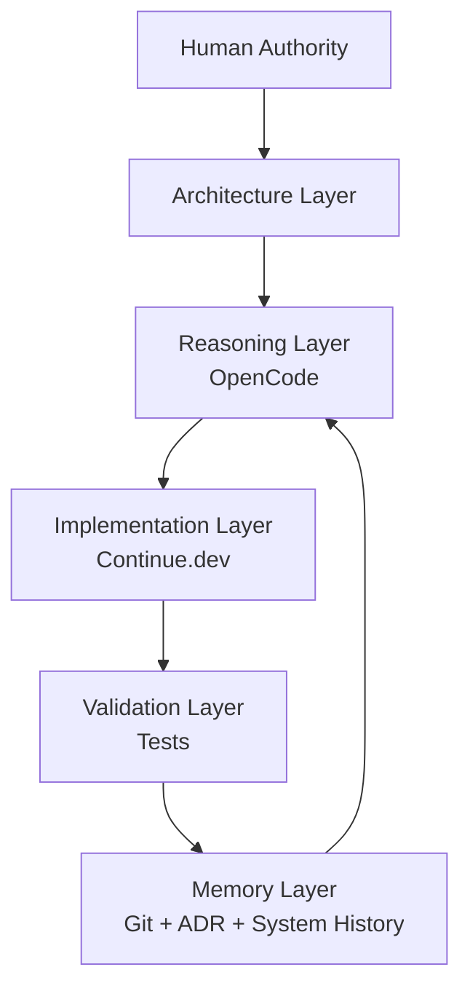

This establishes the **closed-loop system**, not a linear pipeline.

***

## Cognitive Division of Labour

The system flow is:

```text
Human → OpenCode → Continue.dev → Validation → Git/ADR
```

This separation is what prevents:

- hallucinated architectures  
- hidden coupling  
- uncontrolled drift  
- fragile systems  

OpenCode does not replace Continue.dev.

It **constrains and directs** it.

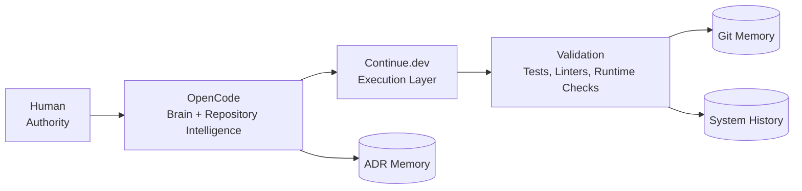

This clarifies **who does what** and where decisions persist.

***

## Human = Authority

The human remains the only accountable entity in the system.

AI generates possibilities.

Humans approve consequences.

Ownership includes:

- architecture decisions  
- risk acceptance  
- prioritization  
- production approval  
- tradeoffs  

**Core rule:**

> Responsibility must align with authority.

***

## OpenCode = Brain + Repository Intelligence

OpenCode’s primary value is not code generation.

It is **judgment**.

Use it for:

- system design  
- decomposition  
- dependency analysis  
- impact assessment  
- debugging strategy  
- architectural critique  
- ADR generation  

**Representative prompts:**

- What are we actually building?  
- What breaks if this changes?  
- Where is coupling hidden?  
- What assumptions are unsafe?  
- Challenge this design.  

OpenCode functions as:

```text
Engineering reasoning + system awareness
```

***

## Continue.dev = Hands

Continue.dev operates at the execution layer.

It is grounded in the repository and current implementation state.

Use it for:

- feature development  
- refactoring  
- test generation  
- code updates  
- local debugging  

**Representative prompts:**

- Implement Phase 4  
- Apply review feedback  
- Preserve behavior while refactoring  
- Generate tests for this module  

Continue.dev is best understood as:

```text
A precise execution engine
```

***

## The Prime Rule

Do not start with code generation.

Start with thinking.

**Failure pattern:**

```text
Idea → Code → Debugging loop
```

**AI-native pattern:**

```text
Problem → Requirements → Architecture → Plan → Code → Validation → Refinement
```

Planning is no longer overhead.

It is **risk control**.

### 🔄 Problem → Production Workflow

Add after: *The Most Important Rule*

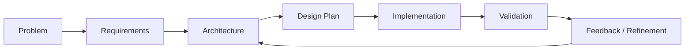

Reinforces: **thinking is iterative, not linear**.

***

## Source of Truth

AI systems require stable context.

Without it, outputs degrade rapidly.

**Minimum structure:**

```text
docs/
├── requirements.md
├── architecture.md
├── implementation-plan.md
├── risks.md
├── roadmap.md
├── prompts.md
├── system-history.md
└── adr/
```

These documents are not optional.

They are the system’s **working memory**.

***

## Three-Layer Memory Architecture

Most teams rely only on Git.

That is insufficient for AI-assisted systems.

You need three distinct memory layers:

- **Git** → what changed  
- **ADR** → why it changed  
- **System history** → what is currently true  

This prevents:

- context collapse  
- repeated mistakes  
- architectural drift  

### 📚 Three-Layer Memory Architecture

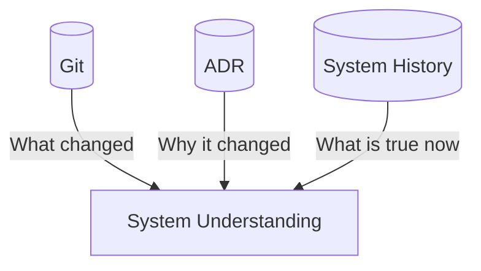

This is one of your strongest ideas—keep it visually simple and conceptual.

***

## Context Engineering

Prompt quality is secondary.

Context quality is decisive.

**Weak:**

```text
Create a blog editor
```

**Strong:**

```text
Review requirements.md, architecture.md, and ADRs.
Implement Phase 4 under existing constraints.
Follow prompts.md.
```

Better context produces better reasoning and safer execution.

### 🧩 Context Engineering Model

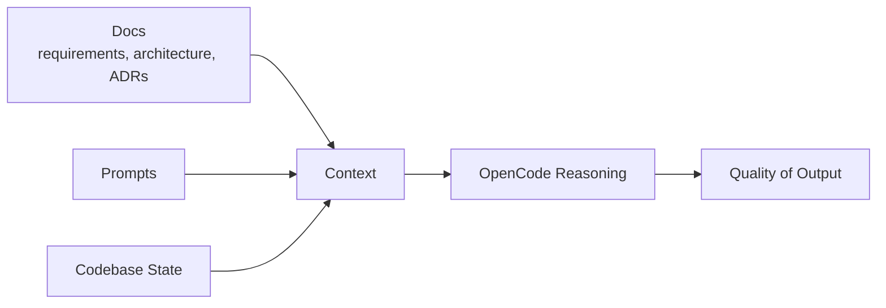

Key message: **context > prompting style**

***

## Contract-First Development

Before writing code, define:

- inputs  
- outputs  
- invariants  
- side effects  

**Example:**

```text
Input: Draft article
Output: Published article
Invariant: Versioning is preserved
Side effects: indexing, notifications, audit logs
```

Code should implement contracts.

Not invent them.

### 🧱 Contract-First Development

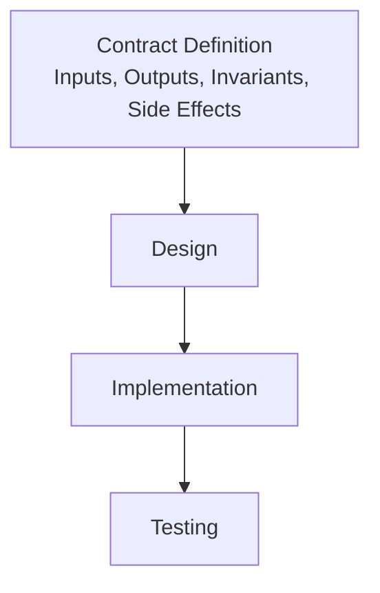

This visually enforces: **contracts precede code**

***

## System Architecture (Blog Platform)

The platform is intentionally layered:

- **Presentation** (React, Next.js) — UI, routing, accessibility  
- **Identity** (Clerk) — authentication and sessions  
- **Content** (Sanity CMS) — editorial workflows and structured content  
- **Transaction** (Appwrite, PostgreSQL) — user actions, analytics, state  

Clear boundaries reduce coupling and increase evolvability.

### 🏗 Blog Platform Architecture

Place immediately before: *Presentation Layer*

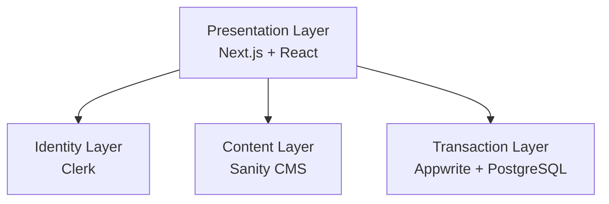

Clean separation of responsibilities.

***

## Presentation Layer

- **Technology**: React, Next.js, Tailwind, shadcn/ui  
- **Responsibilities**: rendering, routing, accessibility, user interaction  

***

## Identity Layer

- **Technology**: Clerk  
- **Responsibilities**: authentication, authorization, session management, user identity  

Passwords should never be handled directly by application code.

***

## Content Layer

- **Technology**: Sanity CMS  
- **Responsibilities**: content management, author profiles, editorial workflow, categories, tags, previews  

Content is managed separately from application state.

***

## Transaction Layer

- **Technology**: Appwrite, PostgreSQL  
- **Responsibilities**: bookmarks, comments, reactions, analytics, application state  

Transactional systems evolve differently from content systems.

Keep boundaries explicit.

***

## Feature Delivery Lifecycle

Every feature follows a governed loop:

1. Define problem  
2. Load context  
3. Analyze impact  
4. Design solution  
5. Challenge assumptions  
6. Implement  
7. Validate  
8. Review  
9. Commit  
10. Update memory  

Skipping steps introduces risk, not speed.

### 🔄 Feature Delivery Lifecycle

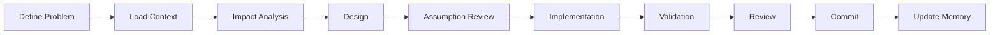

This maps directly to your operational workflow.

***

## Adversarial Review

AI tends toward agreement.

That is a liability.

Review must assume failure.

**Focus on:**

- security  
- data integrity  
- concurrency  
- performance  
- maintainability  

The goal is not approval.

The goal is discovering what breaks.

### ⚔️ Adversarial Review Model

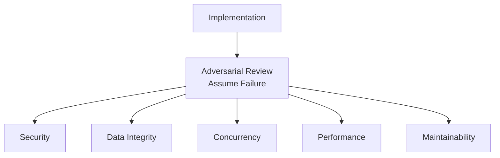

Frames review as **systematic risk discovery**.

***

## Validation = Reality

AI generates possibilities.

Validation determines truth.

Always validate:

- architecture  
- security  
- performance  
- accessibility  
- deployment readiness  

**Principle:**

```text
Generation creates value.
Validation protects it.
```

### 🧪 Validation as Reality

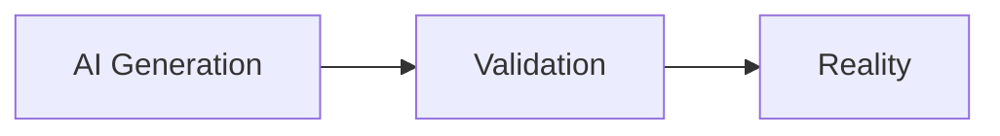

Minimal, but conceptually sharp.

***

## The 60/40 Shift

**Old model:**

```text
10% planning
90% coding
```

**AI-native model:**

```text
60% planning + validation
40% implementation
```

Because coding is no longer the bottleneck.

**Judgment is.**

***

## Tool Usage Clarity

**Use OpenCode when asking:**

- What should we build?  
- Why is this failing?  
- What risks exist?  
- What architectural tradeoffs are involved?  

**Use Continue.dev when asking:**

- How should we implement it?  
- How should this fit into the codebase?  
- How should we refactor this safely?  

***

## Final Identity Model

This system is best understood as:

```text
Human        = Authority
OpenCode     = Brain
Continue.dev = Hands
Git          = Memory
Tests        = Reality
```

The objective is not faster code generation.

It is **controlled, reliable, and explainable software systems**.

### 🚀 Final Identity Shift

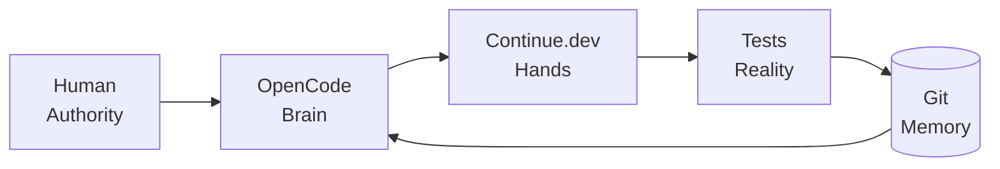

This ties everything together into a **living system loop**.
