# Setting Up a Private AI Server: The Ultimate FOSS Guide to Reusing an Old GPU Laptop

*A complete, zero-cloud blueprint for turning dead weight into an always-on inference cluster — with architecture diagrams, security hardening, RAG internals, observability, and a path to scale.*

## Table of Contents

1. [Why Bother? The Case for Local-First AI](#why-bother)
2. [Part I — Architecture Deep Dive](#part-i)
3. [Part II — Hardware Resurrection](#part-ii)
4. [Part III — The Inference Server (Ollama)](#part-iii)
5. [Part IV — Client Integrations](#part-iv)
6. [Part V — RAG Internals Deep Dive](#part-v)
7. [Part VI — Security: Defense in Depth](#part-vi)
8. [Part VII — Observability & Maintenance](#part-vii)
9. [Part VIII — Scaling Beyond One Node](#part-viii)
10. [Cost & Sustainability Analysis](#cost)
11. [Troubleshooting Matrix](#troubleshooting)
12. [Appendix: Reference Configs & Glossary](#appendix)

---

<a id="why-bother"></a>
## Why Bother? The Case for Local-First AI

You probably have an old gaming or workstation laptop sitting idle: battery degraded, fans loud, hinge squeaky — but still packing a dedicated GPU with several gigabytes of VRAM. Instead of letting it gather dust or shipping it to a recycler, you can turn it into a **private, always-on AI inference server** for your main machine, using only Free and Open Source Software (FOSS).

This isn't just a fun weekend project — it's a genuine, durable alternative to subscription-based AI tooling:

| Factor | Cloud AI SaaS | Local FOSS Server (this guide) |
|---|---|---|
| Monthly cost | $10–$200+/seat | ~$0 (electricity only, roughly $3–8/mo) |
| Data leaves your network | Yes, always | Never |
| Works offline / on a plane | No | Yes, once models are pulled |
| Rate limits / usage caps | Common | None — your hardware, your rules |
| Vendor lock-in | High | None — swap models/UIs freely |
| Hardware footprint | Zero (someone else's datacenter) | Reuses e-waste, extends device life |
| Model transparency | Opaque weights, opaque training | Fully open weights (Qwen, Llama, Mistral, etc.) |
| Auditability | Trust the vendor's policy | You control every log, every packet |

This guide walks through:

- Designing a clean, distributed local AI architecture.
- Hardening an old laptop for 24/7 headless operation (thermals, battery, watchdogs).
- Exposing Ollama securely over your local area network (LAN).
- Wiring up Continue.dev, Open WebUI, and several alternative FOSS clients.
- Integrating a local Retrieval-Augmented Generation (RAG) layer for private documents and codebases.
- Applying production-grade, defense-in-depth security and remote access patterns.
- Adding observability, backups, and a path to scale to multiple nodes.

All with **zero cloud dependencies** and **full data sovereignty**.

---

<a id="part-i"></a>
## Part I — Architecture Deep Dive

### 1.1 The Core Idea

Isolate heavy GPU workloads on the old laptop and expose them as a local API your main workstation can call. By layering **Open WebUI** on your main workstation, you gain an integrated vector database for RAG without overloading the server. Your editor (via Continue.dev) talks directly to the GPU box for low-latency autocomplete, while your browser talks to the orchestration layer for document-heavy chat.

```mermaid
graph TD
    subgraph Workstation ["Primary Workstation (i5 Laptop)"]
        IDE[VS Code / Continue.dev]
        Browser[Browser Client]
        subgraph WebUIContainer ["Docker Sandbox (localhost:3000)"]
            OWUI[Open WebUI Core]
            VDB[(Vector Database: ChromaDB)]
        end
    end

    subgraph ServerLaptop ["Headless AI Server (Old GPU Laptop)"]
        subgraph OllamaEngine ["Ollama Service (0.0.0.0:11434)"]
            Q7B[Qwen 2.5 Coder 7B]
            Q1B[Qwen 2.5 Coder 1.5B]
            L3[Llama 3.2 3B]
            NOMIC[nomic-embed-text]
        end
    end

    IDE -- Autocomplete Queries -->|LAN Port 11434| Q1B
    IDE -- Inline Chat Queries -->|LAN Port 11434| Q7B
    Browser -->|HTTP Port 3000| OWUI
    OWUI -- Ingests Docs --> VDB
    OWUI -- "1. Vector Search Query" --> VDB
    VDB -->|"2. Context Returned"| OWUI
    OWUI -- "3. Augmented Prompt" -->|LAN Port 11434| OllamaEngine
```

- **GPU Server Laptop:** Runs Ollama, hosts models, runs an embedding model, and exposes an OpenAI-compatible API on your LAN.
- **Workstation:** Runs your editor, browser, and UI containers while orchestration happens inside a lightweight Docker container.
- **Network:** Everything stays inside your home LAN unless you explicitly add a secure remote access layer (Tailscale/Netbird).

### 1.2 Trust Boundaries & Data Flow

It helps to think of this system in terms of **trust zones**. Nothing should cross a trust boundary unencrypted or unauthenticated once you leave the physical LAN.


```mermaid
flowchart LR
    subgraph Zone0["Zone 0 — Physical Devices (Trusted)"]
        WS[Workstation]
        SRV[GPU Server]
    end
    subgraph Zone1["Zone 1 — Home LAN (Semi-Trusted)"]
        Router[Home Router / Switch]
        Firewall["UFW / nftables Rules"]
    end
    subgraph Zone2["Zone 2 — Mesh VPN Overlay (Encrypted, Authenticated)"]
        TS["Tailscale / Netbird Tunnel<br/>WireGuard-based"]
    end
    subgraph Zone3["Zone 3 — Public Internet (Untrusted)"]
        Cafe[Coffee Shop Wi-Fi]
        Hotel[Hotel Network]
    end

    WS <--> Router
    SRV <--> Router
    Router --> Firewall
    Firewall -->|"Only trusted subnet, port 11434"| SRV

    Cafe -.->|"Encrypted WireGuard tunnel only"| TS
    Hotel -.->|"Encrypted WireGuard tunnel only"| TS
    TS -.->|"Private mesh IP 100.x.y.z"| SRV

    style Zone3 fill:#3a1616,stroke:#ff4444
    style Zone2 fill:#123a24,stroke:#33cc88
    style Zone1 fill:#1c2a3a,stroke:#4488cc
    style Zone0 fill:#222,stroke:#888
```

**Key rule of thumb:** Zone 3 (public internet) should *never* touch Ollama's raw port directly. All remote traffic is funneled through the encrypted, authenticated mesh overlay (Zone 2) before it ever reaches Zone 0/1.

### 1.3 Component Responsibilities

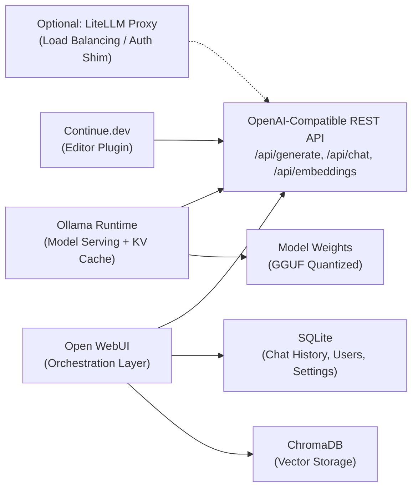
```mermaid
graph LR
    A["Ollama Runtime<br/>(Model Serving + KV Cache)"] --> B["Model Weights<br/>(GGUF Quantized)"]
    A --> C["OpenAI-Compatible REST API<br/>/api/generate, /api/chat, /api/embeddings"]
    D["Open WebUI<br/>(Orchestration Layer)"] --> E["ChromaDB<br/>(Vector Storage)"]
    D --> F["SQLite<br/>(Chat History, Users, Settings)"]
    D --> C
    G["Continue.dev<br/>(Editor Plugin)"] --> C
    H["Optional: LiteLLM Proxy<br/>(Load Balancing / Auth Shim)"] -.-> C
```

- **Ollama** is *only* responsible for loading model weights into GPU/VRAM and serving inference requests. It has no concept of users, documents, or chat history.
- **Open WebUI** is the stateful layer: it owns your chat history, your uploaded documents, your vector embeddings, and your user accounts.
- **Continue.dev** is stateless from the server's perspective — it just fires HTTP requests at Ollama's API directly, bypassing Open WebUI entirely for speed.
- **LiteLLM** (optional, covered in Part VIII) can sit in front of Ollama to add API-key authentication, rate limiting, and multi-backend load balancing — useful once you have more than one GPU node.

### 1.4 Why Not Just Run Everything On the Old Laptop?

A common instinct is to install Open WebUI directly on the GPU laptop too. Resist this. Keeping the UI/orchestration layer on your *primary* workstation means:

- The old laptop's limited RAM/CPU stays dedicated to GPU inference, not web server threads, SQLite writes, or Chroma indexing.
- You can reboot/upgrade the UI stack without ever touching the always-on inference node.
- If the old laptop dies, your chat history and document library (stored in Docker volumes on your main machine) survive untouched.

---

<a id="part-ii"></a>
## Part II — Hardware Resurrection

Laptops aren't designed to run 24/7 with the lid closed. You need to prevent sleep, thermal throttling, and battery degradation — and ideally add a watchdog so the box self-heals after crashes or power blips.

### 2.1 Full Boot-to-Ready Lifecycle

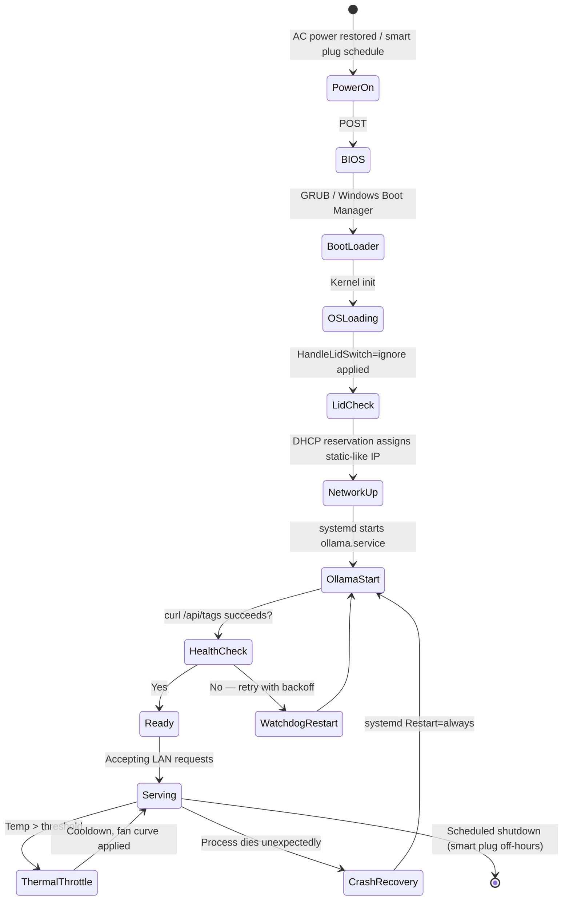
```mermaid
stateDiagram-v2
    [*] --> PowerOn: AC power restored / smart plug schedule
    PowerOn --> BIOS: POST
    BIOS --> BootLoader: GRUB / Windows Boot Manager
    BootLoader --> OSLoading: Kernel init
    OSLoading --> LidCheck: HandleLidSwitch=ignore applied
    LidCheck --> NetworkUp: DHCP reservation assigns static-like IP
    NetworkUp --> OllamaStart: systemd starts ollama.service
    OllamaStart --> HealthCheck: curl /api/tags succeeds?
    HealthCheck --> Ready: Yes
    HealthCheck --> WatchdogRestart: No — retry with backoff
    WatchdogRestart --> OllamaStart
    Ready --> Serving: Accepting LAN requests
    Serving --> ThermalThrottle: Temp > threshold
    ThermalThrottle --> Serving: Cooldown, fan curve applied
    Serving --> CrashRecovery: Process dies unexpectedly
    CrashRecovery --> OllamaStart: systemd Restart=always
    Serving --> [*]: Scheduled shutdown (smart plug off-hours)
```

### 2.2 OS-Level: Prevent Sleep on Lid Close

#### Linux (Ubuntu/Debian) 

Edit the systemd logind config:

```bash
sudo nano /etc/systemd/logind.conf
```

Set the following directives:

```ini
[Login]
HandleLidSwitch=ignore
HandleLidSwitchExternalPower=ignore
HandleSuspendKey=ignore
HandleHibernateKey=ignore
IdleAction=ignore
```

Then reload the daemon:

```bash
sudo systemctl restart systemd-logind
```

Also disable any GUI-level sleep/screen-blank policies if you're running a desktop environment (GNOME, KDE) rather than a pure headless install:

```bash
gsettings set org.gnome.settings-daemon.plugins.power sleep-inactive-ac-type 'nothing'
gsettings set org.gnome.desktop.session idle-delay 0
```

> 💡 **Recommendation:** If this laptop's sole purpose is now serving AI inference, strip the GUI entirely and run a headless server install (Ubuntu Server, or `systemctl set-default multi-user.target` on an existing desktop install). This frees RAM/VRAM contention from compositors and reduces attack surface.

#### Windows

Go to **Control Panel** → **Power Options** → **Choose what closing the lid does** → set **Plugged in** to **Do nothing**. Also set **Sleep** and **Hibernate after** to **Never** under the "Plugged in" column of the advanced power plan settings, and disable **Fast Startup** to avoid inconsistent state after power blips.

### 2.3 Battery Longevity: Cap Charge at ~60%

Running a laptop plugged in at 100% while hot accelerates battery swelling and capacity loss. Use vendor tools to cap the physical charge:

- **Lenovo:** Lenovo Vantage → Power → Conservation Mode (≈60%)
- **ASUS:** Armoury Crate → Battery Health Charging → Maximum Lifespan (≈60%)
- **Dell:** Dell Power Manager → Battery Info → Custom → stop at 55–60%
- **Linux (generic, ThinkPad/many vendors via `acpi_call` or `tlp`):**

```bash
sudo apt install tlp tlp-rdw
sudo nano /etc/tlp.conf
```
```ini
START_CHARGE_THRESH_BAT0=50
STOP_CHARGE_THRESH_BAT0=60
```
```bash
sudo systemctl enable tlp && sudo systemctl restart tlp
```

**Alternative hardware mitigations:**

- Physically remove the battery (if modular) and run entirely on AC power — the cleanest long-term solution if your chassis supports it.
- Use a smart plug with scheduled power cycles if you only need the server during specific working hours, which also reduces total wear and electricity cost.
- If the battery is already swollen or degraded past 80% health, consider this a strong signal to remove it rather than risk a thermal event.

### 2.4 Thermal & Physical Placement

- **Never** stack items on top of the closed laptop.
- Use a vertical laptop stand or a mesh riser to maximize chassis airflow from the intake vents (usually on the bottom).
- Keep it in a well-ventilated space, never inside a sealed cabinet or drawer.
- Consider a cheap external USB laptop cooling pad if the internal fan curve is aggressive/loud — thermal headroom translates directly into sustained inference throughput without GPU clock throttling.
- Monitor temperatures occasionally on Linux using:

```bash
sudo apt install lm-sensors
sudo sensors-detect --auto
watch -n 2 'sensors'
```

For NVIDIA GPUs specifically, track VRAM and core temps together:

```bash
watch -n 2 'nvidia-smi --query-gpu=temperature.gpu,utilization.gpu,memory.used,memory.total,power.draw --format=csv'
```

### 2.5 Automated Watchdog & Self-Healing

A 24/7 unattended box needs to recover from crashes without you SSH-ing in at 2am. Layer three levels of resilience:

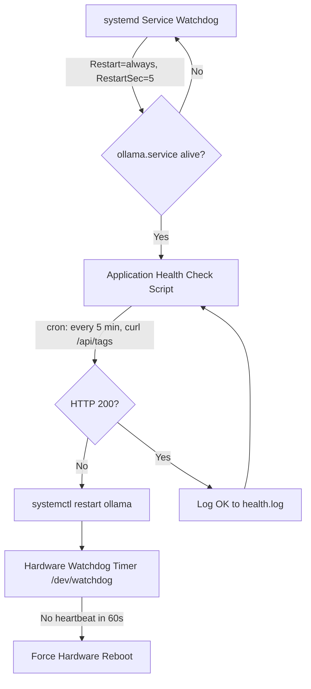
```mermaid
flowchart TD
    A[systemd Service Watchdog] -->|Restart=always, RestartSec=5| B{ollama.service alive?}
    B -->|No| A
    B -->|Yes| C[Application Health Check Script]
    C -->|"cron: every 5 min, curl /api/tags"| D{HTTP 200?}
    D -->|No| E[systemctl restart ollama]
    D -->|Yes| F[Log OK to health.log]
    F --> C
    G[Hardware Watchdog Timer /dev/watchdog] -->|"No heartbeat in 60s"| H[Force Hardware Reboot]
    E --> G
```

**Level 1 — systemd auto-restart** (add to your service override, see Part III):

```ini
[Service]
Restart=always
RestartSec=5
```

**Level 2 — cron-based health check script** (`/usr/local/bin/ollama-healthcheck.sh`):

```bash
#!/bin/bash
if ! curl -sf http://127.0.0.1:11434/api/tags > /dev/null; then
    echo "$(date): Ollama unresponsive, restarting" >> /var/log/ollama-health.log
    systemctl restart ollama
fi
```

```bash
sudo chmod +x /usr/local/bin/ollama-healthcheck.sh
(crontab -l 2>/dev/null; echo "*/5 * * * * /usr/local/bin/ollama-healthcheck.sh") | crontab -
```

**Level 3 — hardware watchdog** (last resort, catches full kernel hangs):

```bash
sudo apt install watchdog
sudo nano /etc/watchdog.conf
```
```ini
watchdog-device = /dev/watchdog
max-load-1 = 24
```
```bash
sudo systemctl enable --now watchdog
```

---

<a id="part-iii"></a>
## Part III — The Inference Server (Ollama)

Ollama serves as your local LLM runtime. By default, it binds only to `127.0.0.1`. We'll reconfigure it to listen on your LAN interface.

### 3.1 Install Ollama

- **Linux:** Follow the official install script from ollama.com.
- **Windows:** Download the native installer executable.

```bash
curl -fsSL https://ollama.com/install.sh | sh
```

### 3.2 Bind Ollama to All Interfaces

#### Linux (systemd)

Create a service override block:

```bash
sudo systemctl edit ollama.service
```

Inject the following configuration:

```ini
[Service]
Environment="OLLAMA_HOST=0.0.0.0:11434"
Environment="OLLAMA_KEEP_ALIVE=30m"
Environment="OLLAMA_MAX_LOADED_MODELS=2"
Restart=always
RestartSec=5
```

Save, exit, and reload the daemon:

```bash
sudo systemctl daemon-reload
sudo systemctl restart ollama
```

> 💡 `OLLAMA_KEEP_ALIVE` controls how long a model stays resident in VRAM after the last request — tune this up if you're paying a large model-load latency cost on every first request after idle.

#### Windows

1. Search **"Environment Variables"** → **Edit the system environment variables**.
2. Under **User variables**, click **New**:
   - **Name:** `OLLAMA_HOST`
   - **Value:** `0.0.0.0:11434`
3. Fully quit Ollama from the Windows system tray and restart it.

### 3.3 Pull Efficient Inference & Embedding Models

On the GPU server terminal, run:

```bash
ollama pull qwen2.5-coder:7b
ollama pull qwen2.5-coder:1.5b
ollama pull llama3.2
ollama pull nomic-embed-text
```

- `qwen2.5-coder:7b` – Strong coding assistant and chat model.
- `qwen2.5-coder:1.5b` – Fast, low-latency autocomplete engine.
- `llama3.2` – Lightweight general-purpose instruction model.
- `nomic-embed-text` – Highly efficient, open-source text embedding model used to vectorize your personal documents for RAG.

> 💡 **Tip:** For older GPUs with low VRAM, consider running highly quantized variants (e.g., `Q4_K_M`) to fit the model completely within the GPU's memory space. Check actual VRAM usage with `nvidia-smi` while a model is loaded.

### 3.4 Model Selection Decision Tree

Not all old GPU laptops are equal. Use this decision tree to pick sane defaults for your specific VRAM budget:

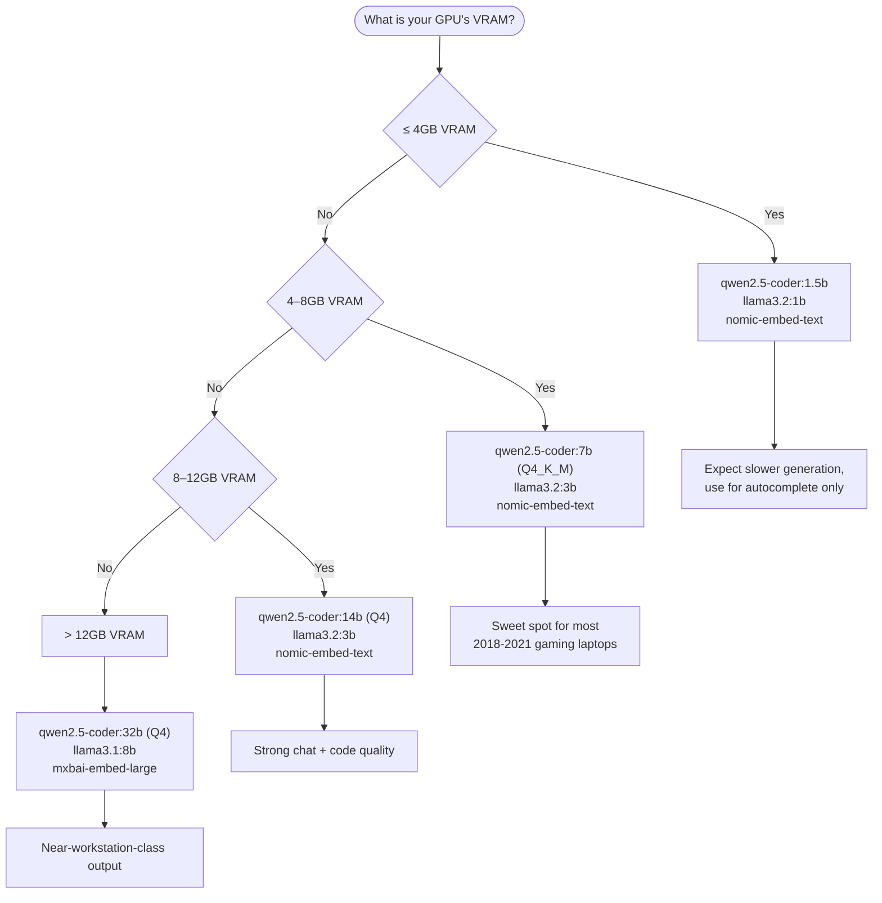
```mermaid
flowchart TD
    Start([What is your GPU's VRAM?]) --> V4{"≤ 4GB VRAM"}
    V4 -->|Yes| T1["qwen2.5-coder:1.5b<br/>llama3.2:1b<br/>nomic-embed-text"]
    V4 -->|No| V8{"4–8GB VRAM"}
    V8 -->|Yes| T2["qwen2.5-coder:7b (Q4_K_M)<br/>llama3.2:3b<br/>nomic-embed-text"]
    V8 -->|No| V12{"8–12GB VRAM"}
    V12 -->|Yes| T3["qwen2.5-coder:14b (Q4)<br/>llama3.2:3b<br/>nomic-embed-text"]
    V12 -->|No| V16["> 12GB VRAM"]
    V16 --> T4["qwen2.5-coder:32b (Q4)<br/>llama3.1:8b<br/>mxbai-embed-large"]

    T1 --> Note1["Expect slower generation,<br/>use for autocomplete only"]
    T2 --> Note2["Sweet spot for most<br/>2018-2021 gaming laptops"]
    T3 --> Note3["Strong chat + code quality"]
    T4 --> Note4["Near-workstation-class output"]
```

Find your server's LAN IP via `ip a` (Linux) or `ipconfig` (Windows). We will assume `192.168.1.50` for the client configurations throughout this guide.

### 3.5 Static IP / DHCP Reservation

Before moving on, lock the server's IP address so it never changes under you — this matters for every client config below. Log into your router's admin panel and create a **DHCP reservation** binding the server's MAC address to `192.168.1.50` permanently. Alternatively, configure a static IP directly on the laptop's network interface via Netplan (Ubuntu):

```yaml
# /etc/netplan/01-static.yaml
network:
  version: 2
  ethernets:
    eth0:
      dhcp4: no
      addresses: [192.168.1.50/24]
      routes:
        - to: default
          via: 192.168.1.1
      nameservers:
        addresses: [1.1.1.1, 8.8.8.8]
```

```bash
sudo netplan apply
```

---

<a id="part-iv"></a>
## Part IV — Client Integrations

Move to your primary machine to consume the remote Ollama endpoint.

### 4.1 Integration A: Continue.dev for Tab Autocomplete & Chat

Continue is an open-source (Apache 2.0) AI assistant for VS Code, VSCodium, and JetBrains IDEs.

1. Install **Continue** from your editor's extension marketplace.
2. Open the Continue configuration file (`config.json`) via the gear icon in the panel.
3. Configure your remote models:

```json
{
  "models": [
    {
      "title": "Remote Qwen Coding 7B",
      "provider": "ollama",
      "model": "qwen2.5-coder:7b",
      "apiBase": "http://192.168.1.50:11434"
    },
    {
      "title": "Remote Llama 3.2 (General Chat)",
      "provider": "ollama",
      "model": "llama3.2",
      "apiBase": "http://192.168.1.50:11434"
    }
  ],
  "tabAutocompleteModel": {
    "title": "Remote Autocomplete 1.5B",
    "provider": "ollama",
    "model": "qwen2.5-coder:1.5b",
    "apiBase": "http://192.168.1.50:11434"
  },
  "tabAutocompleteOptions": {
    "debounceDelay": 300,
    "maxPromptTokens": 1024
  },
  "embeddingsProvider": {
    "provider": "ollama",
    "model": "nomic-embed-text",
    "apiBase": "http://192.168.1.50:11434"
  }
}
```

> 💡 **Tip:** `debounceDelay` matters a lot on a remote LAN setup — since every keystroke pause triggers a network round-trip to the old laptop, tune this up (300–500ms) to avoid saturating the link and to give the 1.5B model breathing room between requests.

4. Test it: open any code file, pause typing for a beat, and confirm ghost-text suggestions appear. Then hit `Cmd/Ctrl+L` to open the chat panel and confirm the 7B model responds.

### 4.2 Integration B: Open WebUI with Local RAG (Reproducible Compose Setup)

Instead of typing out massive inline `docker run` flags, we'll use a `docker-compose.yml` block to launch Open WebUI with persistent database storage and explicit paths to our remote server.

Create a file named `docker-compose.yml` on your primary workstation:

```yaml
version: "3.8"
services:
  open-webui:
    image: ghcr.io/open-webui/open-webui:main
    container_name: open-webui
    ports:
      - "3000:8080"
    environment:
      - OLLAMA_BASE_URL=http://192.168.1.50:11434
      - WEBUI_SECRET_KEY=change_this_to_a_random_cryptographic_secret
      - RAG_EMBEDDING_ENGINE=ollama
      - RAG_OLLAMA_BASE_URL=http://192.168.1.50:11434
      - RAG_EMBEDDING_MODEL=nomic-embed-text:latest
      - ENABLE_SIGNUP=false
      - WEBUI_AUTH=true
    volumes:
      - open-webui-data:/app/backend/data
    restart: always

volumes:
  open-webui-data:
```

Launch the stack on your workstation:

```bash
docker compose up -d
```

Open `http://localhost:3000` in your browser, create your administrative account, and you will see your models instantly populated.

> ⚠️ Set `ENABLE_SIGNUP=false` immediately after creating your first admin account — otherwise anyone who can reach port 3000 on your LAN can self-register a new account into your instance.

### 4.3 Alternative & Complementary FOSS Clients

Continue.dev and Open WebUI cover editor-autocomplete and browser-chat, but the FOSS ecosystem has strong options worth knowing about depending on your workflow:

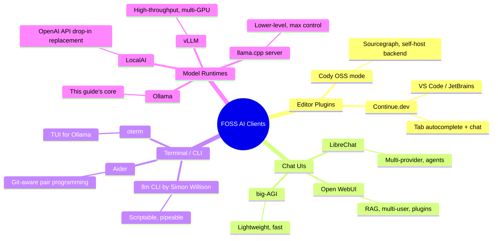
```mermaid
mindmap
  root((FOSS AI Clients))
    Editor Plugins
      Continue.dev
        VS Code / JetBrains
        Tab autocomplete + chat
      Cody OSS mode
        Sourcegraph, self-host backend
    Chat UIs
      Open WebUI
        RAG, multi-user, plugins
      LibreChat
        Multi-provider, agents
      big-AGI
        Lightweight, fast
    Terminal / CLI
      Aider
        Git-aware pair programming
      llm CLI by Simon Willison
        Scriptable, pipeable
      oterm
        TUI for Ollama
    Model Runtimes
      Ollama
        This guide's core
      llama.cpp server
        Lower-level, max control
      LocalAI
        OpenAI API drop-in replacement
      vLLM
        High-throughput, multi-GPU
```

Notable mentions:

- **Aider** — a terminal-based AI pair programmer that reads/writes your git repo directly. Point it at your Ollama endpoint (`aider --model ollama/qwen2.5-coder:7b`) for a keyboard-driven alternative to Continue.dev.
- **LibreChat** — a more feature-rich alternative to Open WebUI if you want multi-provider support (mixing local Ollama with other OpenAI-compatible backends) and agent/plugin support out of the box.
- **oterm** — a slick terminal UI specifically for Ollama if you want a chat interface without spinning up Docker at all.

### 4.4 Request Routing Summary

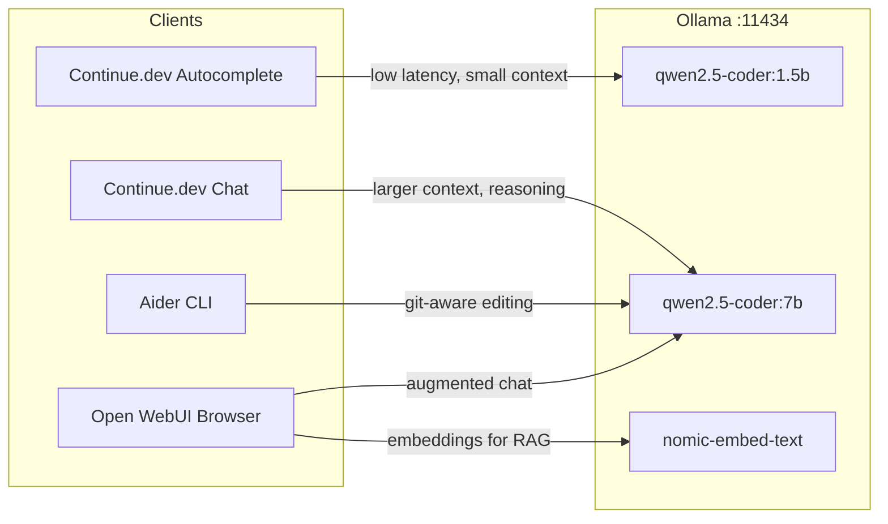
```mermaid
flowchart LR
    subgraph Clients
        C1[Continue.dev Autocomplete]
        C2[Continue.dev Chat]
        C3[Open WebUI Browser]
        C4[Aider CLI]
    end
    subgraph Server["Ollama :11434"]
        M1[qwen2.5-coder:1.5b]
        M2[qwen2.5-coder:7b]
        M3[nomic-embed-text]
    end
    C1 -->|low latency, small context| M1
    C2 -->|larger context, reasoning| M2
    C4 -->|git-aware editing| M2
    C3 -->|embeddings for RAG| M3
    C3 -->|augmented chat| M2
```

---

<a id="part-v"></a>
## Part V — RAG Internals Deep Dive

### 5.1 How the Local RAG Engine Works

When you drag a PDF, Markdown documentation file, or source code file into the Open WebUI interface, the system processes it entirely locally using the step-by-step pipeline below:

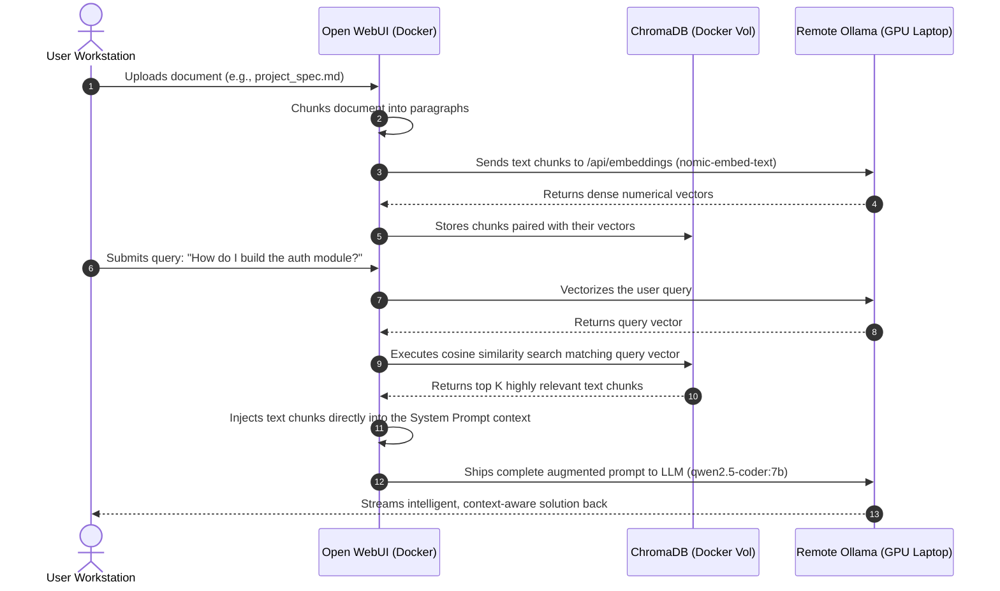
```mermaid
sequenceDiagram
    autonumber
    actor User as User Workstation
    participant UI as Open WebUI (Docker)
    participant DB as ChromaDB (Docker Vol)
    participant GPU as Remote Ollama (GPU Laptop)

    User->>UI: Uploads document (e.g., project_spec.md)
    UI->>UI: Chunks document into paragraphs
    UI->>GPU: Sends text chunks to /api/embeddings (nomic-embed-text)
    GPU-->>UI: Returns dense numerical vectors
    UI->>DB: Stores chunks paired with their vectors

    User->>UI: Submits query: "How do I build the auth module?"
    UI->>GPU: Vectorizes the user query
    GPU-->>UI: Returns query vector
    UI->>DB: Executes cosine similarity search matching query vector
    DB-->>UI: Returns top K highly relevant text chunks
    UI->>UI: Injects text chunks directly into the System Prompt context
    UI->>GPU: Ships complete augmented prompt to LLM (qwen2.5-coder:7b)
    GPU-->>User: Streams intelligent, context-aware solution back
```

### 5.2 Chunking Strategy Matters

The quality of your RAG answers depends heavily on *how* documents are chunked before embedding. Open WebUI exposes these under **Admin Settings → Documents**:

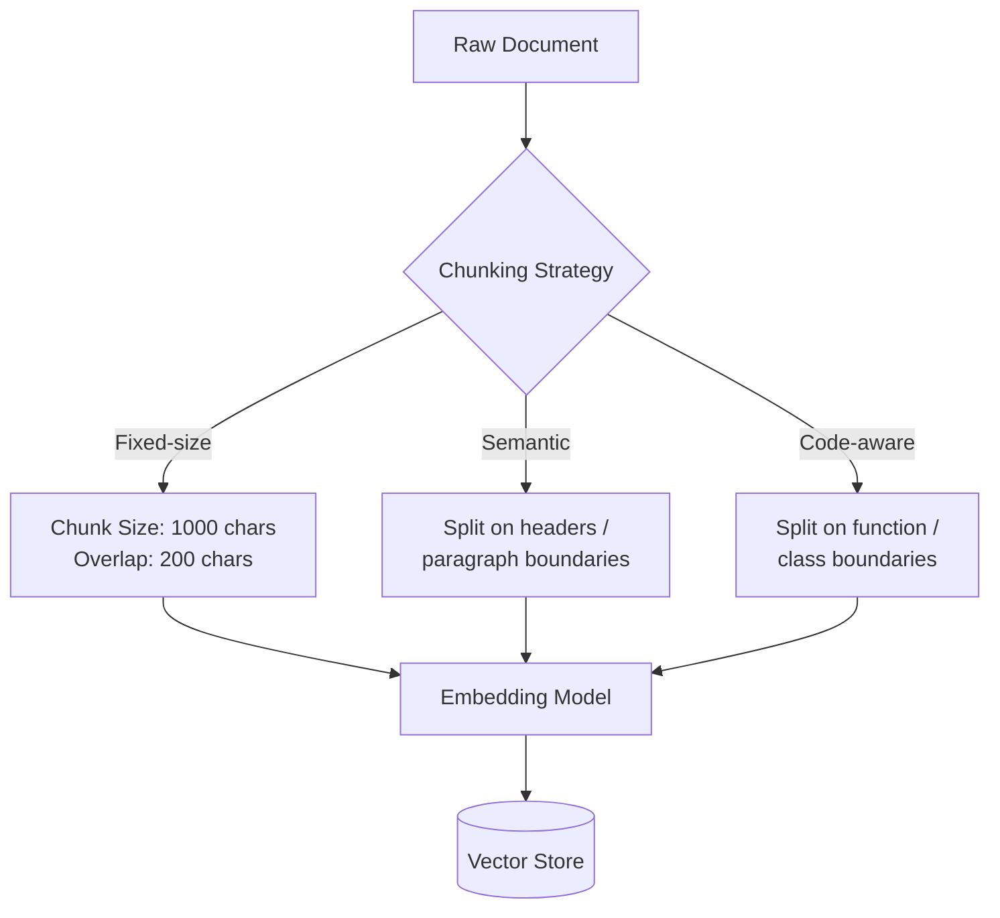
```mermaid
graph TD
    A[Raw Document] --> B{Chunking Strategy}
    B -->|Fixed-size| C["Chunk Size: 1000 chars<br/>Overlap: 200 chars"]
    B -->|Semantic| D["Split on headers /<br/>paragraph boundaries"]
    B -->|Code-aware| E["Split on function /<br/>class boundaries"]
    C --> F[Embedding Model]
    D --> F
    E --> F
    F --> G[(Vector Store)]
```

| Setting | Small chunks (300-500 chars) | Large chunks (1000-1500 chars) |
|---|---|---|
| Retrieval precision | Higher — pinpoints exact facts | Lower — may pull in noise |
| Context completeness | Lower — may cut mid-thought | Higher — preserves surrounding logic |
| Best for | FAQs, reference docs, API specs | Code files, narrative docs, tutorials |

> 💡 For codebases specifically, consider chunk sizes of 800–1200 characters with a 150–200 character overlap so function signatures don't get split away from their bodies.

### 5.3 Configuring Local RAG in the Open WebUI Interface

1. Once logged in, click your profile icon at the bottom-left corner and enter **Admin Settings**.
2. Navigate to **Documents** or **RAG Settings**.
3. Under **Embedding Model Engine**, confirm it is explicitly set to `Ollama`, pointing to your network URL (`http://192.168.1.50:11434`), and that your model text string accurately matches `nomic-embed-text:latest`.
4. Tune **Top K** (number of chunks retrieved per query — start at 4-6) and **Chunk Size/Overlap** per the table above.
5. Return to your workspace chat interface, click the **+** icon next to the message field, upload a technical PDF or codebase folder, type your query, and watch your local model accurately query your text data.

### 5.4 RAG Failure Modes & Mitigations

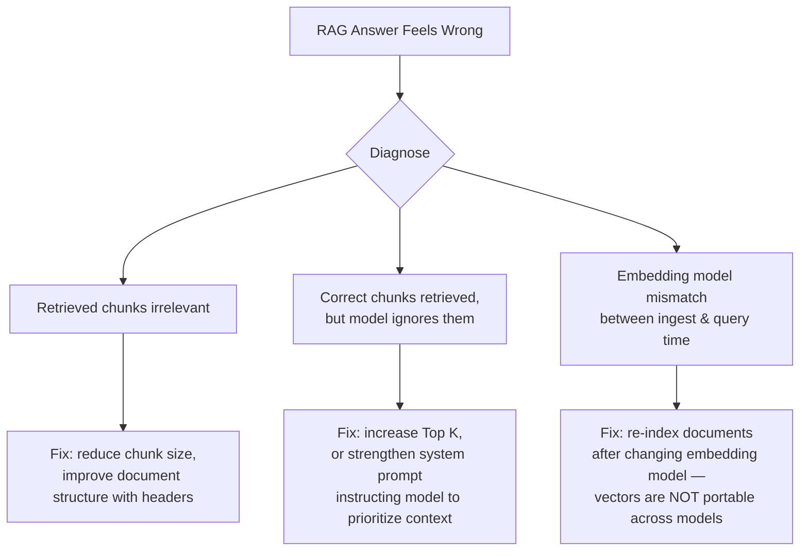
```mermaid
flowchart TD
    A[RAG Answer Feels Wrong] --> B{Diagnose}
    B --> C["Retrieved chunks irrelevant"]
    B --> D["Correct chunks retrieved,<br/>but model ignores them"]
    B --> E["Embedding model mismatch<br/>between ingest & query time"]

    C --> C1["Fix: reduce chunk size,<br/>improve document structure with headers"]
    D --> D1["Fix: increase Top K,<br/>or strengthen system prompt<br/>instructing model to prioritize context"]
    E --> E1["Fix: re-index documents<br/>after changing embedding model —<br/>vectors are NOT portable across models"]
```

> ⚠️ **Critical gotcha:** If you ever change your embedding model (e.g., swap `nomic-embed-text` for `mxbai-embed-large`), you **must** re-ingest all documents. Vectors from different embedding models live in incompatible mathematical spaces — mixing them silently corrupts retrieval quality with no error message.

---

<a id="part-vi"></a>
## Part VI — Security: Defense in Depth

> ⚠️ **Critical Threat Vector:** Ollama has **no built-in authentication layer**. Binding to `0.0.0.0` exposes your system's raw GPU computing power to any device on the network segment.

If left open on public, corporate, or untrusted semi-public networks (co-working spaces, hotels, cafes), unauthorized users can discover your port, execute arbitrary prompts on your hardware, abuse resources, or read your context logs.

### 6.1 The Defense-in-Depth Model


```mermaid
graph TD
    A["Layer 1: Physical/Network<br/>Static IP, DHCP reservation"] --> B["Layer 2: Interface Binding<br/>Bind to LAN IP, not 0.0.0.0"]
    B --> C["Layer 3: Firewall Rules<br/>UFW/nftables subnet allowlist"]
    C --> D["Layer 4: Encrypted Overlay<br/>Tailscale/Netbird for remote access"]
    D --> E["Layer 5: Reverse Proxy Auth<br/>Optional API key / basic auth shim"]
    E --> F["Layer 6: Application Auth<br/>Open WebUI user accounts, signup disabled"]
    F --> G["Layer 7: Monitoring & Alerting<br/>Log review, anomaly detection"]

    style A fill:#1c2a3a
    style B fill:#1c2a3a
    style C fill:#1c3a2a
    style D fill:#123a24
    style E fill:#2a2a1c
    style F fill:#2a2a1c
    style G fill:#3a1c1c
```

Each layer assumes the one before it might fail. Never rely on a single control.

### 6.2 Minimum Viable Hardening

1. **Never** run this setup with an exposed port while connected to public Wi-Fi.
2. **Explicit Interface Binding:** Instead of using the open `0.0.0.0`, bind the engine strictly to your server's static LAN IP:

   ```ini
   Environment="OLLAMA_HOST=192.168.1.50:11434"
   ```

   *Assign a static IP or DHCP reservation for the server in your home router settings so the address does not rotate (see Part III, section 3.5).*

3. **UFW Firewall Rules (Linux):** Restrict access exclusively to your trusted local subnet:

   ```bash
   sudo ufw allow from 192.168.1.0/24 to any port 11434 proto tcp
   sudo ufw deny 11434
   sudo ufw enable
   sudo ufw status verbose
   ```

4. **Disable unnecessary services** on the GPU laptop — SSH password auth, unused ports, Bluetooth, printer sharing. Every open service is attack surface on a box that's now unattended 24/7.

   ```bash
   sudo nano /etc/ssh/sshd_config
   ```
   ```ini
   PasswordAuthentication no
   PermitRootLogin no
   PubkeyAuthentication yes
   ```
   ```bash
   sudo systemctl restart sshd
   ```

### 6.3 Zero-Trust Remote Access: Tailscale / Netbird

If you want to securely query your AI home server when working away from home, avoid forwarding port 11434 on your residential router. Port-forwarding directly to Ollama is effectively broadcasting an unauthenticated GPU compute endpoint to the entire internet — bots scan for exactly this.

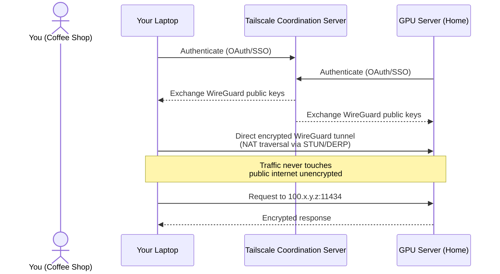
```mermaid
sequenceDiagram
    actor You as You (Coffee Shop)
    participant Laptop as Your Laptop
    participant TSNet as Tailscale Coordination Server
    participant Server as GPU Server (Home)

    Laptop->>TSNet: Authenticate (OAuth/SSO)
    Server->>TSNet: Authenticate (OAuth/SSO)
    TSNet-->>Laptop: Exchange WireGuard public keys
    TSNet-->>Server: Exchange WireGuard public keys
    Laptop->>Server: Direct encrypted WireGuard tunnel<br/>(NAT traversal via STUN/DERP)
    Note over Laptop,Server: Traffic never touches<br/>public internet unencrypted
    Laptop->>Server: Request to 100.x.y.z:11434
    Server-->>Laptop: Encrypted response
```

1. Install an open-source-friendly mesh VPN client like **Tailscale** or **Netbird** on both machines.

   ```bash
   curl -fsSL https://tailscale.com/install.sh | sh
   sudo tailscale up
   ```

2. Bind Ollama to the server's private mesh network IP (e.g., `100.x.y.z`), or simply leave it bound to the LAN IP and rely on Tailscale's subnet routing / ACLs to gate access — either works, but binding directly to the tailnet IP is more explicit and auditable.

3. Update your client config elements (`config.json`, Docker environment flags) to point directly to that encrypted tunnel IP:

   ```json
   "apiBase": "http://100.x.y.z:11434"
   ```

4. **Lock it down further with Tailscale ACLs** — restrict which devices on your tailnet can even reach port 11434:

   ```json
   {
     "acls": [
       {
         "action": "accept",
         "src": ["your-workstation-tag"],
         "dst": ["your-gpu-server-tag:11434"]
       }
     ]
   }
   ```

This architecture gives you end-to-end encrypted, authenticated access globally without exposing ports to the public internet.

### 6.4 Optional: Reverse Proxy with API Key Auth

If multiple people (family, roommates, a small team) share this server, add a lightweight auth shim in front of Ollama using **Caddy** or **Nginx**, since Ollama itself has no concept of API keys:

```
# Caddyfile
:8443 {
    reverse_proxy 127.0.0.1:11434 {
        header_up X-API-Key {header.X-API-Key}
    }
    @noauth {
        not header X-API-Key "your-shared-secret-here"
    }
    respond @noauth 401
}
```

For a more robust multi-user setup, **LiteLLM** (covered in Part VIII) is purpose-built for this and adds per-user API keys, spend tracking, and rate limits natively.

### 6.5 Security Checklist

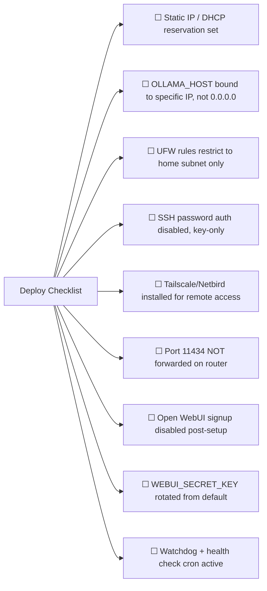
```mermaid
flowchart LR
    A[Deploy Checklist] --> B["☐ Static IP / DHCP reservation set"]
    A --> C["☐ OLLAMA_HOST bound to specific IP, not 0.0.0.0"]
    A --> D["☐ UFW rules restrict to home subnet only"]
    A --> E["☐ SSH password auth disabled, key-only"]
    A --> F["☐ Tailscale/Netbird installed for remote access"]
    A --> G["☐ Port 11434 NOT forwarded on router"]
    A --> H["☐ Open WebUI signup disabled post-setup"]
    A --> I["☐ WEBUI_SECRET_KEY rotated from default"]
    A --> J["☐ Watchdog + health check cron active"]
```

---

<a id="part-vii"></a>
## Part VII — Observability & Maintenance

Running an unattended 24/7 box means you need visibility without constantly SSH-ing in to poke around.

### 7.1 Lightweight Monitoring Stack

For a home-lab setup, a full Prometheus/Grafana stack may be overkill, but it's genuinely useful if you already run other self-hosted services. Here's how it fits in:

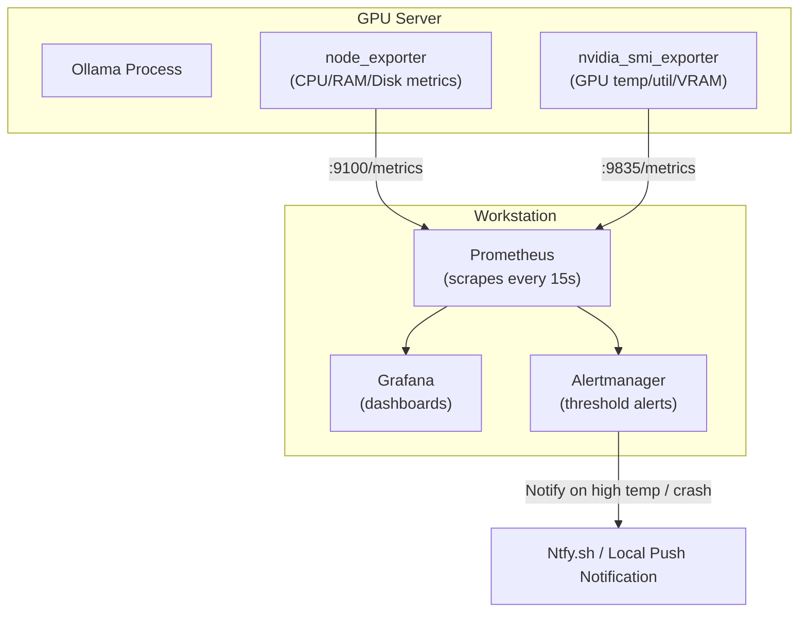
```mermaid
graph TD
    subgraph ServerLaptop["GPU Server"]
        Ollama[Ollama Process]
        NodeExp["node_exporter<br/>(CPU/RAM/Disk metrics)"]
        NvidiaExp["nvidia_smi_exporter<br/>(GPU temp/util/VRAM)"]
    end
    subgraph Workstation["Workstation"]
        Prom["Prometheus<br/>(scrapes every 15s)"]
        Graf["Grafana<br/>(dashboards)"]
        AlertMgr["Alertmanager<br/>(threshold alerts)"]
    end

    NodeExp -->|":9100/metrics"| Prom
    NvidiaExp -->|":9835/metrics"| Prom
    Prom --> Graf
    Prom --> AlertMgr
    AlertMgr -->|"Notify on high temp / crash"| Notify[Ntfy.sh / Local Push Notification]
```

Minimal `docker-compose.yml` addition on your workstation to add Prometheus + Grafana:

```yaml
  prometheus:
    image: prom/prometheus:latest
    volumes:
      - ./prometheus.yml:/etc/prometheus/prometheus.yml
    ports:
      - "9090:9090"
    restart: always

  grafana:
    image: grafana/grafana:latest
    ports:
      - "3001:3000"
    restart: always
```

`prometheus.yml` scrape config pointing at the GPU server:

```yaml
scrape_configs:
  - job_name: 'gpu-server'
    static_configs:
      - targets: ['192.168.1.50:9100', '192.168.1.50:9835']
```

> 💡 If this feels like too much infrastructure for a hobby project, a simpler alternative is a cron job that appends `nvidia-smi` and `sensors` output to a log file every 5 minutes, plus **ntfy.sh** (self-hostable) for push notifications when thresholds are breached.

### 7.2 Simple Alerting Without a Full Stack

```bash
#!/bin/bash
# /usr/local/bin/thermal-alert.sh
TEMP=$(nvidia-smi --query-gpu=temperature.gpu --format=csv,noheader,nounits)
if [ "$TEMP" -gt 85 ]; then
    curl -d "GPU server hit ${TEMP}°C" ntfy.sh/your-private-topic
fi
```

```bash
(crontab -l 2>/dev/null; echo "*/5 * * * * /usr/local/bin/thermal-alert.sh") | crontab -
```

### 7.3 Backup Strategy

The GPU server itself is stateless and disposable — model weights can be re-pulled anytime. Your **workstation** holds the state that actually matters: chat history, uploaded documents, and vector embeddings.

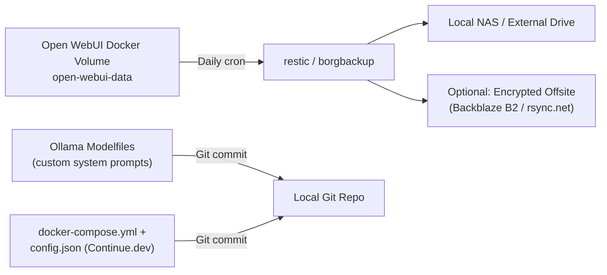
```mermaid
flowchart LR
    A["Open WebUI Docker Volume<br/>open-webui-data"] -->|"Daily cron"| B["restic / borgbackup"]
    B --> C["Local NAS / External Drive"]
    B --> D["Optional: Encrypted Offsite<br/>(Backblaze B2 / rsync.net)"]

    E["Ollama Modelfiles<br/>(custom system prompts)"] -->|"Git commit"| F["Local Git Repo"]

    G["docker-compose.yml +<br/>config.json (Continue.dev)"] -->|"Git commit"| F
```

Simple `restic` backup script for the Open WebUI Docker volume:

```bash
#!/bin/bash
docker run --rm -v open-webui-data:/data -v /mnt/backup:/backup \
  alpine tar czf /backup/open-webui-$(date +%Y%m%d).tar.gz -C /data .

# Prune backups older than 30 days
find /mnt/backup -name "open-webui-*.tar.gz" -mtime +30 -delete
```

> 💡 Treat your `docker-compose.yml`, Continue.dev `config.json`, and any custom Ollama Modelfiles as **code** — commit them to a private git repo. They're small, text-based, and this makes rebuilding the entire client-side setup on a fresh machine a five-minute job.

### 7.4 Update Cadence

- **Ollama binary:** Re-run the install script periodically (`curl -fsSL https://ollama.com/install.sh | sh`) — it's idempotent and pulls the latest release.
- **Models:** `ollama pull <model>` re-pulls only changed layers, so re-running your pull list monthly is cheap.
- **Open WebUI:** `docker compose pull && docker compose up -d` picks up new `:main` image releases. Read release notes first — RAG settings occasionally get restructured between versions.
- **Security patches:** Keep the GPU laptop's OS on automatic security updates (`unattended-upgrades` on Debian/Ubuntu) even though it's headless — an unpatched, internet-adjacent box is a liability regardless of how "internal" it feels.

```bash
sudo apt install unattended-upgrades
sudo dpkg-reconfigure --priority=low unattended-upgrades
```

### 7.5 Maintenance Cadence Summary


```mermaid
gantt
    dateFormat  X
    axisFormat %s
    title Recommended Maintenance Cadence
    section Daily
    Automated backup (restic)          :0, 1
    Health check cron (every 5 min)    :0, 1
    section Weekly
    Review health.log / temps          :0, 1
    Check disk space on both machines  :0, 1
    section Monthly
    Re-pull models (ollama pull)       :0, 1
    docker compose pull && up -d       :0, 1
    Review UFW / Tailscale ACLs        :0, 1
    section Quarterly
    Battery health check (vendor tool) :0, 1
    Physical dust/thermal paste check  :0, 1
```

---

<a id="part-viii"></a>
## Part VIII — Scaling Beyond One Node

Once this setup proves itself, a common next step is adding a second GPU box (another old laptop, a mini-PC, or a desktop tower) to either increase throughput or run larger models in parallel with small ones. Here's how the architecture extends cleanly.

### 8.1 Multi-Node Topology with LiteLLM

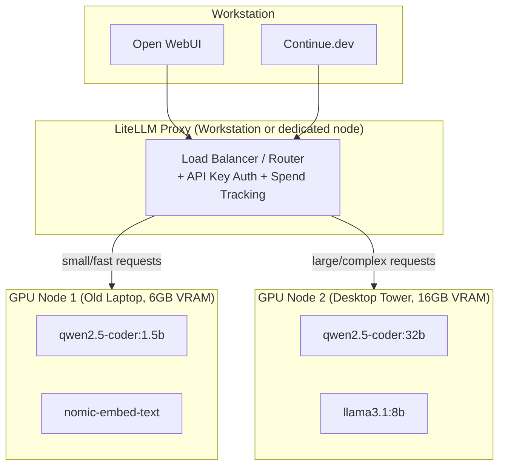
```mermaid
graph TD
    subgraph Workstation
        OWUI[Open WebUI]
        Continue[Continue.dev]
    end

    subgraph Proxy["LiteLLM Proxy (Workstation or dedicated node)"]
        LB["Load Balancer / Router<br/>+ API Key Auth + Spend Tracking"]
    end

    subgraph Node1["GPU Node 1 (Old Laptop, 6GB VRAM)"]
        N1M1[qwen2.5-coder:1.5b]
        N1M2[nomic-embed-text]
    end

    subgraph Node2["GPU Node 2 (Desktop Tower, 16GB VRAM)"]
        N2M1[qwen2.5-coder:32b]
        N2M2[llama3.1:8b]
    end

    OWUI --> LB
    Continue --> LB
    LB -->|"small/fast requests"| Node1
    LB -->|"large/complex requests"| Node2
```

Example `litellm_config.yaml`:

```yaml
model_list:
  - model_name: fast-autocomplete
    litellm_params:
      model: ollama/qwen2.5-coder:1.5b
      api_base: http://192.168.1.50:11434

  - model_name: heavy-reasoning
    litellm_params:
      model: ollama/qwen2.5-coder:32b
      api_base: http://192.168.1.60:11434

general_settings:
  master_key: sk-your-generated-key-here
  database_url: "sqlite:///litellm.db"
```

Run it:

```bash
pip install 'litellm[proxy]'
litellm --config litellm_config.yaml --port 4000
```

Now every client (Continue.dev, Open WebUI) points at `http://localhost:4000` with a single API key, and LiteLLM handles routing, retries, and per-key usage tracking — regardless of how many physical GPU boxes sit behind it.

### 8.2 When to Add a Second Node vs. Upgrade

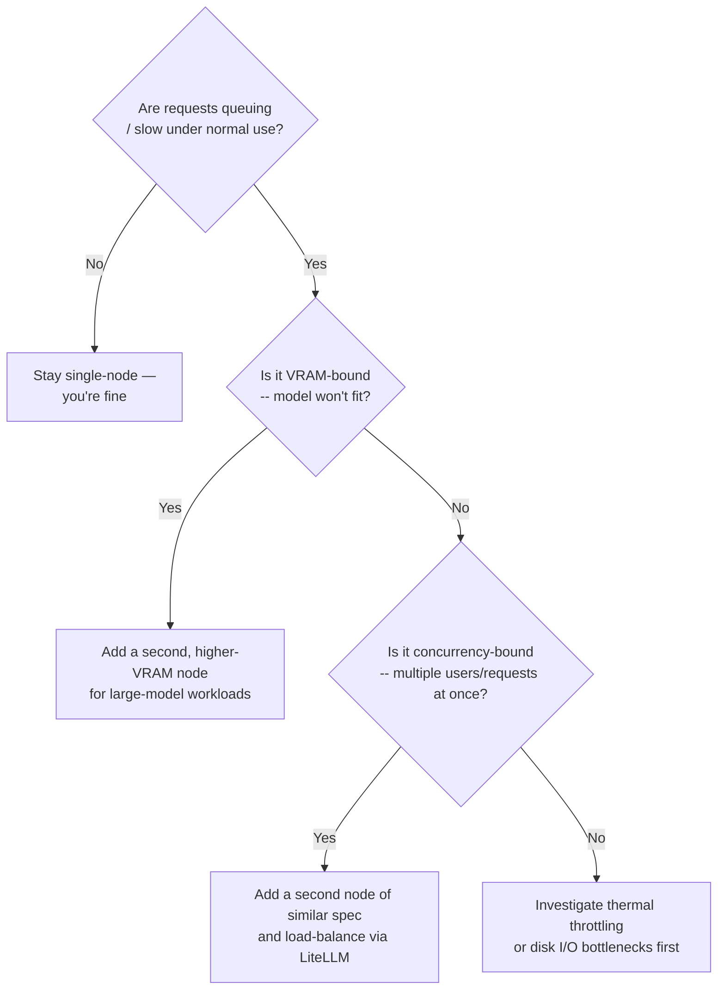
```mermaid
flowchart TD
    A{Are requests queuing<br/>/ slow under normal use?} -->|No| B[Stay single-node —<br/>you're fine]
    A -->|Yes| C{Is it VRAM-bound<br/>-- model won't fit?}
    C -->|Yes| D[Add a second, higher-VRAM node<br/>for large-model workloads]
    C -->|No| E{Is it concurrency-bound<br/>-- multiple users/requests at once?}
    E -->|Yes| F[Add a second node of similar spec<br/>and load-balance via LiteLLM]
    E -->|No| G[Investigate thermal throttling<br/>or disk I/O bottlenecks first]
```

### 8.3 Considerations for Multi-Node Setups

- **Model duplication vs. specialization:** You can either mirror the same models across nodes (for redundancy/throughput) or specialize each node (fast autocomplete on the weak box, heavy reasoning on the strong box) — the latter gets more value out of asymmetric hardware.
- **Network becomes more critical:** With two nodes, prefer wired Ethernet over Wi-Fi for both, especially if either handles large document embedding batches.
- **LiteLLM adds a single point of failure:** if you rely on it for routing, make sure it also runs under systemd/Docker with `restart: always`, and keep a fallback client config (direct `apiBase` to a single node) documented for emergencies.
- **Tailscale scales with you:** every new node just joins the same tailnet — remote access patterns from Part VI don't need to change as you grow.

---

<a id="cost"></a>
## Cost & Sustainability Analysis

A rough back-of-envelope comparison, assuming a mid-range laptop GPU (~60-80W under sustained inference load) running roughly 4 hours/day of active use plus idle background time:

| Item | Estimate |
|---|---|
| Power draw (active inference, ~70W avg) | ~4 hrs/day × 70W = 0.28 kWh/day |
| Power draw (idle, model loaded, ~15W avg) | ~20 hrs/day × 15W = 0.30 kWh/day |
| Total daily consumption | ~0.58 kWh/day |
| Monthly consumption | ~17.4 kWh/month |
| Monthly cost (@ $0.15/kWh) | **~$2.61/month** |
| Equivalent cloud AI subscription (single seat) | $10–$20+/month |
| Break-even vs. one paid seat | Immediate — day one |

Add in the environmental angle: this setup extends the functional life of a device that would otherwise become e-waste, and avoids the amortized datacenter energy/water cost of cloud inference — both are real, if harder to put a single dollar figure on.

---

<a id="troubleshooting"></a>
## 🛠️ Troubleshooting Matrix

| **Symptom** | **Probable Cause** | **Corrective Action** |
|---|---|---|
| **Connection Refused** | Service unbound or down | Run `ss -tulnp \| grep 11434` to verify the active host binding matches your destination IP. Check `systemctl status ollama`. |
| **No Models in Web UI** | Incorrect API Base URL | Verify `OLLAMA_BASE_URL` environment parameters inside the container using `docker inspect open-webui`. Run `curl http://192.168.1.50:11434/api/tags` to test manually. |
| **High Autocomplete Latency** | Network saturation / bad model size | Drop your autocomplete parameter model down to `qwen2.5-coder:1.5b`. Ensure neither laptop is running on a double-NAT layer or isolated guest Wi-Fi network. Check `debounceDelay` in Continue's config. |
| **RAG Upload Errors** | Embedding model missing | Ensure `nomic-embed-text` was successfully pulled to the GPU laptop via `ollama list`. Double-check network connection speeds between machines during embedding phases. |
| **GPU Overheating / Throttling** | Poor airflow, dust buildup, thermal paste degraded | Check `nvidia-smi --query-gpu=temperature.gpu`. Elevate the laptop on a mesh riser. If temps exceed ~85°C sustained, consider a repaste. |
| **Server unreachable after reboot** | Static IP/DHCP reservation not applied, or lid-sleep still triggering | Verify `HandleLidSwitch=ignore` applied via `systemctl status systemd-logind`. Confirm DHCP reservation in router admin panel. |
| **Battery swelling / won't hold charge** | Running at 100% charge continuously while hot | Apply charge threshold caps immediately (Section 2.3). If already swollen, physically remove the battery and run AC-only. |
| **Open WebUI shows "unauthorized" registrations** | `ENABLE_SIGNUP` left true | Set `ENABLE_SIGNUP=false` in your compose environment and restart the stack. |
| **Tailscale connects but Ollama unreachable over tunnel** | Ollama bound only to LAN IP, not tailnet IP | Either bind `OLLAMA_HOST` to `0.0.0.0` and rely on UFW rules restricting to both LAN and Tailscale subnets, or explicitly bind to the tailnet's `100.x.y.z` interface. |
| **Watchdog script restarting Ollama in a loop** | Underlying crash cause not fixed (e.g., OOM from oversized model) | Check `journalctl -u ollama -n 100` for OOM-kill messages. Downgrade to a smaller quantization or model size per the VRAM decision tree (Section 3.4). |

---

<a id="appendix"></a>
## Appendix: Reference Configs & Glossary

### A.1 Full `docker-compose.yml` (Workstation, with Prometheus/Grafana)

```yaml
version: "3.8"
services:
  open-webui:
    image: ghcr.io/open-webui/open-webui:main
    container_name: open-webui
    ports:
      - "3000:8080"
    environment:
      - OLLAMA_BASE_URL=http://192.168.1.50:11434
      - WEBUI_SECRET_KEY=change_this_to_a_random_cryptographic_secret
      - RAG_EMBEDDING_ENGINE=ollama
      - RAG_OLLAMA_BASE_URL=http://192.168.1.50:11434
      - RAG_EMBEDDING_MODEL=nomic-embed-text:latest
      - ENABLE_SIGNUP=false
      - WEBUI_AUTH=true
    volumes:
      - open-webui-data:/app/backend/data
    restart: always

  prometheus:
    image: prom/prometheus:latest
    volumes:
      - ./prometheus.yml:/etc/prometheus/prometheus.yml
    ports:
      - "9090:9090"
    restart: always

  grafana:
    image: grafana/grafana:latest
    ports:
      - "3001:3000"
    restart: always

volumes:
  open-webui-data:
```

### A.2 Glossary

- **Ollama** — open-source local LLM runtime exposing an OpenAI-compatible REST API.
- **GGUF** — the quantized model file format used by llama.cpp/Ollama for efficient CPU/GPU inference.
- **RAG (Retrieval-Augmented Generation)** — injecting relevant retrieved document chunks into a prompt before generation, rather than relying purely on the model's trained knowledge.
- **Embedding model** — a model that converts text into a dense numerical vector for similarity search (e.g., `nomic-embed-text`).
- **ChromaDB** — an open-source embedded vector database


$$$$$$$$$$$$
$$$$$$$$$$$$
$$$$$$$$$$$$
$$$$$$$$$$$$

Continuing exactly from where it cut off:

- **ChromaDB** — an open-source embedded vector database used by Open WebUI to store and query document embeddings via cosine similarity search.
- **Quantization (e.g., Q4_K_M)** — a technique that compresses model weights to lower bit-precision (e.g., 4-bit instead of 16-bit), trading a small amount of accuracy for dramatically reduced VRAM usage and faster inference — essential for fitting larger models on old, VRAM-constrained GPUs.
- **KV Cache** — the intermediate attention state a model keeps in memory during generation to avoid recomputing previous tokens; this is a major consumer of VRAM alongside the model weights themselves.
- **DHCP Reservation** — a router-level binding of a device's MAC address to a fixed IP address, ensuring the server's address never changes across reboots without requiring a fully manual static IP config.
- **Mesh VPN (Tailscale/Netbird)** — a WireGuard-based overlay network that lets devices communicate directly and securely regardless of NAT/firewall topology, without exposing ports on the public internet.
- **LiteLLM** — an open-source proxy that provides a unified OpenAI-compatible API in front of multiple model backends, adding authentication, load balancing, and usage tracking.
- **Watchdog (hardware/software)** — a mechanism that detects unresponsiveness (service crash, kernel hang) and automatically triggers a restart or reboot without human intervention.
- **Trust Zone** — a conceptual boundary in network security design separating devices/traffic by level of trust (physical LAN vs. VPN overlay vs. public internet), used to reason about where authentication and encryption are mandatory.
- **Headless** — running a machine without a connected display/GUI session, typically administered entirely via SSH or remote tooling.

### A.3 Quick Command Cheat Sheet

```bash
# Server-side (GPU laptop)
ollama list                                    # Show installed models
ollama ps                                      # Show currently loaded models + VRAM usage
sudo systemctl status ollama                   # Check service health
sudo systemctl restart ollama                  # Restart the service
journalctl -u ollama -n 100 --no-pager         # View recent logs
nvidia-smi                                     # GPU utilization/temp/VRAM snapshot
watch -n 2 'nvidia-smi --query-gpu=temperature.gpu,utilization.gpu,memory.used --format=csv'

# Client-side (Workstation)
curl http://192.168.1.50:11434/api/tags        # Verify server reachability + list models
docker compose up -d                           # Launch/update Open WebUI stack
docker compose logs -f open-webui              # Tail Open WebUI logs
docker inspect open-webui | grep OLLAMA        # Verify environment variables took effect

# Tailscale
sudo tailscale up                              # Join the tailnet
tailscale status                               # Show connected devices + IPs
tailscale ping <server-hostname>               # Verify tunnel connectivity
```

### A.4 One-Page Architecture Recap


```mermaid
graph TB
    subgraph Home["Home Network"]
        direction LR
        subgraph WS["Workstation"]
            IDE[Continue.dev]
            Browser --> OWUI[Open WebUI + ChromaDB]
        end
        subgraph GPU["GPU Server Laptop"]
            Ollama[Ollama :11434]
        end
        IDE -.LAN.-> Ollama
        OWUI -.LAN.-> Ollama
    end
    subgraph Remote["Away From Home"]
        RemoteYou[You, on Tailscale]
    end
    RemoteYou -.Encrypted WireGuard.-> Ollama

    style GPU fill:#123a24
    style WS fill:#1c2a3a
    style Remote fill:#2a2a1c
```

---

## Closing Thoughts

By separating compute from interface layers using lightweight FOSS primitives, you regain complete data sovereignty, save hardware resources on your primary workstation, and extend the functional lifespan of legacy hardware that would otherwise be discarded. The pattern scales gracefully — start with one old laptop serving a single 7B model over your LAN, and grow into a multi-node, load-balanced, remotely-accessible private AI cluster whenever the need (and spare hardware) arises, without ever sending a single token to a third-party API.
