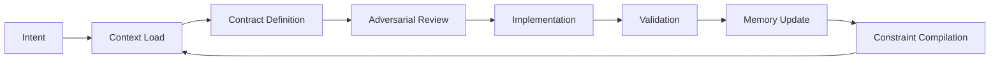

# 🧠 AI-Native Engineering Workflow

## A Closed-Loop System for Co-Developing a Full-Stack Blog App

This is a **runtime execution tutorial**, not a conceptual guide.

You are not building a blog.

You are initializing a **controlled engineering system with deterministic state transitions across reasoning, execution, and memory layers**.

---

# 🧠 SYSTEM PRINCIPLE

> Code is not the product.
> The product is a **verified, reproducible system state**.

---

# 🧩 CORE ROLE MODEL

| Role         | System Component | Responsibility                                           |
| ------------ | ---------------- | -------------------------------------------------------- |
| 🧠 Authority | Human            | Intent, approval, constraint arbitration                 |
| 🧠 Brain     | OpenCode         | Architecture, reasoning, contracts, adversarial analysis |
| ⚙️ Hands     | Continue.dev     | File-level implementation and refactoring                |
| 🧾 Memory    | Git + `/docs`    | Requirements, ADRs, constraints, event logs              |
| 🧪 Reality   | CI / Tests       | Truth validation                                         |
| 👁 Observer  | Drift Monitor    | Entropy detection + system halt                          |

---

# 🔁 CORE EXECUTION LOOP (ALWAYS ACTIVE)



---

# 🚀 PHASE 0 — SYSTEM BOOTSTRAP (REALITY INITIALIZATION)

This phase establishes:

* Memory Layer
* Execution Layer
* Constraint Layer
* Event Layer

---

## ⚙️ Step 0.1 — Initialize Project Structure

```bash
npx create-next-app@latest ai-blog --typescript --tailwind --eslint
cd ai-blog

mkdir -p docs/adr \
         docs/requirements \
         docs/history \
         docs/events \
         docs/constraints \
         db/migrations \
         inngest/functions
```

---

### 🧠 Design Principle

> `/docs` is NOT application code.
> It is **system memory and runtime truth**.

---

## ⚙️ Step 0.2 — Define System Stack Reality

Create:

```
/docs/requirements/system_stack.md
```

### Content:

```md
# System Stack Reality (ADR-000)

- Framework: Next.js (App Router)
- Auth: Clerk
- CMS: Sanity
- Database: Neon Postgres
- Events: Inngest
- Type Safety: TypeScript + Zod
```

---

# 🧠 PHASE 0.3 — SYSTEM BOOTSTRAP (OPENCODE EXECUTION)

## ⚠️ Important Distinction

At this stage:

* OpenCode **does NOT write files**
* OpenCode generates **system artifacts**
* Continue.dev or CLI writes them

---

## 🧠 OpenCode — SYSTEM BOOTSTRAP PROMPT

> You are the System Brain.
>
> Design a production-grade full-stack blog system using:
> Next.js, Clerk, Sanity, Neon, Inngest.
>
> Output:
>
> 1. `docs/requirements/requirements.md`
> 2. `docs/adr/ADR-001.md`
>
> Include:
>
> * scaling assumptions
> * failure modes
> * vendor lock-in risks
> * event-driven architecture justification
> * consistency tradeoffs

---

## 🧠 Expected Output Type

OpenCode produces:

* structured requirement spec
* architectural decision record
* failure model reasoning

NOT file operations.

---

## ⚙️ Continue.dev Instruction (Execution Layer)

Run in IDE:

> “Create files exactly as specified in `/docs/requirements/` and `/docs/adr/` using OpenCode output. Ensure folder structure matches runtime spec.”

---

# 🧠 PHASE 1 — CONTEXT LOAD (SYSTEM RECONSTRUCTION)

This is the **first runtime checkpoint**.

---

## 🧠 OpenCode — GLOBAL RECONSTRUCTION

### Prompt:

> Read and synthesize:
>
> * `/docs/requirements/*`
> * `/docs/adr/*`
> * `/docs/history/*`
>
> Output:
>
> * active system constraints
> * architectural invariants
> * known risks
> * unresolved assumptions
> * system dependency graph

---

## ⚙️ Continue.dev — LOCAL RECONSTRUCTION

### Prompt:

> Analyze repository structure.
>
> Output:
>
> * module map
> * dependency graph
> * feature impact map for "User Profile Syncing"

---

# 📐 PHASE 1.5 — CONSTRAINT COMPILATION (NEW RUNTIME STEP)

This is the key upgrade in v2.2.

---

## 🧠 OpenCode Task

> Compile all system constraints into a single executable runtime artifact.

---

## 📄 OUTPUT FILE

```
/docs/constraints/active_constraints.md
```

---

## 📋 CONTENT STRUCTURE

```md
# Active System Constraints

## Architectural Invariants
- All cross-service mutations must go through event layer (Inngest)
- No direct coupling between UI and external services
- All writes must be idempotent

## System Guarantees
- State changes are event-sourced
- No silent side effects allowed
- All failures must be observable

## Current Risks
- Vendor dependency (Clerk, Sanity)
- Event system latency
```

---

## 🧠 Meaning of This Step

> This file becomes the **runtime truth contract for all future execution**

If this file is missing or outdated → system is invalid.

---

# 📐 PHASE 2 — CONTRACT DEFINITION (NO CODE ALLOWED)

---

## 🧠 OpenCode Prompt

> Define contract for: **User Profile Syncing**
>
> Include:

* inputs (Clerk → system)
* outputs (Neon DB state)
* invariants
* failure modes
* retry strategy
* idempotency guarantees
* event triggers

---

## ⚠️ RULE

If contract is ambiguous:

→ OpenCode must refine before Continue.dev is allowed to proceed

---

# ⚔️ PHASE 3 — ADVERSARIAL REVIEW (PRE-MORTEM)

---

## 🧠 OpenCode Prompt

> Simulate production at scale.
>
> Identify:

* race conditions
* DB inconsistency scenarios
* auth bypass risks
* event duplication issues
* external service failure chains

> Rank by severity (LOW → CRITICAL)

---

## 🚨 RULE

If HIGH or CRITICAL exists:

→ MUST generate ADR update

---

# ⚙️ PHASE 4 — IMPLEMENTATION (CONTINUE.DEV ONLY)

---

## ⚙️ Continue.dev Prompt

> Implement "User Profile Syncing"
>
> Constraints:

* must follow ADR-001
* must follow active_constraints.md
* must be idempotent
* must be event-driven via Inngest

> Output:

* DB migration (Neon)
* Inngest function
* API handler (Next.js App Router)
* validation (Zod)

---

## 🧠 OpenCode Parallel Validation

> Verify:

* contract compliance
* constraint compliance
* architecture drift

---

# 🧪 PHASE 5 — VALIDATION (REALITY GATE)

```bash
npm run lint
npm run test
tsc --noEmit
```

---

## 🧠 OpenCode Prompt

> Classify failures:

* type errors
* logic errors
* architectural violations

> Output fix strategy + rollback decision

---

# 🧾 PHASE 6 — MEMORY UPDATE

---

## 🧠 OpenCode Prompt

> Update:
>
> `/docs/history/system-history.md`
>
> Include:

* what changed
* why it changed
* system impact
* assumptions updated
* constraint evolution

---

# 👁 OBSERVER LAYER — ENTROPY CONTROL

---

## Drift Function

```text
Entropy =
  divergence(ADR vs Implementation)
+ divergence(Constraints vs Code)
+ unresolved HIGH risks
```

---

## CIRCUIT BREAKER

If:

```text
Entropy > threshold
```

Then:

* halt Continue.dev
* freeze implementation state
* require OpenCode re-evaluation
* require Human approval

---

# 📋 FEATURE EXECUTION CHECKLIST

Every feature MUST pass:

* [ ] Context Load (OpenCode + Continue)
* [ ] Constraint Compilation updated
* [ ] Contract defined
* [ ] Adversarial review completed
* [ ] ADR updated if required
* [ ] Implementation completed (Continue.dev)
* [ ] Validation passed
* [ ] Memory updated
* [ ] Events emitted

---

# 🧠 FINAL SYSTEM MODEL (v2.2)

```text
Human (Intent)
   ↓
OpenCode (Meaning Engine)
   ↓
Contract Layer
   ↓
Continue.dev (Execution Engine)
   ↓
Validation (Reality Layer)
   ↓
Git + Docs (Memory Layer)
   ↓
Constraint Compiler
   ↓
Observer (Entropy Control)
   ↓
Back to Human
```

---

# 🚀 RESULT

You now have a **runtime-grade engineering system** with:

* deterministic phase transitions
* enforced tool separation
* compiled constraint memory
* event-driven architecture
* drift detection + circuit breaking
* reproducible system state evolution
