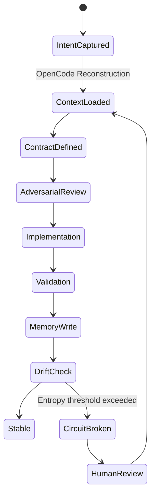

# 🧠 AI-Native Engineering Workflow

## ⚙️ Full Runtime Kit v1 (Prompt + System Extensions)

This system defines an **AI-native engineering operating system**.

It is a **closed-loop runtime for software evolution**, not a workflow or toolkit.

It enforces:

* deterministic AI execution
* contract-first development
* separation of reasoning vs execution
* event-sourced system memory
* architectural drift detection
* runtime safety via circuit breaking

---

# 🧱 1. System Composition (Core Architecture)

This system introduces a governed engineering loop composed of:

### 🧠 Intelligence Layer

* 📚 Reusable prompt library (`/docs/prompts.md`)
* 🧠 OpenCode reasoning kernel (system brain)

### ⚙️ Execution Layer

* ⚙️ Continue.dev execution kernel (code actuator)
* 🧪 Validation engine (tests + invariants)

### 📡 Memory Layer

* 📜 ADR system (architectural decisions)
* 📡 Event-sourced runtime logs
* 🧾 System history tracking

### 🧭 Governance Layer

* 🧭 constraint enforcement engine
* 🔁 safe refactor protocol
* ⚠️ drift detection system

### 🛑 Safety Layer

* 🚨 circuit breaker
* 🧯 entropy control system

---

# 🔄 2. End-to-End Runtime Workflow (Core Loop)

This is the **primary execution lifecycle** of the system.

```text id="core-loop"
Human Intent
   ↓
OpenCode: System Reconstruction
   ↓
OpenCode: Contract Definition
   ↓
OpenCode: Adversarial Review
   ↓
Continue.dev: Implementation
   ↓
Validation Layer (Tests + Invariants)
   ↓
Event Store Append
   ↓
ADR Update (if required)
   ↓
Observer Drift Evaluation
   ↓
[STABLE] → System continues
[FAIL]   → Circuit Break → Reconstruct → Retry
```

---

# 🧠 3. Runtime State Machine



---

# 📡 4. Event-Sourced Memory System

## 📁 `/docs/events/schema.json`

All system changes are **append-only events**.

```json id="event-schema"
{
  "event": {
    "id": "string",
    "type": "CONTEXT_LOADED | CONTRACT_DEFINED | IMPLEMENTATION_APPLIED | VALIDATION_FAILED | MEMORY_UPDATED | CIRCUIT_BROKEN",
    "timestamp": "ISO-8601",
    "actor": "OpenCode | Continue | Human | CI | Observer",
    "feature": "string",
    "payload": {},
    "severity": "LOW | MEDIUM | HIGH | CRITICAL"
  }
}
```

---

## 🔁 Canonical Event Lifecycle

```text id="event-lifecycle"
CONTEXT_LOADED
→ CONTRACT_DEFINED
→ ADVERSARIAL_REVIEW_EXECUTED
→ IMPLEMENTATION_APPLIED
→ VALIDATION_EXECUTED
→ MEMORY_UPDATED
→ (optional) CIRCUIT_BROKEN
```

---

# 🧠 5. OpenCode — Reasoning Kernel (System Brain)

OpenCode is responsible for **system intelligence and governance reasoning**.

It NEVER writes production code.

## Responsibilities:

* system reconstruction
* contract definition
* architectural validation
* risk analysis
* drift detection

---

## 5.1 System Reconstruction Prompt

Rebuild full system state from:

* `/docs/requirements.md`
* `/docs/adr/*`
* `/docs/history/system-history.md`
* `/docs/constraints/active_constraints.md`

### Output:

* active constraints
* ADR delta
* system risks
* hidden inconsistencies
* assumption drift

---

## 5.2 Contract Generator (Interface Layer)

Defines `{FEATURE}` execution contract.

Must include:

* inputs / outputs
* data model
* invariants
* side effects
* failure modes
* security constraints
* idempotency rules

> ❗ No implementation is valid without a contract.

---

## 5.3 Adversarial Review (Pre-Mortem Engine)

Simulates production failure:

* concurrency issues
* race conditions
* data corruption
* auth failures
* dependency breakdowns

### Output:

* issue
* severity
* failure scenario
* blast radius

---

## 5.4 Architecture Drift Detection

Compares:

* implementation
* ADR baseline
* requirements

### Output:

* drift points
* broken invariants
* assumption mismatches
* entropy hotspots

---

# ⚙️ 6. Continue.dev — Execution Kernel (Actuator Layer)

Continue.dev performs **controlled implementation only**.

It NEVER defines architecture.

## Responsibilities:

* code generation
* refactoring
* migrations
* test implementation
* file modification

---

## 6.1 Feature Implementation Contract

Constraints:

* must follow ADRs
* must preserve invariants
* must follow patterns
* must be idempotent

### Output:

* API routes
* DB changes
* validation layer
* minimal tests

---

## 6.2 Safe Refactor Protocol

Hard constraints:

* no behavior change
* no schema change
* no API change

Allowed:

* decomposition
* modularization
* cleanup

### Output:

* semantic diff
* modified files
* risk notes

---

## 6.3 Debugging Protocol

Outputs:

* root cause hypothesis
* affected layer (UI / API / DB / Infra / Event)
* minimal fix plan
* regression risk

---

# 🧭 7. Refactor Safety Protocol (State Transition Model)

Refactoring is a **controlled state transition**, not code editing.

## Phase 1 — System Analysis (OpenCode)

* dependency graph
* coupling analysis
* side effects
* invariants risk map

---

## Phase 2 — Contract Freeze

Lock:

* APIs
* DB schema
* event contracts
* integrations

---

## Phase 3 — Execution (Continue.dev)

Only internal changes allowed:

* decomposition
* abstraction
* modularization

---

## Phase 4 — Validation Gate

System valid only if:

* tests pass
* invariants preserved
* no drift detected

---

# 🧠 8. Observer — System Integrity Engine

The Observer is a **continuous evaluation function**, not an agent.

## 🧮 Entropy Model

```text id="entropy"
Entropy =
  divergence(ADR, Implementation)
+ divergence(Requirements, Code)
+ unresolved high-severity risks
```

---

## 🚨 Circuit Breaker

Triggered when:

```pseudo id="cb-trigger"
if Entropy > threshold:
    trigger CIRCUIT_BREAKER
```

### Behavior:

* freeze execution
* stop writes
* force reconstruction
* require human approval
* reset baseline

---

# 🧾 9. ADR System (Decision Memory Layer)

Stored in:

```text
/docs/adr/ADR-{NNN}.md
```

## ADR Structure:

* Context
* Decision
* Alternatives
* Consequences
* Risks
* Mitigation
* System Impact

> ADRs are **immutable system truth**

---

# 🔁 10. System Evolution Rules (Global Invariants)

### Rule 1 — Contract First

No contract → no execution.

---

### Rule 2 — ADR Compliance

Conflicts block execution.

---

### Rule 3 — Context Load Required

No reconstruction → invalid state.

---

### Rule 4 — Validation Supremacy

Tests override success claims.

---

### Rule 5 — Memory Consistency

Every change must update:

```text
/docs/history/system-history.md
```

---

# 🧠 11. Unified Runtime Architecture

```text id="runtime"
Human
  ↓
OpenCode (Reasoning Kernel)
  ↓
Contract Layer
  ↓
Continue.dev (Execution Kernel)
  ↓
Validation Layer
  ↓
Event Store + ADR Memory
  ↓
Observer (Drift Engine)
  ↓
Circuit Breaker
  ↓
Human Approval Loop
```

---

# 🚀 12. System Summary

This system is not:

* a prompt toolkit
* a coding assistant workflow
* a set of best practices

It is:

> 🧠 A deterministic AI-native software engineering operating system
> with governed execution, memory, and safety constraints

---

# ⚠️ Key Upgrade Over Traditional AI Dev Workflows

### Before:

* ad-hoc prompting
* implicit assumptions
* manual discipline

### Now:

* explicit execution state machine
* enforced contracts
* drift-controlled runtime
* event-sourced engineering memory
* AI agents as constrained system transitions
