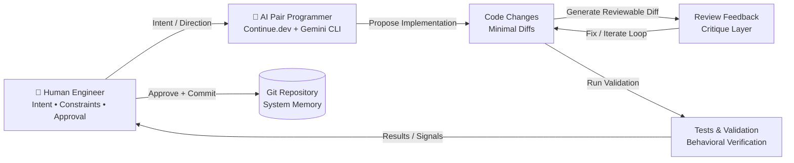

# 🧠 Production-Grade AI Pair Programming System

## (Continue.dev + Gemini CLI + VS Code + Git-Gated Engineering Workflow)

---

# ⚠️ Core Principle

This system is **not autonomous coding**, and it must never be treated as such.

It is:

> **A deterministic, human-governed engineering system where AI functions as a constrained, role-separated pair programming partner under explicit control, review discipline, and Git-enforced safety boundaries.**

The AI does not “own” execution. It participates as a **bounded collaborator inside an engineered workflow**.

The system is designed to behave like a **senior engineering pair**, not an agentic software developer.

---

## 🧩 Non-Negotiable Engineering Properties

Every change must satisfy all four properties simultaneously:

* **Explainable** → Every transformation can be reasoned about and inspected
* **Reviewable** → All changes are diff-based and explicitly inspectable before acceptance
* **Reversible** → Git history allows safe rollback of any state
* **Testable** → Behavior can be verified through automated or explicit validation

If any property is violated, the change is rejected by design—no exceptions.

---

# 🧠 1. System Overview (Pair Programming Architecture)

The system models software development as a **continuous closed-loop collaboration system** between human intent and AI-assisted execution.



---

## 🧠 System Interpretation

This is not a request-response system.

It is a **closed engineering loop**:

* Human defines *intent and constraints*
* AI generates *bounded implementation proposals*
* Review layer enforces *discipline and correctness*
* Validation layer enforces *behavioral truth*
* Git captures *final system state as durable memory*

---

# 🧠 2. The Core Working Loop (How Work Actually Happens)

All engineering activity in this system follows a strict three-phase loop.

---

## 🔁 Phase 1: Intent → Translation (Human → System Understanding)

The human does **not write code**.

Instead, the human expresses:

* intent
* constraints
* expected outcome
* risk tolerance

Example:

> “Refactor authentication to support multi-tenant isolation”

The AI responds with:

* interpretation of intent
* system impact analysis
* architectural implications
* incremental execution plan
* identified risks and edge cases

This phase ensures **alignment before execution begins**.

---

## 🔁 Phase 2: Build → Critique (Execution + Adversarial Review)

The AI generates **small, reviewable diffs only**.

Then the system immediately applies adversarial reasoning:

* Code Agent produces implementation
* Review Agent challenges correctness, safety, and architecture
* Iteration loop continues until acceptable quality is reached

Key rule:

> No implementation is accepted without critique pressure.

This prevents single-pass hallucinated or unsafe changes.

---

## 🔁 Phase 3: Validate → Commit (Truth Enforcement + Memory Write)

Every accepted change must produce:

* automated tests OR explicit justification for missing tests
* observable validation of behavior
* explicit Git commit capturing the state transition

Git is treated as:

> **The system’s permanent memory layer of engineering decisions**

---

# 🧩 3. Role Model (Minimal but Powerful Engineering Separation)

The system is intentionally split into **four cognitive roles**, each enforcing a different constraint.

---

## 🧠 Code Agent (Builder / Implementation Partner)

The Code Agent behaves like a **junior engineer operating under strict senior-level constraints**.

### Responsibilities:

* produce minimal, incremental diffs
* preserve existing system behavior unless explicitly instructed otherwise
* avoid unnecessary abstraction or architectural redesign
* prioritize correctness and clarity over elegance or optimization
* assume every change will be heavily reviewed

### Core Constraint:

> “Change as little as possible while satisfying the intent.”

---

## 🧠 Review Agent (Senior Staff Critic / Adversarial Layer)

The Review Agent is the system’s **built-in skepticism engine**.

It assumes:

> “Every change is incorrect until proven safe.”

### Responsibilities:

* identify hidden edge cases and failure modes
* detect architectural inconsistencies
* surface security, concurrency, and performance risks
* challenge assumptions in implementation
* enforce system-level consistency

### Core Constraint:

> “Find what breaks before it reaches production.”

---

## 🧪 Test Agent (Validation & Behavioral Truth Layer)

The Test Agent enforces **behavioral correctness as truth, not assumption**.

### Responsibilities:

* generate missing test coverage
* identify regression risks
* validate edge-case behavior
* ensure correctness through observable outputs
* ensure system behavior remains stable after change

### Core Constraint:

> “If it is not validated, it does not exist.”

---

## 🧠 Human Engineer (Orchestrator / Final Authority)

The human is not replaced or abstracted away.

The human is the:

* system scheduler
* risk authority
* final approval gate
* architectural decision-maker

### Responsibilities:

* define intent and constraints
* approve or reject changes
* control iteration cycles
* decide acceptable risk thresholds

### Core Constraint:

> “The system executes only what the human explicitly accepts.”

---

# ⚙️ 4. Core Execution Loop (Engineering Lifecycle)

```text
1. Human defines intent
2. AI translates intent into structured plan
3. Code Agent implements minimal change
4. Review Agent critiques aggressively
5. Human evaluates and decides
6. Test Agent validates behavior
7. Git commits final system state
```

This loop is:

* continuous
* iterative
* deterministic
* human-gated

---

# 🔁 5. VS Code + Continue.dev Execution Workflow

---

## Step 1 — Context Loading (System Awareness Phase)

```text
Explain this module, its dependencies, and its risks.
```

Establishes shared understanding of system boundaries.

---

## Step 2 — Intent Definition (Human → AI Contract)

```text
We want to implement X. Propose a safe incremental approach.
```

Defines scope, constraints, and expectations.

---

## Step 3 — Implementation (Code Agent Mode)

```text
Implement this feature with minimal diff and no unnecessary refactoring.
```

Produces constrained, reviewable change sets.

---

## Step 4 — Review Gate (Adversarial Analysis)

```text
Review this change strictly like a senior engineer.
```

Triggers adversarial validation before acceptance.

---

## Step 5 — Fix Cycle (Iterative Correction Loop)

```text
Address all issues found in review.
```

Refines implementation until acceptable.

---

## Step 6 — Validation (Behavioral Verification)

```text
Generate tests and validate edge cases.
```

Ensures correctness is observable and enforced.

---

## Step 7 — Commit (System Memory Write)

```bash
git add .
git commit -m "feat: implement X with validated AI pair programming workflow"
```

Finalizes system state transition.

---

# 🧱 6. Git as the System Memory Layer

Git is not treated as a tool.

It is treated as:

> 🧠 The authoritative memory system of engineering decisions

Every commit represents a **discrete reasoning step in system evolution**.

---

## Commit Semantics

| Type       | Meaning                               |
| ---------- | ------------------------------------- |
| `docs`     | intent / design definition            |
| `feat`     | new system behavior                   |
| `fix`      | correction of incorrect behavior      |
| `refactor` | structural/system improvement         |
| `test`     | validation and behavioral enforcement |

---

## Example Decision Chain

```bash
git commit -m "docs: define authentication redesign"
git commit -m "feat: implement token validation layer"
git commit -m "fix: handle expired session edge case"
git commit -m "test: add multi-tenant authentication coverage"
```

Each commit is:

> A single atomic unit of engineering reasoning.

---

# 🧠 7. Continue.dev Configuration (Production Mode)

```json
{
  "models": [
    {
      "title": "AI Pair Programmer",
      "provider": "openai",
      "model": "gpt-4o"
    }
  ],
  "contextProviders": [
    "codebase",
    "openFiles",
    "diff",
    "terminal",
    "problems"
  ],
  "customCommands": [
    {
      "name": "review",
      "prompt": "Review strictly for correctness, safety, architecture, and hidden edge cases."
    },
    {
      "name": "refactor",
      "prompt": "Refactor with production constraints: minimal diff, preserve behavior, avoid unnecessary abstraction."
    },
    {
      "name": "test",
      "prompt": "Generate comprehensive tests including edge cases, regressions, and failure modes."
    }
  ]
}
```

---

# 🧠 8. Gemini CLI (System-Level Reasoning Layer)

Gemini CLI operates as a **global reasoning layer over the entire codebase**.

It is used for:

* repository-wide architectural analysis
* dependency graph interpretation
* system decomposition
* cross-module impact analysis
* deep debugging of systemic failures

### Example:

```text
Analyze this codebase for hidden coupling, architectural drift, and scalability risks.
```

---

# 🔍 9. Debugging Loop (When System Breaks)

When failure occurs, the system follows a deterministic recovery process:

```text
1. reproduce issue
2. identify root cause
3. locate boundary violation
4. design fix
5. validate fix
6. add regression test
```

This ensures every failure becomes:

> A permanent improvement to system robustness.

---

# ⚡ 10. Feature Development Pipeline (End-to-End Flow)

```text
1. define intent
2. design system approach
3. implement incrementally
4. adversarial review
5. test generation
6. validate behavior
7. commit as system memory
```

---

# 🧠 11. Mental Model (Critical Shift)

## AI is NOT:

* an autonomous developer
* a free-form code generator
* a system authority
* a decision-maker

## AI IS:

* a constrained engineering collaborator
* a structured reasoning assistant
* a diff-generation system under strict rules
* an adversarial review simulator

---

# 🔒 12. Guardrails (Non-Negotiable System Rules)

* No change without review
* No commit without explicit approval
* No silent or undocumented refactors
* No untested production changes
* No multi-file rewrites without intent specification
* No skipping Git checkpoints
* No bypassing review phase

---

# 🚀 13. Final System Outcome

You now operate:

## 🧠 A disciplined AI pair programming system

With:

* structured collaboration loops
* adversarial review enforcement
* Git-backed engineering memory
* test-driven correctness validation
* human-controlled governance layer

---

# 🧭 Final Identity Shift

You are no longer “using AI tools”.

You are:

> 🧠 Operating a controlled engineering system where AI functions as a constrained senior pair programmer under strict software engineering discipline.
