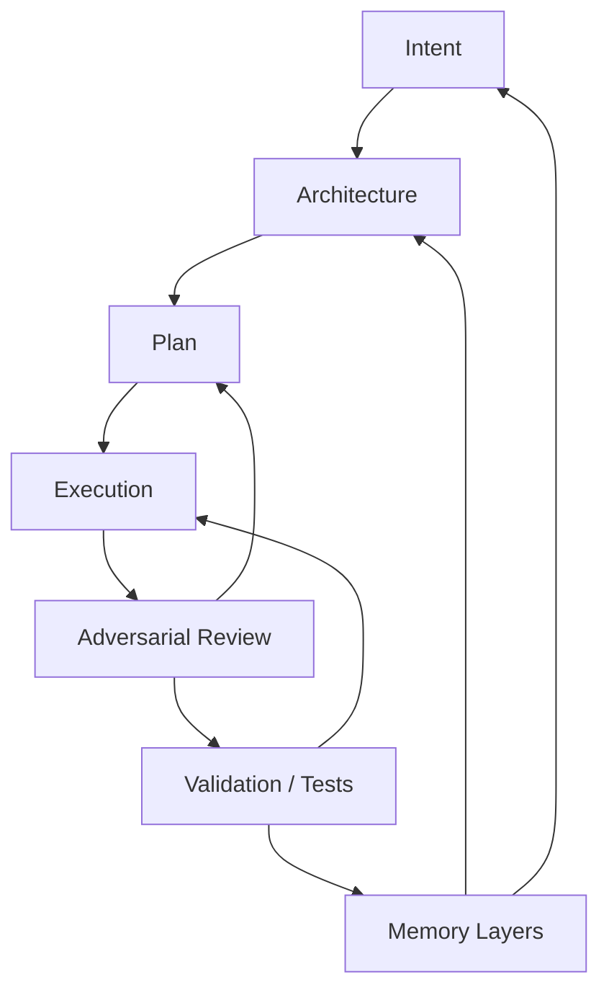
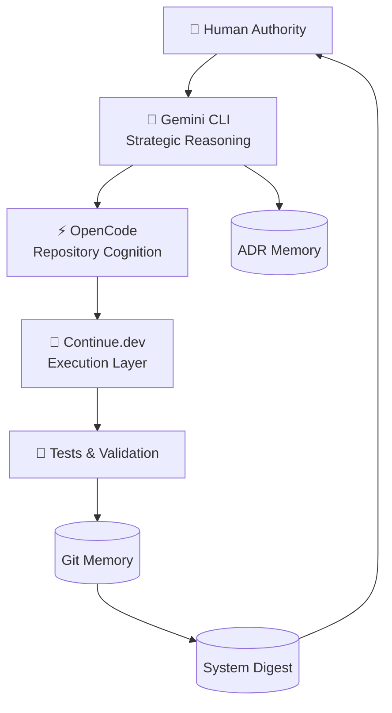

# 🧠 Governed Intelligence Engineering + OpenCode Protocol System

## Beyond AI Pair Programming

### A Human-Governed, Adversarially-Validated Engineering Intelligence System

---

# ⚠️ Core Principle

AI does not reduce the need for engineering.

AI increases the need for engineering.

As software generation approaches zero marginal cost, the scarce resources become:

* judgment
* validation
* governance
* architectural coherence
* operational reliability
* system memory integrity

The challenge is no longer generating software.

The challenge is governing software generation inside a **closed, verifiable engineering control system with structured intelligence feedback loops**.

---

# 🧠 First Law of AI Engineering

Generation is cheap.

Correctness is expensive.

> System design must optimize for correctness preservation, not output velocity.

---

# 🧠 Second Law of AI Engineering

Any AI system without feedback loops will drift.

---

# 🧩 Engineering as a Closed Control System

## ❌ Linear AI Workflow

```text
Prompt → Generate → Accept
```

This is not engineering.

It is uncontrolled synthesis.

---

## ✅ Governed Engineering System



### System Properties

Every stage enforces:

* feedback
* verification
* traceability
* reversibility
* accountability

---

# 🧠 Intelligence Layer Architecture



---

# 👤 Human = Authority Layer

Humans are the only true authority because they own consequences.

### Responsibilities

* define intent
* approve architecture
* accept risk
* authorize dependencies
* approve production changes

> Authority and responsibility must remain coupled.

---

# 🧠 AI Role Separation Model

## 🧠 Gemini CLI — Strategic Cognition

Used for:

* architecture reasoning
* system decomposition
* threat modeling
* scalability failure analysis
* ADR creation

### Prompt Pattern

```text
Analyze this system for hidden assumptions, scaling failures, and governance risks.

What breaks at 10x scale?
What assumptions are unstated?
What are systemic risks?
```

---

## ⚡ OpenCode — Repository Cognition

Used for:

* dependency analysis
* architectural drift detection
* coupling identification
* system-wide impact reasoning

### Prompt Pattern

```text
Identify coupling across modules.

Show architectural drift.

Locate hidden dependencies.

Map system-wide impact of this change.
```

---

## 🤲 Continue.dev — Execution Layer

Used for:

* implementation
* bounded refactoring
* bug fixing
* test generation

### Core Constraint

> Never redesign architecture without explicit authorization.

### Prompt Pattern

```text
Implement with minimal diff.

Preserve existing behavior.

Avoid unnecessary abstraction.

Add tests before modification.
```

---

## 🧪 Test System — Reality Layer

Used for:

* behavioral validation
* regression detection
* invariant enforcement

> If it is not tested or observed, it does not exist.

---

# 🔁 Unified Engineering Execution Loop

```text
1. Human defines intent + constraints
2. Gemini performs strategic reasoning
3. OpenCode analyzes repository impact
4. Continue.dev proposes implementation
5. Adversarial review validates assumptions
6. Tests enforce correctness
7. Human approves or rejects
8. Git commits system state
9. System Digest updates
```

---

# 🧠 Context Engineering Layer

Context is the primary system resource.

```text
Correctness ∝ Context Quality × Constraint Quality × Validation Quality
```

---

## Standard Intent Contract

```markdown
# Objective
What are we trying to achieve?

# Constraints
What must NOT change?

# Success Criteria
How do we measure success?

# Risks
What could break?

# Out of Scope
What must NOT be touched?
```

---

# 🧩 Contract-First Engineering

No implementation begins without a contract.

```text
Input:
Output:
Side Effects:
Invariants:
Failure Modes:
```

---

# ⚠️ Adversarial Review System

## Default Assumption

> Every change is unsafe until proven correct.

### Review Priorities

1. Security
2. Data integrity
3. Concurrency safety
4. System correctness
5. Performance
6. Maintainability

### Explicit Exclusions

* formatting
* stylistic preferences
* unnecessary abstraction

---

# 📜 Three Memory Layers

## 1. Git Memory (State Changes)

```text
What changed?
```

---

## 2. ADR Memory (Decision History)

```text
Why did it change?
```

---

## 3. System Digest (Operational Truth)

```text
SYSTEM_HISTORY.md
```

Contains:

* current architecture
* active constraints
* known risks
* technical debt
* unresolved tradeoffs

---

# 🧠 Production AI Pair Programming Loop


---

# 🧠 Role Model (Execution Discipline)

## 🧠 Code Agent

* minimal diff
* preserve behavior
* no redesign
* no optimization unless required

> “Change as little as possible.”

---

## 🧠 Review Agent

* assumes failure
* finds hidden risks
* challenges assumptions
* blocks unsafe changes

> “Prove safety before acceptance.”

---

## 🧪 Test Agent

* validates real behavior
* enforces invariants
* prevents regression drift

> “If it is not validated, it does not exist.”

---

## 👤 Human Engineer

* final authority
* risk owner
* system architect

> “Nothing ships without explicit approval.”

---

# 🔁 End-to-End Feature Lifecycle

```text
1. Intent Definition
2. System Analysis (Gemini + OpenCode)
3. Contract Specification
4. Implementation
5. Adversarial Review
6. Test Generation
7. Validation Execution
8. Human Approval
9. Git Commit
10. System Digest Update
```

---

# 🧱 Git as Engineering Memory

Git is not version control.

It is:

> 🧠 A structured reasoning history of system evolution

### Commit Types

| Type     | Meaning           |
| -------- | ----------------- |
| docs     | intent/design     |
| feat     | new behavior      |
| fix      | correction        |
| refactor | structural change |
| test     | validation        |

---

# 🧠 Failure Mode Governance

* Specification drift → re-anchor contracts
* Context collapse → maintain System Digest + ADRs
* Refactor mania → enforce minimal diff
* Abstraction explosion → require justification
* False confidence → require tests + evidence
* Reviewer bias → enforce adversarial review

---

# 🚨 Human Red Lines

* No change without review
* No commit without approval
* No multi-module rewrite without intent
* No untested production changes
* No silent refactors
* No unauthorized dependencies

---

# 🧪 Risk-Based Governance Model

| Risk     | Example  | Controls                 |
| -------- | -------- | ------------------------ |
| Low      | Docs     | Review                   |
| Medium   | Feature  | Review + Tests           |
| High     | Auth     | ADR + Adversarial Review |
| Critical | Payments | Full validation pipeline |

---

# ⚙️ Continue.dev Execution Configuration

```json
{
  "models": [
    {
      "title": "Code Agent",
      "provider": "openai",
      "model": "gpt-4o"
    }
  ],
  "contextProviders": [
    "codebase",
    "openFiles",
    "diff",
    "terminal",
    "problems"
  ],
  "customCommands": [
    {
      "name": "implement",
      "prompt": "Minimal diff implementation under strict constraints."
    },
    {
      "name": "review",
      "prompt": "Adversarial review: security, correctness, architecture, failure modes."
    },
    {
      "name": "test",
      "prompt": "Generate regression and edge-case tests."
    }
  ]
}
```

---

# ⚡ OpenCode CLI Command System (Runtime Layer)

## 🧠 Core Philosophy

OpenCode is not a tool.

It is a:

> 🧠 Repository cognition interface for structured reasoning, impact analysis, and controlled change negotiation

---

## 🔍 inspect

```bash
opencode inspect repo
opencode inspect module <name>
opencode inspect file <path>
```

Understand system structure and responsibilities.

---

## 🧠 analyze

```bash
opencode analyze architecture
opencode analyze consistency
opencode analyze antipatterns
```

Deep structural reasoning.

---

## 🔗 trace

```bash
opencode trace module <name>
opencode trace callchain <entry>
opencode trace dataflow <entity>
```

Dependency and flow cognition.

---

## ⚠️ impact

```bash
opencode impact module <name>
```

Simulate system-wide effects of change.

---

## 🧠 review

```bash
opencode review system
opencode review module <name>
opencode review security
```

Adversarial evaluation layer.

---

## 🔧 refactor

```bash
opencode refactor plan <module>
opencode refactor minimal <module>
```

Controlled change design.

---

## 🐞 debug

```bash
opencode debug error "<msg>"
opencode debug test <name>
opencode debug incident <id>
```

Failure reasoning engine.

---

## 🏗️ design

```bash
opencode design system <feature>
```

Architecture reasoning.

---

## 🧾 commit

```bash
opencode commit explain
opencode commit summary
opencode commit risk
```

Memory layer introspection.

---

# 🔁 Workflow Compositions

```bash
opencode inspect module auth
opencode analyze architecture
opencode trace module auth
opencode impact module auth
opencode review module auth
```

---

# 🧠 Final System Identity

You are not using AI tools.

You are operating:

> 🧠 A governed intelligence engineering system with multi-layer cognition, adversarial validation, and Git-backed memory discipline


