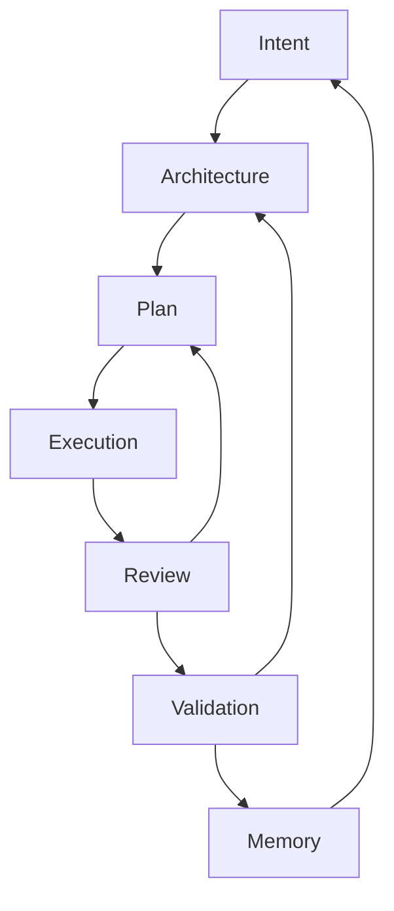
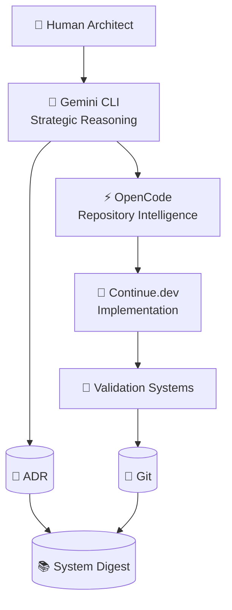

# 🧠 Governed Intelligence Engineering

## Beyond AI Pair Programming

### Building Stable Human–Machine Engineering Systems

---

# ⚠️ Core Principle

AI does not reduce the need for engineering.

AI increases the need for engineering.

As software generation approaches zero marginal cost, the scarce resources become:

* judgment
* validation
* governance
* architectural coherence
* operational reliability

The challenge is no longer generating software.

The challenge is governing software generation.

Therefore:

> AI must be treated as an execution capability operating inside a governed engineering system rather than a source of authority.

---

# 🧠 The First Law of AI Engineering

Generation is cheap.

Correctness is expensive.

Every engineering process should be optimized around preserving correctness rather than maximizing generation speed.

---

# 🧩 Engineering as a Control System

Traditional AI workflows resemble:

```text
Prompt
 ↓
Generate
 ↓
Accept
```

This is not engineering.

It is content generation.

Production engineering requires feedback loops.



Every stage must have:

* feedback
* verification
* accountability

Without feedback loops, AI systems drift.

---

# 🧠 Intelligence Layer Separation

The most important design principle is separation of cognition.

Different tools perform different forms of thinking.



---

# 👤 Human = Authority Layer

Humans retain authority because humans own consequences.

AI does not own:

* outages
* compliance violations
* security incidents
* business risk

Humans do.

Therefore authority cannot be delegated.

### Responsibilities

* intent definition
* architectural approval
* risk acceptance
* prioritization
* escalation decisions

### Core Rule

> Responsibility and authority must remain aligned.

---

# 🧠 Gemini CLI = Strategic Cognition

Gemini should not be treated as a code generator.

Its highest-value role is reasoning.

Responsibilities:

* architecture reviews
* tradeoff analysis
* system decomposition
* threat modeling
* ADR drafting
* assumption discovery

Prompt examples:

```text
Challenge this architecture.

Identify hidden assumptions.

What fails at 10x scale?

What governance risks exist?
```

---

# ⚡ OpenCode = Repository Cognition

OpenCode understands systems.

Not features.

Responsibilities:

* dependency graph analysis
* coupling detection
* boundary violations
* impact assessment
* architectural drift detection

Prompt examples:

```text
Show hidden coupling.

Identify modules impacted.

Locate architectural erosion.

Detect cyclic dependencies.
```

---

# 🤲 Continue.dev = Execution Layer

Continue.dev should operate under strict constraints.

Responsibilities:

* implementation
* local refactoring
* test generation
* defect correction

Prompt examples:

```text
Implement minimal diff.

Preserve behavior.

Do not redesign architecture.

Generate tests before modification.
```

### Core Rule

> Optimization without authorization is prohibited.

---

# 🧠 Context Engineering

## Context Is the Primary Resource

Most AI failures are context failures.

The quality of output is largely determined by:

```text
Context Quality
×
Constraint Quality
×
Validation Quality
```

---

## Intent Template

Every session should begin with a structured intent contract.

```markdown
# Objective

What are we trying to achieve?

# Constraints

What cannot change?

# Success Criteria

How will success be measured?

# Risks

What can break?

# Out Of Scope

What must not be touched?
```

This reduces ambiguity and drift.

---

# 🧩 Contract-First Engineering

Before implementation begins:

Define:

* inputs
* outputs
* side effects
* invariants

Example:

```text
Input:
JWT Token

Output:
Authenticated User

Invariant:
Existing API contract unchanged

Side Effects:
Audit log entry created
```

Only after agreement on the contract should implementation begin.

This enables:

* deterministic testing
* specification-driven development
* reviewable requirements

---

# ⚠️ Adversarial Review Layer

One weakness of AI systems is alignment bias.

The reviewer often agrees with the builder.

To counter this:

The Review Agent must operate under adversarial assumptions.

Default assumption:

> The implementation is unsafe until proven otherwise.

Review priorities:

1. Security
2. Data Integrity
3. Concurrency
4. Performance
5. Maintainability

Not:

```text
Code Style
Formatting
Elegance
```

The objective is risk discovery.

Not encouragement.

---

# 📜 Three Memory Layers

Most systems only maintain one memory layer.

Production systems require three.

---

## Layer 1: Git Memory

Stores:

```text
What changed?
```

---

## Layer 2: ADR Memory

Stores:

```text
Why did it change?
```

---

## Layer 3: System Digest Memory

Stores:

```text
What is currently true?
```

File:

```text
SYSTEM_HISTORY.md
```

Updated every:

```text
3–5 commits
or
major architectural change
```

Contains:

* active constraints
* current architecture
* accepted tradeoffs
* known technical debt
* unresolved risks

This prevents context saturation and historical drift.

---

# ⚠️ Known AI Failure Modes

## Specification Drift

Requirements change subtly.

Mitigation:

```text
Restate constraints continuously.
```

---

## Context Collapse

Earlier decisions disappear.

Mitigation:

```text
System Digest
ADR Records
Architecture Summaries
```

---

## Refactor Mania

AI rewrites stable systems.

Mitigation:

```text
Minimal Diff Policy
```

---

## Abstraction Explosion

AI introduces unnecessary patterns.

Mitigation:

```text
Justification Required
```

---

## False Confidence

AI presents assumptions as facts.

Mitigation:

```text
Evidence Required
Validation Required
Tests Required
```

---

## Reviewer Paradox

Reviewer validates builder assumptions.

Mitigation:

```text
Adversarial Review Persona
Independent Validation
Explicit Threat Modeling
```

---

# 🚨 Human Red Lines

The human must immediately reject any change that violates these rules.

---

## Red Line #1

No explanation.

If the AI cannot explain:

```text
Why?
```

The change is rejected.

---

## Red Line #2

Unauthorized dependencies.

New libraries require explicit approval.

Always.

---

## Red Line #3

Broken tests.

If existing tests fail:

The human investigates first.

The AI does not redefine requirements.

---

## Red Line #4

Architectural modification without ADR.

Immediate rejection.

---

## Red Line #5

Multi-module rewrite without authorization.

Immediate rejection.

---

# 🧪 Risk-Based Governance

| Risk     | Example               | Required Controls                            |
| -------- | --------------------- | -------------------------------------------- |
| Low      | Documentation         | Review                                       |
| Medium   | Feature Change        | Review + Tests                               |
| High     | Authentication        | Adversarial Review                           |
| Critical | Payments / Compliance | Architecture Review + ADR + Validation Suite |

Governance should scale with risk.

Not effort.

---

# 🚀 Final Identity Shift

You are no longer managing coding assistants.

You are governing a distributed intelligence system.

Where:

```text
Human          = Authority
Gemini CLI     = Strategic Cognition
OpenCode       = Repository Cognition
Continue.dev   = Execution
Tests          = Reality
Git            = Code Memory
ADR            = Decision Memory
System Digest  = Operational Memory
```

The objective is not generating software.

The objective is preserving correctness, coherence, and control while leveraging machine intelligence at scale.

That is the foundation of AI-native engineering.
