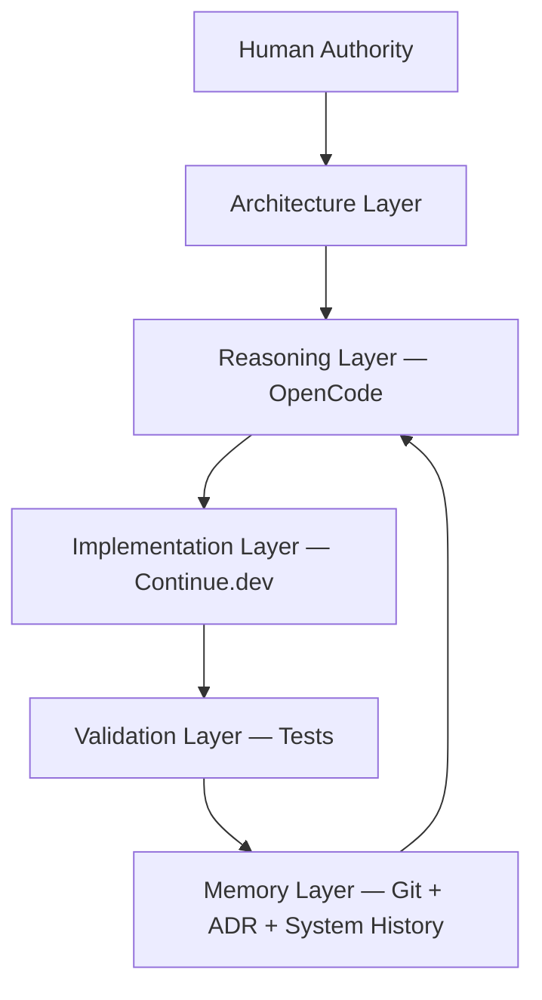

# Co-Developing a Full-Stack Application with VS Code, Continue.dev, and OpenCode

## An AI-Native Engineering System

### React · Next.js · Clerk · Sanity · Inngest · Neon PostgreSQL · shadcn/ui

---

Building software with AI is no longer primarily a coding task.

It is a systems engineering discipline.

This tutorial uses a blog platform as the working example, but the goal is not the application itself.

**The goal is to internalize a repeatable system for building production-grade software in an AI-native environment.**

By the end, you will understand how to:

- Set up VS Code with Continue.dev and OpenCode as a cognitive development system
- Use each tool for the right kind of thinking
- Govern AI-assisted development so your system remains correct, safe, and maintainable
- Build and wire a full stack: React, Next.js, Clerk, Sanity CMS, Inngest, Neon PostgreSQL, and shadcn/ui

---

## Part 1: Understanding the System Before You Touch Code

### Why This Is Not a Tool Replacement

A common mistake is treating AI coding tools as interchangeable drop-ins for each other.

They are not. Each tool occupies a distinct cognitive role.

The traditional model framed development responsibilities like this:

```
Continue.dev = implementation
Some AI assistant = reasoning
```

That framing is too narrow. The right model is:

| Role | Tool | Responsibility |
|---|---|---|
| **Authority** | You (Human) | Architecture, risk, production approval |
| **Brain** | OpenCode | Reasoning, design, impact analysis |
| **Hands** | Continue.dev | Implementation, refactoring, test generation |
| **Memory** | Git + ADRs + System History | What changed, why, what is true now |
| **Reality** | Tests + Linters + CI | Validation that generates truth |

This is not a toolchain.

It is a **cognitive system**.

```
Continue.dev + OpenCode
```

Becomes:

```
Continue.dev = Hands
OpenCode     = Brain + Repository Intelligence
Git          = Memory
Human        = Authority
Tests        = Reality
```

---

### The Engineering Shift

Traditional development optimized for code production. Developers spent most effort writing logic, wiring systems, building APIs, generating boilerplate.

AI has reduced the cost of all of these.

What is now scarce:

- Clear requirements
- Sound architecture
- Controlled integration
- Validation discipline
- Governance
- Operational reliability

The central question has changed.

Not:

> Can AI build this?

But:

> Can we ensure the system being built is correct, safe, and maintainable?

---

### From Toolchain to Cognitive System

Modern software development should no longer be viewed as:

```
Human → AI → Code
```

Instead, it is layered cognition:

```
Human → Architecture → Reasoning → Implementation → Validation → Memory
```

Each layer has a distinct responsibility and a distinct failure mode.



This is a **closed-loop system**, not a linear pipeline. Memory feeds back into reasoning. Every commit is a learning event.

---

## Part 2: Installing and Configuring Your Tools

### Prerequisites

Before starting, ensure you have:

- Node.js 20+ installed
- VS Code installed
- Git initialized in your project
- Accounts created for: Clerk, Sanity, Neon, Inngest

---

### Installing Continue.dev

Continue.dev is a VS Code extension that brings AI into your editor at the implementation layer.

**Install:**

1. Open VS Code
2. Go to Extensions (`Cmd+Shift+X` / `Ctrl+Shift+X`)
3. Search for **Continue**
4. Click Install

**Configure your model:**

Open `.continue/config.json` in your project root (Continue creates this on first launch):

```json
{
  "models": [
    {
      "title": "Claude Sonnet",
      "provider": "anthropic",
      "model": "claude-sonnet-4-5",
      "apiKey": "YOUR_ANTHROPIC_API_KEY"
    }
  ],
  "contextProviders": [
    { "name": "code" },
    { "name": "docs" },
    { "name": "diff" },
    { "name": "terminal" },
    { "name": "problems" },
    { "name": "folder" },
    { "name": "codebase" }
  ],
  "slashCommands": [
    { "name": "edit", "description": "Edit highlighted code" },
    { "name": "comment", "description": "Write comments for the highlighted code" },
    { "name": "tests", "description": "Write unit tests for the highlighted code" }
  ]
}
```

The `contextProviders` are what make Continue.dev powerful. They let you reference your codebase, open files, terminal output, and even your docs folder in any prompt.

**Key shortcuts:**

| Action | Mac | Windows |
|---|---|---|
| Open Continue chat | `Cmd+L` | `Ctrl+L` |
| Inline edit | `Cmd+I` | `Ctrl+I` |
| Add file to context | `@file` | `@file` |
| Add codebase context | `@codebase` | `@codebase` |

---

### Installing OpenCode

OpenCode is a terminal-based AI coding tool with deep repository awareness.

**Install via npm:**

```bash
npm install -g opencode-ai
```

**Or via Homebrew (macOS):**

```bash
brew install opencode
```

**Launch in your project:**

```bash
cd your-project
opencode
```

OpenCode reads your entire repository at startup. This is the key difference from editor-based tools — it builds a full graph of your project before you ask it anything.

**First run setup:**

On first launch, OpenCode will prompt you to configure your preferred AI provider:

```
? Select your AI provider: Anthropic
? Enter your API key: sk-ant-...
? Default model: claude-sonnet-4-5
```

**How to use OpenCode vs Continue.dev:**

Use OpenCode in your terminal when you need to **think**. Use Continue.dev in VS Code when you need to **implement**.

| Question type | Use |
|---|---|
| "What should we build?" | OpenCode |
| "Where is coupling hidden?" | OpenCode |
| "What breaks if I change this?" | OpenCode |
| "Implement Phase 3 of the plan" | Continue.dev |
| "Generate tests for this module" | Continue.dev |
| "Refactor this file safely" | Continue.dev |

---

## Part 3: The Prime Rule

### Do Not Start with Code Generation

**The failure pattern:**

```
Idea → Code → Debugging loop → More code → More debugging
```

**The AI-native pattern:**

```
Problem → Requirements → Architecture → Plan → Code → Validation → Refinement
```

Planning is no longer overhead. It is **risk control**.

The workflow loop looks like this:

```
Problem
  ↓
Requirements
  ↓
Architecture
  ↓
Design Plan
  ↓
Implementation
  ↓
Validation
  ↓
Feedback / Refinement
  ↑_____________________↑
```

This loop is not linear. Architecture evolves as you learn from implementation. Thinking is iterative.

---

### Setting Up Your Source of Truth

AI systems require stable context. Without it, outputs degrade rapidly.

Create this folder structure before writing a single line of application code:

```
docs/
├── requirements.md          # What we are building and why
├── architecture.md          # System design, layers, decisions
├── implementation-plan.md   # Phased delivery plan
├── risks.md                 # Known risks and mitigations
├── roadmap.md               # Features and milestones
├── prompts.md               # Reusable prompts for this project
├── system-history.md        # What is currently true
└── adr/                     # Architecture Decision Records
    ├── ADR-001-auth.md
    ├── ADR-002-cms.md
    └── ADR-003-database.md
```

These documents are not optional. They are the system's **working memory**.

Every prompt you write to OpenCode or Continue.dev should reference these files. Better context produces better reasoning and safer execution.

---

### Three-Layer Memory Architecture

Most teams rely only on Git. That is insufficient for AI-assisted systems.

You need three distinct memory layers:

| Layer | Tool | Answers |
|---|---|---|
| **Code memory** | Git | What changed? |
| **Decision memory** | ADR | Why did it change? |
| **State memory** | System History | What is currently true? |

This prevents context collapse, repeated mistakes, and architectural drift.

**ADR template (`docs/adr/ADR-001-example.md`):**

```markdown
# ADR-001: [Decision Title]

## Status
Accepted

## Context
[What was the situation that forced this decision?]

## Decision
[What did we decide?]

## Consequences
[What are the trade-offs? What becomes easier? What becomes harder?]

## Alternatives Considered
[What else was considered and why was it rejected?]
```

---

## Part 4: Context Engineering

### Prompt Quality Is Secondary. Context Quality Is Decisive.

**Weak prompt:**

```
Create a blog editor
```

**Strong prompt:**

```
Review docs/requirements.md, docs/architecture.md, and docs/adr/.
Implement Phase 4 as described in docs/implementation-plan.md.
Stay within existing constraints. Follow the conventions in docs/prompts.md.
```

The second prompt is not longer because of verbosity. It is longer because it supplies **the system's working memory** to the AI on every call.

```
Docs (requirements, architecture, ADRs)
  +
Prompts
  +
Codebase State
  =
Context
  ↓
OpenCode Reasoning
  ↓
Quality of Output
```

Key principle: **context > prompting style**

---

### Writing Your docs/prompts.md

Maintain a shared prompts file so you and your team use consistent patterns:

```markdown
# Prompts

## Context Loading (use at start of every OpenCode session)
Review docs/requirements.md, docs/architecture.md, and all ADRs in docs/adr/.
Understand the current system state in docs/system-history.md before proceeding.

## Feature Analysis
What are the implications of implementing [feature]?
What existing code does it touch?
Where is coupling hidden?
What assumptions are unsafe?

## Adversarial Review
Assume this implementation has failed. What broke?
Check: security, data integrity, concurrency, performance, maintainability.

## ADR Generation
We decided to [decision]. Context was [context]. Alternatives considered were [alternatives].
Generate an ADR for docs/adr/ADR-[N]-[slug].md.
```

---

## Part 5: Contract-First Development

### Define the Contract Before Writing Code

For every feature or module, define before any implementation:

- **Inputs**: what data enters
- **Outputs**: what data exits
- **Invariants**: what must always be true
- **Side effects**: what changes in the world

**Example — article publishing:**

```
Input:     Draft article (title, body, author, tags)
Output:    Published article (same + slug, publishedAt, version)
Invariant: Versioning is preserved on every publish
Side effects: Search index updated, notifications queued, audit log written
```

Code should implement contracts. Not invent them.

```
Contract Definition
  (Inputs, Outputs, Invariants, Side Effects)
  ↓
Design
  ↓
Implementation
  ↓
Testing
```

This is the natural order. Skip the contract step and you are debugging an ambiguous system.

---

## Part 6: System Architecture

### The Blog Platform Stack

The platform is intentionally layered with clear boundaries:

| Layer | Technology | Responsibility |
|---|---|---|
| **Presentation** | React, Next.js, shadcn/ui | UI, routing, accessibility |
| **Identity** | Clerk | Authentication, sessions, user identity |
| **Content** | Sanity CMS | Editorial workflows, structured content |
| **Transaction** | Neon PostgreSQL | User actions, analytics, bookmarks, state |
| **Background Jobs** | Inngest | Event-driven workflows, notifications, indexing |

Clear boundaries reduce coupling and increase evolvability.

```
Presentation Layer (Next.js + React + shadcn/ui)
  ↓           ↓           ↓
Identity    Content    Transaction
(Clerk)   (Sanity)  (Neon PostgreSQL)
                          ↓
                     Background Jobs
                       (Inngest)
```

---

### Presentation Layer

**Technology:** React, Next.js 14+ (App Router), Tailwind CSS, shadcn/ui

**Responsibilities:** rendering, routing, accessibility, user interaction, component library

**Key decisions:**
- Use the App Router for server components and streaming
- shadcn/ui for consistent, accessible UI primitives
- Tailwind for utility-first styling with design tokens

---

### Identity Layer

**Technology:** Clerk

**Responsibilities:** authentication, authorization, session management, user identity, social login

Passwords should never be handled directly by application code. Clerk owns this layer entirely.

**Setup:**

```bash
npm install @clerk/nextjs
```

```typescript
// app/layout.tsx
import { ClerkProvider } from '@clerk/nextjs'

export default function RootLayout({ children }: { children: React.ReactNode }) {
  return (
    <ClerkProvider>
      <html lang="en">
        <body>{children}</body>
      </html>
    </ClerkProvider>
  )
}
```

```bash
# .env.local
NEXT_PUBLIC_CLERK_PUBLISHABLE_KEY=pk_...
CLERK_SECRET_KEY=sk_...
```

---

### Content Layer

**Technology:** Sanity CMS

**Responsibilities:** content management, author profiles, editorial workflow, categories, tags, previews, content versioning

Content is managed separately from application state. This boundary is intentional — editorial workflow evolves on a different cadence than transactional systems.

**Setup:**

```bash
npm create sanity@latest -- --project YOUR_PROJECT_ID --dataset production
npm install next-sanity @sanity/image-url
```

**Example schema (`sanity/schemas/post.ts`):**

```typescript
export default {
  name: 'post',
  title: 'Post',
  type: 'document',
  fields: [
    { name: 'title', title: 'Title', type: 'string' },
    { name: 'slug', title: 'Slug', type: 'slug', options: { source: 'title' } },
    { name: 'author', title: 'Author', type: 'reference', to: [{ type: 'author' }] },
    { name: 'body', title: 'Body', type: 'array', of: [{ type: 'block' }] },
    { name: 'publishedAt', title: 'Published at', type: 'datetime' },
  ],
}
```

---

### Transaction Layer

**Technology:** Neon PostgreSQL

**Responsibilities:** bookmarks, comments, reactions, user analytics, application state, anything that requires transactional consistency

Transactional systems evolve differently from content systems. Neon provides serverless PostgreSQL with branching — you can branch your database for each feature, just like Git.

**Setup:**

```bash
npm install @neondatabase/serverless
```

```typescript
// lib/db.ts
import { neon } from '@neondatabase/serverless'

export const sql = neon(process.env.DATABASE_URL!)
```

**Example query:**

```typescript
// Fetch bookmarks for a user
const bookmarks = await sql`
  SELECT post_id, created_at
  FROM bookmarks
  WHERE user_id = ${userId}
  ORDER BY created_at DESC
`
```

```bash
# .env.local
DATABASE_URL=postgresql://...@...neon.tech/neondb?sslmode=require
```

---

### Background Jobs Layer

**Technology:** Inngest

**Responsibilities:** event-driven workflows, email notifications, search indexing, scheduled jobs, async processing

Inngest decouples side effects from your request lifecycle. When a post is published, you do not want to block the HTTP response while indexing and sending notifications. Inngest handles that reliably, with retries and observability.

**Setup:**

```bash
npm install inngest
```

**Define a function (`inngest/functions/post-published.ts`):**

```typescript
import { inngest } from '../client'

export const onPostPublished = inngest.createFunction(
  { id: 'on-post-published' },
  { event: 'post/published' },
  async ({ event, step }) => {
    await step.run('update-search-index', async () => {
      // Index the post in your search system
    })

    await step.run('send-notifications', async () => {
      // Notify subscribers
    })

    await step.run('update-analytics', async () => {
      // Record publish event
    })
  }
)
```

**Trigger the event from your API route:**

```typescript
await inngest.send({
  name: 'post/published',
  data: { postId: post.id, authorId: post.authorId }
})
```

---

## Part 7: The Feature Delivery Lifecycle

Every feature follows a governed loop. Skipping steps introduces risk, not speed.

```
1.  Define Problem
2.  Load Context
3.  Analyze Impact
4.  Design Solution
5.  Challenge Assumptions
6.  Implement
7.  Validate
8.  Review
9.  Commit
10. Update Memory
```

This maps to your tools directly:

| Step | Tool | Action |
|---|---|---|
| Define Problem | You | Write clearly in docs/requirements.md |
| Load Context | OpenCode | `Review docs/ and src/` |
| Analyze Impact | OpenCode | `What breaks if we add X?` |
| Design Solution | OpenCode | `Design the contract and architecture` |
| Challenge Assumptions | OpenCode | `What is unsafe about this plan?` |
| Implement | Continue.dev | `Implement Phase N per the plan` |
| Validate | CLI / CI | `npm test && npm run lint` |
| Review | OpenCode | Adversarial review (see below) |
| Commit | Git | Conventional commits with context |
| Update Memory | You | Update system-history.md and ADRs |

---

### Adversarial Review

AI tends toward agreement. That is a liability.

Treat every review as adversarial. Assume the implementation has failed. Find where.

**Focus areas:**

- **Security**: Are inputs validated? Can this endpoint be abused?
- **Data integrity**: Are transactions correct? Can this data be corrupted?
- **Concurrency**: What happens under parallel requests?
- **Performance**: Does this query scale?
- **Maintainability**: Will the next developer understand this?

The goal is not approval. The goal is **discovering what breaks**.

**Adversarial review prompt for OpenCode:**

```
Assume the implementation in [file] has a critical failure.
Review for: security vulnerabilities, data integrity issues, concurrency bugs,
performance problems, and maintainability concerns.
Do not look for what works. Look for what breaks.
```

---

## Part 8: Putting It Together — Phased Build

### Phase 0: Foundation

Before writing application code, complete your cognitive scaffolding.

```bash
mkdir docs docs/adr
touch docs/requirements.md
touch docs/architecture.md
touch docs/implementation-plan.md
touch docs/risks.md
touch docs/prompts.md
touch docs/system-history.md
```

Populate each file with your project's intent. Even rough notes are better than empty files.

---

### Phase 1: Project Scaffolding

```bash
npx create-next-app@latest blog-platform \
  --typescript \
  --tailwind \
  --app \
  --src-dir \
  --import-alias "@/*"

cd blog-platform

# Install all dependencies
npm install @clerk/nextjs next-sanity @sanity/image-url \
  @neondatabase/serverless inngest \
  @radix-ui/react-slot class-variance-authority clsx tailwind-merge

# Install shadcn/ui
npx shadcn@latest init
```

**OpenCode prompt to use at this stage:**

```
Review the scaffolded project structure.
Review docs/architecture.md and docs/requirements.md.
Identify any structural misalignments with our planned architecture.
What is missing? What should not be there?
```

---

### Phase 2: Identity Integration

Add Clerk to the application layer.

**Continue.dev prompt:**

```
@docs/architecture.md @src/app/layout.tsx
Implement Clerk authentication following the Identity Layer spec.
Wrap the root layout with ClerkProvider.
Add middleware to protect /dashboard and /editor routes.
Preserve existing layout structure.
```

Create `src/middleware.ts`:

```typescript
import { clerkMiddleware, createRouteMatcher } from '@clerk/nextjs/server'

const isProtectedRoute = createRouteMatcher(['/dashboard(.*)', '/editor(.*)'])

export default clerkMiddleware((auth, req) => {
  if (isProtectedRoute(req)) auth().protect()
})

export const config = {
  matcher: ['/((?!.*\\..*|_next).*)', '/', '/(api|trpc)(.*)'],
}
```

---

### Phase 3: Content Schema

Design your Sanity schemas contract-first.

**OpenCode prompt:**

```
Review docs/requirements.md.
Design Sanity schemas for: Post, Author, Category, Tag.
Respect the contract: Post must preserve versioning on publish.
Side effects on publish: search indexing, notifications.
Output schemas only — no implementation code yet.
```

Review the output. Challenge the design. Then implement:

**Continue.dev prompt:**

```
@sanity/schemas/
Implement the Post, Author, Category, and Tag schemas
as defined in the design output above.
Follow Sanity v3 conventions.
```

---

### Phase 4: Transaction Layer

Stand up your Neon database schema.

**Contract definition:**

```
Bookmarks
  Input:  userId (Clerk), postId (Sanity document ID)
  Output: bookmark record with id, createdAt
  Invariant: One bookmark per user per post
  Side effects: none (sync)

Comments
  Input:  userId, postId, body (string, max 2000 chars)
  Output: comment record
  Invariant: Body cannot be empty; user must be authenticated
  Side effects: notification queued via Inngest
```

**Migration (`db/migrations/001_initial.sql`):**

```sql
CREATE TABLE bookmarks (
  id          UUID PRIMARY KEY DEFAULT gen_random_uuid(),
  user_id     TEXT NOT NULL,
  post_id     TEXT NOT NULL,
  created_at  TIMESTAMPTZ NOT NULL DEFAULT NOW(),
  UNIQUE(user_id, post_id)
);

CREATE TABLE comments (
  id          UUID PRIMARY KEY DEFAULT gen_random_uuid(),
  user_id     TEXT NOT NULL,
  post_id     TEXT NOT NULL,
  body        TEXT NOT NULL CHECK (char_length(body) <= 2000),
  created_at  TIMESTAMPTZ NOT NULL DEFAULT NOW()
);

CREATE INDEX idx_bookmarks_user ON bookmarks(user_id);
CREATE INDEX idx_comments_post  ON comments(post_id);
```

---

### Phase 5: Background Jobs

Wire Inngest for post-publish side effects.

**Continue.dev prompt:**

```
@docs/implementation-plan.md @inngest/
Implement the post-publish Inngest function.
Steps: update-search-index, send-subscriber-notifications, record-analytics.
Each step must be independently retryable.
Add the API route handler at app/api/inngest/route.ts.
```

---

### Phase 6: UI Components

Build the interface with shadcn/ui.

**Continue.dev prompt:**

```
@docs/requirements.md @src/components/
Implement the PostCard component using shadcn/ui Card primitives.
Props: title, excerpt, author, publishedAt, slug, coverImage.
Follow the existing component conventions in this folder.
Use TypeScript. Include hover state for the card.
```

---

## Part 9: Validation Is Reality

AI generates possibilities.

Validation determines truth.

Always validate:

| Concern | Method |
|---|---|
| Correctness | Unit and integration tests |
| Security | Input validation, auth checks, OWASP checklist |
| Performance | Query analysis, Lighthouse, load testing |
| Accessibility | axe-core, keyboard navigation testing |
| Type safety | TypeScript strict mode, no `any` |
| Deployment | Preview deploy on every PR |

**Principle:**

```
Generation creates value.
Validation protects it.
```

---

## Part 10: The 60/40 Shift

**Old development model:**

```
10% planning
90% coding
```

**AI-native development model:**

```
60% planning + validation
40% implementation
```

Coding is no longer the bottleneck.

**Judgment is.**

The developer's job has shifted from *producing* code to *governing* a system that produces code. That governance — clear requirements, sound architecture, adversarial review, disciplined validation — is where value is created and risk is controlled.

---

## Part 11: Tool Usage Reference

### When to use OpenCode

Ask OpenCode when you need to **think**:

- What are we actually building?
- What breaks if this changes?
- Where is coupling hidden?
- What assumptions are unsafe?
- Challenge this design.
- Why is this failing?
- What architectural tradeoffs are involved here?

### When to use Continue.dev

Ask Continue.dev when you need to **execute**:

- Implement Phase 4 as specified.
- Apply the review feedback to this file.
- Preserve behavior while refactoring this module.
- Generate tests for this service.
- How does this fit into the existing codebase?

---

## Final Identity Model

This system is best understood as:

```
Human        = Authority
OpenCode     = Brain
Continue.dev = Hands
Git          = Memory
Tests        = Reality
```

The objective is not faster code generation.

It is **controlled, reliable, and explainable software systems**.

```
Human (Authority)
  ↓
OpenCode (Brain)
  ↓
Continue.dev (Hands)
  ↓
Tests (Reality)
  ↓
Git (Memory)
  ↑__________↑
     (loop)
```

This is a living system. Memory feeds reasoning. Every commit sharpens the next decision.

---

## Appendix: Quick Reference

### Environment Variables

```bash
# .env.local

# Clerk
NEXT_PUBLIC_CLERK_PUBLISHABLE_KEY=pk_...
CLERK_SECRET_KEY=sk_...
NEXT_PUBLIC_CLERK_SIGN_IN_URL=/sign-in
NEXT_PUBLIC_CLERK_SIGN_UP_URL=/sign-up

# Sanity
NEXT_PUBLIC_SANITY_PROJECT_ID=...
NEXT_PUBLIC_SANITY_DATASET=production
SANITY_API_TOKEN=sk...

# Neon PostgreSQL
DATABASE_URL=postgresql://...@....neon.tech/neondb?sslmode=require

# Inngest
INNGEST_EVENT_KEY=...
INNGEST_SIGNING_KEY=...
```

### Recommended npm Scripts

```json
{
  "scripts": {
    "dev": "next dev",
    "build": "next build",
    "start": "next start",
    "lint": "next lint",
    "type-check": "tsc --noEmit",
    "test": "vitest",
    "test:e2e": "playwright test",
    "db:migrate": "node db/migrate.js",
    "inngest:dev": "npx inngest-cli@latest dev"
  }
}
```

### Phased Delivery Checklist

- [ ] Phase 0: Docs scaffolding complete (requirements, architecture, prompts, ADRs)
- [ ] Phase 1: Next.js project scaffolded, all dependencies installed
- [ ] Phase 2: Clerk auth integrated, middleware protecting routes
- [ ] Phase 3: Sanity schemas designed (contract-first), Studio running
- [ ] Phase 4: Neon migrations applied, database client configured
- [ ] Phase 5: Inngest functions wired, API handler registered
- [ ] Phase 6: UI components built, pages connected to data
- [ ] Phase 7: Adversarial review complete across all layers
- [ ] Phase 8: Tests written, CI passing
- [ ] Phase 9: System history and ADRs updated

---

*The system you are building is not just an application. It is a feedback loop between human judgment, AI reasoning, and validated code. Govern it well.*
