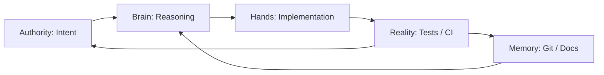

# 🧠 AI-Native Engineering Workflow

## A Closed-Loop Cognitive System for Modern Software Development

This tutorial reframes software development as an **AI-native cognitive system**, not a coding activity.

We are no longer using AI as a passive assistant.

We are designing a **closed-loop engineering environment** where:

* Thinking is distributed across specialized roles
* Code is a *byproduct* of structured reasoning
* Every decision is traceable, testable, and reversible

Software engineering is no longer about writing code.

It is about **orchestrating information flow, decision systems, and validation loops**.

---

# 🧩 Part 1: Cognitive System Architecture

Before writing any code, explicitly define the system roles.
If these boundaries blur, the system becomes un-auditable and unstable.

---

## 🧠 Role Model

| Role          | System Component | Responsibility                                                 |
| ------------- | ---------------- | -------------------------------------------------------------- |
| **Authority** | Human            | Defines intent, sets constraints, owns risk, final approval    |
| **Brain**     | OpenCode         | System reasoning, architecture, analysis, adversarial thinking |
| **Hands**     | Continue.dev     | Implementation, refactoring, code execution                    |
| **Memory**    | Git + `/docs`    | Requirements, ADRs, history, system state                      |
| **Reality**   | Tests / CI       | Objective validation and correctness enforcement               |

---

## 🔁 Closed-Loop Engineering System



### Loop semantics

* Intent becomes specification
* Specification becomes design
* Design becomes implementation
* Implementation becomes evidence
* Evidence updates memory
* Memory reshapes future intent

This is a **self-correcting engineering loop**.

---

# 🏗️ Part 2: Cognitive Scaffolding (System Bootstrap)

The repository is not a codebase.

It is the **external memory of the engineering system**.

---

## Step 1: Initialize System Structure

```bash
mkdir -p docs/adr \
         docs/requirements \
         docs/history \
         src/components \
         db/migrations \
         inngest/functions
```

This is not folder creation.

This is **memory architecture design**.

---

## Step 2: Generate System Truth (AI Bootstrapping)

Instead of manually writing documentation, bootstrap the system via reasoning.

> **Prompt (Brain Layer — OpenCode):**
> Build a full-stack CRUD blog using Next.js, Clerk, Sanity, Neon, and Inngest.
>
> Generate:
>
> 1. `docs/requirements.md` (MVP definition)
> 2. `docs/adr/ADR-001.md` (architecture decision + tradeoffs + risks + alternatives)

---

# 🔄 Part 3: Contract-First Build Loop

Never start with code.

Start with **contracts, invariants, and failure modes**.

---

## Step 3: Define Feature Contracts

> **Prompt:**
> Define the contract for the “Post Comment” feature:
>
> * Inputs
> * Outputs
> * Invariants
> * Side effects
> * Failure modes

---

## Step 4: Adversarial Design Review

Before implementation, force failure analysis.

> **Prompt:**
> Assume this system runs at scale.
>
> Identify:
>
> * Security vulnerabilities
> * Concurrency risks
> * Consistency issues
> * Failure modes (including external service outages)

This is **pre-mortem engineering**.

---

## Step 5: Implementation (Hands Layer)

Only now do you write code.

> **Prompt (Continue.dev):**
> Implement database schema for comments based on ADR-001 and the defined contract.
> Output SQL migration.

---

# ⚙️ Part 4: System Construction Phases

## Phase 1: Foundation

* Scaffold app:

```bash
npx create-next-app@latest
```

* Install core stack:

  * Clerk (auth)
  * Sanity (CMS)
  * Neon (Postgres)
  * Inngest (events)

---

## Phase 2: Identity & Content

* Auth integration:

  > Implement ClerkProvider and protect `/dashboard`

* Content modeling:

  > Design Sanity schemas for Post and Author

---

## Phase 3: Data Consistency Layer

Use Neon PostgreSQL for transactional correctness.

> Create bookmark schema with:

* unique constraints
* deduplication rules
* query optimization indexes

---

## Phase 4: Event-Driven Architecture

Introduce asynchronous workflows via Inngest.

> On `post/published`:

* Index content
* Notify subscribers
* Write audit logs

---

# 🧪 Part 5: Governance & System Integrity

## 🔍 Adversarial Review Gate (Before Every Commit)

Review as a hostile systems engineer:

* Security flaws
* Data integrity issues
* Performance bottlenecks
* Hidden coupling
* Architectural debt

---

## 🧾 System Memory Rule

After every feature:

Update:

```
docs/history/system-history.md
```

Record:

* What changed
* Why it changed
* What broke
* What assumptions changed

This ensures **traceable system evolution**.

---

# 📋 Master Execution Checklist

Every feature must pass this pipeline:

* [ ] Define → update `requirements.md`
* [ ] Contract → define inputs/outputs/invariants
* [ ] Reason → adversarial analysis (OpenCode)
* [ ] Implement → generate code (Continue.dev)
* [ ] Validate → tests + `tsc --noEmit`
* [ ] Record → update system history

---

# 🔁 System Summary

You are not building software.

You are operating a **self-correcting engineering system**:

* Intent → Specification
* Specification → Contract
* Contract → Implementation
* Implementation → Evidence
* Evidence → Memory
* Memory → Improved Intent

---

# 🚀 Bootstrap State (Dual Initialization Complete)

The system is now initialized across two coupled layers:

## 🧠 Cognitive Layer

* Requirements defined
* Architecture decisions recorded
* Failure modes explicitly acknowledged

## ⚙️ Execution Layer

* Next.js scaffold initialized
* Dependencies installed
* System boundaries established

---

# 🧭 Next Phase Options

You now proceed into **Phase 1: Contract Engineering**

Choose one entry point:

### A. Domain First (Recommended)

* Post / Comment / Bookmark contracts
* Domain modeling first

### B. Infrastructure First

* Auth integration
* Database schema baseline
* CI + testing pipeline
* contract DSL format
* and production-grade workflow automation rules
