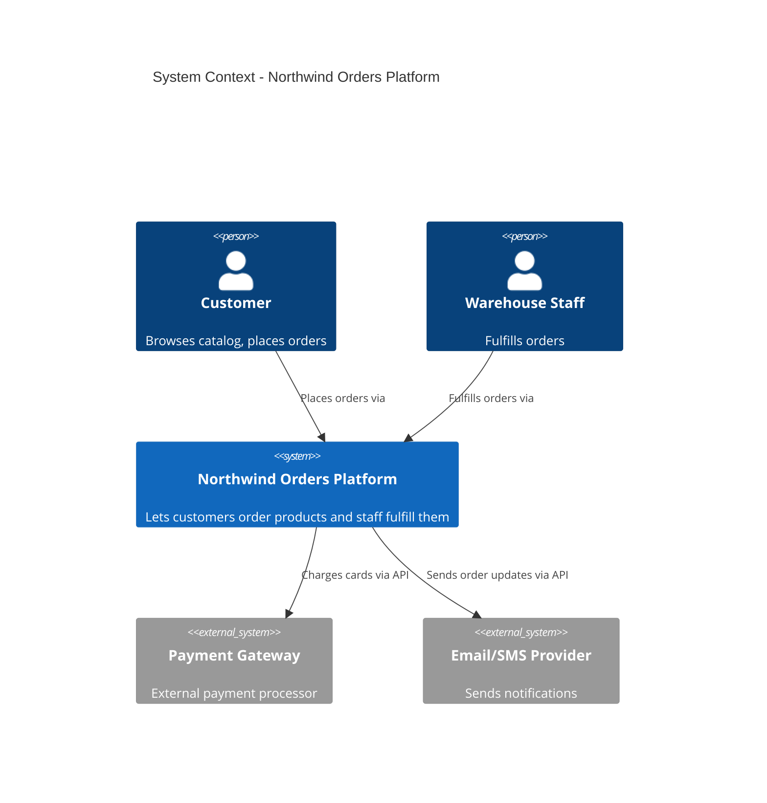
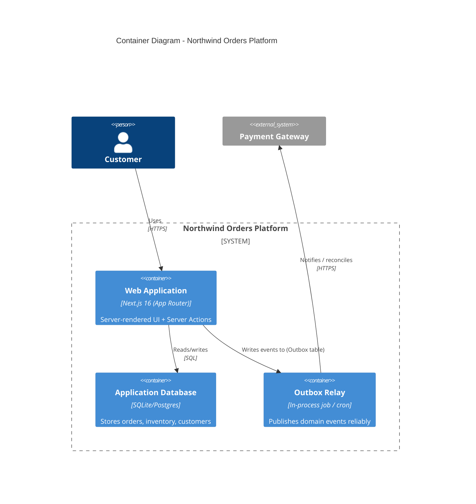

# Part 1: The Architect's Mindset

## 1. Architecture vs. Code: The Core Distinction

**Code** answers: "Does this function produce the correct output for this input?"
**Architecture** answers: "When the business changes its mind next quarter, how much of this system do we have to rewrite?"

This is the **Cost of Change** lens, and it's the single most important mental model in this entire series. A junior engineer optimizes for "does it work." A senior engineer optimizes for "is it correct." A **principal architect** optimizes for "what does it cost us to change this in 6 months, and have we paid that cost as late as possible?"

Every pattern in this series — layering, DDD, DI, event-driven consistency, circuit breakers, API versioning, ADRs — is a tool for **deferring or reducing the cost of change**, not a tool for making code "more correct" or "more elegant."

### The Three Questions an Architect Asks Before Writing Code

1. **What varies, and what is stable?** (Business rules are usually stable. UI frameworks, databases, and third-party APIs change often.)
2. **What depends on what?** (Dependencies should point from volatile things toward stable things — never the reverse.)
3. **What is the blast radius of a mistake here?** (A bad decision in a leaf utility function costs an hour. A bad decision in the data model costs months.)

## 2. Clean Architecture (and Why "Clean" Doesn't Mean "Pretty")

Robert C. Martin's Clean Architecture (a descendant of Hexagonal Architecture / Ports & Adapters, and Onion Architecture) organizes code into concentric layers where **dependencies only point inward**:

```
┌─────────────────────────────────────────────┐
│  Frameworks & Drivers (Next.js, React, DB)   │  ← outermost, most volatile
│  ┌─────────────────────────────────────────┐ │
│  │  Interface Adapters (Controllers, DTOs)  │ │
│  │  ┌───────────────────────────────────┐   │ │
│  │  │  Application (Use Cases)          │   │ │
│  │  │  ┌─────────────────────────────┐  │   │ │
│  │  │  │  Domain (Entities, Rules)    │  │   │ │  ← innermost, most stable
│  │  │  └─────────────────────────────┘  │   │ │
│  │  └───────────────────────────────────┘   │ │
│  └─────────────────────────────────────────┘ │
└─────────────────────────────────────────────┘
```

**The Dependency Rule:** source code dependencies only point inward. The Domain layer knows nothing about Next.js, React, Postgres, or fetch. Next.js knows about the Domain — never the other way around.

**Why this matters for Cost of Change:** Next.js 16 will eventually be replaced by something else. Your ORM will eventually be swapped. Your business rule ("an order cannot ship without a successful payment") will likely outlive all of them. If your business rule is entangled inside a Next.js Server Action or a Prisma query, replacing the framework means re-deriving the business rule from scattered code. If the business rule lives in a pure, framework-agnostic `core/` module, replacing Next.js is a weekend project, not a rewrite.

### Locality of Behavior (LoB) — The Counterweight

Clean Architecture's layering can be taken too far, producing "onion soup": a change to one feature requires touching 6 files across 4 layers ("shotgun surgery"). **Locality of Behavior**, popularized by htmx's Carson Gross, is the counter-principle: *code that changes together should live together, and the behavior of a unit of code should be evident from looking at it, not from tracing it through five indirections.*

The synthesis this series teaches: **layer by dependency direction (domain vs. framework), but colocate by feature, not by technical role.** This is why we organize as `modules/ordering/`, `modules/inventory/` (feature-first) rather than `controllers/`, `services/`, `repositories/` (role-first) at the top level — each module internally respects the Dependency Rule, but you never hunt across the repo to understand one feature.

```
src/
  modules/
    ordering/
      domain/          # Entities, value objects, domain rules — pure TS, zero imports from React/Next
      application/      # Use cases / application services — orchestrate domain + ports
      infrastructure/    # Adapters: Next.js Server Actions, DB repositories, external API clients
      ui/                 # React Server/Client Components specific to ordering
    inventory/
      domain/
      application/
      infrastructure/
      ui/
    shared-kernel/       # Truly shared types/utilities used by 2+ modules (keep this small!)
```

This is the folder structure we will build on for the rest of the series.

## 3. The C4 Model: Documenting Structure Without a Paid Tool

The **C4 Model** (Simon Brown, free and open) gives four levels of zoom, each answering a different audience's question:

| Level | Diagram | Audience | Question Answered |
|---|---|---|---|
| 1 | **Context** | Anyone (non-technical) | What is this system, and what does it talk to? |
| 2 | **Container** | Technical stakeholders | What are the deployable/runnable units (app, DB, queue)? |
| 3 | **Component** | Developers | What are the major building blocks inside one container? |
| 4 | **Code** | Developers (rarely drawn) | Class/module diagrams — usually just read the code instead |

### Level 1: System Context Diagram (Mermaid — free, renders in GitHub/VS Code)



### Level 2: Container Diagram



**Why Mermaid/PlantUML over a paid tool like Lucidchart:** these are **diagrams-as-code**. They live in version control next to the code they describe, get reviewed in pull requests, and never go stale silently in a separate wiki. This is the single biggest practical win of the free-tooling constraint — it isn't just about cost, it's about **keeping documentation adjacent to what it documents** (a direct application of Locality of Behavior to documentation itself).

See **Appendix A (The Architect's Toolkit)** for the full free-tool reference (Structurizr DSL, PlantUML, Excalidraw).

## 4. Design Exercise

**Scenario:** You're the architect for "Northwind Orders" — a platform where customers order products, staff fulfill them, payments are processed externally, and customers receive notifications.

**Step 1:** Draw a C4 Level 1 (System Context) diagram identifying every human actor and every external system. Ask yourself: is the notification provider a dependency of the *domain*, or of the *infrastructure*? (Hint: the fact that "a notification must be sent" is a domain concern; "we use Twilio" is an infrastructure concern.)

**Step 2:** Sketch a Level 2 (Container) diagram. Identify: how many independently deployable units does this need on day one? (Hint: for an MVP, the answer is almost always fewer than you think.)

**Step 3:** List 5 things about this system that are likely to change in the next 12 months (e.g., "swap payment provider," "add a mobile app," "move from SQLite to Postgres"). For each, mark whether the Domain layer, Application layer, or Infrastructure layer would need to change. If more than one item forces a Domain-layer change, revisit your domain boundaries.

## 5. Solution & Discussion

**Step 1 solution:** Actors = Customer, Warehouse Staff. External systems = Payment Gateway, Email/SMS Provider. Key insight: the *need* to notify is domain-level (an Order entity transitions to "Shipped" and that's a business event), but *which provider* sends it is purely infrastructure — this distinction is exactly what Part 3's Dependency Injection will let us isolate.

**Step 2 solution:** For an MVP, one container (the Next.js app) plus one database is sufficient. Do not draw a message queue, Redis cache, or separate microservices container yet — that's paying a **scalability tax before you've proven you need scale**. This restraint is itself an architectural decision, and by Part 7 you'll learn to write an ADR that says "we chose a single deployable unit for the MVP; revisit if traffic exceeds X or team size exceeds Y."

**Step 3 solution walkthrough:**

| Likely change | Layer affected |
|---|---|
| Swap payment provider | Infrastructure only (if designed with a port/interface — see Part 3) |
| Add mobile app | New Interface Adapter (new controllers), zero Domain change |
| SQLite → Postgres | Infrastructure only (repository implementation swap) |
| Add loyalty points program | Domain change (new business rule) — correctly so, it's new business logic |
| Add multi-warehouse fulfillment | Domain change to Inventory context — correctly so |

Notice the pattern: **infrastructure changes should never touch the Domain layer.** If you found a "likely change" that would force Domain edits and it *feels* like it should've been infrastructure (e.g., "swap payment provider" forcing Domain edits), that's a signal of a **leaky abstraction** — exactly the failure mode Part 3 (Decoupling Components) is designed to prevent.

## Up Next

**Part 2 (Designing the Core)** takes the `domain/` folder we sketched here and fills it in properly using Domain-Driven Design: bounded contexts, entities, value objects, and aggregates for the Northwind Orders platform.
