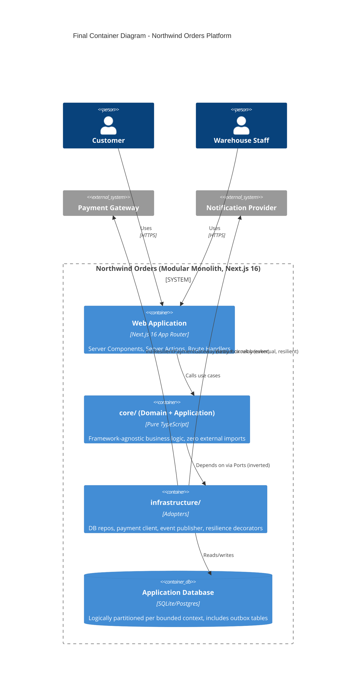

Here's the full content of **Part 8 (The Full System)** — the capstone:

---

# Part 8: The Full System — Northwind Orders, Assembled

## 1. Zooming Out: What We Built and Why Each Piece Exists

Across seven parts, we made a sequence of deliberate, individually-justified decisions. This part assembles them into one coherent, runnable architecture, and — critically — makes explicit *why the order in which we made these decisions mattered*: each layer was designed to be replaceable without disturbing the ones inside it, and we can now see that promise fulfilled end-to-end.



## 2. The Final Folder Structure

```
northwind-orders/
  core/                              # Zero framework imports anywhere in this tree
    shared-kernel/
      resilience/
        retry.ts
        CircuitBreaker.ts
    ordering/
      domain/
        entities/ (Order.ts, OrderLineItem.ts)
        value-objects/ (Money.ts)
      application/
        ports/ (OrderRepository.ts, PaymentGateway.ts, EventPublisher.ts)
        use-cases/ (PlaceOrder.ts, CancelOrder.ts)
    inventory/
      domain/ ...
      application/ ...
    catalog/
      domain/ ...
      application/
        ports/ (CatalogReader.ts)
    notifications/
      application/
        ports/ (NotificationSender.ts)

  infrastructure/
    persistence/ (SqlOrderRepository.ts, InMemoryOrderRepository.ts, db.ts)
    payments/ (ResilientPaymentGateway.ts, FakePaymentGateway.ts)
    events/ (OutboxRelay.ts, ConsoleEventPublisher.ts)
    catalog/ (CachedCatalogReader.ts)
    notifications/ (ConsoleNotificationSender.ts)
    container.ts                    # THE composition root — only file wiring Ports to Adapters

  interface-adapters/
    dtos/ (OrderDTOv1.ts, OrderDTOv2.ts, ProductDTO.ts)
    gateway/ (withApiMiddleware.ts)

  app/                               # Next.js App Router — the "Frameworks & Drivers" ring
    api/v1/products/route.ts
    api/v2/orders/[id]/route.ts
    actions/ (place-order.ts, cancel-order.ts)
    checkout/ (page.tsx, RecommendedProducts.tsx)
    dashboard/ (page.tsx — staff fulfillment view)

  docs/
    adr/ (0001 through 0009+, template.md)
    c4-diagrams/ (context.mmd, container.mmd)
```

**Read this structure top to bottom and notice the Dependency Rule holds throughout:** `core/` imports nothing below it. `infrastructure/` imports `core/` (to implement its Ports) but nothing from `app/`. `interface-adapters/` imports `core/` (for DTOs mapping from entities) and is imported by `app/`. `app/` is the only layer allowed to know Next.js exists. This is Part 1's Clean Architecture diagram, now fully realized as an actual, buildable codebase.

## 3. End-to-End Flow: Placing an Order, Traced Through Every Part

```
1. Customer submits checkout form
   -> app/actions/place-order.ts ("use server")           [Part 1: outermost ring]

2. Server Action calls placeOrderUseCase.execute(orderId)
   -> infrastructure/container.ts wired this use case      [Part 3: DI composition root]

3. PlaceOrderUseCase (core/ordering/application/use-cases)
   -> order.place() enforces "must have line items"         [Part 2: DDD entity rule]
   -> calls this.payments.charge(...) via Port               [Part 3: IoC — use case doesn't know it's Stripe/fake]

4. ResilientPaymentGateway wraps the real gateway
   -> retryWithBackoff + CircuitBreaker                      [Part 5: resilience decorators]

5. On success: order.markPaid(), orders.save(order)
   -> SqlOrderRepository.saveWithEvent() writes Order row
      AND outbox_events row in ONE transaction               [Part 4: Outbox pattern, solves dual-write]

6. OutboxRelay (background) picks up the OrderPaid event,
   publishes it -> Inventory converts reservation to
   deduction, Notifications sends confirmation               [Part 4 + Part 2: Published Language between contexts]

7. Client polls or receives update via
   GET /api/v2/orders/:id -> toOrderDTOv2(order)              [Part 6: DTO boundary, versioned contract]

8. Every non-trivial choice above (outbox vs. direct publish,
   manual DI, additive API versioning, modular monolith)
   has a corresponding entry in docs/adr/                     [Part 7: ADR log]
```

This trace is the real proof of the architecture's value: **a request can be followed from UI to database and back without ever finding business logic duplicated, hidden, or entangled with a framework detail.** Every seam is a Port; every framework touchpoint is confined to `app/` or `infrastructure/`.

## 4. When (and Only When) to Split the Monolith

Because every bounded context already has its own `domain/`, `application/`, isolated schema (Part 4), and Port-based boundaries (Part 3), Northwind Orders is a **Modular Monolith with pre-cut seams**. Splitting any single context (say, Inventory) into a standalone deployable service later is a matter of:
1. Standing up a new deployable that hosts `core/inventory` + its own `infrastructure/inventory`
2. Replacing the in-process `EventPublisher`/subscriber wiring with a real message broker (Kafka/RabbitMQ — swapped in `container.ts` only, per Part 3's whole point)
3. Writing ADR-00XX documenting the trigger condition that justified the split (per Part 7)

No `core/inventory` domain code changes. This is the entire payoff of everything this series has taught, made concrete: **the cost of evolving from Modular Monolith to (partial) microservices was paid upfront, in design discipline, not in a frantic rewrite under scaling pressure later.**

## 5. Final Design Exercise (Capstone)

**Step 1:** Draw the complete C4 Container diagram for a *post-split* world where Inventory has been extracted to its own service, while Ordering, Catalog, Payments-adapter, and Notifications remain in the monolith. Identify the new inter-service communication mechanism.

**Step 2:** Write the ADR (ADR-0012, superseding ADR-0003 from Part 7) documenting this extraction: context (what scaling pressure justified it), decision, alternatives (e.g., "extract Catalog instead"), and consequences.

**Step 3:** Using Appendix C's Architectural Pattern Matrix, justify in one paragraph why Northwind Orders should *not* jump straight to full microservices for all five contexts simultaneously, even after the Inventory split.

## 6. Solution & Discussion

**Step 1:** The diagram adds a new `Container(inventorySvc, "Inventory Service", "Standalone Next.js or Node service")` box with a `Rel` to a message broker container (`Container(broker, "Message Broker", "e.g., RabbitMQ (OSS)")`), and both Ordering (still in the monolith) and Inventory publish/subscribe through it instead of the in-process `EventPublisher`. The monolith's `container.ts` swaps `ConsoleEventPublisher`/`OutboxRelay`'s direct call for a `RabbitMqEventPublisher` — again, a one-file change.

**Step 2 key points:** Context = e.g., "Inventory's reservation-checking load grew 40x due to a new real-time stock-availability widget, degrading Ordering's database performance on shared infrastructure." Alternatives = "scale the shared database vertically" (rejected: temporary fix, doesn't address contention) and "extract Catalog instead" (rejected: Catalog's read-heavy, cacheable load isn't the actual bottleneck). Consequences = network latency and partial-failure handling now apply to Ordering↔Inventory calls, which is why Part 5's resilience patterns (retry, circuit breaker) must now wrap that boundary too, not just external providers.

**Step 3:** Splitting all five contexts simultaneously would mean paying the full operational cost of microservices — distributed tracing, N deployment pipelines, cross-service integration testing, eventual consistency everywhere — before any of the other four contexts have demonstrated Inventory's specific scaling pressure. Per Appendix C's matrix, Microservices are justified per-context, incrementally, exactly when a *specific, evidenced* need (independent scaling, independent team ownership, independent failure isolation) exists for *that* context — not as a wholesale architectural fashion choice applied uniformly. The Modular Monolith's pre-cut seams mean this evaluation and extraction can happen **one context at a time, on its own evidence and timeline**, which is the entire architectural bet this series has been making since Part 1.

## Series Complete

You've now designed, justified, and implemented a full system architecture from first principles (Part 1) through domain modeling (Part 2), decoupling (Part 3), data consistency (Part 4), resilience (Part 5), API contracts (Part 6), decision governance (Part 7), to a fully assembled, evolvable system (Part 8) — using exclusively free and open-source tools throughout.

See **Appendix A** for the full toolkit reference, **Appendix B** for the ADR template to drop into any new project's `docs/adr/template.md`, and **Appendix C** for the Architectural Pattern Matrix referenced above.


