# 🚀 Bun: The Complete Full-Stack Blueprint & Architecture Guide


## From Runtime → Full-Stack Platform

[Bun Official Site](https://bun.sh?utm_source=chatgpt.com)
[Bun Documentation](https://bun.sh/docs?utm_source=chatgpt.com)
[Bun GitHub Repository](https://github.com/oven-sh/bun?utm_source=chatgpt.com)

---

# 🧠 What Is Bun Really?

Most beginners think Bun is “just another Node.js alternative.”

That’s not actually the important part.

The real breakthrough is this:

> Bun collapses the modern JavaScript toolchain into a single integrated runtime.

Traditionally, building a full-stack app means combining dozens of independent tools:

* Node.js
* npm/pnpm/yarn
* Vite
* Babel
* ts-node
* Jest/Vitest
* Express
* dotenv
* Webpack/Rollup/esbuild
* nodemon

Every one of those introduces:

* configuration
* version mismatches
* plugins
* dependency conflicts
* startup overhead
* maintenance cost

Bun eliminates most of that complexity.

---

# 🧠 The Master Mental Model

Think of Bun like this:

| Traditional JavaScript       | Bun                       |
| ---------------------------- | ------------------------- |
| Assemble many tools yourself | One integrated platform   |
| Runtime + tooling fragmented | Runtime + tooling unified |
| Multiple processes           | Single optimized engine   |
| Configuration-heavy          | Zero-config philosophy    |
| Build pipelines everywhere   | Native execution          |

---

# 🏗️ Traditional Stack vs Bun Stack

## Traditional Node.js Architecture

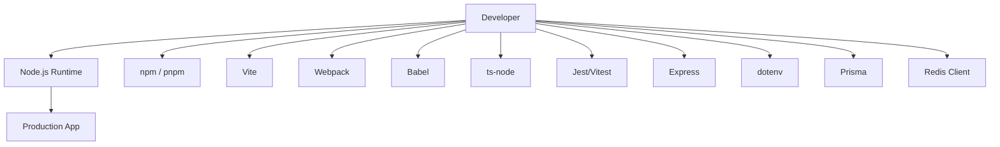

This works.

But it creates:

* tooling sprawl
* duplicated build steps
* cold start overhead
* dependency chaos
* config fatigue

---

# 🚀 Bun Unified Architecture

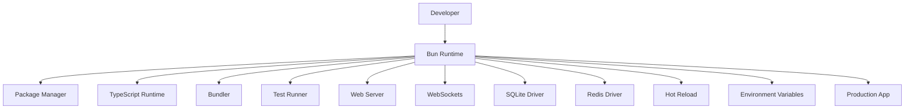

This is the key architectural idea behind Bun.

---

# 🧠 Another Important Mental Model

## Node.js Ecosystem

```text
"JavaScript + Tooling"
```

## Bun Ecosystem

```text
"Integrated JavaScript Operating System"
```

Bun is trying to become:

* runtime
* build system
* server platform
* package manager
* testing framework
* deployment runtime

all at once.

---

# ⚡ Why Bun Is Fast

Bun performance comes from several architectural decisions.

---

# 1. JavaScriptCore Instead of V8

Node.js uses:

* Google V8

Bun uses:

* Apple JavaScriptCore (Safari engine)

JavaScriptCore is extremely optimized for:

* fast startup
* low memory
* rapid execution

---

# 2. Bun Is Written in Zig

[Zig Language](https://ziglang.org?utm_source=chatgpt.com)

Zig is a systems language similar to:

* C
* Rust
* C++

But simpler.

This gives Bun:

* direct memory control
* low-level networking
* fast filesystem access
* fewer abstractions
* less runtime overhead

---

# 🧠 Mental Model: Why Zig Matters

## Typical JavaScript Toolchain

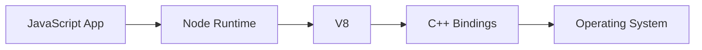

Many abstraction layers exist.

---

## Bun Architecture

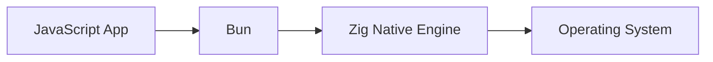

Fewer layers.

Less overhead.

Better performance.

---

# 🛠️ Bun's Built-In Features

One of Bun’s biggest advantages is that features are already included.

| Feature               | Traditional Tool | Bun        |
| --------------------- | ---------------- | ---------- |
| Runtime               | Node.js          | ✅ Built-in |
| Package Manager       | npm/pnpm/yarn    | ✅ Built-in |
| Bundler               | Vite/Webpack     | ✅ Built-in |
| TypeScript            | ts-node          | ✅ Built-in |
| Testing               | Jest/Vitest      | ✅ Built-in |
| Hot Reload            | nodemon          | ✅ Built-in |
| Environment Variables | dotenv           | ✅ Built-in |
| WebSockets            | ws/socket.io     | ✅ Built-in |

---

# 🚀 Installing Bun

## macOS/Linux

```bash
curl -fsSL https://bun.sh/install | bash
```

---

## Windows

```powershell
powershell -c "irm bun.sh/install.ps1 | iex"
```

## NPM (Alternative)

```powershell
npm install -g bun
```

---

## Verify Installation

```bash
bun --version
```

---

# 🏗️ Creating Your First Bun Project

```bash
bun init
```

Bun automatically creates:

* `package.json`
* `tsconfig.json`
* starter files

No extra setup required.

---

# 📂 Beginner-Friendly Project Structure

```text
my-bun-app/
│
├── src/
│   ├── server.ts
│   ├── database.ts
│   ├── routes/
│   ├── services/
│   └── frontend/
│
├── public/
│
├── package.json
├── bun.lockb
├── tsconfig.json
└── .env
```

---

# 🧠 Understanding `bun.lockb`

This is Bun’s lockfile.

Equivalent to:

* `package-lock.json`
* `pnpm-lock.yaml`
* `yarn.lock`

Always commit it to Git.

---

# ⚡ Installing Dependencies

```bash
bun add hono
```

Development dependency:

```bash
bun add -d typescript
```

Remove package:

```bash
bun remove package-name
```

---

# 🚀 Running TypeScript Directly

This is where Bun feels magical.

## Node.js

Normally you need:

```bash
ts-node src/index.ts
```

or:

```bash
npm run build
node dist/index.js
```

---

## Bun

Just run:

```bash
bun run src/index.ts
```

No transpilation step needed.

---

# 🧠 Mental Model: Bun Executes TS Natively

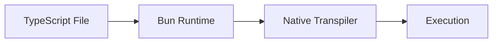

Instead of:

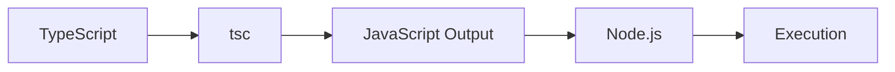

---

# 🌐 Bun HTTP Server

Bun includes a native HTTP server.

No Express required.

---

# Basic Example

```typescript
Bun.serve({
  port: 3000,

  fetch(req) {
    return new Response("Hello from Bun!");
  },
});
```

Run:

```bash
bun run server.ts
```

Open:

```text
http://localhost:3000
```

---

# 🧠 Understanding `fetch(req)`

Bun uses Web Standard APIs.

Instead of Express:

```typescript
(req, res)
```

Bun uses:

```typescript
Request
Response
```

This aligns Bun with:

* browsers
* Cloudflare Workers
* Deno
* Service Workers

---

# 🏗️ Request Lifecycle Mental Model

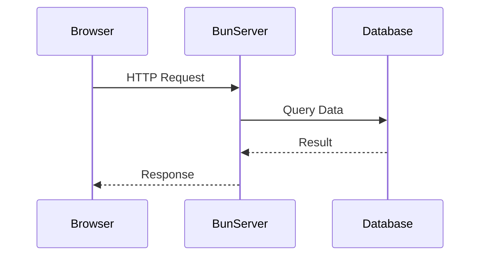

---

# ⚡ Full Beginner CRUD API

Let’s build a real backend.

---

# 📂 server.ts

```typescript
type Todo = {
  id: number;
  text: string;
};

const todos: Todo[] = [];

Bun.serve({
  port: 3000,

  async fetch(req) {
    const url = new URL(req.url);

    // GET all todos
    if (url.pathname === "/api/todos" && req.method === "GET") {
      return Response.json(todos);
    }

    // CREATE todo
    if (url.pathname === "/api/todos" && req.method === "POST") {
      const body = await req.json();

      const todo = {
        id: Date.now(),
        text: body.text,
      };

      todos.push(todo);

      return Response.json(todo, {
        status: 201,
      });
    }

    return new Response("Not Found", {
      status: 404,
    });
  },
});

console.log("🚀 Server running on http://localhost:3000");
```

---

# 🧠 CRUD Mental Model

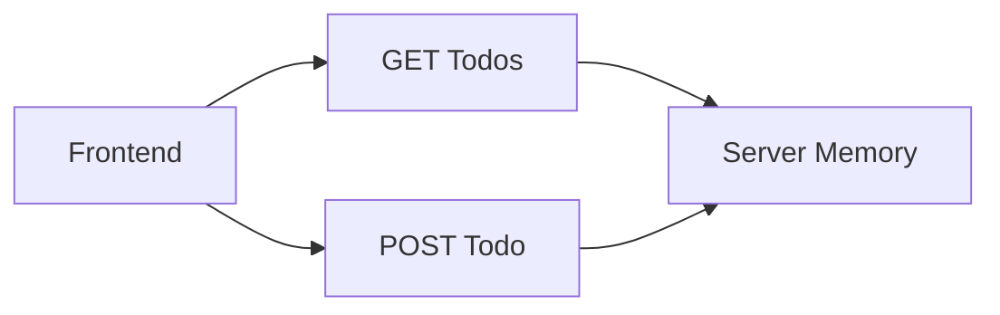

---

# ⚡ Hot Reload Development

Run:

```bash
bun --watch server.ts
```

Bun automatically reloads changes.

Equivalent replacements:

* nodemon
* ts-node-dev

---

# 🗄️ SQLite with Bun

One of Bun’s best features is native SQLite support.

No external ORM required for small/medium apps.

---

# 📂 database.ts

```typescript
import { Database } from "bun:sqlite";

export const db = new Database("app.sqlite", {
  create: true,
});
```

---

# Create Table

```typescript
db.run(`
  CREATE TABLE IF NOT EXISTS todos (
    id INTEGER PRIMARY KEY AUTOINCREMENT,
    text TEXT NOT NULL
  )
`);
```

---

# Insert Data

```typescript
const query = db.prepare(`
  INSERT INTO todos (text)
  VALUES ($text)
`);

query.run({
  $text: "Learn Bun",
});
```

---

# Read Data

```typescript
const todos = db.query(`
  SELECT * FROM todos
`).all();
```

---

# 🧠 SQL Mental Model

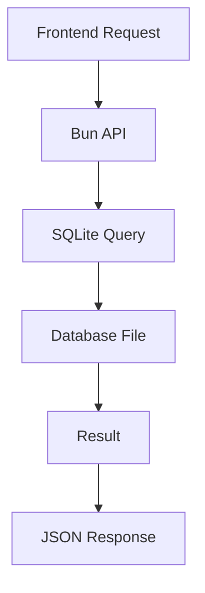

---

# 🔒 SQL Injection Protection

Use tagged templates.

```typescript
const user = "admin";

const result = db.query`
  SELECT * FROM users
  WHERE username = ${user}
`;
```

Never build raw SQL strings manually.

---

# ⚡ Redis Caching

Bun also supports Redis.

---

# Install Redis

```bash
docker run -p 6379:6379 redis
```

---

# Redis Example

```typescript
import { Redis } from "bun:redis";

const redis = new Redis({
  hostname: "localhost",
  port: 6379,
});

await redis.set("message", "hello");
const value = await redis.get("message");

console.log(value);
```

---

# 🧠 Cache Mental Model

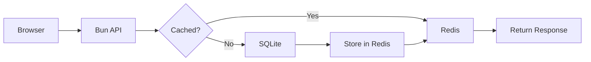

---

# 🚀 COMPLETE FULL-STACK APP

# 📋 Full-Stack Task Manager

Now let’s build a real application.

This combines:

* frontend
* backend
* SQLite
* Bun server
* API routes
* persistence

---

# 🏗️ Architecture Overview

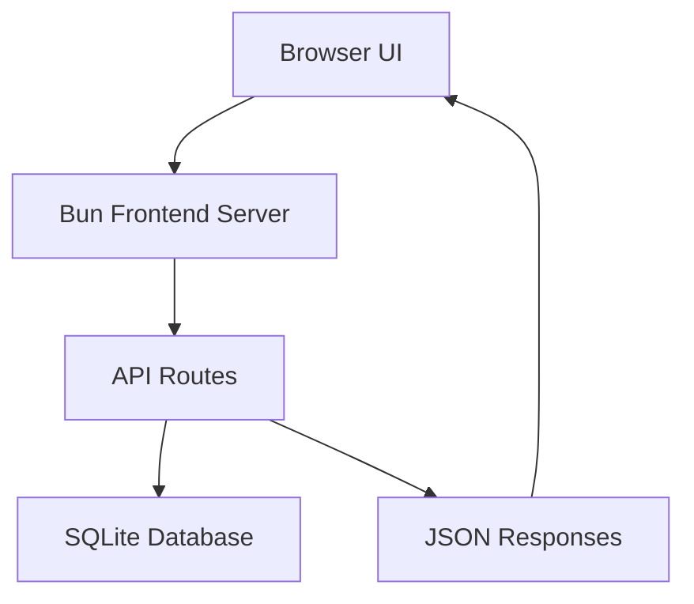

---

# 📂 Project Structure

```text
task-manager/
│
├── public/
│   ├── index.html
│   ├── app.js
│   └── styles.css
│
├── src/
│   ├── server.ts
│   └── database.ts
│
├── package.json
└── bun.lockb
```

---

# 📂 src/database.ts

```typescript
import { Database } from "bun:sqlite";

export const db = new Database("tasks.sqlite", {
  create: true,
});

db.run(`
  CREATE TABLE IF NOT EXISTS tasks (
    id INTEGER PRIMARY KEY AUTOINCREMENT,
    title TEXT NOT NULL,
    completed INTEGER DEFAULT 0
  )
`);
```

---

# 📂 src/server.ts

```typescript
import { file } from "bun";
import { db } from "./database";

const server = Bun.serve({
  port: 3000,

  async fetch(req) {
    const url = new URL(req.url);

    // Serve frontend
    if (url.pathname === "/") {
      return new Response(
        file("./public/index.html")
      );
    }

    if (url.pathname === "/app.js") {
      return new Response(
        file("./public/app.js")
      );
    }

    if (url.pathname === "/styles.css") {
      return new Response(
        file("./public/styles.css")
      );
    }

    // GET TASKS
    if (url.pathname === "/api/tasks" && req.method === "GET") {
      const tasks = db.query(`
        SELECT * FROM tasks
        ORDER BY id DESC
      `).all();

      return Response.json(tasks);
    }

    // CREATE TASK
    if (url.pathname === "/api/tasks" && req.method === "POST") {
      const body = await req.json();

      const insert = db.prepare(`
        INSERT INTO tasks (title)
        VALUES ($title)
      `);

      insert.run({
        $title: body.title,
      });

      return Response.json({
        success: true,
      });
    }

    // TOGGLE COMPLETE
    if (
      url.pathname.startsWith("/api/tasks/")
      && req.method === "PATCH"
    ) {
      const id = url.pathname.split("/").pop();

      db.run(`
        UPDATE tasks
        SET completed =
          CASE
            WHEN completed = 1 THEN 0
            ELSE 1
          END
        WHERE id = ?
      `, [id]);

      return Response.json({
        success: true,
      });
    }

    // DELETE TASK
    if (
      url.pathname.startsWith("/api/tasks/")
      && req.method === "DELETE"
    ) {
      const id = url.pathname.split("/").pop();

      db.run(`
        DELETE FROM tasks
        WHERE id = ?
      `, [id]);

      return Response.json({
        success: true,
      });
    }

    return new Response("Not Found", {
      status: 404,
    });
  },
});

console.log(`
🚀 Task Manager Running
${server.url}
`);
```

---

# 📂 public/index.html

```html
<!DOCTYPE html>
<html>
<head>
  <title>Bun Task Manager</title>
  <link rel="stylesheet" href="/styles.css">
</head>

<body>
  <div class="container">
    <h1>🚀 Bun Task Manager</h1>

    <form id="task-form">
      <input
        type="text"
        id="task-input"
        placeholder="Enter task..."
      />

      <button>Add Task</button>
    </form>

    <ul id="task-list"></ul>
  </div>

  <script src="/app.js"></script>
</body>
</html>
```

---

# 📂 public/app.js

```javascript
const form = document.getElementById("task-form");
const input = document.getElementById("task-input");
const list = document.getElementById("task-list");

async function loadTasks() {
  const response = await fetch("/api/tasks");

  const tasks = await response.json();

  list.innerHTML = "";

  for (const task of tasks) {
    const li = document.createElement("li");

    li.innerHTML = `
      <span class="${task.completed ? "done" : ""}">
        ${task.title}
      </span>

      <div>
        <button onclick="toggleTask(${task.id})">
          Toggle
        </button>

        <button onclick="deleteTask(${task.id})">
          Delete
        </button>
      </div>
    `;

    list.appendChild(li);
  }
}

form.addEventListener("submit", async (e) => {
  e.preventDefault();

  await fetch("/api/tasks", {
    method: "POST",

    headers: {
      "Content-Type": "application/json",
    },

    body: JSON.stringify({
      title: input.value,
    }),
  });

  input.value = "";

  loadTasks();
});

async function toggleTask(id) {
  await fetch(`/api/tasks/${id}`, {
    method: "PATCH",
  });

  loadTasks();
}

async function deleteTask(id) {
  await fetch(`/api/tasks/${id}`, {
    method: "DELETE",
  });

  loadTasks();
}

loadTasks();
```

---

# 📂 public/styles.css

```css
body {
  font-family: Arial;
  background: #111827;
  color: white;
  padding: 40px;
}

.container {
  max-width: 700px;
  margin: auto;
}

input {
  padding: 12px;
  width: 300px;
}

button {
  padding: 12px;
  cursor: pointer;
}

li {
  margin-top: 10px;
  display: flex;
  justify-content: space-between;
}

.done {
  text-decoration: line-through;
  opacity: 0.5;
}
```

---

# 🚀 Run The Application

```bash
bun --watch src/server.ts
```

Visit:

```text
http://localhost:3000
```

---

# 🧠 Full Request Flow Mental Model

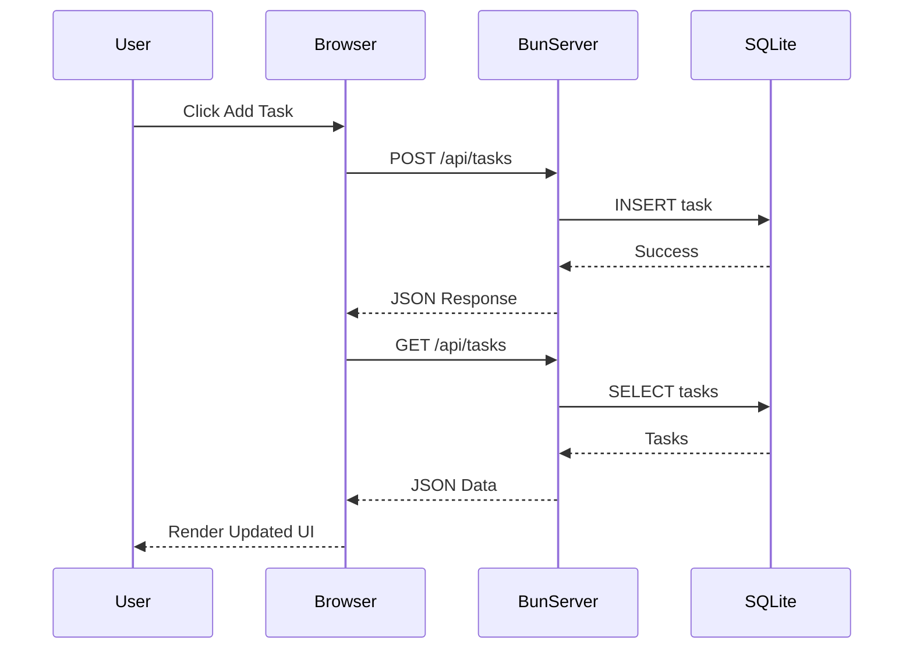

---

# ⚡ WebSockets in Bun

Bun includes native WebSocket support.

No `socket.io`.

No `ws`.

---

# Real-Time Chat Example

```typescript
const server = Bun.serve({
  port: 3000,

  fetch(req, server) {
    if (server.upgrade(req)) {
      return;
    }

    return new Response("Upgrade failed", {
      status: 500,
    });
  },

  websocket: {
    open(ws) {
      console.log("Client connected");
    },

    message(ws, message) {
      ws.send(`Echo: ${message}`);
    },

    close(ws) {
      console.log("Client disconnected");
    },
  },
});
```

---

# 🧠 WebSocket Mental Model

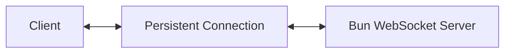

Traditional HTTP:

* request
* response
* disconnected

WebSocket:

* always connected
* bidirectional
* real-time

---

# 🧪 Testing with Bun

```typescript
import { expect, test } from "bun:test";

test("addition", () => {
  expect(1 + 1).toBe(2);
});
```

Run:

```bash
bun test
```

---

# 🧠 Bun Testing Architecture

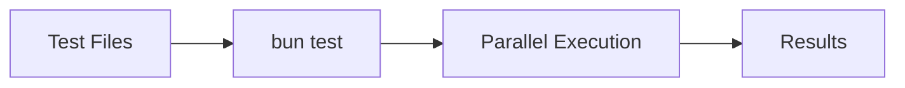

---

# 🐳 Docker Deployment

## Dockerfile

```dockerfile
FROM oven/bun:1.1-alpine

WORKDIR /app

COPY . .

RUN bun install

EXPOSE 3000

CMD ["bun", "run", "src/server.ts"]
```

---

# Build Container

```bash
docker build -t bun-app .
```

---

# Run Container

```bash
docker run -p 3000:3000 bun-app
```

---

# 🧠 Production Deployment Mental Model

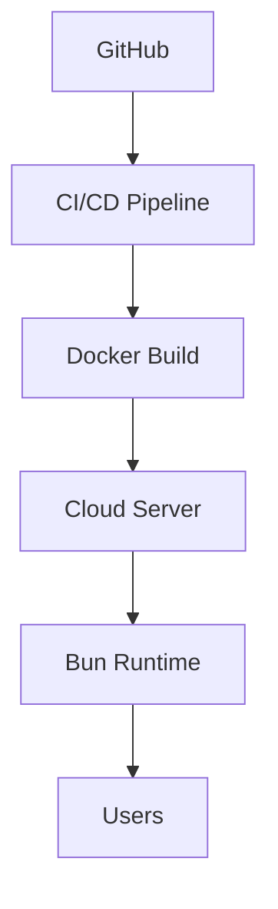

---

# 🚀 Scaling Bun Applications

For large-scale systems:

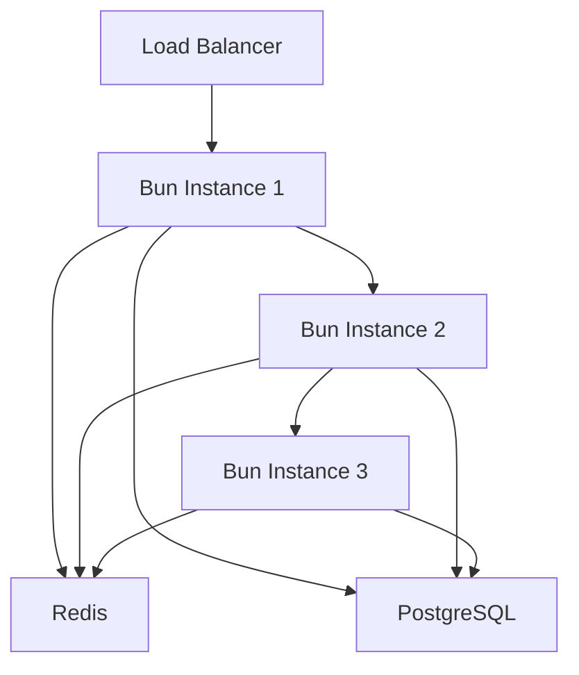

---

# 🧠 Beginner Scaling Advice

## Small Apps

Use:

* Bun
* SQLite
* single server

This is enough for:

* portfolios
* dashboards
* admin tools
* internal apps
* prototypes
* MVPs

---

## Medium Apps

Add:

* PostgreSQL
* Redis
* Docker

---

## Large Apps

Add:

* Kubernetes
* load balancers
* queues
* observability
* horizontal scaling

---

# ⚡ Migrating From Node.js

## Remove These

```bash
bun remove nodemon
bun remove ts-node
bun remove dotenv
bun remove jest
```

---

# Update Scripts

```json
{
  "scripts": {
    "dev": "bun --watch src/server.ts",
    "start": "bun run src/server.ts",
    "test": "bun test"
  }
}
```

---

# 🧠 Bun vs Node.js Mental Model

| Node.js                   | Bun                    |
| ------------------------- | ---------------------- |
| Runtime only              | Full platform          |
| Requires external tooling | Integrated tooling     |
| Heavy configuration       | Zero-config            |
| Many packages required    | Many features built-in |
| Mature ecosystem          | Rapidly evolving       |

---

# ⚠️ When NOT To Use Bun

Bun is excellent, but not perfect yet.

Avoid Bun if:

* your company depends on Node-only native addons
* your APM tooling requires V8 internals
* your enterprise environment blocks newer runtimes
* you rely on obscure Node internals

---

# 🚀 Best Frameworks for Bun

## Elysia.js

[Elysia.js Official Site](https://elysiajs.com?utm_source=chatgpt.com)

Best Bun-native framework.

Extremely fast.

Excellent TypeScript support.

---

## Hono

[Hono Official Site](https://hono.dev?utm_source=chatgpt.com)

Tiny, elegant, edge-friendly.

Works beautifully with:

* Bun
* Cloudflare
* Deno
* Node

---

# 🧠 Final Mental Model

Think of Bun as:

```text
Node.js + npm + Vite + ts-node + Jest + Webpack + dotenv + nodemon
↓
Collapsed into one runtime
```

That’s the real innovation.

Not just “speed.”

But:

* simplicity
* integration
* reduced complexity
* developer experience
* operational efficiency

---

# 🚀 Recommended Learning Path

## Beginner

1. Learn `Bun.serve`
2. Build CRUD APIs
3. Learn SQLite
4. Build frontend serving
5. Learn WebSockets

---

## Intermediate

1. Dockerize apps
2. Add Redis caching
3. Learn Elysia/Hono
4. Add authentication
5. Add testing

---

## Advanced

1. Clustering
2. Queues
3. Distributed systems
4. Edge deployment
5. Observability

---

# 📚 Additional Resources

* [Bun Benchmarks](https://bun.sh/benchmarks?utm_source=chatgpt.com)
* [Bun HTTP Server Docs](https://bun.sh/docs/api/http?utm_source=chatgpt.com)
* [Bun SQLite Docs](https://bun.sh/docs/api/sqlite?utm_source=chatgpt.com)
* [Bun WebSocket Docs](https://bun.sh/docs/api/websockets?utm_source=chatgpt.com)
* [Bun Node Compatibility Docs](https://bun.sh/docs/runtime/node?utm_source=chatgpt.com)
* [Bun Docker Images](https://hub.docker.com/r/oven/bun?utm_source=chatgpt.com)
* [Bun Discord Community](https://discord.gg/bun?utm_source=chatgpt.com)
* [Bun X/Twitter](https://x.com/bun?utm_source=chatgpt.com)

---

# 🏁 Closing Perspective

Bun is not merely a faster Node.js.

It represents a broader shift in JavaScript engineering:

> Fewer tools.
> Fewer layers.
> Less configuration.
> More native capability.

For beginners, Bun dramatically lowers setup complexity.

For experienced engineers, Bun reduces operational and architectural overhead.

And for full-stack teams, Bun offers something the JavaScript ecosystem has lacked for years:

> a cohesive, integrated developer platform.
