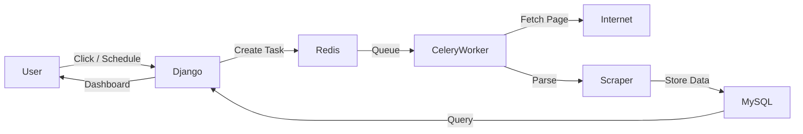
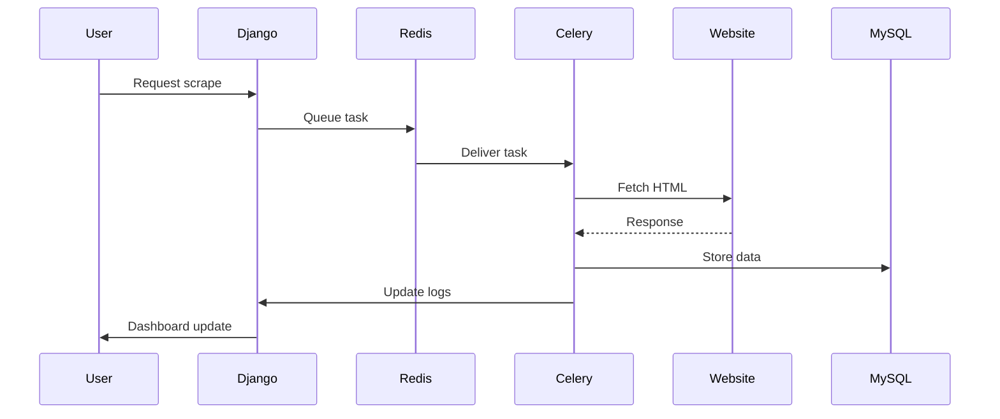
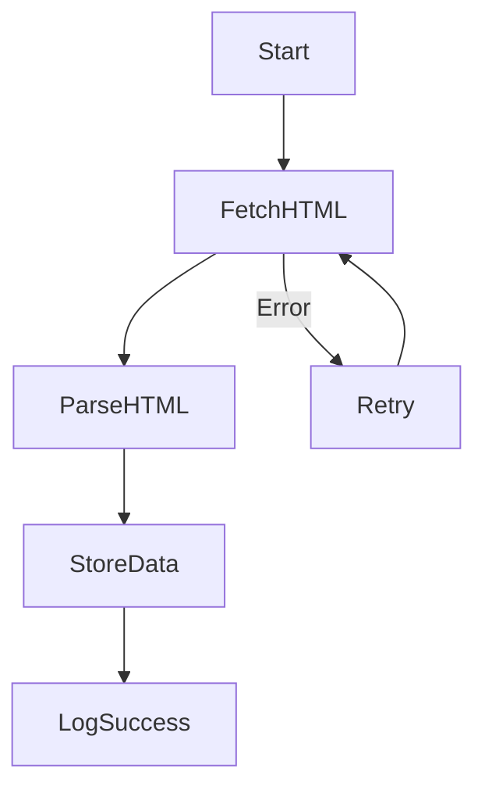
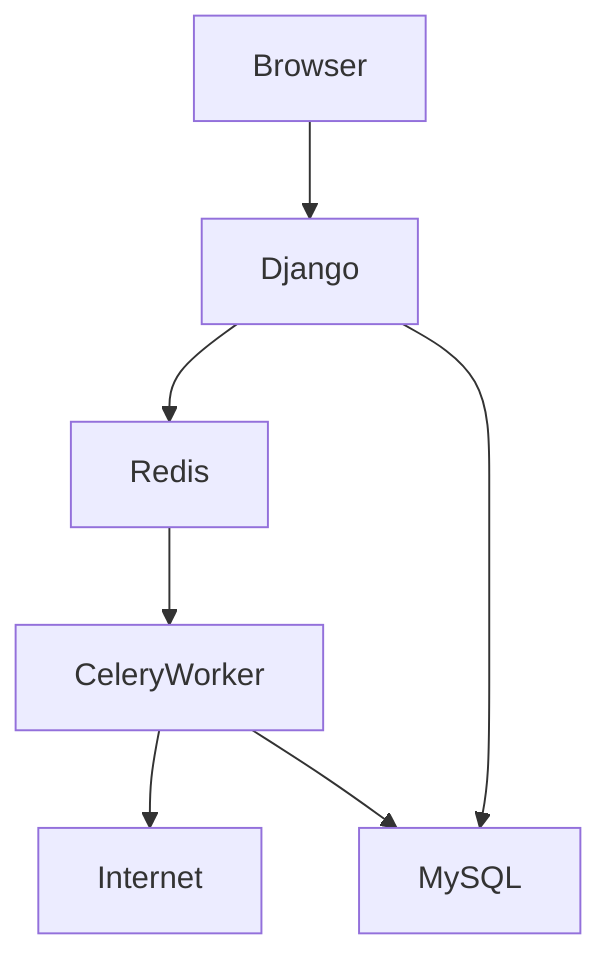
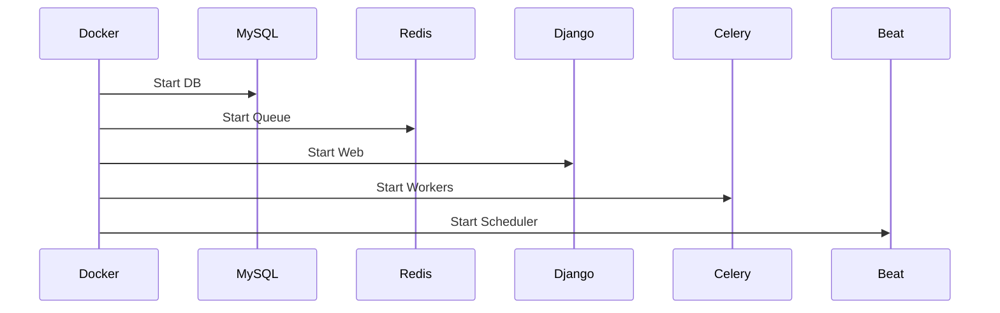
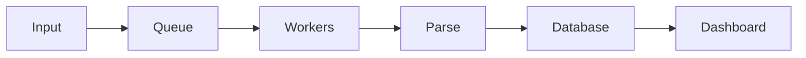

# 🌍 Production-Grade Web Scraping System — The Beginner’s Masterclass

> **From zero → distributed scraping platform using Django, Celery, Redis, MySQL & Docker**

By the end of this tutorial, you will **fully understand**:

* How modern scraping systems work
* Why we use distributed workers
* How scheduling & retries actually function
* How Django, Celery, Redis, and Docker cooperate
* How to safely & ethically scrape the web at scale

---

# 🧠 Mental Model: What Are We Actually Building?

Let’s start with **how to think about this system**.

### Simple mental model:

> **A factory for websites**

You submit **URLs → workers fetch pages → results get processed → data stored → dashboard shows status**

But instead of humans:

* Machines perform scraping
* Tasks are distributed
* Failures are retried
* Everything is tracked

---

# 🏗 System Architecture — Big Picture



---

# 🧠 Mental Model of Each Component

| Component  | Think of it as      | Purpose                        |
| ---------- | ------------------- | ------------------------------ |
| **Django** | Control tower       | Web UI, admin, database access |
| **Celery** | Factory workers     | Execute scraping jobs          |
| **Redis**  | Conveyor belt       | Task queue                     |
| **MySQL**  | Filing cabinet      | Stores scraped data & logs     |
| **Docker** | Shipping containers | Runs everything cleanly        |

---

# 🧱 Why This Architecture?

### Without Celery:

```
User → Django → Scrape → Wait → Page Loads (slow ❌)
```

### With Celery:

```
User → Django → Task Queued → Response Instantly
                 ↓
            Workers scrape in background
```

---

# 🔥 Why Web Scraping Needs Distributed Systems

### Problems:

* Websites are slow
* Network fails
* Rate limits
* Bans
* Captchas
* Massive scale

### Solutions:

* Background workers
* Automatic retries
* Scheduling
* Logging
* Observability
* Throttling
* Proxy rotation

---

# 🧩 Our Complete Stack

```text
Frontend        → Django Templates
Web Server      → Django
Task Queue      → Redis
Workers         → Celery
Database         → MySQL
Containerization → Docker
Scheduler        → Celery Beat
```

---

# 🧭 End-to-End Flow (Mental Model)



---

# 🏗 Step 1 — Install Dependencies

```bash
pip install django celery[redis] redis mysqlclient requests beautifulsoup4 django-celery-beat
```

### What each does:

| Package            | Purpose                    |
| ------------------ | -------------------------- |
| django             | Web framework              |
| celery             | Distributed task execution |
| redis              | Message broker             |
| mysqlclient        | MySQL driver               |
| requests           | HTTP fetching              |
| beautifulsoup4     | HTML parsing               |
| django-celery-beat | Scheduler                  |

---

# 🗄 Step 2 — Database Configuration (MySQL)

```python
DATABASES = {
    'default': {
        'ENGINE': 'django.db.backends.mysql',
        'NAME': 'scraping_db',
        'USER': 'scraper_user',
        'PASSWORD': 'scraper_password',
        'HOST': 'db',
        'PORT': '3306',
        'OPTIONS': {
            'init_command': "SET sql_mode='STRICT_TRANS_TABLES'",
            'CONN_MAX_AGE': 60,
        }
    }
}
```

### Mental Model:

> Your **Django app + workers + scheduler all share one data brain**

---

# 🔄 Step 3 — Task Queue Configuration

```python
CELERY_BROKER_URL = 'redis://redis:6379/0'
CELERY_RESULT_BACKEND = 'redis://redis:6379/0'
CELERY_BEAT_SCHEDULER = 'django_celery_beat.schedulers:DatabaseScheduler'
```

### Mental Model:

```
Django  → Redis → Celery Workers
```

Redis is **not storage**. It is **task traffic control**.

---

# 🧱 Step 4 — Data Models

## ScrapedSite — What We Collect

```python
class ScrapedSite(models.Model):
    url = models.URLField(unique=True)
    title = models.CharField(max_length=255, null=True, blank=True)
    status_code = models.IntegerField(null=True)
    last_scraped = models.DateTimeField(auto_now=True)
```

### Mental Model:

> **One row = one website**

---

## ScrapeLog — What Happened

```python
class ScrapeLog(models.Model):
    task_id = models.CharField(max_length=255, unique=True)
    site = models.ForeignKey(ScrapedSite, on_delete=models.CASCADE)
    status = models.CharField(max_length=20)
    records_scraped = models.IntegerField(default=0)
    error_message = models.TextField(null=True, blank=True)
```

### Mental Model:

> **One row = one scrape attempt**

---

# 🕵️ Step 5 — Stealth Scraper Engine

## Core Problems in Scraping:

* Bot detection
* Rate limits
* IP bans
* Header fingerprinting

---

## Solution: Human Mimicking

```python
class BaseScraper:
    def __init__(self):
        self.session = requests.Session()
        self.user_agents = [...]

    def get_headers(self):
        return {
            "User-Agent": random.choice(self.user_agents),
            "Referer": "https://www.google.com/",
            ...
        }
```

### Mental Model:

> **Never behave like a robot**

---

## Why Session Matters

```python
self.session = requests.Session()
```

This enables:

* Cookie persistence
* Session reuse
* TLS fingerprint stability
* Anti-bot evasion

---

# ⚙ Step 6 — Celery Task Engine

```python
@shared_task(bind=True, max_retries=3)
def perform_scrape(self, site_id):
```

### Mental Model:

> **This function runs on worker machines, not inside Django.**

---

## Task Execution Flow



---

# 🔁 Automatic Retries Logic

```python
raise self.retry(exc=exc, countdown=60 ** self.request.retries)
```

### Retry pattern:

| Attempt   | Wait  |
| --------- | ----- |
| 1 → 2     | 60s   |
| 2 → 3     | 3600s |
| 3 → Final | Fail  |

---

# 📦 Step 7 — Docker Architecture



---

# 🐳 Docker Compose: Full System

```yaml
services:
  db:
    image: mysql:8.0

  redis:
    image: redis:alpine

  web:
    build: .

  worker:
    build: .

  beat:
    build: .
```

### Mental Model:

> **One command → entire production system launches.**

---

# 🛠 How Everything Boots



---

# 📊 Step 8 — Dashboard

### What Should a Scraping Platform Show?

* Success rate
* Error rate
* Recent jobs
* Failure reasons
* Retry options

---

# 📤 Streaming CSV Export

```python
def export_csv(request):
```

### Mental Model:

> **Never load millions of rows into memory. Stream instead.**

---

# ⏰ Step 9 — Scheduling with Celery Beat

### Why Scheduling?

* Daily price tracking
* Hourly news scraping
* Weekly product updates

### Mental Model:

> **Beat = alarm clock for Celery**

---

# 🔔 Step 10 — Alerts

When scraping fails:

```
Slack → Telegram → Discord → Email
```

So humans can intervene.

---

# ⚖ Ethical Web Scraping — Extremely Important

### Always:

* Respect robots.txt (unless legal rights allow)
* Add delays
* Limit concurrency
* Cache aggressively
* Identify yourself in User-Agent

### Never:

* Bypass authentication
* Break ToS
* Overload servers

---

# 🚀 How This Scales

| Scale      | Change                   |
| ---------- | ------------------------ |
| 1k sites   | 2 workers                |
| 100k sites | 20 workers               |
| 1M sites   | Kubernetes + autoscaling |

---

# 🧠 Final Mental Model Summary



> **This is the same architecture used by large-scale crawlers, SaaS scraping platforms, and data pipelines.**

---

# 🎯 What You Now Understand

You now fully grasp:

* Distributed task queues
* Asynchronous processing
* Production scraping pipelines
* Containerized deployment
* Operational monitoring


Just say 😄
