# 🚀 Local Asynchronous Email System in Django 

**Author:** Sean Wong
**Version:** 1.0
**Date:** January 2026

**Tech Stack:** Django · Celery · Redis · ServerSMTP · Flower

---

## 1. Introduction & Mental Models

Sending emails **synchronously** in Django (directly in views) blocks user requests.

Example:

```python
def welcome_user(request):
    send_email_to_user(user_email)
    return HttpResponse("Welcome email sent!")
```

**Problem:** For a newsletter of 1,000 users, each request can take seconds, slowing down the UI and risking timeouts.

**Mental Model:** Think of your web server as a **fast food counter**. If each order waits for cooking, the line backs up. Instead, you delegate cooking to the **kitchen (Celery worker)** while the cashier (Django) serves other customers.

**Goal:** Build a **local asynchronous email system** that:

* Sends **HTML & plain-text emails** in the background
* Uses **Celery + Redis** for task queues
* Relays emails via **ServerSMTP**
* Tracks successes, failures, and retries in **Redis**
* Monitors tasks via **Flower**
* Provides a **real-time metrics dashboard**
* Supports **bulk sending, retry logging, and pause/resume**

---

## 2. Prerequisites & Setup

**Software Requirements:**

* Python ≥ 3.11
* Django ≥ 4.2
* Redis installed locally (`redis-server`)
* ServerSMTP account

**Python Packages:**

```bash
pip install django celery redis flower more-itertools
```

> **Mental Model:** Python packages = ingredients, Redis = kitchen queue, Celery = kitchen staff, ServerSMTP = delivery driver.

⚡ **Tip:** Use a virtual environment (`venv`) to isolate dependencies.

---

## 3. Create Django Project & App

```bash
django-admin startproject messaging_platform
cd messaging_platform
python manage.py startapp email_service
```

Add the app to `INSTALLED_APPS`:

```python
INSTALLED_APPS = [
    ...,
    'email_service',
]
```

> **Mental Model:** Adding an app = registering a department in a company. Django knows this team exists and can route tasks.

---

## 4. Configure ServerSMTP (`settings.py`)

```python
EMAIL_BACKEND = 'django.core.mail.backends.smtp.EmailBackend'
EMAIL_HOST = 'smtp.serversmtp.com'
EMAIL_PORT = 587
EMAIL_USE_TLS = True
EMAIL_HOST_USER = 'your_username'
EMAIL_HOST_PASSWORD = 'your_password'
DEFAULT_FROM_EMAIL = 'no-reply@yourdomain.com'
```

> **Mental Model:** SMTP server = trusted courier. Django hands an envelope; the server delivers it.

---

## 5. Configure Celery + Redis

### `messaging_platform/celery.py`

```python
import os
from celery import Celery

os.environ.setdefault("DJANGO_SETTINGS_MODULE", "messaging_platform.settings")
app = Celery("messaging_platform")
app.config_from_object("django.conf:settings", namespace="CELERY")
app.autodiscover_tasks()
```

### Celery Settings (`settings.py`)

```python
CELERY_BROKER_URL = "redis://localhost:6379/0"
CELERY_RESULT_BACKEND = CELERY_BROKER_URL
CELERY_ACCEPT_CONTENT = ['json']
CELERY_TASK_SERIALIZER = 'json'
CELERY_TIMEZONE = 'UTC'

CELERY_TASK_QUEUES = {
    'high_priority': {'exchange': 'high_priority', 'routing_key': 'high_priority'},
    'bulk': {'exchange': 'bulk', 'routing_key': 'bulk'},
}
CELERY_TASK_DEFAULT_QUEUE = 'bulk'
CELERY_TASK_DEFAULT_EXCHANGE = 'bulk'
CELERY_TASK_DEFAULT_ROUTING_KEY = 'bulk'
```

Start Redis:

```bash
redis-server
```

> **Mental Model:** Celery = task dispatcher; Redis = conveyor belt. Workers pick tasks asynchronously.

---

## 6. Core Email Tasks (`email_service/tasks.py`)

```python
import redis
from celery import shared_task
from django.core.mail import EmailMultiAlternatives
from django.template.loader import render_to_string
from django.utils.html import strip_tags

# Redis for metrics & pause/resume
r = redis.Redis(host='localhost', port=6379, db=1)
BULK_EMAIL_PAUSE_KEY = "bulk_email_pause"

def exponential_backoff(retries):
    """Delay retries exponentially; max 1 hour"""
    return min(2 ** retries * 10, 3600)

def _send_email(recipient, subject, context, template):
    """Render and send email; update Redis metrics"""
    html_content = render_to_string(f"emails/{template}.html", context)
    text_content = strip_tags(html_content)
    try:
        email = EmailMultiAlternatives(subject, text_content, to=[recipient])
        email.attach_alternative(html_content, "text/html")
        email.send()
        r.incr("email_sent_total")
        r.hset("email_retry_counts", recipient, 0)
    except Exception:
        r.incr("email_failed_total")
        r.hincrby("email_retry_counts", recipient, 1)
        raise

@shared_task(bind=True, max_retries=5, autoretry_for=(Exception,), default_retry_delay=60, queue='high_priority')
def send_high_priority_email(self, recipient, subject, context, template):
    _send_email(recipient, subject, context, template)

@shared_task(bind=True, max_retries=5, autoretry_for=(Exception,), default_retry_delay=60, queue='bulk')
def send_bulk_email_batch(self, recipients, subject, context, template):
    """Send batch asynchronously; respects pause/resume flag"""
    for recipient in recipients:
        while r.get(BULK_EMAIL_PAUSE_KEY) == b"1":
            import time; time.sleep(5)
        try:
            _send_email(recipient, subject, context, template)
        except Exception as e:
            retries = self.request.retries + 1
            raise self.retry(exc=e, countdown=exponential_backoff(retries))
```

> **Mental Model:**
> `_send_email` = worker prepares one “package.”
> `send_bulk_email_batch` = conveyor belt operator delivering batches, respecting pause switches.

---

## 7. Sending Emails

```python
from email_service.tasks import send_high_priority_email, send_bulk_email_batch
from more_itertools import chunked

# High-priority
send_high_priority_email.delay("vip@example.com", "Critical Alert", {"username": "Sean"}, "welcome")

# Bulk
recipients_list = ["user1@example.com", "user2@example.com"]
for chunk in chunked(recipients_list, 50):
    send_bulk_email_batch.delay(chunk, "Newsletter", {"username": "Subscriber"}, "newsletter")
```

> **Mental Model:** `.delay()` = put package on conveyor belt. Worker picks it up; web server keeps serving.

---

## 8. Email Templates

`email_service/templates/emails/welcome.html`:

```html
<h1>Hello {{ username }}!</h1>
<p>Welcome to our async email system using Django & ServerSMTP!</p>
```

> **Mental Model:** Templates = pre-made envelopes with personalized letters.

---

## 9. Metrics & Pause/Resume Dashboard

### `views.py`

```python
from django.shortcuts import render, redirect
import redis

r = redis.Redis(host='localhost', port=6379, db=1)
BULK_EMAIL_PAUSE_KEY = "bulk_email_pause"

def metrics_dashboard(request):
    sent = int(r.get("email_sent_total") or 0)
    failed = int(r.get("email_failed_total") or 0)
    retry_counts = {k.decode(): int(v) for k,v in r.hgetall("email_retry_counts").items()}
    success_rate = sent / max(sent + failed, 1) * 100
    return render(request, "email_service/dashboard.html", {
        "sent": sent,
        "failed": failed,
        "success_rate": round(success_rate, 2),
        "retry_counts": retry_counts
    })

def pause_bulk_emails(request):
    r.set(BULK_EMAIL_PAUSE_KEY, "1")
    return redirect("dashboard")

def resume_bulk_emails(request):
    r.set(BULK_EMAIL_PAUSE_KEY, "0")
    return redirect("dashboard")
```

### `urls.py`

```python
from django.urls import path
from .views import metrics_dashboard, pause_bulk_emails, resume_bulk_emails

urlpatterns = [
    path("dashboard/", metrics_dashboard, name="dashboard"),
    path("pause_bulk/", pause_bulk_emails, name="pause_bulk"),
    path("resume_bulk/", resume_bulk_emails, name="resume_bulk"),
]
```

### `dashboard.html` snippet

```html
<h1>Email Metrics</h1>
<p>✅ Sent: {{ sent }} | ❌ Failed: {{ failed }} | 📊 Success: {{ success_rate }}%</p>

<h2>Retries per Recipient</h2>
<ul>

  <li>{{ email }}: {{ count }} retries</li>

</ul>

<h2>Controls</h2>
<form method="post" action="">
  <button>⏸ Pause Bulk Emails</button>
</form>
<form method="post" action="">
  <button>▶ Resume Bulk Emails</button>
</form>
```

> **Mental Model:** Dashboard = control center. View metrics and toggle the “pause switch.”

---

## 10. Start Celery & Flower

```bash
celery -A messaging_platform worker --loglevel=info
celery -A messaging_platform flower --port=5555
```

[http://localhost:5555](http://localhost:5555)

> **Mental Model:** Flower = security camera observing worker performance.

---

## 11. Workflow Diagram (Static)


---

## 12. Dynamic Flow with Retries, Pause/Resume

```mermaid
flowchart LR
    Django --> RedisQueue
    RedisQueue --> Worker
    Worker -->|Check pause| RedisPause
    Worker --> _Send[_send_email]
    _Send --> SMTP
    _Send -->|Failure → retry| RedisMetrics
    RedisMetrics --> Dashboard
    Worker --> Flower
```



> **Mental Model:** Conveyor belt + kitchen analogy, with retry logic and metrics updating in real-time.

---

## 13. Time-Based Flow (Gantt)

```mermaid
gantt
    title Async Email System – Time Flow
    dateFormat HH:mm
    axisFormat %H:%M

    section High-Priority
    Task1 :active, hp1, 08:00, 00:10
    RetryHP :crit, hp_retry, after hp1, 00:05

    section Bulk Batch 1
    Batch1Start :active, bulk1, 08:00, 00:15
    PauseCheck :crit, pause1, 08:05, 00:05
    RetryBulk1 :crit, bulk_retry1, 08:10, 00:05
    Batch1Complete :done, bulk_done1, 08:15, 00:01

    section Bulk Batch 2
    Batch2Start :active, bulk2, 08:16, 00:15
    RetryBulk2 :crit, bulk_retry2, 08:20, 00:05
    PauseCheck2 :crit, pause2, 08:21, 00:05
    Batch2Complete :done, bulk_done2, 08:31, 00:01

    section Metrics
    MetricsUpdate1 :active, metrics1, 08:01, 00:30
    MetricsUpdate2 :active, metrics2, 08:16, 00:30

    section Flower
    FlowerMonitor :active, flower1, 08:00, 00:45
```



---

### ✅ Key Takeaways

* Async email sending (high-priority & bulk)
* Retry logging with exponential backoff
* Pause/resume control for bulk batches
* Real-time metrics in Redis dashboard
* Task monitoring with Flower
* Mental models: conveyor belt, kitchen staff, courier, scoreboard, supervisor
