# 🚀 Django SPA Task Manager 

**Tech Stack:** Django · HTMX · Tailwind · MySQL · Chart.js · SSE · Sortable.js · Crispy Forms

This guide shows how to build a **real-time task manager SPA** with Django, featuring:

* CRUD without page reloads
* Multi-project support
* Drag-and-drop ordering
* Real-time notifications
* CSV exports
* Visual analytics

We emphasize **both “how” and “why”**, highlighting the mental models behind architecture and workflow.

---

## 🧠 Why SPA with Django + HTMX?

Think of your app as a **living page**:

* **Traditional Django:** Full-page reloads on every action → slow UX, wasted bandwidth.
* **SPA approach:** Only update the DOM fragments that change. HTMX acts as a **remote control for the DOM**.

**Complementary stack:**

* Tailwind → Styling & responsive UI
* MySQL → Persistent, reliable storage
* Django signals + SSE → Real-time updates

> Mental model: MySQL is a **ledger**—every task update is reliably recorded, ensuring SPA state integrity.

---

## 🛠 Prerequisites

* Python 3.10+ & `pip`
* MySQL installed
* Familiarity with Python, Django, HTML

---

## 1️⃣ Environment & MySQL Setup

### Project & Virtual Environment

```bash
mkdir task-manager && cd task-manager
python -m venv venv
source venv/bin/activate  # Windows: venv\Scripts\activate
```

> **Mental model:** Virtual environments isolate dependencies—your SPA won’t break if other projects differ.

### Dependencies

```bash
pip install django mysqlclient django-crispy-forms crispy-tailwind
```

* `mysqlclient` → Connect Django to MySQL
* `django-crispy-forms` + `crispy-tailwind` → Clean, DRY forms

### Create Project & App

```bash
django-admin startproject config .
python manage.py startapp tasks
```

### Configure MySQL (`config/settings.py`)

```python
DATABASES = {
    'default': {
        'ENGINE': 'django.db.backends.mysql',
        'NAME': 'task_db',
        'USER': 'your_mysql_user',
        'PASSWORD': 'your_password',
        'HOST': 'localhost',
        'PORT': '3306',
    }
}
```

> **Mental model:** ORM abstracts SQL; indexing fields (like `title`) ensures fast live search.

---

## 2️⃣ Data Models (`tasks/models.py`)

```python
from django.db import models
from django.contrib.auth.models import User

class Project(models.Model):
    name = models.CharField(max_length=100)
    slug = models.SlugField(unique=True)
    created_at = models.DateTimeField(auto_now_add=True)

class Category(models.Model):
    name = models.CharField(max_length=100)
    color = models.CharField(max_length=7, default='#3B82F6')

class Task(models.Model):
    PRIORITY_CHOICES = [('low','Low'),('medium','Medium'),('high','High'),('urgent','Urgent')]

    title = models.CharField(max_length=200, db_index=True)
    description = models.TextField(blank=True)
    completed = models.BooleanField(default=False)
    priority = models.CharField(max_length=10, choices=PRIORITY_CHOICES, default='medium')
    category = models.ForeignKey(Category, on_delete=models.SET_NULL, null=True, blank=True)
    user = models.ForeignKey(User, on_delete=models.CASCADE)
    project = models.ForeignKey(Project, on_delete=models.CASCADE, null=True, blank=True)
    position = models.PositiveIntegerField(default=0)
    created_at = models.DateTimeField(auto_now_add=True)
    updated_at = models.DateTimeField(auto_now=True)

    class Meta:
        ordering = ['position', 'completed', '-created_at']
```

**Mental models:**

* `position` → **priority queue** for drag-and-drop ordering
* `db_index=True` → faster search
* `project` → multi-workspace organization

---

## 3️⃣ HTMX Views – SPA Logic

```python
from django.shortcuts import render, get_object_or_404
from django.views.decorators.http import require_http_methods
from .models import Task, Project
from .forms import TaskForm

def task_list(request):
    return render(request, 'tasks/list.html', {'tasks': Task.objects.all(), 'task_form': TaskForm()})

@require_http_methods(["POST"])
def create_task(request):
    form = TaskForm(request.POST)
    project_id = request.GET.get('project_id')
    if form.is_valid():
        task = form.save(commit=False)
        if project_id: task.project_id = project_id
        task.user = request.user
        task.save()
        return render(request, 'tasks/partials/task_card.html', {'task': task})
```

> **Mental model:** HTMX swaps fragments instead of reloading pages—like updating Lego blocks instead of rebuilding the tower.

Other SPA actions: `toggle_task`, `delete_task`, `reorder_tasks`, `search_tasks`, `project_tasks`.

---

## 4️⃣ Real-Time Notifications – Signals + SSE

### Signals (`tasks/signals.py`)

```python
from django.db.models.signals import post_save
from django.dispatch import receiver
from .models import Task

notification_queue = []

@receiver(post_save, sender=Task)
def task_saved_notification(sender, instance, created, **kwargs):
    action = "created" if created else "updated"
    notification_queue.append(f"Task '{instance.title}' was {action}!")
```

> **Mental model:** Signals = automatic triggers on database events.

### SSE Stream (`tasks/views.py`)

```python
import time
from django.http import StreamingHttpResponse
from .signals import notification_queue

def event_stream():
    while True:
        if notification_queue:
            message = notification_queue.pop(0)
            yield f"event: task-update\ndata: <div class='p-4 mb-2 bg-indigo-600 text-white rounded shadow-lg animate-fade-in'>🔔 {message}</div>\n\n"
        time.sleep(1)

def stream_notifications(request):
    return StreamingHttpResponse(event_stream(), content_type='text/event-stream')
```

> **Mental model:** SSE = **server → browser push**, no reload needed.

---

## 5️⃣ Frontend – HTMX + Tailwind + Sortable.js + Chart.js

* **Base Template (`base.html`)**: HTMX, Tailwind, Sortable.js, Chart.js, SSE container
* **Task List + Form + Search**: HTMX handles form submission, search, and dynamic updates
* **Dashboard – Chart.js**: real-time stats updated via `dashboard_stats` view
* **CSV Export**: snapshot of MySQL data for offline analysis

---

## 6️⃣ URL Patterns

```python
from django.urls import path
from . import views

urlpatterns = [
    path('', views.task_list, name='task_list'),
    path('create/', views.create_task, name='create_task'),
    path('toggle/<int:pk>/', views.toggle_task, name='toggle_task'),
    path('delete/<int:pk>/', views.delete_task, name='delete_task'),
    path('reorder/', views.reorder_tasks, name='reorder_tasks'),
    path('search/', views.search_tasks, name='search_tasks'),
    path('project/<slug:slug>/', views.project_tasks, name='project_tasks'),
    path('events/', views.stream_notifications, name='stream_notifications'),
    path('export/', views.export_tasks_csv, name='export_tasks_csv'),
    path('dashboard-stats/', views.dashboard_stats, name='dashboard_stats'),
]
```

---

## 7️⃣ Folder Structure & HTMX Partial Flow


**HTMX Partial Flow**

```mermaid
flowchart TD
subgraph TaskListPage[list.html]
    A1[Task Add Form] -->|hx-target="#task-list"| B1[Insert task_card.html]
    A2[Search / Project Switch] -->|hx-get| B2[Swap task_list_items.html]
    A3[Drag & Drop] -->|hx-post reorder_tasks| B3[Update DB]
    A4[Dashboard] -->|hx-get dashboard_stats| B4[Swap dashboard.html]
end

subgraph SSE[Notifications]
    S1[Server Push] --> S2[Insert Toast in #notifications-toast]
end
```

---

## 🧠 Mental Models Recap

```mermaid
flowchart LR
UserAction[User Action] --> HTMX[HTMX Request]
HTMX --> DjangoView[Django View / DB Interaction]
DjangoView --> MySQL[MySQL Storage]
MySQL --> Partial[Return Partial HTML]
Partial --> DOMUpdate[HTMX Swap → DOM Updated]
SSE[Signals → SSE Notification] --> DOMUpdate
```



---

## 🎨 Step-by-Step SPA Flows (Mermaid)

**Task Create / Add**


**Task Toggle / Complete**


**Drag-and-Drop Reordering**


**Search / Filter**


**Dashboard & Analytics**


**SSE Notifications**


---

## 🌈 Unified Color-Coded SPA Architecture


---

✅ **Color Key for Teaching:**

| Element          | Color  | Meaning                             |
| ---------------- | ------ | ----------------------------------- |
| User Action      | Blue   | Clicks, form submit, keyup, drag    |
| HTMX Request     | Purple | AJAX-like request                   |
| Django View      | Green  | Backend processing & DB interaction |
| MySQL            | Orange | Database storage / read / update    |
| Partial HTML     | Yellow | Fragment templates returned         |
| DOM Update       | Teal   | HTMX swaps content in browser       |
| SSE Notification | Red    | Real-time push from server          |

---

This is a **full, self-contained, color-coded teaching guide** with:

* Folder structure
* SPA flow (CRUD, search, project filter)
* Dashboard analytics
* Drag-and-drop reordering
* SSE notifications
* Step-by-step Mermaid sequence diagrams
* Unified Mermaid architecture with teaching colors
