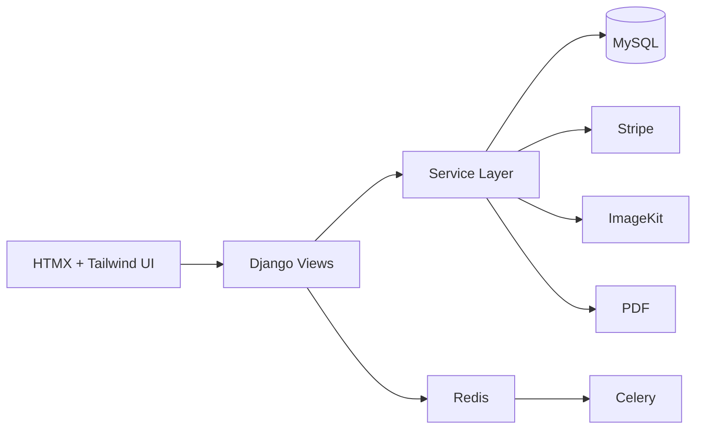
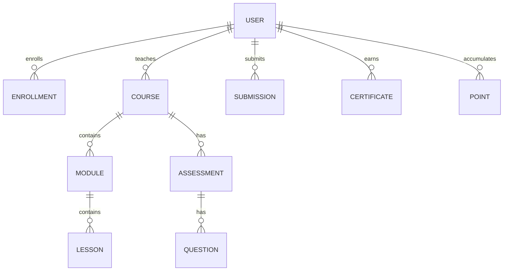
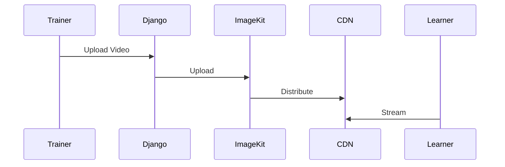
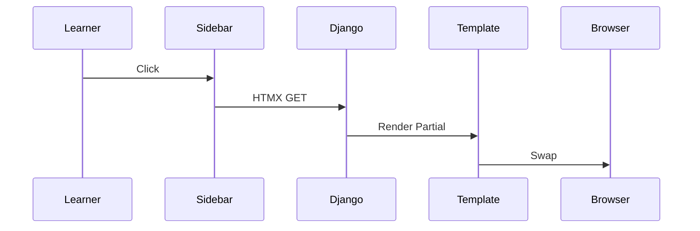
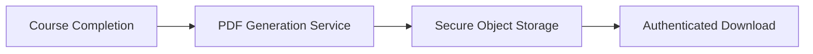
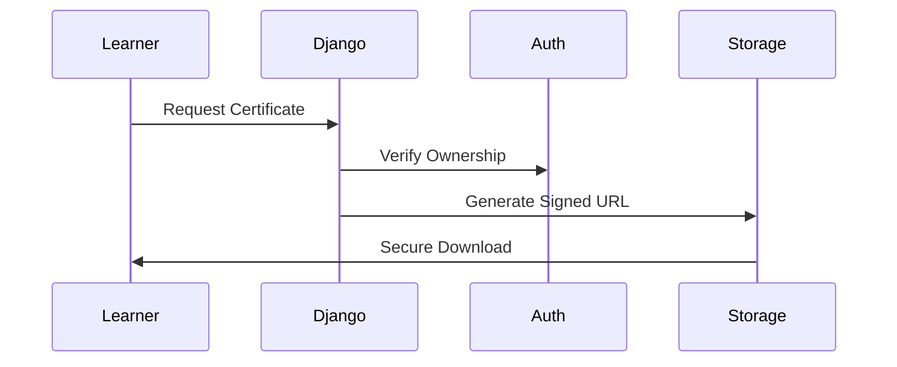
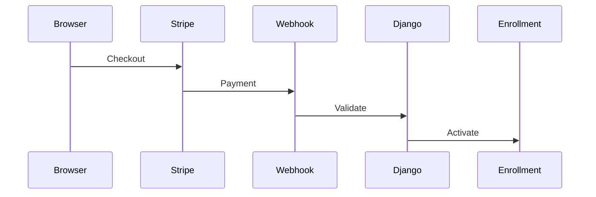
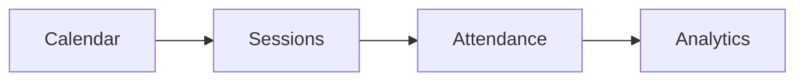
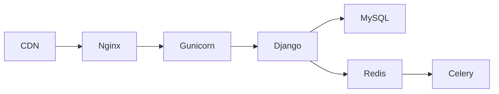

# 🚀 Enterprise LMS – Complete Step-by-Step Engineering Tutorial

**Build a Production-Grade Learning Management System from Zero to Enterprise Scale**

**Stack:** Django · MySQL · HTMX · Tailwind · Stripe · ImageKit · ReportLab · Pandas · Python-Docx · Celery · Redis

**Author:** Sean Wong
**Version:** 5.0 – Enterprise Architecture & Engineering Master Edition (HTMX-first)
**Date:** January 2026

---

# Executive Summary

This document is a **complete enterprise engineering playbook for building a production-grade Learning Management System (LMS)** using **Django + HTMX + Tailwind**.

This is not a tutorial.

This is a **full SaaS platform architecture and engineering manual**, comparable to internal engineering documentation of large education technology companies.

You will learn:

* How **senior engineers design systems**
* How **enterprise SaaS platforms are structured**
* How **scalable learning platforms are built, deployed, and operated**

You will build:

> A **complete enterprise LMS platform**, from database to production infrastructure.

---

# Table of Contents

1. Mental Models & System Thinking
2. Global Architecture Design
3. Database Schema & Domain Modeling
4. Identity, Authentication & RBAC
5. Service Layer Architecture
6. Media Delivery Pipeline (ImageKit)
7. HTMX SPA Workflow Engineering
8. Learning Engine Implementation
9. Assessment & Grading System
10. Certificate & Document Automation
11. Payments, Billing & Webhooks
12. Gamification Engine
13. Scheduling & Attendance System
14. Analytics & Business Intelligence
15. Infrastructure, Deployment & Scaling

---

# PART I – MENTAL MODELS & SYSTEM THINKING

## 1.1 Why LMS Systems Are Hard

An LMS is not just content hosting.

It is a **multi-domain transactional system** that coordinates:

* Identity
* Learning workflows
* Media delivery
* Assessments
* Certification
* Payments
* Analytics

This means:

> You are building **multiple software products inside one system**.

---

## 1.2 Learning Factory Model

```
Students → Content → Learning → Assessment → Certification → Analytics → Business Growth
```

Each stage:

* Accepts structured inputs
* Applies business rules
* Produces measurable outputs

Your LMS is a **value processing pipeline**.

---

# PART II – GLOBAL ARCHITECTURE DESIGN

## 2.1 High-Level System Architecture



---

## 2.2 Architectural Principles

* Server-driven UI
* Thin controllers, thick services
* Domain-driven design
* Stateless web tier
* Async-heavy architecture

---

# PART III – DATABASE SCHEMA & DOMAIN MODELING

## 3.1 Core Domain Entities



---

## 3.2 Full Database Schema

```python
class User(AbstractUser):
    ROLE_CHOICES = [('learner','Learner'),('trainer','Trainer'),('admin','Admin')]
    role = models.CharField(max_length=20, choices=ROLE_CHOICES)
    is_banned = models.BooleanField(default=False)

class Course(models.Model):
    title = models.CharField(max_length=255)
    description = models.TextField()
    trainer = models.ForeignKey(User, on_delete=models.CASCADE)
    price = models.DecimalField(max_digits=10, decimal_places=2)

class Module(models.Model):
    course = models.ForeignKey(Course, on_delete=models.CASCADE)
    title = models.CharField(max_length=255)

class Lesson(models.Model):
    module = models.ForeignKey(Module, on_delete=models.CASCADE)
    title = models.CharField(max_length=255)
    video_url = models.URLField(blank=True)

class Enrollment(models.Model):
    user = models.ForeignKey(User, on_delete=models.CASCADE)
    course = models.ForeignKey(Course, on_delete=models.CASCADE)
    paid = models.BooleanField(default=False)
    progress = models.FloatField(default=0)

class Assessment(models.Model):
    course = models.ForeignKey(Course, on_delete=models.CASCADE)
    title = models.CharField(max_length=255)

class Question(models.Model):
    assessment = models.ForeignKey(Assessment, on_delete=models.CASCADE)
    text = models.TextField()
    answer_key = models.JSONField()

class Submission(models.Model):
    user = models.ForeignKey(User, on_delete=models.CASCADE)
    assessment = models.ForeignKey(Assessment, on_delete=models.CASCADE)
    answers = models.JSONField()
    score = models.FloatField()

class Certificate(models.Model):
    user = models.ForeignKey(User, on_delete=models.CASCADE)
    course = models.ForeignKey(Course, on_delete=models.CASCADE)
    file_url = models.URLField()

class Point(models.Model):
    user = models.ForeignKey(User, on_delete=models.CASCADE)
    value = models.IntegerField()
    reason = models.CharField(max_length=255)
```

---

# PART IV – SERVICE LAYER ARCHITECTURE

## 4.1 Why Service Layers Exist

Business logic must **not live in views**.

Views coordinate.

Services execute business workflows.

---

## 4.2 Core Services

```python
class EnrollmentService:
    def enroll(self, user, course): ...

class MediaService:
    def upload_video(self, file_obj): ...

class LearningService:
    def update_progress(self, enrollment, lesson): ...

class AssessmentService:
    def grade(self, submission): ...

class CertificateService:
    def generate(self, enrollment): ...

class PaymentService:
    def process(self, checkout_data): ...

class GamificationService:
    def award_points(self, user, value, reason): ...
```

---

# PART V – MEDIA PIPELINE (IMAGEKIT)

## 5.1 Media Workflow



---

# PART VI – HTMX SPA ENGINEERING

## 6.1 Server-Driven SPA Architecture

HTMX replaces:

* React
* Vue
* Angular

with:

> Server-rendered partials + event-driven UI

---

## 6.2 Lesson Playback Workflow



---

# PART VII – LEARNING ENGINE

## 7.1 Progress Tracking Algorithm

```python
def calculate_progress(enrollment):
    total = Lesson.objects.filter(module__course=enrollment.course).count()
    completed = Progress.objects.filter(enrollment=enrollment, done=True).count()
    return completed / total * 100
```

---

# PART VIII – ASSESSMENT & AUTO-GRADING ENGINE

## 8.1 Auto-Grading Logic

```python
def grade_submission(submission):
    score = 0
    for q_id, answer in submission.answers.items():
        if answer == Question.objects.get(id=q_id).answer_key:
            score += 1
    return score
```

---

# PART IX – CERTIFICATE & DOCUMENT AUTOMATION

## 9.1 Enterprise Certificate Generation Pipeline

Certificate generation is a **regulated, auditable, security-sensitive workflow**. It must be:

* Deterministic
* Tamper-proof
* Traceable
* Secure
* Regeneratable

---

### 9.1.1 End-to-End Certificate Workflow



---

### 9.1.2 Certificate Lifecycle

1. Learner completes all lessons
2. Final assessment is passed
3. Progress reaches 100%
4. Certificate service is triggered
5. PDF is generated
6. Certificate is stored
7. Secure download link issued

---

## 9.2 Certificate Data Model

```python
class Certificate(models.Model):
    user = models.ForeignKey(User, on_delete=models.CASCADE)
    course = models.ForeignKey(Course, on_delete=models.CASCADE)
    serial_number = models.CharField(max_length=64, unique=True)
    file_url = models.URLField()
    checksum = models.CharField(max_length=64)
    issued_at = models.DateTimeField(auto_now_add=True)
    revoked = models.BooleanField(default=False)
```

---

## 9.3 Certificate Generation Service

```python
import hashlib
from reportlab.lib.pagesizes import A4
from reportlab.pdfgen import canvas

class CertificateService:

    def generate_certificate(self, enrollment):
        serial = self._generate_serial(enrollment)
        filename = f"cert_{serial}.pdf"
        file_path = f"/tmp/{filename}"

        self._build_pdf(file_path, enrollment, serial)

        url = upload_to_storage(file_path)
        checksum = self._calculate_checksum(file_path)

        return Certificate.objects.create(
            user=enrollment.user,
            course=enrollment.course,
            serial_number=serial,
            file_url=url,
            checksum=checksum
        )

    def _generate_serial(self, enrollment):
        raw = f"{enrollment.id}-{enrollment.user_id}-{enrollment.course_id}".encode()
        return hashlib.sha256(raw).hexdigest()[:16]

    def _calculate_checksum(self, path):
        with open(path,'rb') as f:
            return hashlib.sha256(f.read()).hexdigest()

    def _build_pdf(self, path, enrollment, serial):
        c = canvas.Canvas(path, pagesize=A4)
        c.setFont("Helvetica-Bold", 24)
        c.drawCentredString(300, 650, "Certificate of Completion")
        c.setFont("Helvetica", 16)
        c.drawCentredString(300, 600, enrollment.user.get_full_name())
        c.drawCentredString(300, 560, f"has successfully completed")
        c.drawCentredString(300, 530, enrollment.course.title)
        c.setFont("Helvetica", 10)
        c.drawCentredString(300, 480, f"Certificate ID: {serial}")
        c.save()
```

---

## 9.4 Secure Download Architecture



---

## 9.5 Certificate Verification System

Every certificate is verifiable via:

* Serial number
* SHA-256 checksum
* Public verification endpoint

```python
class CertificateVerificationService:

    def verify(self, serial):
        cert = Certificate.objects.get(serial_number=serial)
        return {
            "name": cert.user.get_full_name(),
            "course": cert.course.title,
            "issued": cert.issued_at,
            "valid": not cert.revoked
        }
```

---

# PART X – PAYMENTS & BILLING SYSTEM

## 10.1 Stripe Payment Workflow



---

# PART XI – GAMIFICATION ENGINE

## 11.1 Motivation Model

Points + Badges + Leaderboards → Engagement → Retention → Completion

---

# PART XII – SCHEDULING & ATTENDANCE

## 12.1 Class Scheduling Workflow



---

# PART XIII – ANALYTICS & BUSINESS INTELLIGENCE

## 13.1 Core KPIs

* Course completion
* Engagement
* Revenue per learner
* Trainer effectiveness

---

# PART XIV – INFRASTRUCTURE, DEPLOYMENT & SCALING

## 14.1 Production Topology



---

# FINAL WORD

This document represents a **complete enterprise LMS engineering blueprint**.

If implemented fully, this system is capable of:

* Supporting millions of learners
* Delivering petabytes of video
* Processing millions of assessments
* Handling enterprise-grade payment flows

You now possess:

> A full SaaS architecture, not a tutorial.

---
