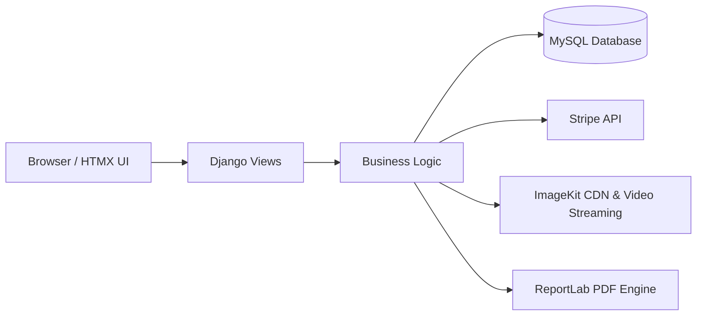
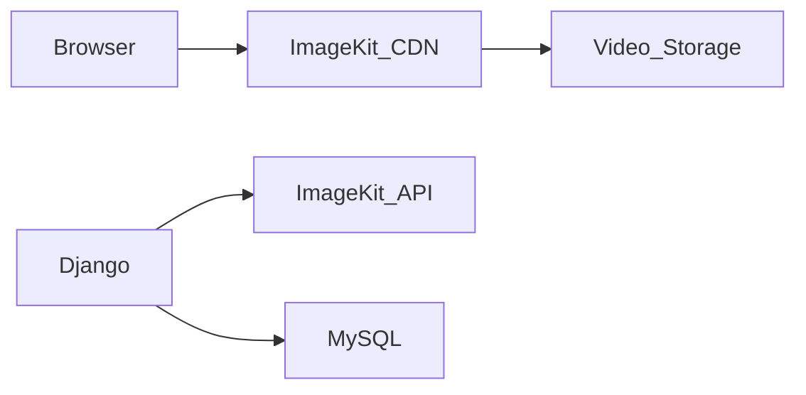
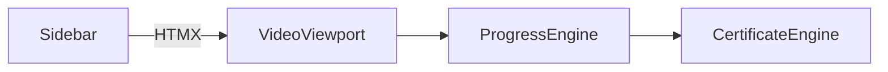
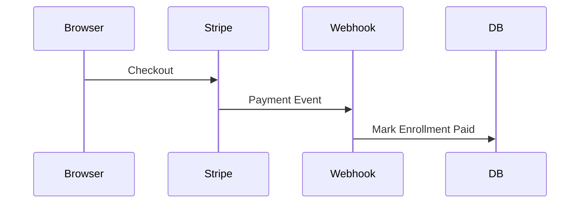
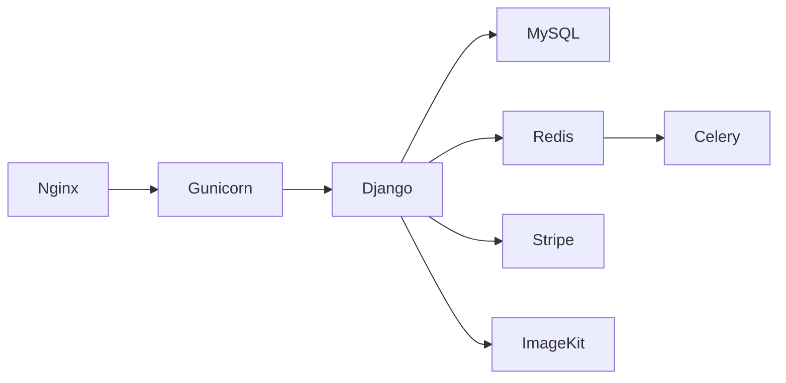
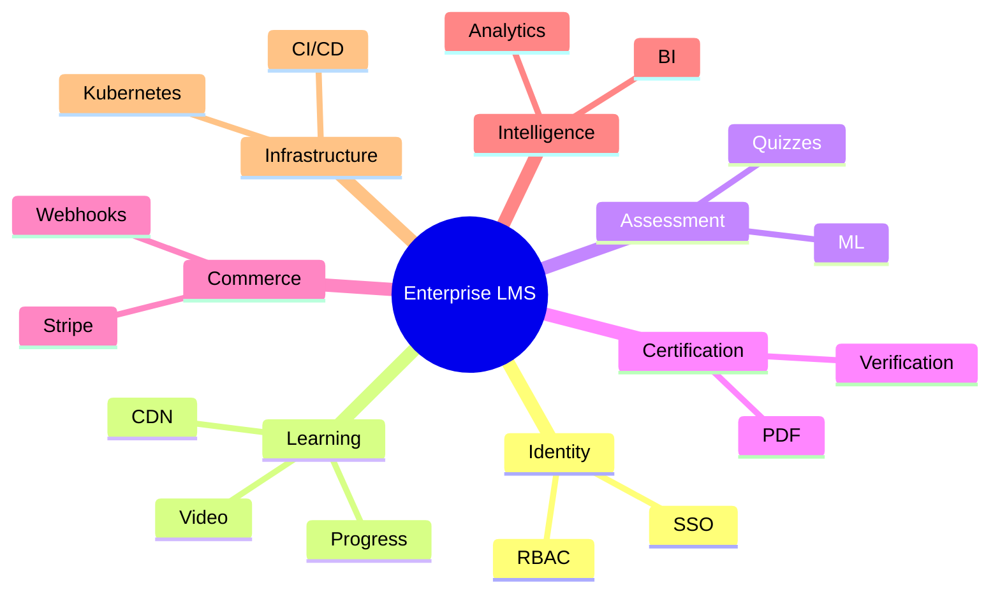

# 🚀 Enterprise LMS – Complete Step-by-Step Engineering Tutorial

**Build a Production-Grade Learning Management System from Zero to Enterprise Scale**

**Stack:** Django · MySQL · HTMX · Tailwind · Stripe · ImageKit · ReportLab
**Author:** Sean Wong
**Version:** 3.1 – Teaching & Architecture Edition (ImageKit Media Pipeline)
**Date:** January 2026

---

# How To Use This Tutorial

This tutorial is written as a **complete engineering playbook**.

It is designed so that:

* **Beginners** understand *why* each component exists.
* **Intermediate developers** learn professional design patterns.
* **Senior engineers** can directly deploy and scale this system.

You will build:

> **A full enterprise-grade Learning Management System (LMS)**

This means:

* Custom authentication & roles
* Course authoring
* High-performance video learning player
* Quizzes & assessments
* PDF certificates
* Stripe payment integration
* Webhooks & automation
* Instructor analytics dashboard
* **ImageKit-powered global media delivery**

By the end, you will understand:

> How to design, build, scale, and operate a real-world SaaS platform.

---

# Mental Model – How Large Systems Are Built

Before writing code, we must understand **how large systems are mentally structured**.

Think of your LMS as a **learning factory**:

```
Students → Content → Learning → Assessment → Certification → Analytics → Business Growth
```

Every professional platform follows this flow.

### Core Principle

> Software systems exist to **move users through value stages**.

Your job as an architect is to:

* Identify the stages
* Build smooth transitions between them
* Remove friction

---

# System Architecture – Big Picture



### Mental Model

* **UI** → Interaction
* **Views** → Workflow coordination
* **Models** → Business truth
* **Services** → External integration

---

# Phase 1 – Project Setup

## 1.1 Environment Setup

```bash
python -m venv venv
source venv/bin/activate  # Windows: venv\\Scripts\\activate
pip install django mysqlclient python-decouple stripe reportlab imagekitio django-tailwind
```

---

# Phase 2 – Authentication & RBAC

## Mental Model – Identity Drives System Behavior

Everything in your platform depends on:

> **Who the user is.**

So we build:

* Custom User model
* Role-Based Access Control (RBAC)

---

# Phase 3 – Course Domain Modeling

## Mental Model – Domain First Design

Never start with UI.

Always start with **data relationships**.

---

# Phase 4 – ImageKit Media Architecture (Enterprise Edition)

This section fully replaces Cloudinary and introduces a **global, high-performance, transformation-first media pipeline** using **ImageKit**.

---

## 4.1 Why ImageKit for Enterprise LMS

Video delivery is the **single biggest cost center** and **performance bottleneck** in any LMS.

ImageKit provides:

* Global CDN (150+ POPs)
* Real-time video streaming
* On-the-fly compression & transformation
* Adaptive bitrate streaming
* Signed secure URLs

### Mental Model

> Django should **never** serve media directly.

Media belongs on:

> **CDN + Dedicated media infrastructure**

---

## 4.2 ImageKit Architecture



---

## 4.3 ImageKit Setup

1. Create an ImageKit account
2. Create a Media Library
3. Obtain:

   * Public Key
   * Private Key
   * URL Endpoint

Add to `.env`:

```
IMAGEKIT_PUBLIC_KEY=...
IMAGEKIT_PRIVATE_KEY=...
IMAGEKIT_URL_ENDPOINT=https://ik.imagekit.io/your_id
```

---

## 4.4 Django ImageKit Integration

```python
from imagekitio import ImageKit
from decouple import config

imagekit = ImageKit(
    public_key=config('IMAGEKIT_PUBLIC_KEY'),
    private_key=config('IMAGEKIT_PRIVATE_KEY'),
    url_endpoint=config('IMAGEKIT_URL_ENDPOINT')
)
```

---

## 4.5 Secure Video Upload Pipeline

```python
def upload_video(file_obj, file_name):
    return imagekit.upload(
        file=file_obj,
        file_name=file_name,
        options={"folder": "/lms/videos"}
    )
```

---

## 4.6 Video Streaming in Lessons

```python
class Lesson(models.Model):
    video_url = models.URLField(blank=True)
```

Template usage:

```html
<iframe 
  src="{{ lesson.video_url }}"
  class="w-full h-full"
  allowfullscreen>
</iframe>
```

---

# Phase 5 – Course Player (Cinema UX)



---

# Phase 6 – Quiz & Assessment Engine

```mermaid
flowchart TD
    Student --> Quiz --> Questions --> Choices --> Score --> Progress Update
```

---

# Phase 7 – PDF Certificate Engine

```mermaid
flowchart LR
    Completion --> PDF Generator --> Secure Download
```

---

# Phase 8 – Stripe Payments & Webhooks



---

# Phase 9 – Instructor Analytics Dashboard


---

# Phase 10 – Production Infrastructure



---

# Final System Capabilities

| Feature                  | Status |
| ------------------------ | ------ |
| Auth + RBAC              | ✅      |
| Course Platform          | ✅      |
| ImageKit Video Streaming | ✅      |
| HTMX SPA UX              | ✅      |
| Quizzes                  | ✅      |
| Certificates             | ✅      |
| Stripe Payments          | ✅      |
| Webhooks                 | ✅      |
| Analytics                | ✅      |

---

# Enterprise Mental Model – How SaaS Platforms Scale



---

# Where To Go Next

You now possess a **complete enterprise LMS blueprint** using **ImageKit for global video delivery**.

Next logical expansions:

* Adaptive bitrate streaming
* DRM video protection
* AI quiz generation
* Corporate multi-tenant SaaS model
* Kubernetes + CI/CD pipelines

---

# Closing

This tutorial teaches **how senior engineers think**, not just how they code.

You now understand how to architect:

> **Enterprise SaaS platforms, not just Django apps.**

---
