# 🧠 DHA Stack 2026 — Django + HTMX + Alpine.js

**DHA = Django (Brain) + HTMX (Pulse) + Alpine.js (Sprinkles)**
*HTML-first, JS-light, MySQL-ready, production-grade.*

> **Promise:** SPA-level responsiveness without SPA complexity.
> Django owns business logic and state, HTMX streams HTML over the wire, Alpine adds just enough client-side reactivity to feel modern.

---

## 📖 1. Philosophy & Stack Overview

DHA is rooted in **hypermedia-driven design** — the browser speaks HTML, not JSON APIs, and the server is the canonical source of truth.

Instead of building a frontend *framework application*, you build a **web application** again.

### Why DHA in 2026?

Modern SPAs solved real problems — but at a steep and often unnecessary cost. DHA keeps what worked, discards what didn’t.

| SPA Pain Point       | DHA Solution                                                |
| -------------------- | ----------------------------------------------------------- |
| **Duplicated Logic** | One Django view = validation, permissions, state, rendering |
| **Hydration Delays** | Instant SSR + HTMX fragment swaps                           |
| **Bundle Bloat**     | <50KB JS total, CDN-delivered                               |
| **State Hell**       | Django sessions + MySQL = boring, reliable state            |
| **API Glue Code**    | HTML *is* the contract                                      |

> In DHA, **HTML is state**, not an afterthought.

---

## 🔁 1.1 Data Flow (Mental Model)

```mermaid
flowchart TD
    User[👤 User Action] --> HTMX[⚡ HTMX Request]
    HTMX --> Django[🧠 Django View]
    Django --> MySQL[💾 MySQL DB]
    Django -->|HTML Fragment| HTMX
    HTMX --> DOM[✅ DOM Swap]
    DOM --> Alpine[✨ Local UX / Sprinkles]
```



**Think in loops, not layers.** Every interaction closes the loop back to the user in milliseconds.

> Django decides. HTMX delivers. Alpine polishes.

---

## 🏗️ Phase 1: Environment & Scaffolding

DHA favors **predictable infrastructure**. No magic. No snowflakes.

* Docker for parity across dev, staging, prod
* MySQL 8.1 for boring, durable storage
* Redis 7 for fast ephemeral state and realtime signaling

### 1.1 Project Structure

```text
dha_app/
├── core/                  # Settings, ASGI, URLs
├── apps/
│   └── tasks/             # Business logic lives here
├── templates/
│   ├── base.html          # App shell (rarely replaced)
│   └── partials/          # HTMX fragments (frequently swapped)
├── static/
│   └── js/                # Alpine helpers only
├── Dockerfile
└── docker-compose.yml
```

> **Rule of thumb:** If it changes often, make it a partial.

---

## 🧩 1.2 Database Models (MySQL-Optimized)

```python
from django.db import models

class Column(models.Model):
    name = models.CharField(max_length=100)
    order = models.IntegerField(default=0)

    class Meta:
        ordering = ['order']

class Task(models.Model):
    title = models.CharField(max_length=255)
    column = models.ForeignKey(Column, on_delete=models.CASCADE, related_name='tasks')
    is_completed = models.BooleanField(default=False)
    created_at = models.DateTimeField(auto_now_add=True)

    class Meta:
        indexes = [
            models.Index(fields=['is_completed', 'column']),
            models.Index(fields=['created_at']),
        ]
```

**Why indexes matter in DHA:** HTMX encourages frequent small queries — optimize for them early.

---

## ⚡ Phase 2: HTMX Pulse (Server‑Driven Reactivity)

HTMX replaces client-side state machines with **HTTP semantics**.

* `GET` = read
* `POST` = intent
* Response = HTML

### 2.1 Hybrid Django View (Full Page + Fragment)

```python
def kanban_board(request):
    query = request.GET.get('q', '')
    tasks = Task.objects.select_related('column')

    if query:
        tasks = tasks.filter(title__icontains=query)

    columns = Column.objects.prefetch_related(
        models.Prefetch(
            'tasks',
            queryset=tasks.order_by('-created_at')
        )
    )

    context = {
        'columns': columns,
        'query': query,
    }

    template = (
        'tasks/partials/kanban_content.html'
        if request.htmx
        else 'tasks/kanban.html'
    )

    return render(request, template, context)
```

> One view. Two render paths. Zero duplication.

---

### 2.2 Live Search (Debounced, Accessible)

```html
<input
  type="search"
  name="q"
  placeholder="Search tasks…"
  hx-get=""
  hx-trigger="keyup changed delay:300ms"
  hx-target="#kanban-container"
  hx-push-url="true"
  hx-indicator="#spinner"
/>

<div id="spinner" class="htmx-indicator animate-spin">🌀</div>
```

**Key idea:** URLs still matter. Search is bookmarkable.

---

## ✨ Phase 3: Alpine Sprinkles (Local UX)

Alpine.js is not a framework — it’s **HTML sugar**.

Use it when:

* You need optimistic UI
* You need tiny state machines
* You want animation without re-rendering

Avoid it when:

* Business rules are involved
* Data must be authoritative

### 3.1 Drag‑and‑Drop with Sortable.js

```html
<div x-data="kanban()" class="flex gap-4">
  
  <div
    id="col-{{ col.id }}"
    data-id="{{ col.id }}"
    x-init="initSortable($el)"
  >
    
    <div
      id="task-{{ task.id }}"
      data-id="{{ task.id }}"
      class="card"
    >
      {{ task.title }}
    </div>
    
  </div>
  
</div>

<script>
function kanban() {
  return {
    initSortable(el) {
      new Sortable(el, {
        group: 'tasks',
        animation: 150,
        onEnd: (evt) => {
          htmx.ajax('POST', `/move/${evt.item.dataset.id}/`, {
            values: { column_id: evt.to.dataset.id },
            target: `#task-${evt.item.dataset.id}`,
            swap: 'outerHTML'
          })
        }
      })
    }
  }
}
</script>
```

**Pattern:** Optimistic UI locally, authoritative correction from server.

---

## 📡 Phase 4: Real‑Time Pulse (HTMX OOB)

Out‑of‑Band swaps let Django update **multiple UI regions** in a single response.

```html
<div id="task-5" class="card updated-success">Task Researched!</div>

<span id="pending-count" hx-swap-oob="true">12</span>

<div id="toast-container" hx-swap-oob="afterbegin">
  <div
    x-data="{ show: true }"
    x-show="show"
    x-init="setTimeout(() => show = false, 3000)"
  >
    Successfully moved!
  </div>
</div>
```

**Result:** One response, many UI updates, zero JS orchestration.

---

## 🏁 Phase 5: Production & Environment

### 5.1 Docker Compose (Production‑Ready)

```yaml
services:
  db:
    image: mysql:8.1
    volumes:
      - mysql_data:/var/lib/mysql
      - ./backups:/backups
    healthcheck:
      test: ["CMD", "mysqladmin", "ping", "-psecret_password"]

  redis:
    image: redis:7-alpine

  web:
    build: .
    command: daphne -b 0.0.0.0 -p 8000 core.asgi:application
    depends_on:
      db:
        condition: service_healthy

volumes:
  mysql_data:
```

---

### 5.2 Environment‑Aware Django Settings

```python
ENV = os.getenv('DJANGO_ENV', 'development')
DEBUG = ENV == 'development'

SECRET_KEY = os.getenv('DJANGO_SECRET_KEY', 'dev-key-not-for-prod')

ALLOWED_HOSTS = ['*'] if DEBUG else os.getenv('ALLOWED_HOSTS', '').split(',')

SESSION_COOKIE_SECURE = not DEBUG
CSRF_COOKIE_SECURE = not DEBUG

DATABASES = {
    'default': dj_database_url.config(
        default=os.getenv(
            'DATABASE_URL',
            'mysql://dha_user:secret@db:3306/dha_db'
        )
    )
}

CHANNEL_LAYERS = {
    'default': {
        'BACKEND': 'channels_redis.core.RedisChannelLayer',
        'CONFIG': {
            'hosts': [os.getenv('REDIS_URL', 'redis://redis:6379/0')]
        }
    }
}
```

---

### 5.3 System Health Check Endpoint

```python
from django.db import connections
from django.core.cache import cache
import time

def system_health_check(request):
    try:
        start = time.time()
        connections['default'].cursor()
        db_status = 'Healthy'
        db_latency = round((time.time() - start) * 1000, 2)
    except Exception:
        db_status, db_latency = 'Unreachable', 'N/A'

    try:
        start = time.time()
        cache.set('health_check', 'ok', timeout=5)
        redis_status = 'Healthy'
        redis_latency = round((time.time() - start) * 1000, 2)
    except Exception:
        redis_status, redis_latency = 'Disconnected', 'N/A'

    return render(request, 'partials/system_status.html', {
        'db_status': db_status,
        'db_latency': db_latency,
        'redis_status': redis_status,
        'redis_latency': redis_latency,
    })
```

---

## 🔁 DHA Loop Overview (Mental Map)


---

## 🌐 Circular DHA Architecture (One‑Page Reference)

```mermaid
flowchart TB
    U[👤 User Action] --> HTMX[⚡ HTMX Request / Partial HTML]
    HTMX --> DJ[🧠 Django Brain / Hybrid Views]
    DJ --> DB[💾 MySQL 8.1]
    DJ --> Redis[🔔 Redis 7]
    Redis --> Channels[🌐 Channels / WebSocket Pulse]
    Channels --> DOM[✅ DOM Swap / OOB Updates]
    DJ -->|HTML Fragment / OOB| DOM
    DOM --> UX[✨ Alpine.js Sprinkles]
    UX --> U
```



### ✅ Loop Highlights

1. User actions always hit the server.
2. Django remains authoritative.
3. HTML is streamed, not assembled.
4. Alpine never owns business state.
5. The loop closes fast — **and stays debuggable**.

---

## 🚀 Launch Commands

```bash
docker-compose -f docker-compose.prod.yml up -d
docker-compose logs -f web
```

---

## 🧠 Final Takeaway

DHA is not a step backward.

It’s a **course correction** — rediscovering what made the web resilient, simple, and fast, while keeping the UX expectations of 2026.

> **Build less JavaScript. Ship more product. Sleep better.**
