```mermaid
flowchart TD
    User[👤 User Action] --> HTMX[⚡ HTMX Request]
    HTMX --> Django[🧠 Django View]
    Django --> MySQL[💾 MySQL DB]
    Django -->|HTML Fragment| HTMX
    HTMX --> DOM[✅ DOM Swap]
    DOM --> Alpine[✨ Local UX / Sprinkles]
```

# 🧠 DHA Stack 2026 — Django + HTMX + Alpine.js

**DHA = Django (Brain) + HTMX (Pulse) + Alpine.js (Sprinkles)**
*HTML-first, JS-light, MySQL-ready, production-grade.*

> SPA-level responsiveness without SPA complexity: the server handles business logic, HTMX drives HTML updates, and Alpine provides local UX polish.

---

## 📖 1. Philosophy & Stack Overview

DHA embraces **Hypermedia-driven design**: the server is the brain, the client is a lightweight reactive runtime.

| SPA Pain Point       | DHA Solution                                        |
| -------------------- | --------------------------------------------------- |
| **Duplicated Logic** | Single Django view as the source of truth           |
| **Hydration Delays** | Instant SSR + HTMX partial DOM swaps                |
| **Bundle Bloat**     | <50KB JS total (CDN-loaded)                         |
| **State Hell**       | Django sessions + MySQL = simple, centralized state |

### 1.1 Data Flow



> HTML is the **state**, HTMX is the **pulse**, Alpine adds **sprinkles**.

---

## 🏗️ Phase 1: Environment & Scaffolding

Docker ensures **reproducible development** with MySQL 8.1 and Redis 7.

### 1.1 Project Structure

```text
dha_app/
├── core/                  # Settings, ASGI, URLs
├── apps/
│   └── tasks/             # Business logic
├── templates/
│   ├── base.html          # Dashboard shell
│   └── partials/          # HTMX fragments
├── Dockerfile
└── docker-compose.yml
```

### 1.2 Database Models (`models.py`)

```python
from django.db import models

class Column(models.Model):
    name = models.CharField(max_length=100)
    order = models.IntegerField(default=0)

class Task(models.Model):
    title = models.CharField(max_length=255)
    column = models.ForeignKey(Column, on_delete=models.CASCADE, related_name='tasks')
    is_completed = models.BooleanField(default=False)
    created_at = models.DateTimeField(auto_now_add=True)

    class Meta:
        indexes = [models.Index(fields=['is_completed', 'column'])]
```

---

## ⚡ Phase 2: HTMX Pulse (Server-Driven Reactivity)

HTMX provides **declarative server-driven interactivity**. Hybrid views return either full pages or partial fragments.

### 2.1 Hybrid View

```python
def kanban_board(request):
    query = request.GET.get('q', '')
    tasks = Task.objects.select_related('column')
    
    if query:
        tasks = tasks.filter(title__icontains=query)

    columns = Column.objects.prefetch_related(
        models.Prefetch('tasks', queryset=tasks.order_by('-created_at'))
    ).all()

    context = {'columns': columns, 'query': query}
    template = 'tasks/partials/kanban_content.html' if request.htmx else 'tasks/kanban.html'
    return render(request, template, context)
```

### 2.2 Live Search Component

```html
<input type="search" name="q" placeholder="Search tasks..."
       hx-get=""
       hx-trigger="keyup changed delay:300ms"
       hx-target="#kanban-container"
       hx-indicator="#spinner">

<div id="spinner" class="htmx-indicator animate-spin">🌀</div>
```

---

## ✨ Phase 3: Alpine Sprinkles (Local UX & Drag-and-Drop)

Alpine.js handles **optimistic UI**, small animations, and drag-and-drop via **Sortable.js**.

### 3.1 Drag-and-Drop

```html
<div x-data="kanban()" class="flex gap-4">
    
    <div id="col-{{ col.id }}" data-id="{{ col.id }}" x-init="initSortable($el)">
        
            <div id="task-{{ task.id }}" data-id="{{ task.id }}" class="card">
                {{ task.title }}
            </div>
        
    </div>
    
</div>

<script>
function kanban() {
    return {
        initSortable(el) {
            new Sortable(el, {
                group: 'tasks',
                onEnd: (evt) => {
                    htmx.ajax('POST', `/move/${evt.item.dataset.id}/`, {
                        values: { column_id: evt.to.dataset.id },
                        target: `#task-${evt.item.dataset.id}`,
                        swap: 'outerHTML'
                    });
                }
            });
        }
    }
}
</script>
```

---

## 📡 Phase 4: Real-Time Pulse (OOB Swaps)

**Out-of-Band (OOB) swaps** allow Django to update multiple DOM targets.

```html
<div id="task-5" class="card updated-success">Task Researched!</div>
<span id="pending-count" hx-swap-oob="true">12</span>

<div id="toast-container" hx-swap-oob="afterbegin">
    <div x-data="{ show: true }" x-show="show" x-init="setTimeout(() => show=false, 3000)">
        Successfully moved!
    </div>
</div>
```

---

## 🏁 Phase 5: Production & Environment

### 5.1 Docker Compose

```yaml
services:
  db:
    image: mysql:8.1
    volumes: 
      - mysql_data:/var/lib/mysql
      - ./backups:/backups
    healthcheck:
      test: ["CMD", "mysqladmin", "ping", "-psecret_password"]

  redis:
    image: redis:7-alpine

  web:
    build: .
    command: daphne -b 0.0.0.0 -p 8000 core.asgi:application
    depends_on:
      db: { condition: service_healthy }

volumes:
  mysql_data:
```

### 5.2 Environment-Aware Settings (`settings.py`)

```python
import os
from pathlib import Path
import dj_database_url

BASE_DIR = Path(__file__).resolve().parent.parent

ENV = os.getenv('DJANGO_ENV', 'development')
DEBUG = ENV == 'development'
SECRET_KEY = os.getenv('DJANGO_SECRET_KEY', 'dev-key-not-for-prod')

ALLOWED_HOSTS = ['*'] if DEBUG else os.getenv('ALLOWED_HOSTS', '').split(',')
SESSION_COOKIE_SECURE = not DEBUG
CSRF_COOKIE_SECURE = not DEBUG

DATABASES = {
    'default': dj_database_url.config(
        default=os.getenv('DATABASE_URL', 'mysql://dha_user:secret@db:3306/dha_db')
    )
}

CHANNEL_LAYERS = {
    "default": {
        "BACKEND": "channels_redis.core.RedisChannelLayer",
        "CONFIG": {"hosts": [os.getenv('REDIS_URL', 'redis://redis:6379/0')]}
    }
}
```

### 5.3 System Health Check

```python
from django.db import connections
from django.core.cache import cache
import time

def system_health_check(request):
    try:
        start = time.time()
        connections['default'].cursor()
        db_status, db_latency = "Healthy", round((time.time()-start)*1000,2)
    except:
        db_status, db_latency = "Unreachable", "N/A"

    try:
        start = time.time()
        cache.set('health_check', 'ok', timeout=5)
        redis_status, redis_latency = "Healthy", round((time.time()-start)*1000,2)
    except:
        redis_status, redis_latency = "Disconnected", "N/A"

    return render(request, 'partials/system_status.html', {
        'db_status': db_status, 'db_latency': db_latency,
        'redis_status': redis_status, 'redis_latency': redis_latency
    })
```

---

## 🏁 DHA Loop Overview


---

## 🚀 Launch Commands

```bash
docker-compose -f docker-compose.prod.yml up -d
docker-compose logs -f web
```

---

## 🌐 Circular DHA Architecture (One-Page Reference)

```mermaid
flowchart TB
    %% Circular DHA Loop
    U[👤 User Action] --> HTMX[⚡ HTMX Request / Partial HTML]
    HTMX --> DJ[🧠 Django Brain / Hybrid Views]
    DJ --> DB[💾 MySQL 8.1 - Persistent Storage]
    DJ --> Redis[🔔 Redis 7 - Realtime Nerves]
    Redis --> Channels[🌐 Channels / WebSocket Pulse]
    Channels --> DOM[✅ DOM Swap / OOB Updates]
    DJ -->|HTML Fragment / OOB| DOM
    DOM --> UX[✨ Alpine.js Sprinkles / Optimistic UI]
    UX --> U
```



### ✅ Circular Loop Highlights

1. **User → HTMX:** Every action triggers server-driven updates.
2. **Django Brain:** Single source of truth for full page or fragment.
3. **Storage:** MySQL persists state; Redis powers real-time notifications.
4. **Channels:** Push live updates to the DOM.
5. **DOM & OOB:** HTMX swaps multiple targets instantly.
6. **Alpine Sprinkles:** Local animations and optimistic UI.
7. **Closed Loop:** Browser reacts immediately, keeping the app **hyper-responsive**.


