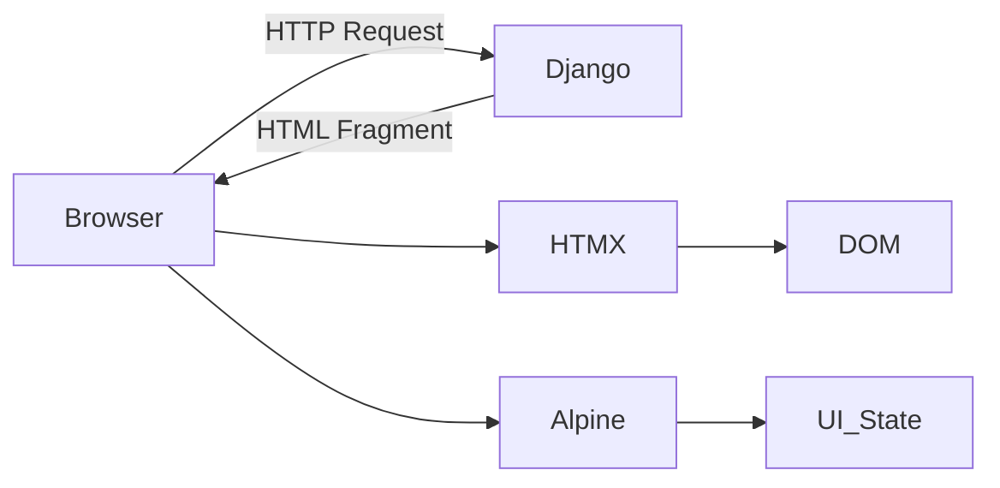
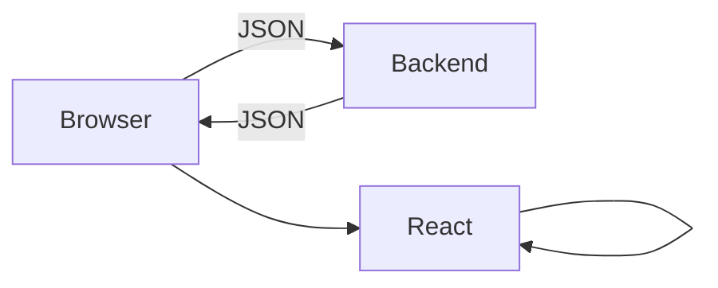
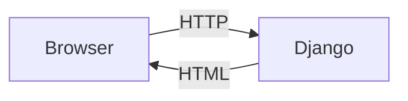
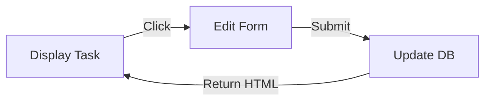
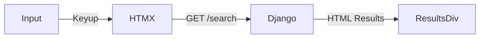
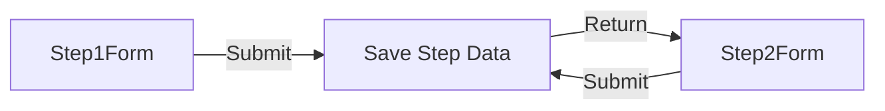
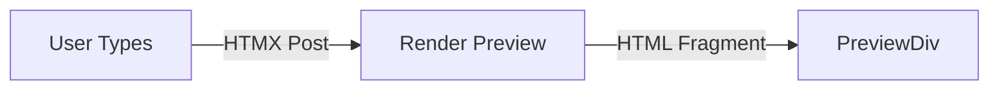
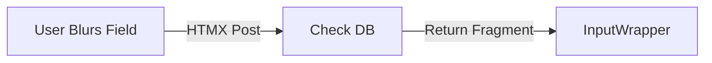
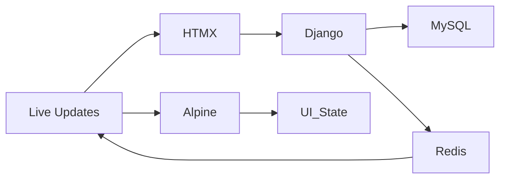

# 🧠 Monolith+ in 2026 — Build Fast Web Apps Without SPA Headaches

> **Stop overcomplicating your code.** Monolith+ delivers **SPA-level snappiness with server sanity**. HTML-first, minimal JS, MySQL-backed, zero hydration hell—just Python, HTMX, Alpine.js, and Tailwind working together.

**[Start for Free →](#signup)** | **[See Live Demo →](#demo)** | **[Read Docs →](#docs)**

---

## 📉 Why “Modern” Apps Often Overcomplicate Things

Traditional SPAs (React, Vue, Angular) force you to **build twice**: frontend and backend. This leads to:

* Redundant logic
* Bigger JS bundles
* More bugs
* Maintenance nightmares

| Metric                | Standard SPA / API Stack         | **Monolith+**                   |
| --------------------- | -------------------------------- | ------------------------------- |
| **Logic Duplication** | 40% (validation, routing, types) | **0% — single source of truth** |
| **JS Bundle Size**    | 300–800 KB                       | **< 25 KB**                     |
| **Time to Interact**  | Slow (wait for JS + API)         | **Instant (SSR + HTMX)**        |
| **Maintenance Cost**  | High (dependency churn)          | **Low (stable web standards)**  |

> Every extra KB of JavaScript is a **future productivity tax**. Monolith+ treats HTML as the **engine of state**.

---

## 🛠️ Core Philosophy — The Power Trio

Monolith+ is powered by the **HAT Stack** (HTMX + Alpine + Tailwind) on top of a Django/MySQL core.

| Role          | Tool      | Responsibility                                     |
| ------------- | --------- | -------------------------------------------------- |
| **Brain**     | Django    | Auth, validation, database, and HTML rendering     |
| **Pulse**     | HTMX      | Partial HTML requests, DOM swaps, WebSocket hooks  |
| **Sprinkles** | Alpine.js | Small interactive behaviors: toggles, modals, drag |



**Principle:** *HTML is the truth. Read the template and understand the feature—no switching between frameworks.*

---

## 🧭 Mental Model Shift

### The Old Way: SPA Chaos



* Hydration bugs
* Redundant client/server logic
* Brittle APIs

### The Monolith+ Way



* No hydration
* No API sync battles
* No client routing

> Result: Simple, predictable request–response. Instant feedback. Fewer bugs.

---

## 🏗️ Real-World Patterns

### 1️⃣ Inline “Swap-to-Edit”

React-style inline editing with **one Python view**, no JS frameworks:



**HTML Example**

```html
<span hx-get="" 
      hx-target="#task-{{ task.id }}" 
      hx-swap="outerHTML">{{ task.title }}</span>

<form hx-post="" 
      hx-target="#task-{{ task.id }}" 
      hx-swap="outerHTML">
  <input type="text" name="title" value="{{ task.title }}" autofocus>
  <button type="submit">Save</button>
  <button type="button" hx-get="" hx-target="#task-{{ task.id }}" hx-swap="outerHTML">Cancel</button>
</form>
```

---

### 2️⃣ Live Search — Zero Custom JS



**HTML Example**

```html
<input type="search" name="q" placeholder="Search tasks..."
       hx-get="" 
       hx-trigger="keyup changed delay:500ms"
       hx-target="#search-results" hx-indicator=".loader">
<span class="loader htmx-indicator">Searching...</span>
<div id="search-results"></div>
```

* **Reactive UX without writing JS.**

---

### 3️⃣ Multi-Step Wizard (Server-Side State)



**Django View**

```python
def project_wizard(request, step=1):
    if request.method == "POST":
        # Save partial data to session/DB
        step += 1
    return render(request, f"wizard/partials/step_{step}.html", {"step": step})
```

**Alpine Modal Skeleton**

```html
<div x-data="{ open: false }" @open-wizard.window="open = true" x-show="open" class="modal-overlay">
    <div class="modal-body" @click.away="open = false">
        <div id="wizard-content"></div>
    </div>
</div>
```

**Partial Form Step**

```html
<form hx-post="" hx-target="#wizard-content">
  <input type="text" name="project_name" required>
  <button type="submit">Next</button>
</form>
```

**Benefits:**

* Server-side state, no Redux/XState
* DB-backed validation at each step
* Automatic back-button support via `hx-push-url`

---

### 4️⃣ Live Preview Pattern



**HTML Example**

```html
<input type="text" name="title"
       hx-post="" 
       hx-trigger="keyup changed delay:300ms"
       hx-target="#wizard-preview-socket">
<div id="wizard-preview-socket"></div>
```

**Django Fragment Render**

```python
def update_preview(request):
    context = {
        'title': request.POST.get('title', 'Untitled'),
        'category': request.POST.get('category', 'internal'),
        'last_updated': now()
    }
    return render(request, 'wizard/partials/preview_card.html', context)
```

---

### 5️⃣ Live Validation Pattern



**Python Example**

```python
def validate_title(request):
    title = request.POST.get('title', '').strip()
    error = None
    success = False
    if len(title) < 3:
        error = "Title too short"
    elif Project.objects.filter(title__iexact=title).exists():
        error = "Title exists"
    else:
        success = True
    return render(request, 'partials/title_field.html', {'title': title, 'error': error, 'success': success})
```

* **Validation happens live, always against the real database.**

---

## ⚡ Production-Ready Stack (2026)



| Layer           | Tool                    | Why It Matters                           |
| --------------- | ----------------------- | ---------------------------------------- |
| Routing & Logic | Django                  | Secure, tested, batteries included       |
| Partial Loading | HTMX                    | SPA-like experience without complexity   |
| Client UI       | Alpine.js               | Lightweight, local interactivity         |
| Database        | MySQL                   | Reliable and widely supported            |
| Real-time       | Django Channels + Redis | Live updates without heavy JS frameworks |

**Dockerized Workflow**

```yaml
services:
  db: mysql:8.4
  redis: redis:7-alpine
  web: 
    build: .
    ports: ["8000:8000"]
    depends_on: [db, redis]
```

* Hot-reload in development
* Nginx + Gunicorn in production

---

## 🔑 Key Takeaways

* **HTML = engine of state** — server is the brain
* **SPA-level UX without SPA complexity** — minimal JS, no duplicate logic
* **Live previews & inline validation** — instantaneous feedback
* **Scalable & maintainable** — database-first validation, small bundles

> Monolith+ makes web development fast, reliable, and fun again. No massive frameworks, no hydration hell—just modern web apps done right in 2026.

---

## 🎯 Level-Up Features: Design, Security, Real-Time

### 🎨 1. Design: Styling with Tailwind CSS

Think of **Tailwind** as a box of “styling stickers.” Stick them on HTML; no CSS context-switching.

**Example:**

```html
<button class="bg-blue-500 p-4 rounded-lg text-white hover:bg-blue-600">
    Click Me
</button>
```

---

### 🔐 2. Security: Login & Signup

* Django handles user auth, password hashing, and sessions.
* Always use `` in forms for security.

**Model Example**

```python
from django.contrib.auth.models import User

class Task(models.Model):
    user = models.ForeignKey(User, on_delete=models.CASCADE)
    title = models.CharField(max_length=200)
    is_done = models.BooleanField(default=False)
```

*Protect routes with `@login_required`.*

---

### 💬 3. Real-Time: Chat / Activity Feed

**Browser (HTMX WebSocket)**

```html
<div hx-ws="connect:/ws/activity/">
    <div id="activity-feed" class="text-sm italic text-slate-500"></div>
</div>
```

**Server Broadcast Example**

```python
broadcast_message = "<div>Someone just finished a task! 🚀</div>"
# Sent via Channels to all connected clients
```

*Users see updates instantly.*

---

## 🚀 Monolith+ Developer Cheat Sheet

### HTMX

| Attribute      | Function             | Example                          |
| -------------- | -------------------- | -------------------------------- |
| `hx-get`       | Fetch HTML fragment  | `hx-get="/search/"`              |
| `hx-post`      | Send form data       | `hx-post="/add-task/"`           |
| `hx-target`    | Where to insert HTML | `hx-target="#list-box"`          |
| `hx-swap`      | How to insert HTML   | `hx-swap="afterbegin"`           |
| `hx-trigger`   | When to act          | `hx-trigger="keyup delay:500ms"` |
| `hx-indicator` | Loading spinner      | `hx-indicator="#spinner"`        |

### Tailwind

* **Layout:** `flex`, `grid`, `space-y-4`, `w-full`, `max-w-md`
* **Colors & Look:** `bg-blue-500`, `text-slate-700`, `rounded-xl`, `shadow-lg`, `hover:bg-blue-600`

### Django

* `request.POST.get('name')` → grab input
* `Task.objects.all()` → fetch all tasks
* `Task.objects.filter(user=request.user)` → fetch user tasks
* `return render(request, 'partial.html', context)` → return HTML fragment

### Modern Secret Combo: Delete Button

```html
<button class="bg-red-100 text-red-600 p-2 rounded hover:bg-red-200 transition-colors"
        hx-delete="/delete/{{ task.id }}"
        hx-target="closest .task-item"
        hx-swap="outerHTML swap:500ms">
    Delete
</button>
```

> `closest .task-item` finds the container to remove—it’s an HTMX pro-tip.

---

### 🎉 Congratulations!

You’ve gone from understanding **Monolith+ concepts** to implementing:

* **Database-backed logic**
* **Live previews & validations**
* **Stylish Tailwind UIs**
* **Secure, private auth**
* **Real-time, reactive experiences**

All **without SPA headaches**. You are now ready to build **modern, maintainable web apps in 2026**.


