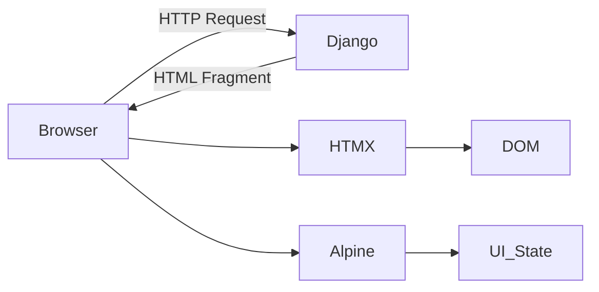
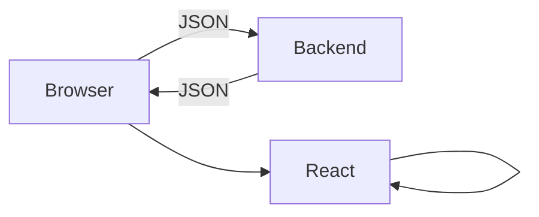
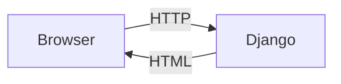

# 🧠 Monolith+ in 2026 — Real-Time Web Apps Without SPA Overhead

> **Stop fighting your tools.** Monolith+ delivers **SPA-level snappiness with server sanity**: HTML-first, zero build steps, minimal JS, and MySQL for persistence. No hydration hell, no massive bundles—just HTML, Python, and a little Alpine.js magic.

**[Get Started Free →](#signup)** | **[See Live Demo →](#demo)** | **[Read the Docs →](#docs)**

---

## 📉 The Complexity Tax of Modern SPAs

Decoupled stacks (React/Vue + REST/GraphQL) often force you to **build your app twice**: once in JS, once in the backend. This creates **redundancy, hydration bugs, and brittle APIs**. Monolith+ eliminates the middleman.

| Metric                     | SPA / API Stack                  | **Monolith+**                   |
| -------------------------- | -------------------------------- | ------------------------------- |
| **Logic Duplication**      | 40% (Types, Validation, Routing) | **0% (Single Source of Truth)** |
| **JS Bundle Size**         | 300–800 KB                       | **< 25 KB**                     |
| **TTI (Time to Interact)** | Slow (Wait for JS + API)         | **Instant (SSR + HTMX)**        |
| **Maintenance Cost**       | High (Dependency churn)          | **Low (Stable Web Standards)**  |

> Every extra kilobyte of JavaScript is a **future productivity mortgage**. Monolith+ treats HTML as the **engine of state**.

---

## 🛠️ Core Philosophy — The Power Trio

Monolith+ uses the **HAT Stack** (HTMX + Alpine + Tailwind) powered by a robust Django/MySQL core.

| Role          | Tool      | Responsibility                                              |
| ------------- | --------- | ----------------------------------------------------------- |
| **Brain**     | Django    | Handles Auth, Validation, Database, HTML Rendering          |
| **Pulse**     | HTMX      | Partial HTML requests, DOM swaps, WebSocket hooks           |
| **Sprinkles** | Alpine.js | Client-only UI behaviors like toggles, modals, drag handles |



**Principle:** *HTML is the truth. Read the template, understand the feature—no context switching between frameworks.*

---

## 🧭 Mental Model Shift

### Old Way: SPA Chaos



* Hydration bugs
* Redundant client/server logic
* Brittle API contracts

### Monolith+ Flow



* No hydration
* No API sync battles
* No client routing

**Result:** Simple, predictable request–response wins every time.

---

## 🏗️ Real-World Patterns

### 1️⃣ Inline "Swap-to-Edit"

React-style inline editing with **one Python view**, no abstractions:

```html
<span hx-get="" 
      hx-target="#task-{{ task.id }}" 
      hx-swap="outerHTML">{{ task.title }}</span>

<form hx-post="" 
      hx-target="#task-{{ task.id }}" 
      hx-swap="outerHTML">
  <input type="text" name="title" value="{{ task.title }}" autofocus>
  <button type="submit">Save</button>
  <button type="button" hx-get="" hx-target="#task-{{ task.id }}" hx-swap="outerHTML">Cancel</button>
</form>
```

---

### 2️⃣ Live Search — Zero Custom JS

```html
<input type="search" name="q" placeholder="Search tasks..."
       hx-get="" 
       hx-trigger="keyup changed delay:500ms"
       hx-target="#search-results" hx-indicator=".loader">
<span class="loader htmx-indicator">Searching...</span>
<div id="search-results"></div>
```

*Reactive UX without a line of JS.*

---

### 3️⃣ Multi-Step Wizard (Server-Side State)

**Controller (Django View)**

```python
def project_wizard(request, step=1):
    if request.method == "POST":
        # Save partial data to session/DB
        step += 1
    return render(request, f"wizard/partials/step_{step}.html", {"step": step})
```

**Modal Skeleton (Alpine + HTMX)**

```html
<div x-data="{ open: false }" @open-wizard.window="open = true" x-show="open" class="modal-overlay">
    <div class="modal-body" @click.away="open = false">
        <div id="wizard-content"></div>
    </div>
</div>
```

**Partial Form Steps**

```html
<form hx-post="" hx-target="#wizard-content">
  <input type="text" name="project_name" required>
  <button type="submit">Next</button>
</form>
```

**Benefits:**

* Server-side state, no Redux/XState
* DB-backed validation at each step
* Automatic back-button support via `hx-push-url`

---

### 4️⃣ Live Preview Pattern

Reactive side-by-side preview without client state:

```html
<input type="text" name="title"
       hx-post="" 
       hx-trigger="keyup changed delay:300ms"
       hx-target="#wizard-preview-socket">
<div id="wizard-preview-socket"></div>
```

**Backend renders fragment:**

```python
def update_preview(request):
    context = {
        'title': request.POST.get('title', 'Untitled'),
        'category': request.POST.get('category', 'internal'),
        'last_updated': now()
    }
    return render(request, 'wizard/partials/preview_card.html', context)
```

---

### 5️⃣ Live Validation Pattern

```html
<div id="title-wrapper">
  <input type="text" name="title"
         hx-post="" 
         hx-trigger="blur" 
         hx-target="#title-wrapper" 
         hx-swap="outerHTML">
</div>
```

```python
def validate_title(request):
    title = request.POST.get('title', '').strip()
    error = None
    success = False
    if len(title) < 3:
        error = "Title too short"
    elif Project.objects.filter(title__iexact=title).exists():
        error = "Title exists"
    else:
        success = True
    return render(request, 'partials/title_field.html', {'title': title, 'error': error, 'success': success})
```

*Validation happens live, always against the real database.*

---

## ⚡ Production-Ready Stack (2026)

| Layer           | Tool                    | Why It Matters                            |
| --------------- | ----------------------- | ----------------------------------------- |
| Routing & Logic | Django                  | Secure, tested, batteries included        |
| Partial Loading | HTMX                    | SPA-like experience with zero complexity  |
| Client UI       | Alpine.js               | Local interactivity for lightweight state |
| Database        | MySQL                   | Reliable, widely supported                |
| Real-time       | Django Channels + Redis | Live updates without JS frameworks        |

**Dockerized Workflow**

```yaml
services:
  db: mysql:8.4
  redis: redis:7-alpine
  web: 
    build: .
    ports: ["8000:8000"]
    depends_on: [db, redis]
```

*Hot-reload in dev, Nginx + Gunicorn in production.*

---

## 🔑 Key Takeaways

* **HTML is the engine of state** — server is the brain.
* **SPA-level UX without SPA complexity** — minimal JS, no hydration, zero duplicate logic.
* **Live previews & inline validation** — instantaneous feedback using server-rendered fragments.
* **Scalable & maintainable** — database-first validation, clean architecture, small bundles.

> With Monolith+, your app is **fast, reliable, and a delight to maintain**. No 200MB node_modules, no complex frontend frameworks—just modern web apps done **right in 2026**.

---

