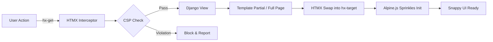
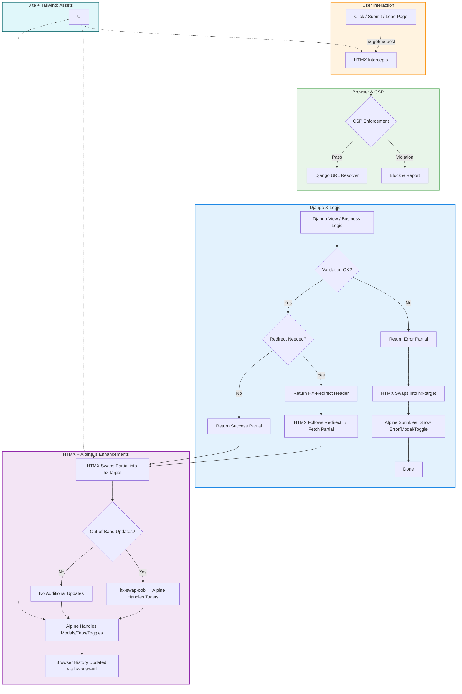

# 🧠 Monolith+ in 2026: Django, Vite, HTMX, Alpine

> **Philosophy:** HTML is the engine of state. Django is the brain. The browser is the runtime.

Monolith+ embraces **Hypermedia Systems**—every user action is a hypermedia interaction. Instead of SPAs and duplicated client logic, you **navigate the server via HTML** while the browser manages ephemeral state locally.

> **Locality of Behavior (LoB):** You can understand a component's behavior purely by inspecting its HTML.

---

## 🏗️ Architectural Mental Model

| Layer         | Technology | Responsibility (2026)                                                            |
| ------------- | ---------- | -------------------------------------------------------------------------------- |
| **Backend**   | Django 6.x | Single Source of Truth: Auth, ORM, Routing, and **HTML Generation**              |
| **Build**     | Vite       | Lightning-fast Asset Pipeline: HMR, Tailwind JIT, module bundling                |
| **Transport** | HTMX 2.x   | Hypermedia Assistant: Declarative AJAX, partial DOM swaps, URL & history updates |
| **Client**    | Alpine.js  | Ephemeral UI: Local state for modals, tabs, toggles; no server state             |

---

## 🔁 Request & Asset Lifecycle

1. **User triggers an action** → click, form submit, or page load.
2. **HTMX intercepts** → makes a declarative AJAX request.
3. **CSP & Security checks** → browser enforces rules before hitting Django.
4. **Django serves partial HTML** → success, error, or redirect.
5. **HTMX swaps partials** → `hx-target` or `hx-swap-oob` for notifications.
6. **Alpine sprinkles** → ephemeral state is applied.
7. **Browser history** → updated automatically if `hx-push-url` is used.



---

## ⚙️ Implementation Guide

### 1. Django ↔ Vite Bridge

**`django-vite`** manages the connection between Django and Vite.

```python
# settings.py
INSTALLED_APPS += ["django_vite"]

DJANGO_VITE = {
    "default": {
        "dev_mode": DEBUG,
        "manifest_path": BASE_DIR / "frontend/dist/.vite/manifest.json",
        "dev_server_port": 5173,
    }
}
```

* Dev mode → injects HMR client for live reload.
* Prod mode → injects hashed assets from `manifest.json`.

---

### 2. High-Performance Base Template

```html

<!DOCTYPE html>
<html lang="en">
<head>
    <meta charset="UTF-8">
    
    
</head>
<body hx-headers='{"X-CSRFToken": "{{ csrf_token }}"}'>

    <button hx-get="" hx-target="#content" hx-push-url="true">
        Load Books
    </button>

    <div x-data="{ open: false }">
        <button @click="open = !open">Menu</button>
        <nav x-show="open" @click.away="open = false">...</nav>
    </div>

    <div id="content"></div>

</body>
</html>
```

**Key Benefits**

* CSRF handled globally via HTMX headers.
* No inline scripts → CSP-compliant.
* HTMX works anywhere; Alpine handles ephemeral UI.

---

### 3. Native Partials (Django 6.0)

```html
{# books.html #}

<ul id="book-list">
    
        <li>{{ book.title }}</li>
    
</ul>

```

```python
# views.py
def book_list(request):
    books = Book.objects.all()
    template = "books.html#book_list" if request.htmx else "books.html"
    return render(request, template, {"books": books})
```

* Single view + single template → multiple render depths.
* HTMX reveals the server logic without duplicating state.

---

### 4. HTMX Navigation Patterns

**History Management**

```html
<button hx-get="/books/" hx-target="#content" hx-push-url="true">Load Books</button>
```

* Updates URL → back/forward works naturally.

**Redirects**

```python
response = HttpResponse()
response['HX-Redirect'] = '/books/'
return response
```

* Server-driven navigation → no client JS.

**Error Handling**

```python
if not title:
    return HttpResponseBadRequest('<p>Title required!</p>')
```

* HTMX swaps error partial into `hx-target`.

**Out-of-Band Notifications**

```html
<div id="toast-container"></div>
<div hx-get="/books/add/" hx-target="#content" hx-swap-oob="afterbegin:#toast-container">
    Add Book
</div>
```

* Notifications survive partial swaps or redirects.

---

### 5. Security: 2026 CSP Standard

**Development**

```python
CSP_DEFAULT_SRC = ("'self'",)
CSP_SCRIPT_SRC = ("'self'", "http://localhost:5173")
CSP_STYLE_SRC = ("'self'", "'unsafe-inline'", "http://localhost:5173")
CSP_CONNECT_SRC = ("'self'", "ws://localhost:5173")
```

**Production**

```python
CSP_DEFAULT_SRC = ("'self'",)
CSP_SCRIPT_SRC = ("'self'",)
CSP_STYLE_SRC = ("'self'", "'unsafe-inline'")
CSP_CONNECT_SRC = ("'self'",)
```

* Avoid `hx-on` → uses `eval()`.
* Prefer Alpine `@click` or native events.

---

### 6. Why Monolith+ Wins

* **Zero Hydration Lag:** Server-rendered HTML → instant content.
* **Unified Auth:** Django sessions; no JWT or CORS headaches.
* **Lower Cognitive Load:** HTML-first → LoB is obvious.
* **Single Execution Path:** HTMX swaps, redirects, errors, notifications, history.
* **Operational Simplicity:** One app, one deploy, predictable lifecycle.

---

### 7. Production-Ready Lifecycle Diagram



---

