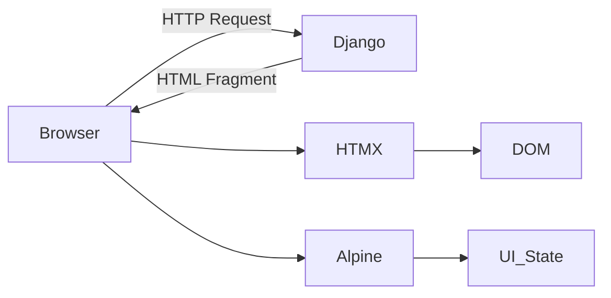
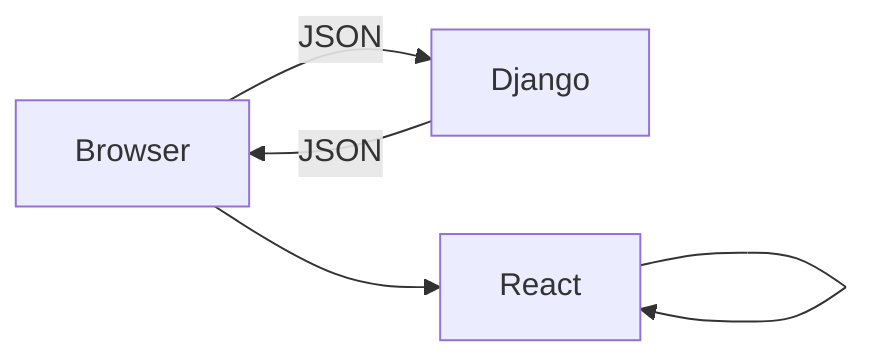
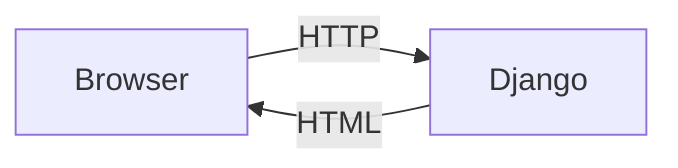
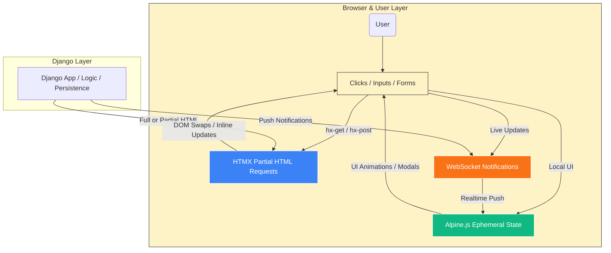

# 🧠 Monolith+ in 2026

**Ship web apps without SPA madness**

> **Who this is for**
>
> * Django developers tired of React overkill
> * React developers burned out by hooks/state juggling
> * Product teams whose “simple app” turned into a distributed tangle

Monolith+ is about **shipping fast**, **staying sane**, and **scaling sustainably**. We treat **HTML as the state container** and sprinkle minimal JS where it actually adds value.

---

## 📉 The Complexity Tax

| Metric             | SPA / API Stack | Monolith+                     |
| ------------------ | --------------- | ----------------------------- |
| Logic Duplication  | 30–40%          | **0%**                        |
| Initial JS Payload | 300–500 KB      | **< 20 KB**                   |
| Feature Velocity   | 1.5–2× slower   | **Linear & intuitive**        |
| System Fragility   | High            | **Low — standard HTTP + DOM** |

> Every extra KB of JS is a maintenance debt. Monolith+ keeps HTML as the source of truth.

---

## 🛠️ Core Philosophy

**HTML = app state + minimal JS**

| Role      | Tool      | Responsibility                                    |
| --------- | --------- | ------------------------------------------------- |
| Brain     | Django    | Business logic, validation, persistence, HTML     |
| Transport | HTMX      | Partial HTML requests & DOM swaps                 |
| Sprinkles | Alpine.js | Client-only ephemeral UI (modals, toggles, drags) |



**Principle:** *Locality of behavior — reading the HTML explains the feature.*

---

## 🧭 Mental Model Shift

### SPA / Distributed Chaos



Problems: hydration bugs, redundant logic, brittle API contracts.

### Monolith+ Flow



No hydration, no API sync battles, no client routing. Simple request–response wins.

---

## 🏗️ Example: Task Manager

**Project Layout**

```text
monolith-plus/
├── manage.py
├── tasks/
│   ├── models.py
│   ├── views.py
│   ├── urls.py
│   └── templates/tasks/
│       ├── list.html
│       └── partials/
│           ├── task_row.html
│           ├── task_form.html
│           └── task_edit_form.html
└── templates/base.html
```

No `/api/`, no `/frontend/`, no build step.

---

### One View, Two Outputs

```python
def task_list(request):
    tasks = Task.objects.all()
    if request.headers.get('HX-Request'):
        return render(request, 'tasks/partials/task_list_inner.html', {'tasks': tasks})
    return render(request, 'tasks/list.html', {'tasks': tasks})
```

*One view, dual rendering — no microservices pretending to talk.*

---

### Inline Edit / Swap-to-Edit

```html
<span hx-get="" 
      hx-target="#task-{{ task.id }}" 
      hx-swap="outerHTML">{{ task.title }}</span>
```

```html
<form hx-post="" 
      hx-target="#task-{{ task.id }}" 
      hx-swap="outerHTML">
  <input type="text" name="title" value="{{ task.title }}" autofocus>
  <button type="submit">Save</button>
  <button type="button" hx-get="" 
          hx-target="#task-{{ task.id }}" hx-swap="outerHTML">Cancel</button>
</form>
```

Think React inline-edit UX — implemented with **one line of Python**, not five layers of abstraction.

---

### Drag & Drop Reordering

```html
<div id="task-container" hx-post="" hx-trigger="end" hx-target="this">

  <div class="task-item">
    <input type="hidden" name="task_order" value="{{ task.id }}">
    <span class="handle">☰</span>{{ task.title }}
  </div>

</div>
```

```javascript
new Sortable(document.getElementById('task-container'), {
  handle: '.handle',
  animation: 150,
  onEnd: () => document.getElementById('task-container')
                       .dispatchEvent(new Event('end'))
})
```

Smooth reordering + persistence — no JS state libraries needed.

---

## 🔎 Real-Time Search

**Backend**

```python
def task_search(request):
    query = request.GET.get('q', '')
    tasks = Task.objects.filter(title__icontains=query) if query else Task.objects.all()
    template = 'tasks/partials/task_results.html' if request.headers.get('HX-Request') else 'tasks/search_page.html'
    return render(request, template, {'tasks': tasks})
```

**Frontend**

```html
<input 
  type="search"
  name="q"
  placeholder="Search tasks..."
  hx-get=""
  hx-trigger="keyup changed delay:500ms, search"
  hx-target="#search-results"
  hx-indicator=".loader">
<span class="loader htmx-indicator">Searching...</span>
<div id="search-results"></div>
```

Reactive UX without writing a line of JS beyond HTMX attributes.

---

## 💌 Live Validation Pattern

```html
<div id="title-field-wrapper">
  <label>Task Title</label>
  <input 
    type="text" name="title" value="{{ title|default:'' }}"
    hx-post="" hx-trigger="blur"
    hx-target="#title-field-wrapper" hx-swap="outerHTML"
    class="border-red-500">

  
    <p class="text-red-500">{{ error }}</p>
  
    <p class="text-green-500">Title is available!</p>
  
</div>
```

HTML updates itself via server validation — no API, no JSON juggling.

---

## ⚡ SPA Feel, Zero SPA Code

```html
<body hx-boost="true">
  <nav>
    <a href="/">Dashboard</a>
    <a href="/tasks/">Tasks</a>
  </nav>
  <main id="main-content"></main>
</body>
```

Navigation is instant, progressive, and cache-friendly — all through HTML.

---

## 🌐 Real-Time Notifications

**Frontend**

```html
<div hx-ext="ws" ws-connect="/ws/notifications/">
  <div id="notification-toast"></div>
</div>
```

**Server**

```python
def notify_new_task(task):
    html = render_to_string("partials/notification.html", {"task": task})
    async_to_sync(get_channel_layer().group_send)(
        "notifications",
        {"type": "send_notification", "html": html}
    )
```

**Alpine.js**

```html
<div id="notification-toast" x-data="{ show: true }" 
     x-show="show" x-init="setTimeout(() => show=false, 5000)">
  <p>New Task: {{ task.title }}</p>
  <button @click="show=false">×</button>
</div>
```

WebSockets + HTML = live UX without brittle front-end frameworks.

---

## 🏁 Monolith+ Stack in 2026

| Layer           | Tool       | Why it Matters                          |
| --------------- | ---------- | --------------------------------------- |
| Routing & Logic | Django     | Secure, proven, batteries included      |
| Partial Loading | HTMX Boost | SPA-like experience, minimal complexity |
| Interactivity   | HTMX       | Works with HTML, not against it         |
| Local UI State  | Alpine.js  | Small, expressive client behavior       |

---

## 🧩 Big Picture Architecture



> Monolith+ makes the **complex simple**: HTML as the truth, minimal JS for delight, server as the brain.


