# 🧠 Monolith+ in 2026 — The Complete Beginner’s Primer

> **Goal:** Build modern, reactive web apps using **Django, HTMX, Alpine.js, and Tailwind CSS**.
> **Approach:** Learn architecture first, then implement a live To-Do app backed by **MySQL** and containerized with **Docker**.
> **Key Philosophy:** Minimal JS, server-driven logic, SPA-level UX without SPA headaches.

---

## 1️⃣ Understanding the Stack: Traditional SPA vs Monolith+

### **Traditional SPA (React / Vue / Angular)**


**Pain Points:**

* Duplicate logic between server and client (validation, routing)
* Hydration bugs and slow initial load
* Heavy JS bundles → slower UX

---

### **Monolith+ Approach**


**Advantages:**

* Server renders HTML → instant display
* HTMX swaps only parts of the DOM → lightweight updates
* Alpine handles toggles, modals, small interactive UI
* No hydration or API sync headaches

**Color Legend:**

| Layer           | Tool           | Purpose                               |
| --------------- | -------------- | ------------------------------------- |
| Browser         | HTML/CSS       | Display and user events               |
| Server          | Django         | Routing, validation, DB operations    |
| Partial Loading | HTMX           | SPA-like interactions with minimal JS |
| Client UI       | Alpine.js      | Simple interactivity (modals, hints)  |
| Database        | MySQL          | Persistent storage                    |
| Real-Time       | Redis/Channels | Notifications, dashboards             |

---

## 2️⃣ Key Reactive Patterns with HTMX & Alpine.js

### **Inline Swap-to-Edit**


**HTML Example:**

```html
<span hx-get="" 
      hx-target="#task-{{ task.id }}" 
      hx-swap="outerHTML">{{ task.title }}</span>

<form hx-post="" 
      hx-target="#task-{{ task.id }}" 
      hx-swap="outerHTML">
  <input type="text" name="title" value="{{ task.title }}" autofocus>
  <button type="submit">Save</button>
  <button type="button" hx-get="" hx-target="#task-{{ task.id }}" hx-swap="outerHTML">Cancel</button>
</form>
```

---

### **Live Search**


**HTML Example:**

```html
<input type="search" name="q" placeholder="Search tasks..."
       hx-get="" 
       hx-trigger="keyup changed delay:300ms"
       hx-target="#task-container" hx-indicator=".loader">
<span class="loader htmx-indicator">Searching...</span>
<div id="task-container"></div>
```

---

### **Multi-Step Wizard / Live Preview / Validation**

* Each step saved to DB → allows back-navigation
* Live preview shows exactly what will be saved
* Server-side validation ensures correctness


---

## 3️⃣ Hands-On: Build a Reactive To-Do App

### **Step 1: Project Setup & MySQL**

```bash
python -m venv venv
source venv/bin/activate  # Windows: venv\Scripts\activate
pip install django mysqlclient
```

**Configure MySQL** (`settings.py`):

```python
DATABASES = {
    'default': {
        'ENGINE': 'django.db.backends.mysql',
        'NAME': 'todo_db',
        'USER': 'your_mysql_user',
        'PASSWORD': 'your_password',
        'HOST': 'localhost',
        'PORT': '3306',
    }
}
```

---

### **Step 2: Define Task Model**

```python
from django.db import models

class Task(models.Model):
    title = models.CharField(max_length=255)
    is_completed = models.BooleanField(default=False)
    created_at = models.DateTimeField(auto_now_add=True)

    def __str__(self):
        return self.title
```

Run migrations:

```bash
python manage.py makemigrations
python manage.py migrate
```

---

### **Step 3: Base Template with HTMX, Alpine, Tailwind**

```html
<!DOCTYPE html>
<html lang="en">
<head>
    <script src="https://cdn.tailwindcss.com"></script>
    <script src="https://unpkg.com/htmx.org@1.9.10"></script>
    <script defer src="https://unpkg.com/alpinejs@3.x.x/dist/cdn.min.js"></script>
</head>
<body class="bg-gray-100 p-10">
    <div class="max-w-md mx-auto bg-white p-6 rounded-lg shadow-lg">
        <h1 class="text-2xl font-bold mb-4">My To-Dos</h1>
        
    </div>
</body>
</html>
```

---

### **Step 4: HTMX Add Task**

`views.py`:

```python
from django.shortcuts import render
from .models import Task

def task_list(request):
    tasks = Task.objects.all().order_by('-created_at')
    return render(request, 'tasks/task_list.html', {'tasks': tasks})

def add_task(request):
    title = request.POST.get('title')
    task = Task.objects.create(title=title)
    return render(request, 'tasks/partials/task_item.html', {'task': task})
```

`task_list.html`:

```html
<form hx-post="" hx-target="#task-container" hx-swap="afterbegin">
    
    <input type="text" name="title" placeholder="What needs doing?">
    <button type="submit">Add</button>
</form>

<div id="task-container">
    
        
    
</div>
```

---

### **Step 5: Delete & Toggle Completion with HTMX**

```python
from django.http import HttpResponse
from django.views.decorators.http import require_http_methods

@require_http_methods(["DELETE"])
def delete_task(request, pk):
    Task.objects.filter(pk=pk).delete()
    return HttpResponse("")
    
def toggle_task(request, pk):
    task = Task.objects.get(pk=pk)
    task.is_completed = not task.is_completed
    task.save()
    return render(request, 'tasks/partials/task_item.html', {'task': task})
```

Partial template `task_item.html`:

```html
<div id="task-{{ task.id }}">
    <input type="checkbox" checked
           hx-post="" hx-target="#task-{{ task.id }}" hx-swap="outerHTML">
    <span class="line-through text-gray-400">{{ task.title }}</span>
    <button hx-delete="" hx-target="#task-{{ task.id }}" hx-swap="outerHTML" hx-confirm="Are you sure?">&times;</button>
</div>
```

---

### **Step 6: Real-Time Search**

```html
<input type="text" placeholder="Search..." 
       hx-get=""
       hx-trigger="keyup changed delay:300ms"
       hx-target="#task-container" hx-swap="outerHTML">
```

`views.py` filter:

```python
search_text = request.GET.get('search', '')
tasks = Task.objects.all()
if search_text:
    tasks = tasks.filter(title__icontains=search_text)
```

---

### **Step 7: Dockerizing**

`Dockerfile`:

```dockerfile
FROM python:3.11-slim
RUN apt-get update && apt-get install -y gcc default-libmysqlclient-dev pkg-config curl && rm -rf /var/lib/apt/lists/*
WORKDIR /app
COPY requirements.txt .
RUN pip install --no-cache-dir -r requirements.txt
COPY . .
CMD ["python", "manage.py", "runserver", "0.0.0.0:8000"]
```

`docker-compose.yml`:

```yaml
services:
  db:
    image: mysql:8.0
    environment:
      MYSQL_DATABASE: todo_db
      MYSQL_ROOT_PASSWORD: rootpassword
    ports: ["3306:3306"]
  web:
    build: .
    volumes: [".:/app"]
    ports: ["8000:8000"]
    environment:
      - DB_HOST=db
      - DB_NAME=todo_db
      - DB_USER=root
      - DB_PASS=rootpassword
    depends_on:
      db:
        condition: service_healthy
```

---

### **Step 8: Production Ready**

* Use **Gunicorn** instead of `runserver`
* Add `.env` variables for `SECRET_KEY`, DB credentials
* Deploy with **Docker Compose** on a VPS
* Optionally, put **Nginx** in front for HTTPS

---

## 4️⃣ Full Production Flow (Monolith+ Visual)

```mermaid
flowchart TD
    %% Class Definitions
    classDef browser fill:#D0E8FF,stroke:#007ACC,stroke-width:2px,color:#000;
    classDef server fill:#FFF4C2,stroke:#FFC107,stroke-width:2px,color:#000;
    classDef db fill:#E0FFE0,stroke:#28A745,stroke-width:2px,color:#000;
    classDef htmx fill:#FFD6D6,stroke:#FF4C4C,stroke-width:2px,color:#000;
    classDef alpine fill:#F0E0FF,stroke:#8A2BE2,stroke-width:2px,color:#000;
    classDef redis fill:#FFE5B4,stroke:#FF8C00,stroke-width:2px,color:#000;
    classDef dockerNode fill:#D9F0FF,stroke:#00A3E0,stroke-width:2px,color:#000;

    %% Browser Layer
    Browser[1️⃣ Browser / UI]:::browser -->|2️⃣ Click / Submit| HTMX[2️⃣ HTMX Intercepts]:::htmx
    HTMX -->|3️⃣ AJAX POST/GET/DELETE| Django[3️⃣ Django Views & Logic]:::server
    Django -->|4️⃣ Read/Write| MySQL[4️⃣ MySQL]:::db
    Django -->|5️⃣ Optional Push| Redis[5️⃣ Redis / Channels]:::redis
    Django -->|6️⃣ Return HTML Fragment| HTMX
    HTMX -->|7️⃣ DOM Swap / Update| Browser
    Browser -->|8️⃣ Local Interactivity| Alpine[Alpine.js UI Sprinkles]:::alpine

    %% Docker Containers Subgraph
    subgraph Docker["Docker Containers"]
        DjangoDocker[Django]:::dockerNode
        MySQLDocker[MySQL]:::dockerNode
        RedisDocker[Redis]:::dockerNode
    end

    %% Optional links to show Docker contains these services
    Django --> DjangoDocker
    MySQL --> MySQLDocker
    Redis --> RedisDocker

```



---

### ✅ Key Takeaways

1. Browser triggers event → HTMX intercepts → sends request to Django
2. Django reads/writes from MySQL → returns HTML fragment
3. HTMX swaps fragment → DOM updates
4. Alpine.js adds local UI polish
5. Redis + Channels optionally push real-time updates
6. Fully reactive CRUD + live search + inline edits without SPA overhead
7. Docker ensures environment consistency for dev & production
8. Production ready: Gunicorn + Nginx + VPS deployment

