# 🧠 Monolith+ in 2026: Django, Vite, HTMX, Alpine

> **Philosophy:** *HTML is the engine of state. Django is the brain. The browser is the runtime.*

The web in 2026 is rediscovering its roots. For years, developers built **Single Page Applications (SPAs)** that constantly rehydrated the DOM, managed complex client-side state, and duplicated logic. Powerful—but often **hard to reason about**, slow, and heavy on JavaScript.

**Monolith+** flips this approach:

> *The server drives your UI; the browser handles ephemeral, local behavior.*

This is **Hypermedia-First Design**. Instead of sending JSON and rebuilding the DOM with JS, the **server returns HTML fragments** representing the app state. Every click, form, or navigation is a **hypermedia interaction**, not a random API call.

---

## Why Hypermedia-First Matters

* ✅ **Instant feedback:** HTML renders immediately; no client-side hydration needed
* ✅ **Fewer moving parts:** Less JS, fewer state bugs
* ✅ **Easier reasoning:** One source of truth—the server

> 💡 **Mental Model — Locality of Behavior (LoB)**
> You should understand any component **just by reading the HTML**. Minimal hidden JS, no complex client-side state machines.

---

## 🏗 Monolith+ Architecture

| Layer         | Tech       | Responsibility                                               |
| ------------- | ---------- | ------------------------------------------------------------ |
| **Backend**   | Django 6.x | Auth, ORM, routing, **HTML generation**                      |
| **Build**     | Vite       | Fast asset compilation: HMR, Tailwind JIT, JS/CSS bundling   |
| **Transport** | HTMX 2.x   | Declarative AJAX, partial DOM swaps, browser history updates |
| **Client**    | Alpine.js  | Local ephemeral UI: modals, tabs, dropdowns, toggles         |

> ⚙️ **Mental Model:** HTML is the contract → Django computes → HTMX delivers → Alpine decorates.

---

## 🔁 Request & Asset Lifecycle

Every action follows **seven phases**:

1. **User Action** → click, form submission, or page load
2. **HTMX Intercepts** → declarative AJAX request
3. **CSP Check** → browser ensures security
4. **Django Processes** → view executes, queries DB, generates HTML
5. **HTMX Swaps** → HTML injected into `hx-target`
6. **Alpine Enhances** → ephemeral UI behavior (modals, toasts)
7. **History Sync** → browser URL updated (`hx-push-url`)


> HTMX = **“HTML courier”**, Alpine = **“ephemeral decorator”**.

---

## ⚙️ Step-by-Step: Book List Example

### 1️⃣ Django ↔ Vite Bridge

```python
# settings.py
INSTALLED_APPS += ["django_vite"]

DJANGO_VITE = {
    "default": {
        "dev_mode": DEBUG,
        "manifest_path": BASE_DIR / "frontend/dist/.vite/manifest.json",
        "dev_server_port": 5173,
    }
}
```

* **Dev mode:** Hot Module Reload
* **Prod mode:** Django serves hashed assets from `manifest.json`

> Keep CSS & JS in Vite; Django will serve the correct version.

---

### 2️⃣ Secure Base Template

```html

<!DOCTYPE html>
<html lang="en">
<head>
  <meta charset="UTF-8">
  
  
</head>
<body hx-headers='{"X-CSRFToken": "{{ csrf_token }}"}'>

  <button hx-get="" hx-target="#content" hx-push-url="true">Load Books</button>

  <div x-data="{ open: false }">
    <button @click="open = !open">Menu</button>
    <nav x-show="open" @click.away="open = false">...</nav>
  </div>

  <div id="content"></div>
</body>
</html>
```

> Avoid inline JS; let Vite bundle scripts for CSP compliance.

---

### 3️⃣ Django Native Partials

```html

<ul id="book-list">
  
    <li>{{ book.title }}</li>
  
</ul>

```

```python
# views.py
def book_list(request):
    books = Book.objects.all()
    template = "books.html#book_list" if request.htmx else "books.html"
    return render(request, template, {"books": books})
```

> One template, one view, multiple modes. No JSON juggling.

---

### 4️⃣ HTMX Patterns

| Pattern             | Example                                                                                | Notes                            |
| ------------------- | -------------------------------------------------------------------------------------- | -------------------------------- |
| Load Content        | `<button hx-get="/books/" hx-target="#content" hx-push-url="true">Load Books</button>` | Declarative navigation           |
| Form Submit         | `<form hx-post="/add/" hx-target="#list" hx-swap="beforeend">...</form>`               | Partial DOM update               |
| Out-of-Band Updates | `<div hx-get="/notify/" hx-swap-oob="afterbegin:#toast">Notify</div>`                  | Notifications across transitions |
| Server Redirect     | `response["HX-Redirect"] = "/books/"`                                                  | Redirects without JS             |
| Error Handling      | `return HttpResponseBadRequest("<p>Title required!</p>")`                              | Sends partial error HTML         |

---

### 5️⃣ Alpine.js Essentials

| Behavior             | Example                                                                                                  | Notes                                  |
| -------------------- | -------------------------------------------------------------------------------------------------------- | -------------------------------------- |
| Toggle               | `<div x-data="{open:false}"><button @click="open=!open">Menu</button><nav x-show="open">...</nav></div>` | Declarative toggle UI                  |
| Toast / Notification | `<div x-data="{toast:''}" x-text="toast"></div>`                                                         | Update via Alpine store or HTMX events |
| Click Away           | `@click.away="open=false"`                                                                               | Auto-close dropdowns/modals            |

---

### 6️⃣ Docker + MySQL Quick Reference

* **Services:** `db` (MySQL 8), `web` (Django+Gunicorn), `frontend` (Vite dev)
* **Ports:** `3306` MySQL, `8000` Django, `5173` Vite
* **Env Variables:**

```text
DATABASE_HOST=db
DATABASE_NAME=monolith
DATABASE_USER=monolith
DATABASE_PASSWORD=secretpassword
DATABASE_PORT=3306
```

* **Commands:**

```bash
docker-compose up -d
docker-compose logs -f web
```

> Start small: HTML + HTMX first, then Alpine, Vite, and Docker.

---

## 7️⃣ Mental Models & Pro-Tips

* **LoB:** Behavior visible in HTML → easy debugging
* **HTMX Courier:** Fetch & swap HTML without SPA complexity
* **Alpine Decorator:** Adds ephemeral UI behaviors
* **Docker Containers:** Reproducible isolation
* **Vite:** Handles HMR & asset bundling seamlessly

---

## 8️⃣ Monolith+ TL;DR Visual

```mermaid
flowchart TD
    A[👤 User] -->|Click / Submit| B[📨 HTMX]
    B --> C[🧠 Django + Logic]
    C --> D[💾 MySQL]
    D --> E[Partial HTML Response]
    E --> F[🎨 Alpine Sprinkles Behavior]
    F --> G[🌐 Browser Updates]
    H[⚡ Vite HMR / Assets] -.-> F
    I[🐳 Docker Isolation] -.-> B
```



> One glance: **user click → backend → DB → frontend → browser**.

---

## ✅ Takeaways for Beginners

* Build **server-driven, HTML-first apps**
* Use **HTMX** for partial updates
* Sprinkle **Alpine** for ephemeral UI behavior
* Containerize with **Docker**
* Avoid SPA complexity while keeping interactivity

> TL;DR: Start with **a small feature**, understand the Monolith+ flow, then scale to full apps with Redis, Celery, or Nginx.

