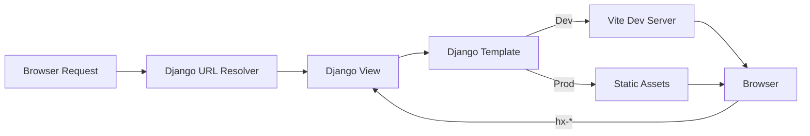
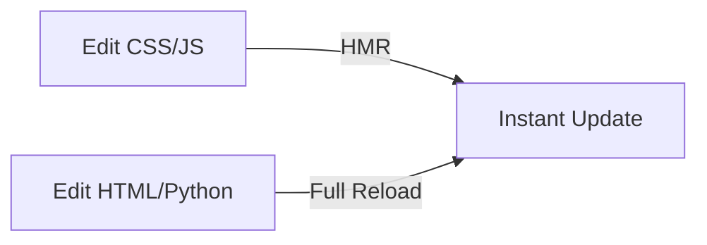

# 🚀 Supercharge Django with Vite, Tailwind & HTMX

### A Production-Grade Frontend Architecture (2026 Edition)

> **TL;DR** — We are going to build a **Monolith+**: the operational reliability of Django, the development speed of Vite, the design system power of Tailwind, and the server‑driven interactivity of HTMX. No SPA tax. No client-side state explosion.

---

## 🧠 The Mental Model (Read This First)

By 2026, the "SPA vs Monolith" debate is effectively over. Mature teams now optimize for **Locality of Behavior**, **Progressive Enhancement**, and **Operational Simplicity**.

Think of your application like a building:

* **Django owns the structure** — URLs, views, permissions, transactions, templates. The load-bearing walls.
* **Vite owns the tooling speed** — instant dev server, HMR, optimized production bundles.
* **HTMX owns interaction** — user-triggered HTTP requests that swap HTML, not JSON.
* **Tailwind owns the design system** — constraints, consistency, and fast iteration.

This stack keeps **HTML as the unit of composition**.

---

## 🏗 High-Level Request & Asset Flow



What matters:

* Django always renders the **initial HTML**
* Vite is *never* your application runtime — only a build & dev tool
* HTMX re-enters Django using normal HTTP

---

## ⚡ Step 1: Initialize the Frontend Workspace

Inside your Django project root (next to `manage.py`):

```bash
npm create vite@latest frontend -- --template vanilla
cd frontend
npm install
```

Install the core dependencies:

```bash
npm install htmx.org tailwindcss postcss autoprefixer
npx tailwindcss init -p
```

This creates a **clean boundary**: Django owns behavior, Vite owns assets.

---

## 🎨 Step 2: Configure Tailwind for Django Templates

Tailwind must scan Django templates so unused styles can be removed in production.

```js
// frontend/tailwind.config.js
export default {
  content: [
    '../templates/**/*.html',
    '../**/templates/**/*.html',
    './src/**/*.{js,ts}',
  ],
  theme: { extend: {} },
  plugins: [],
}
```

```css
/* frontend/src/style.css */
@tailwind base;
@tailwind components;
@tailwind utilities;
```

---

## ⚙️ Step 3: The Django ↔ Vite Bridge (Critical)

Django does not know about port `5173` or hashed filenames. We solve this once using a **custom template tag**.

### Design Rules

* Dev → load from Vite dev server
* Prod → resolve from `manifest.json`

```python
# templatetags/vite.py
import json, os
from django import template
from django.conf import settings

register = template.Library()

@register.simple_tag
def vite_asset(entry):
    if settings.DEBUG:
        return f'<script type="module" src="http://localhost:5173/{entry}"></script>'

    manifest_path = os.path.join(settings.BASE_DIR, 'frontend/dist/.vite/manifest.json')
    with open(manifest_path) as f:
        manifest = json.load(f)

    file_path = manifest[entry]['file']
    return f'<script type="module" src="{settings.STATIC_URL}{file_path}"></script>'
```

This single abstraction removes environment branching everywhere else.

---

## 🔌 Step 4: The Base Template (The Only One That Matters)

```html

<!DOCTYPE html>
<html lang="en">
<head>
  <meta charset="UTF-8" />
  <title>Django + Vite + HTMX</title>
  
</head>
<body class="bg-gray-100 p-10">
  <h1 class="text-4xl font-bold text-blue-600">Hello Django + Vite</h1>

  <button
    hx-get="/api/hello/"
    hx-target="#response"
    class="mt-4 bg-black text-white px-4 py-2 rounded"
  >
    Click Me (HTMX)
  </button>

  <div id="response" class="mt-4 italic"></div>
</body>
</html>
```

---

## 🧠 Step 5: HTMX Fragments (The Power Move)

You do **not** build JSON APIs unless a non-browser client needs them.

```python
# views.py
def hello_fragment(request):
    return HttpResponse('<p>HTMX swapped this instantly.</p>')
```

HTMX turns Django into a **hypermedia engine** again.

---

## 🚢 Step 6: Production Build Pipeline

```bash
cd frontend && npm run build
python manage.py collectstatic
```

| Tool     | Responsibility                  |
| -------- | ------------------------------- |
| Vite     | Bundling, hashing, minification |
| Tailwind | CSS tree-shaking                |
| HTMX     | Runtime interactivity (~10kb)   |
| Django   | HTML, auth, data                |

---

## 🛠 Vite Configuration (Professional Default)

```js
// frontend/vite.config.js
import { defineConfig } from 'vite'
import path from 'path'

export default defineConfig({
  root: path.resolve(__dirname, 'src'),
  base: '/static/',

  build: {
    manifest: true,
    outDir: path.resolve(__dirname, 'dist'),
    emptyOutDir: true,
    rollupOptions: {
      input: path.resolve(__dirname, 'src/main.js'),
    },
  },

  server: {
    port: 5173,
    strictPort: true,
    origin: 'http://localhost:5173',
  },
})
```

---

## 📂 Resulting Build Output

```text
frontend/
├── dist/
│   ├── .vite/
│   │   └── manifest.json
│   └── assets/
│       ├── main.[hash].js
│       └── style.[hash].css
```

---

## 🖼 Asset Handling (Images Done Right)

### CSS / JS Images

```css
background-image: url('./assets/logo.svg');
```

```js
import logo from './assets/logo.svg'
```

### Django Template Images (Hashed)

```js
// main.js
import.meta.glob('./assets/*.{png,svg,jpg,jpeg}', { eager: true })
```

```python
@register.simple_tag
def vite_image(path):
    if settings.DEBUG:
        return f'http://localhost:5173/src/{path}'

    manifest_path = os.path.join(settings.BASE_DIR, 'frontend/dist/.vite/manifest.json')
    with open(manifest_path) as f:
        manifest = json.load(f)

    return f"{settings.STATIC_URL}{manifest[f'src/{path}']['file']}"
```

```html

```

---

## 🔄 Developer Experience: Full Reload Integration

```bash
npm install -D vite-plugin-full-reload
```

```js
import FullReload from 'vite-plugin-full-reload'

plugins: [
  FullReload([
    '../../templates/**/*.html',
    '../../**/templates/**/*.html',
    '../../**/*.py'
  ]),
]
```

---

## 🚦 The Golden Loop



---

## ✅ Why This Stack Wins in 2026

* Zero blank screens
* SEO by default
* Minimal JavaScript
* Server-driven correctness
* Easy to debug

---

**You now have a production-grade Django + Vite + Tailwind + HTMX architecture.**
