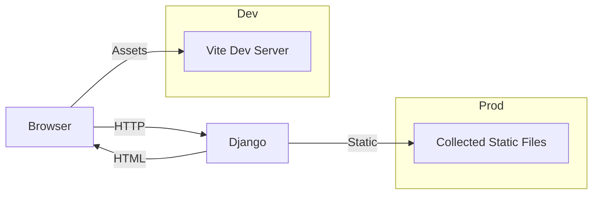
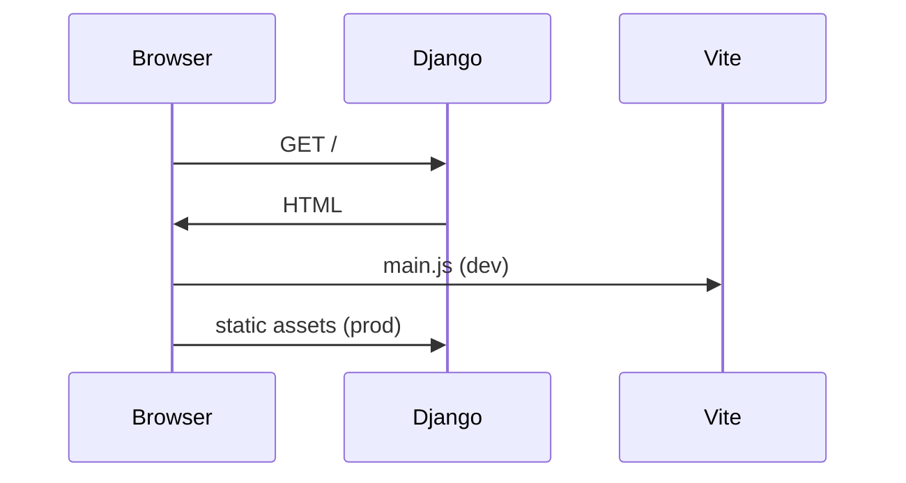
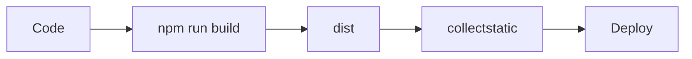

# 🚀 Supercharge Django with Vite, Tailwind & HTMX

### A Production-Grade Frontend Architecture (2026 Edition)

> **TL;DR**
> This guide shows how to combine **Django**, **Vite**, **Tailwind CSS**, and **HTMX** into a modern, fast, and maintainable frontend stack — without turning your Django app into a JavaScript framework zoo.

This is not a toy setup.
This is how **real Django apps ship in 2026**.

---

## 🧠 The Mental Model (Read This First)

Before touching code, internalize this:

> **Django owns HTML.
> Vite owns assets.
> HTMX owns interactivity.
> Tailwind owns styling.**

No JSON APIs.
No SPA hydration tax.
No client-side state explosion.

Just **fast pages**, progressively enhanced.

---

## 🏗 High-Level Architecture



**Key idea:**

* In **development**, the browser pulls JS/CSS from **Vite**
* In **production**, Django serves **built, hashed assets**

---

## 🧩 Why Vite (Not Webpack, Not “Magic Django Plugins”)

Vite is not just “faster Webpack”. It changes the game:

| Problem           | Old Way           | Vite Way          |
| ----------------- | ----------------- | ----------------- |
| Slow reloads      | Bundle everything | Native ES modules |
| Complex config    | Webpack hell      | Sensible defaults |
| Django mismatch   | Static hacks      | Clean separation  |
| Production builds | Painful           | One command       |

Vite treats Django exactly how it should be treated:

> **As a backend, not a JS runtime.**

---

## 📁 Canonical Project Structure

This structure scales from hobby apps → enterprise platforms.

```
myproject/
├─ manage.py
├─ myproject/
│  ├─ settings.py
│  ├─ urls.py
│  └─ wsgi.py
├─ app/
│  ├─ views.py
│  ├─ urls.py
│  └─ templates/
│     └─ app/index.html
├─ frontend/
│  ├─ main.js
│  ├─ style.css
│  ├─ vite.config.js
│  ├─ tailwind.config.js
│  └─ dist/
│     ├─ manifest.json
│     └─ assets/
└─ db.sqlite3
```

**Rule:**
👉 Django never touches raw JS/CSS
👉 Django only sees **built assets**

---

## ⚙️ Step 1 — Django Backend (Thin & Boring)

```bash
pip install django
django-admin startproject myproject
cd myproject
python manage.py startapp app
```

```python
# app/views.py
from django.shortcuts import render

def index(request):
    return render(request, "app/index.html")
```

Django’s job is simple:

* Routing
* Business logic
* HTML rendering

No frontend gymnastics.

---

## ⚡ Step 2 — Initialize Vite

```bash
npm create vite@latest frontend -- --template vanilla
cd frontend
npm install
npm run dev
```

You now have:

* Instant reloads
* Native ES modules
* Zero Django coupling

---

## 🎨 Step 3 — Tailwind CSS (Utility-First, Server-Friendly)

```bash
npm install -D tailwindcss postcss autoprefixer
npx tailwindcss init -p
```

```js
// tailwind.config.js
export default {
  content: [
    "./index.html",
    "../**/templates/**/*.html",
  ],
  theme: { extend: {} },
  plugins: [],
}
```

```css
/* style.css */
@tailwind base;
@tailwind components;
@tailwind utilities;
```

Tailwind works *beautifully* with server-rendered HTML because:

* No runtime JS
* No class generation at runtime
* Full compile-time optimization

---

## 🔌 Step 4 — Django ↔ Vite Integration

### Development vs Production (Critical Distinction)



---

### Django Template (Dev + Prod Safe)

```html

<!DOCTYPE html>
<html>
<head>
  <meta charset="utf-8">
  <title>Django + Vite</title>
  
</head>
<body class="bg-gray-50 h-screen flex items-center justify-center">
  <h1 class="text-3xl font-bold text-blue-600">
    It works.
  </h1>
</body>
</html>
```

You **never hardcode filenames**.
The manifest handles everything.

---

## 📦 Step 5 — Vite Production Configuration

```js
// frontend/vite.config.js
import { defineConfig } from 'vite'
import path from 'path'

export default defineConfig({
  build: {
    outDir: 'dist',
    manifest: true,
    rollupOptions: {
      input: 'main.js',
      output: {
        entryFileNames: 'assets/[name].js',
        assetFileNames: 'assets/[name].[ext]',
      },
    },
  },
})
```

This enables:

* Cache-busting
* CDN-friendly assets
* Deterministic builds

---

## 🧠 Step 6 — Auto-Load Assets via Manifest

### Why This Matters

Without this:

* You hardcode filenames
* Cache invalidation becomes painful
* Deploys break silently

With the manifest:

> Django always loads **the correct hashed asset**

---

### Template Tag

```python
# app/templatetags/vite_tags.py
import json, os
from django import template
from django.conf import settings

register = template.Library()

@register.simple_tag
def vite_asset(entry):
    path = settings.VITE_MANIFEST_PATH

    if not os.path.exists(path):
        return f'''
        <script type="module" src="http://localhost:5173/@vite/client"></script>
        <script type="module" src="http://localhost:5173/{entry}"></script>
        '''

    manifest = json.load(open(path))
    asset = manifest[entry]

    tags = [f'<script type="module" src="{settings.STATIC_URL}{asset["file"]}"></script>']
    for css in asset.get("css", []):
        tags.append(f'<link rel="stylesheet" href="{settings.STATIC_URL}{css}">')
    return "\n".join(tags)
```

This is **the single most important production detail** in the entire stack.

---

## ⚡ Step 7 — HTMX: Interactivity Without JavaScript

HTMX flips frontend development back to its roots:

> **HTML is the API.**

```mermaid
flowchart LR
    Click --> HTMX
    HTMX --> Django
    Django --> HTML Fragment
    HTMX --> DOM Swap
```

---

### Example Interaction

```html
<form
  hx-get="/random-fact/"
  hx-target="#fact"
  hx-swap="innerHTML">
  <button>Get Fact</button>
</form>

<div id="fact"></div>
```

No JS.
No JSON.
No frontend state.

---

## 🧩 Step 8 — Progressive Enhancement (Non-Negotiable)

With `django-htmx`:

```python
if request.htmx:
    return HttpResponse(fragment)
return render(request, "full_page.html")
```

**Result:**

| Environment  | Behavior               |
| ------------ | ---------------------- |
| JS enabled   | Smooth partial updates |
| JS disabled  | Full page reloads      |
| Slow network | Graceful fallback      |
| Bots         | Fully crawlable        |

This is how **robust web apps** are built.

---

## 🚢 Step 9 — Production Build Pipeline



```bash
npm run build
python manage.py collectstatic
```

That’s it.

No magic.
No brittle glue.

---

## ✅ Final Stack Summary (2026-Approved)

```
Backend      → Django
Assets       → Vite
Styling      → Tailwind CSS
Interactivity→ HTMX
Enhancement  → django-htmx
```

### What You Get

* ⚡ Instant dev reloads
* 🎯 Server-driven UI
* 🔐 Cache-safe deployments
* 📉 Minimal JS surface area
* 🧠 Predictable mental model

---

## 🧭 Closing Thought

This stack works because it **respects the web**.

It doesn’t fight HTTP.
It doesn’t fight HTML.
It doesn’t pretend Django is a frontend framework.

It simply **lets each tool do what it’s best at**.


