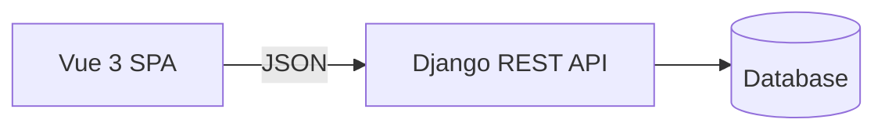
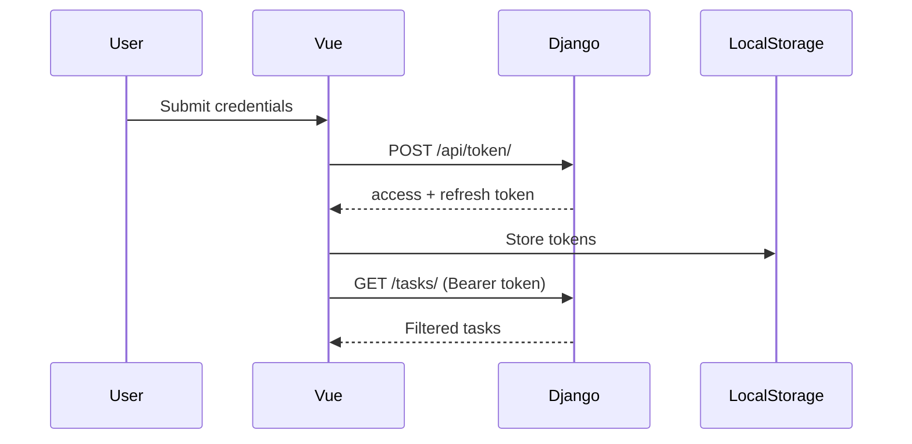
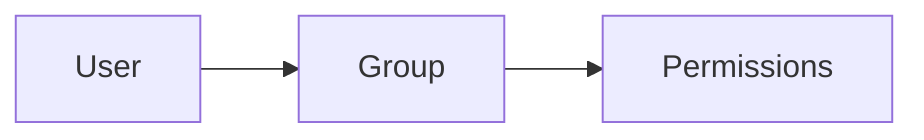
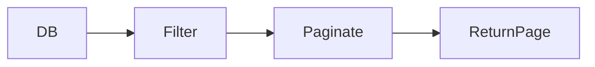
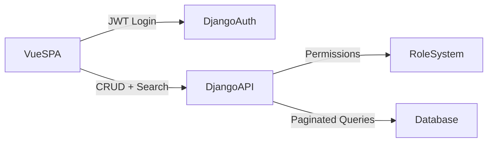
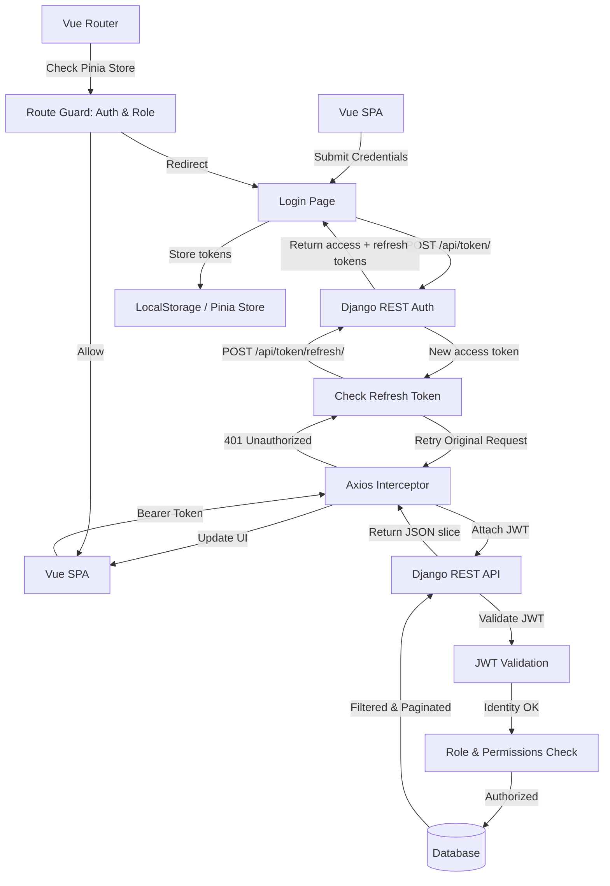

# 🚀 Building a Production-Ready Fullstack App

## Vue 3 + Django REST + JWT + Role-Based Access + Pagination + Search

> A beginner-friendly, mental-model-first walkthrough for **real-world authentication, CRUD operations, and production-ready architecture**.

Modern fullstack applications typically have:

* **Frontend:** Vue 3 SPA
* **Backend:** Django REST Framework
* **Authentication:** JWT
* **Authorization:** Role-based access control
* **Data handling:** Paginated and searchable APIs

This guide builds **exactly that**, while explaining **why** each part exists so you can design confidently rather than copy blindly.

---

# 🧠 The Big Picture

Think of your system as **two independent machines communicating over JSON/HTTP**:



Responsibilities:

* **Vue SPA:** Handles UI, local state, and API requests
* **Django API:** Secures endpoints, enforces business logic, manages data
* **JWT:** A signed “passport” that proves identity between Vue and Django

> Think of Django as the **Vault** and Vue as the **Remote Control**.

---

# 🔐 Authentication with JWT

In production, server-side sessions are rare. Instead, **JWTs** are used for stateless authentication.



> JWTs are like **signed passports**: Django validates the token and trusts the bearer without querying the database every request.

---

# 🧑‍💼 Role-Based Permissions

Roles are modeled via Django Groups:

* **Admin**
* **User**

Example custom permission:

```python
from rest_framework.permissions import BasePermission

class IsAdminGroup(BasePermission):
    def has_permission(self, request, view):
        return request.user.groups.filter(name='Admin').exists()
```

> Keeps role checks **explicit, readable, and testable**.

---

# 🚀 Extension 1 — Role Management UI

Instead of relying only on Django Admin, we can manage roles **from the frontend**.

---

## 🧠 Mental Model: Roles as Relationships

Roles are just **relationships** between users, groups, and permissions:

```
Users ←→ Groups ←→ Permissions
```



We need:

* API to list users and their groups
* API to update a user’s groups
* Admin-only access to these endpoints

---

# Backend — User & Role APIs

### 1️⃣ Serializer

```python
from django.contrib.auth.models import User, Group
from rest_framework import serializers

class UserSerializer(serializers.ModelSerializer):
    groups = serializers.SlugRelatedField(
        many=True,
        slug_field='name',
        queryset=Group.objects.all()
    )

    class Meta:
        model = User
        fields = ['id', 'username', 'groups']
```

> `SlugRelatedField` keeps JSON simple: **group names instead of numeric IDs**.

---

### 2️⃣ Admin-Only ViewSet

```python
from rest_framework import viewsets
from rest_framework.permissions import IsAuthenticated
from .permissions import IsAdminGroup
from django.contrib.auth.models import User
from .serializers import UserSerializer

class UserManagementViewSet(viewsets.ModelViewSet):
    queryset = User.objects.all().order_by('username')
    serializer_class = UserSerializer
    permission_classes = [IsAuthenticated, IsAdminGroup]
```

Register it in your router:

```python
router.register('users', UserManagementViewSet)
```

> Only authenticated admins can list or modify users through this endpoint.

---

# Vue — Role Management Page

`Admin.vue`:

```vue
<script setup>
import { ref, onMounted } from 'vue'
import api from '@/services/api'

const users = ref([])

async function fetchUsers() {
  const response = await api.get('users/')
  users.value = response.data
}

async function updateRoles(user) {
  await api.put(`users/${user.id}/`, user)
}

onMounted(fetchUsers)
</script>

<template>
  <div>
    <h1>User Role Management</h1>

    <div v-for="user in users" :key="user.id">
      <h3>{{ user.username }}</h3>

      <select v-model="user.groups[0]">
        <option>User</option>
        <option>Admin</option>
      </select>

      <button @click="updateRoles(user)">Save</button>
    </div>
  </div>
</template>
```

> For more complex apps, support multiple groups per user or a dedicated roles table.

---

# 🔎 Extension 2 — Pagination & Search

Production APIs **never return all rows**—it overwhelms both frontend and backend.

---

## 🧠 Mental Model: Slice Data



1. Filter database first
2. Then paginate results
3. Frontend requests only the slice it needs

---

# Backend — Pagination Setup

`settings.py`:

```python
REST_FRAMEWORK = {
    'DEFAULT_AUTHENTICATION_CLASSES': (
        'rest_framework_simplejwt.authentication.JWTAuthentication',
    ),
    'DEFAULT_PAGINATION_CLASS': 'rest_framework.pagination.PageNumberPagination',
    'PAGE_SIZE': 5,
}
```

Response structure:

```json
{
  "count": 42,
  "next": "...",
  "previous": null,
  "results": [...]
}
```

---

# Add Search to TaskViewSet

```python
from rest_framework.filters import SearchFilter

class TaskViewSet(viewsets.ModelViewSet):
    serializer_class = TaskSerializer
    permission_classes = [IsAuthenticated]
    filter_backends = [SearchFilter]
    search_fields = ['title']

    def get_queryset(self):
        return Task.objects.filter(owner=self.request.user).order_by('-id')
```

Example queries:

```
GET /tasks/?search=home
GET /tasks/?page=2
GET /tasks/?search=home&page=2
```

---

# Vue — Pagination + Search UI

```vue
<script setup>
import { ref, onMounted } from 'vue'
import api from '@/services/api'

const tasks = ref([])
const search = ref('')
const next = ref(null)
const previous = ref(null)
const loading = ref(false)

async function fetchTasks(url = 'tasks/') {
  loading.value = true
  try {
    const response = await api.get(url)
    tasks.value = response.data.results
    next.value = response.data.next
    previous.value = response.data.previous
  } finally {
    loading.value = false
  }
}

async function searchTasks() {
  await fetchTasks(`tasks/?search=${encodeURIComponent(search.value)}`)
}

onMounted(fetchTasks)
</script>

<template>
  <div>
    <h1>Your Tasks</h1>

    <input v-model="search" placeholder="Search tasks..." />
    <button @click="searchTasks" :disabled="loading">Search</button>

    <ul>
      <li v-for="task in tasks" :key="task.id">{{ task.title }}</li>
    </ul>

    <button v-if="previous" @click="fetchTasks(previous)" :disabled="loading">
      Previous
    </button>
    <button v-if="next" @click="fetchTasks(next)" :disabled="loading">
      Next
    </button>
  </div>
</template>
```

> Frontend simply follows `next` and `previous` links returned by the API.

---

# 🧠 Full Production Architecture



> Each arrow is an HTTP request carrying a JWT, returning **only what the frontend needs**.

---

# 🏁 What You’ve Built

✅ JWT authentication & registration
✅ Role-based permissions with Django Groups
✅ Admin role management UI in Vue
✅ Protected CRUD endpoints
✅ Paginated, searchable task APIs
✅ Decoupled, production-style architecture

> No longer a toy app—this is a **real-world foundation**.

---

# 🔒 Production Deployment — Nginx + Docker

Never use Vite or Django dev servers in production. Use **Nginx** as a reverse proxy:

* Serve Vue static files
* Handle HTTPS
* Proxy `/api` requests to Django

### 🧠 Mental Model: The Concierge

* Guest asks for a map → concierge hands static file
* Guest requests room service → concierge calls Django backend

---

### 1. `nginx.conf`

```nginx
server {
    listen 80;
    server_name yourdomain.com;

    location / {
        root /usr/share/nginx/html;
        index index.html;
        try_files $uri $uri/ /index.html;
    }

    location /api/ {
        proxy_pass http://backend:8000;
        proxy_set_header Host $host;
        proxy_set_header X-Real-IP $remote_addr;
        proxy_set_header X-Forwarded-For $proxy_add_x_forwarded_for;
        proxy_set_header X-Forwarded-Proto $scheme;
    }

    location /static/django/ {
        alias /app/static/;
    }
}
```

---

### 2. Docker Compose (Production)

```yaml
services:
  nginx:
    image: nginx:stable-alpine
    ports:
      - "80:80"
    volumes:
      - ./nginx.conf:/etc/nginx/conf.d/default.conf:ro
      - ./frontend/dist:/usr/share/nginx/html:ro
    depends_on:
      - backend

  backend:
    build: ./backend
    command: gunicorn myproject.wsgi:application --bind 0.0.0.0:8000
```

**Benefits:**

1. Vue Router works with `try_files`
2. Django backend hidden behind Nginx
3. Static files served efficiently

---

# 🔄 Production-Ready Vue Client Workflow

1. **Axios Interceptor:** Attach JWT & auto-refresh on 401
2. **Pinia Store:** Centralized auth & role management
3. **Debounced Search:** Efficient API calls
4. **Route Guards:** Role-based access control
5. **Reactive UI:** Reflects auth & role state

---

# 🗺 End-to-End Workflow Diagram



### 🔑 Key Takeaways

1. Vue SPA handles UI, Pinia state, and Axios requests
2. JWT acts as a stateless “passport” for backend verification
3. Axios interceptors attach tokens & handle refresh automatically
4. Backend enforces roles, permissions, pagination, and search
5. Route guards prevent unauthorized frontend access
6. LocalStorage / Pinia keeps tokens & roles in sync
7. Nginx serves static files and proxies API requests efficiently

---

