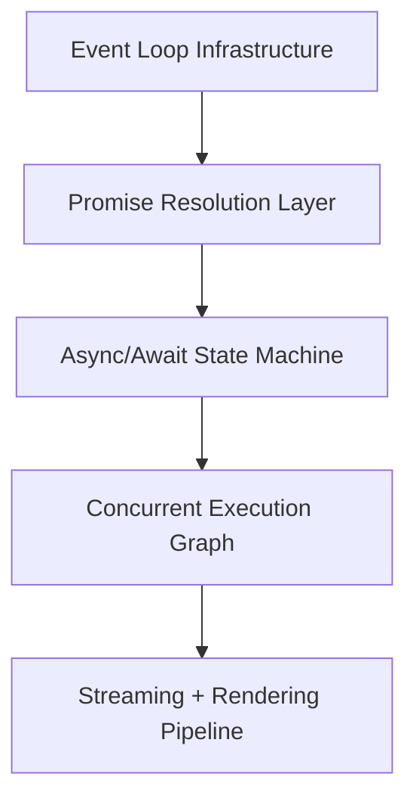
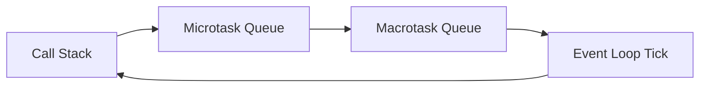
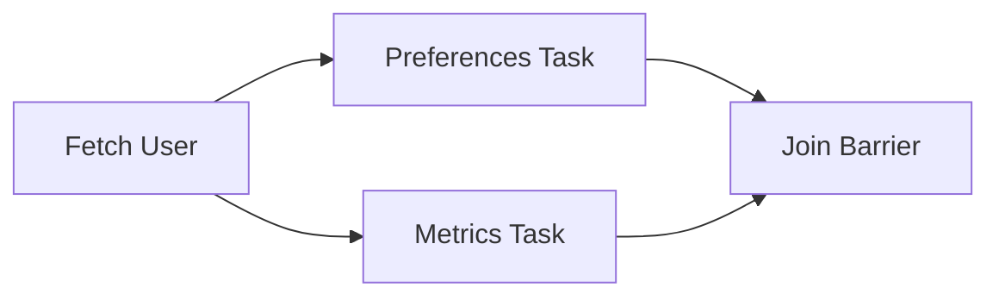
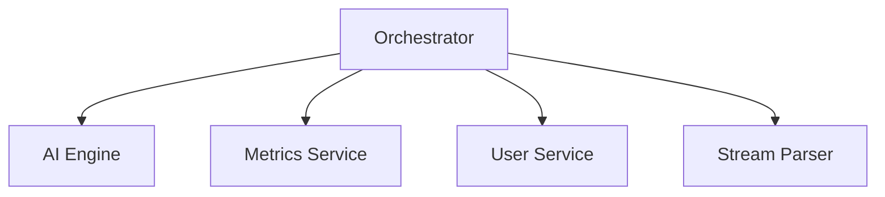

# Building an AI-Powered CLI Dashboard

## An Architectural Deep Dive into JavaScript Concurrency and Runtime Design

This is a strong foundation. The progression from basic queue scheduling to an asymmetric asynchronous execution graph is structurally sound. However, to elevate this into a **production-grade engineering article**, we need to remove the “homework project” framing and re-anchor the narrative in real-world runtime architecture.

The refinement below introduces rigorous system terminology—**Inversion of Control**, **Temporal Coupling**, **Backpressure**, and **Execution Graph Theory**—upgrades mock implementations into production-aligned abstractions, and replaces naive stream handling with realistic **SSE (Server-Sent Events) parsing semantics** as used in providers like OpenRouter.

We also enforce **functional decomposition**, strict **I/O boundary isolation**, and **Locality of Behavior (LoB)** to align the design with systems used in real-time AI dashboards and streaming observability platforms.

---

## 🧠 Concurrency as Architecture, Not Syntax

JavaScript does not execute asynchronous logic—it orchestrates it.

Every `async` operation is compiled into a set of scheduling decisions distributed across the **event loop phases**, **microtask queue**, and **macrotask queue**. The runtime is not a sequential executor; it is a **coordinated concurrency scheduler operating over a single-threaded execution substrate**.

Production systems built on streaming AI APIs (e.g., OpenRouter) must therefore be modeled as **execution graphs**, not procedural flows.

---

### 🔁 Execution Topology (Runtime Abstraction Layer)



Each layer represents a **semantic transformation of execution**, not a function call chain. The goal is to reduce temporal dependency depth while maximizing concurrent saturation of the runtime scheduler.

---

### 🧭 Core Runtime Principles

* **⚡ Microtask Priority Guarantee**
  Microtasks (`Promise.then`, `queueMicrotask`) operate under *run-to-exhaustion semantics*. The event loop will fully drain the microtask queue before transitioning to any macrotask phase (`setTimeout`, I/O polling). This creates implicit prioritization layers that directly affect system fairness and latency.

* **💤 Suspension Without Blocking (Continuation Capture Model)**
  `await` does not block threads. It performs **continuation capture**, suspending execution context state into heap-managed closures while yielding control back to the event loop scheduler.

* **🎯 Scheduler vs. Executor Separation**
  Application code defines **dependency topology and intent**, while the JavaScript runtime determines **temporal execution ordering**. This separation is critical in understanding non-deterministic latency behavior in distributed async systems.

---

### 🧵 Event Loop Phase Model



This loop defines the **fundamental execution contract of JavaScript concurrency**.

---

## 🏗️ CLI Dashboard System Architecture

The CLI dashboard is modeled as an **asymmetric asynchronous dependency graph**, where independent I/O domains are executed concurrently and synchronized only at defined aggregation barriers.

This avoids **temporal coupling**, where unrelated operations become serialized due to poor dependency modeling.

---

### 🧩 System Execution Flow

```mermaid
flowchart TD
    A[User Boot / Request] --> B[Auth Boundary Layer]
    B --> C1[User Preferences Service]
    B --> C2[System Telemetry Service]

    C1 --> D[Aggregation Barrier: Promise.all]
    C2 --> D

    D --> E[AI Streaming Engine (SSE Pipeline)]
    E --> F[Terminal Render Stream (stdout)]
```

Key design principle: **isolate I/O domains, then re-compose via deterministic synchronization barriers**.

---

## ⚙️ Milestone 1 — Event Loop Instrumentation (Runtime Semantics)

Understanding execution order requires mapping syntax to runtime scheduling phases.

```javascript
// Non-blocking timer abstraction (Macrotask phase scheduling)
const delay = (ms) => new Promise((resolve) => setTimeout(resolve, ms));

console.log("⏳ [Stack] Boot sequence started");

// Macrotask: Timer queue
delay(0).then(() => {
  console.log("🚀 [Macrotask] Timer-based execution");
});

// Microtask: Highest-priority queue
Promise.resolve()
  .then(() => {
    console.log("⚡ [Microtask] Immediate microtask execution");
  })
  .then(() => {
    console.log("⚡ [Microtask] Chained microtask continuation");
  });

console.log("⚙️ [Stack] Synchronous execution completed");
```

### 📊 Deterministic Output Ordering

1. Stack execution
2. Microtask exhaustion phase
3. Macrotask execution phase

This ordering is not semantic—it is **runtime-enforced scheduling policy**.

---

## 🧨 Milestone 2 — Callback Collapse (Temporal Coupling & IOC Inversion)

Callback-based async models introduce two architectural failures:

* **Inversion of Control (IoC):** Execution authority is delegated to external callbacks
* **Temporal Coupling:** Structural nesting reflects execution timing constraints

```javascript
// Structural anti-pattern: callback pyramid with IoC leakage
function fetchUser(id, cb) {
  setTimeout(() => {
    if (!id) return cb(new Error("Invalid ID"));
    cb(null, { id, name: "Alex Code" });
  }, 300);
}

function fetchPreferences(userId, cb) {
  setTimeout(() => cb(null, { theme: "dark" }), 200);
}

// Deep nesting couples structure to execution timeline
fetchUser(42, (err, user) => {
  if (err) return console.error(err);

  fetchPreferences(user.id, (err, prefs) => {
    if (err) return console.error(err);

    console.log("Hydrated dashboard:", { user, prefs });
  });
});
```

This structure is non-composable and does not scale under increasing I/O complexity.

---

## 🔄 Milestone 3 — Promise Normalization (Composable Async Abstraction)

Promises introduce **monadic composition semantics for asynchronous execution**, decoupling control flow from callback ownership.

```javascript
const fetchUser = (id) =>
  new Promise((resolve, reject) => {
    setTimeout(() => {
      if (!id) return reject(new Error("Invalid ID"));
      resolve({ id, name: "Alex Code" });
    }, 300);
  });

const fetchPreferences = (userId) =>
  new Promise((resolve) =>
    setTimeout(() => resolve({ theme: "dark" }), 200)
  );
```

```javascript
fetchUser(42)
  .then((user) =>
    fetchPreferences(user.id).then((prefs) => ({ user, prefs }))
  )
  .then((result) => console.log("Normalized pipeline:", result))
  .catch((err) => console.error("Pipeline failure:", err.message));
```

This eliminates callback inversion while preserving composability.

---

## ⚡ Milestone 4 — Async/Await State Machine Model

`async/await` is syntactic sugar over a **compiler-generated state machine**, where each `await` boundary defines a suspension checkpoint.

```javascript
async function hydrateDashboard(userId) {
  try {
    const user = await fetchUser(userId);
    const prefs = await fetchPreferences(user.id);

    return { user, prefs };
  } catch (err) {
    console.error("State machine failure:", err);
    throw err;
  }
}
```

Each `await`:

* Captures execution state
* Stores continuation in heap
* Resumes via microtask scheduling

---

## 🚀 Milestone 5 — Fork–Join Concurrency Model

Sequential `await` chains introduce unnecessary latency when dependencies are independent.

The correct model is **fork–join concurrency**, where parallel tasks are initiated first and synchronized later.

```javascript
const fetchSystemMetrics = () =>
  new Promise((r) =>
    setTimeout(() => r({ cpu: "42%", mem: "71%" }), 150)
  );

async function optimizedFetch(userId) {
  const user = await fetchUser(userId);

  console.time("fork-join");

  // Fork phase (parallel initialization)
  const prefsPromise = fetchPreferences(user.id);
  const metricsPromise = fetchSystemMetrics();

  // Join barrier (synchronization point)
  const [prefs, metrics] = await Promise.all([
    prefsPromise,
    metricsPromise,
  ]);

  console.timeEnd("fork-join");

  return { user, prefs, metrics };
}
```



---

## 🌊 Milestone 6 — Streaming AI Execution Model (SSE Pipeline)

Production-grade LLM integration (e.g., OpenRouter) relies on **Server-Sent Events streaming**, not buffered JSON responses.

Key design concerns:

* Chunk fragmentation
* Partial JSON parsing
* Backpressure-aware streaming
* Token-level rendering

```javascript
async function* streamAIInsights(metrics) {
  const res = await fetch("https://openrouter.ai/api/v1/chat/completions", {
    method: "POST",
    headers: {
      Authorization: `Bearer ${process.env.OPENROUTER_API_KEY}`,
      "Content-Type": "application/json",
    },
    body: JSON.stringify({
      model: "google/gemini-2.5-flash",
      stream: true,
      messages: [
        {
          role: "user",
          content: `Analyze: CPU=${metrics.cpu}, MEM=${metrics.mem}`,
        },
      ],
    }),
  });

  const reader = res.body.getReader();
  const decoder = new TextDecoder();
  let buffer = "";

  while (true) {
    const { done, value } = await reader.read();
    if (done) break;

    buffer += decoder.decode(value, { stream: true });
    const lines = buffer.split("\n");
    buffer = lines.pop() ?? "";

    for (const line of lines) {
      if (!line.startsWith("data: ")) continue;

      const payload = line.slice(6);
      if (payload === "[DONE]") continue;

      try {
        const json = JSON.parse(payload);
        const token = json?.choices?.[0]?.delta?.content;
        if (token) yield token;
      } catch {
        // Ignore partial SSE fragmentation artifacts
      }
    }
  }
}
```

This is not streaming as a feature—it is **streaming as a control system**.

---

## 🏁 Production CLI Orchestrator

```javascript
async function runDashboard() {
  console.clear();

  const user = await fetchUser(42);
  console.log("Authenticated:", user.name);

  const [prefs, metrics] = await Promise.all([
    fetchPreferences(user.id),
    fetchSystemMetrics(),
  ]);

  console.log("Telemetry:", metrics);

  for await (const token of streamAIInsights(metrics)) {
    process.stdout.write(token);
  }

  console.log("\nExecution complete.");
}

runDashboard();
```

---

## 📦 Modular System Decomposition



### 🧩 Design Constraints

* **I/O Isolation:** All network interaction must be encapsulated in service boundaries
* **Locality of Behavior (LoB):** Logic must remain co-located with its state transformation rules
* **Deterministic Mocking:** Async boundaries must be replaceable with test doubles without altering orchestration logic

---

## 🎯 Final Insight

JavaScript concurrency is not a matter of syntax or async keywords.

It is the **explicit construction of execution graphs under a single-threaded scheduling engine**, where performance is determined not by execution speed—but by **dependency topology, temporal coupling, and scheduling efficiency**.

Once this model is internalized, you stop writing asynchronous code.

You start designing **runtime systems**.

