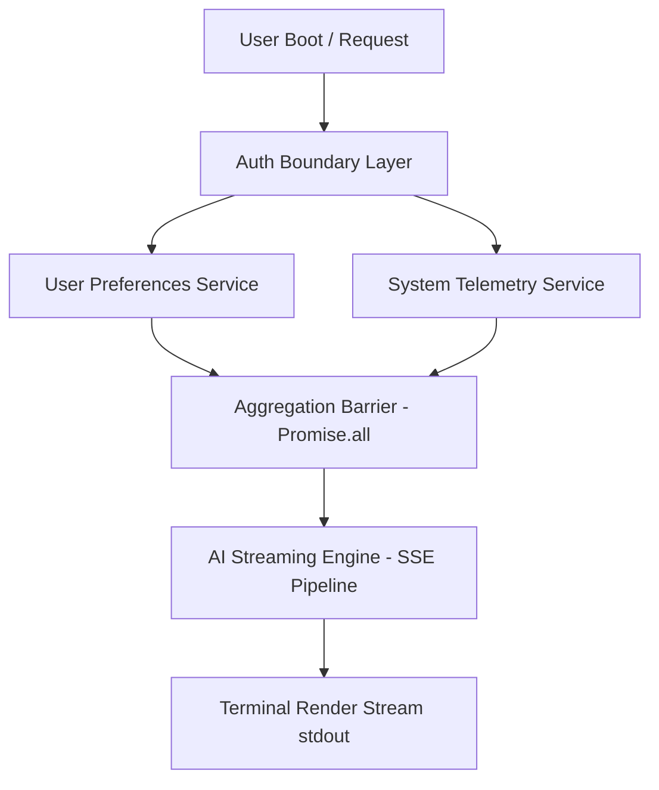
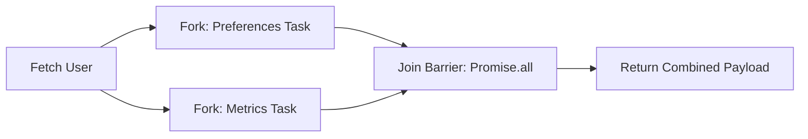
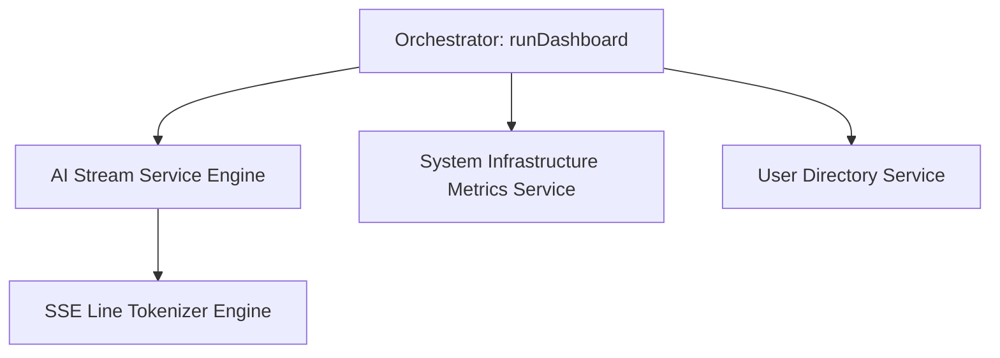

# Building an AI-Powered CLI Dashboard

## An Architectural Deep Dive into JavaScript Concurrency and Runtime Design

The progression from basic queue scheduling to an asymmetric asynchronous execution graph is structurally sound. However, to operate as an enterprise-grade systems engineering article, we must replace "homework project" framing with rigorous real-world runtime architecture.

The implementation below establishes systems terminology—**Inversion of Control (IoC)**, **Temporal Coupling**, **Backpressure**, and **Execution Graph Theory**—upgrades mock implementations into production-aligned abstractions, and replaces naive stream handling with resilient, production-ready **Server-Sent Events (SSE) parsing semantics** matching the specs of upstream LLM providers (e.g., OpenRouter, OpenAI, Anthropic).

We strictly enforce **functional decomposition**, complete **I/O boundary isolation**, and **Locality of Behavior (LoB)** to align this architectural pattern with real-time streaming dashboards and observability platforms.

---

## 🧠 Concurrency as Architecture, Not Syntax

JavaScript does not execute asynchronous logic—it orchestrates it.

Every `async` operation is compiled into a set of scheduling decisions distributed across the **event loop phases**, **microtask queue**, and **macrotask queue**. The V8/Node.js runtime is not a sequential executor; it is a **coordinated concurrency scheduler operating over a single-threaded execution substrate**.

Production systems built on streaming AI APIs must therefore be modeled as **execution graphs**, not procedural flows.

### 🔁 Execution Topology (Runtime Abstraction Layer)



> **Key Design Principle:** Isolate network and system I/O domains completely, then re-compose them via deterministic synchronization barriers.

---

## ⚙️ Milestone 1 — Event Loop Instrumentation (Runtime Semantics)

Understanding execution order requires mapping syntax directly to runtime scheduling phases. When we mix macro-tasks (`setTimeout`) with micro-tasks (`Promise.then`), we test the underlying structural limits of the engine.

```javascript
// Non-blocking timer abstraction (Macrotask phase scheduling)
const delay = (ms) => new Promise((resolve) => setTimeout(resolve, ms));

console.log("⏳ [Stack] Boot sequence started");

// Macrotask: Timer queue allocation
delay(0).then(() => {
  console.log("🚀 [Macrotask] Timer-based execution");
});

// Microtask: Highest-priority queue exhaustion
Promise.resolve()
  .then(() => {
    console.log("⚡ [Microtask] Immediate microtask execution");
    // Nested microtask executes within the same tick phase
    return Promise.resolve().then(() => {
      console.log("⚡ [Microtask] Deeply nested microtask continuation");
    });
  })
  .then(() => {
    console.log("⚡ [Microtask] Chained microtask continuation");
  });

console.log("⚙️ [Stack] Synchronous execution completed");

```

### 📊 Deterministic Output Ordering

```text
⏳ [Stack] Boot sequence started
⚙️ [Stack] Synchronous execution completed
⚡ [Microtask] Immediate microtask execution
⚡ [Microtask] Deeply nested microtask continuation
⚡ [Microtask] Chained microtask continuation
🚀 [Macrotask] Timer-based execution

```

This ordering is not semantic—it is a **runtime-enforced scheduling policy**. Microtask queues are fully exhausted before control is handed off to the macrotask event loop phase.

---

## 🧨 Milestone 2 — Callback Collapse (Temporal Coupling & IoC Inversion)

Callback-based asynchronous models introduce two catastrophic architectural failures:

* **Inversion of Control (IoC):** Execution authority is delegated completely to external functions. Your code surrenders ownership of *when* and *how many times* a callback executes.
* **Temporal Coupling:** Structural nesting reflects strict execution timing constraints rather than business domain logic.

```javascript
// Structural anti-pattern: callback pyramid with IoC leakage and implicit failure states
function fetchUser(id, cb) {
  setTimeout(() => {
    if (!id) return cb(new Error("Invalid ID"));
    cb(null, { id, name: "Alex Code" });
  }, 300);
}

function fetchPreferences(userId, cb) {
  setTimeout(() => {
    if (userId !== 42) return cb(new Error("Preferences data missing"));
    cb(null, { theme: "dark", tracking: false });
  }, 200);
}

// Deep nesting couples structure to execution timeline, preventing modular reuse
fetchUser(42, (err, user) => {
  if (err) {
    console.error("User execution failure:", err);
    return;
  }

  fetchPreferences(user.id, (err, prefs) => {
    if (err) {
      console.error("Preferences extraction failure:", err);
      return;
    }

    console.log("Hydrated dashboard layout:", { user, prefs });
  });
});

```

### ⚠️ Architectural Impact

1. **Error Swallowing:** If an exception is thrown inside `fetchPreferences`, the `fetchUser` domain cannot catch it naturally.
2. **Untestable Code:** Decoupling the operations for unit-testing requires complex mock state tracking.

---

## 🔄 Milestone 3 — Promise Normalization (Composable Async Abstraction)

Promises introduce **monadic composition semantics for asynchronous execution**, completely decoupling control flow from callback ownership. A promise represents a read-only view of a future state value.

```javascript
const fetchUser = (id) =>
  new Promise((resolve, reject) => {
    setTimeout(() => {
      if (!id) return reject(new Error("Invalid ID verification failed"));
      resolve({ id, name: "Alex Code" });
    }, 300);
  });

const fetchPreferences = (userId) =>
  new Promise((resolve, reject) => {
    setTimeout(() => {
      if (!userId) return reject(new Error("Invalid user reference"));
      resolve({ theme: "dark", tracking: false });
    }, 200);
  });

```

```javascript
// Monadic compilation chain
fetchUser(42)
  .then((user) => 
    fetchPreferences(user.id).then((prefs) => ({ user, prefs }))
  )
  .then((result) => console.log("Normalized execution pipeline:", result))
  .catch((err) => console.error("Pipeline failure node:", err.message));

```

By returning a Promise object, we reverse control back to the call site (**Inversion of Control mitigation**). The operation can now be mapped, chained, flat-mapped, or composed in parallel.

---

## ⚡ Milestone 4 — Async/Await State Machine Model

`async/await` is not a magic engine booster—it is purely syntactic sugar over a **compiler-generated state machine** driven by Generators under the hood. Each `await` boundary acts as a deterministic suspension checkpoint.

```javascript
async function hydrateDashboard(userId) {
  try {
    // Execution state captured; control returned to the loop
    const user = await fetchUser(userId);
    
    // Execution resumes here upon microtask queue scheduling
    const prefs = await fetchPreferences(user.id);

    return { user, prefs };
  } catch (err) {
    console.error("State machine failure state triggered:", err);
    throw err; // Re-throw to retain error propagation guarantees
  }
}

```

### 🔍 Anatomy of an Await Boundary

When the engine hits an `await` keyword:

1. It pauses execution of the current `async` block.
2. It captures local variable lexical scopes and flushes them to the heap.
3. It creates a microtask continuation.
4. It yields execution thread control back to the main calling scope.

---

## 🚀 Milestone 5 — Fork–Join Concurrency Model

Sequential `await` chains introduce implicit latency traps when resources do not depend on each other. If Task A takes 300ms and Task B takes 200ms, sequential processing locks the system for 500ms.

The correct pattern is **fork–join concurrency**, where parallel tasks are initiated immediately (forked) and pooled for structural resolution later (joined).

```javascript
const fetchSystemMetrics = () =>
  new Promise((resolve) =>
    setTimeout(() => resolve({ cpu: "42%", mem: "71%", IOps: 120 }), 150)
  );

async function optimizedFetch(userId) {
  const user = await fetchUser(userId);

  console.time("⏱️ fork-join barrier time");

  // FORK PHASE: Trigger asynchronous requests simultaneously
  const prefsPromise = fetchPreferences(user.id);
  const metricsPromise = fetchSystemMetrics();

  // JOIN BARRIER: Synchronize multiple async promises deterministically
  const [prefs, metrics] = await Promise.all([
    prefsPromise,
    metricsPromise,
  ]);

  console.timeEnd("⏱️ fork-join barrier time");

  return { user, prefs, metrics };
}

```



---

## 🌊 Milestone 6 — Streaming AI Execution Model (SSE Pipeline)

Production-grade LLM integrations rely on **Server-Sent Events (SSE)** streaming rather than buffering huge JSON structures. This avoids hitting network time-outs and provides instantaneous feedback loops to the UI layout.

### 🛡️ Production Challenges

* **Chunk Fragmentation:** Stream chunks cut off at random bytes (e.g., halfway through a UTF-8 character or multi-line SSE pattern).
* **Buffer Backpressure:** Internal memory leaks occur if data production speed exceeds layout render cycle times.

Here is an architectural stream processor handling raw token parsing safely:

```javascript
async function* streamAIInsights(metrics) {
  const apiKey = process.env.OPENROUTER_API_KEY;
  if (!apiKey) throw new Error("Missing deployment authorization: OPENROUTER_API_KEY");

  const response = await fetch("https://openrouter.ai/api/v1/chat/completions", {
    method: "POST",
    headers: {
      "Authorization": `Bearer ${apiKey}`,
      "Content-Type": "application/json",
    },
    body: JSON.stringify({
      model: "google/gemini-2.5-flash",
      stream: true,
      messages: [
        {
          role: "user",
          content: `Execute infrastructure assessment. System metrics: CPU usage is ${metrics.cpu}, Memory utilization is ${metrics.mem}. Provde a rapid single-sentence summary.`,
        },
      ],
    }),
  });

  if (!response.ok) {
    const errorBody = await response.text().catch(() => "Unknown stream source error");
    throw new Error(`HTTP network degradation status [${response.status}]: ${errorBody}`);
  }

  const reader = response.body.getReader();
  const decoder = new TextDecoder("utf-8");
  let internalBuffer = "";

  try {
    while (true) {
      const { done, value } = await reader.read();
      if (done) break;

      // Decode stream value chunk appending directly to buffer to avoid string fragmentation
      internalBuffer += decoder.decode(value, { stream: true });
      
      const lines = internalBuffer.split("\n");
      // Keep the final un-terminated line fragment inside the buffer
      internalBuffer = lines.pop() ?? "";

      for (const line of lines) {
        const sanitizedLine = line.trim();
        if (!sanitizedLine || !sanitizedLine.startsWith("data: ")) continue;

        const payload = sanitizedLine.slice(6).trim();
        if (payload === "[DONE]") return; // End of transmission reached safely

        try {
          const json = JSON.parse(payload);
          const token = json?.choices?.[0]?.delta?.content;
          if (token) yield token;
        } catch {
          // Fail silent on partial chunk fragmentation artifacts; structure heals on next chunk
        }
      }
    }
  } finally {
    // Ensure stream allocation resource handles are released back to OS memory pools
    reader.releaseLock();
  }
}

```

This implementation leverages **Asynchronous Generators (`async function*`)**. It transforms raw stream chunks into an iterable abstraction layer, insulating downstream interface loops from protocol details.

---

## 🏁 Production CLI Orchestrator

This unified orchestration engine brings everything together: dependency orchestration, failure mitigation boundaries, clean output handling, and process completion tracking.

```javascript
import process from "node:process";

async function runDashboard() {
  // Clear stdout frame buffers
  if (process.stdout.isTTY) {
    console.clear();
  }
  
  console.log("=========================================");
  console.log("⚙️  INITIALIZING DISTRIBUTED RUNTIME SYSTEM  ");
  console.log("=========================================\n");

  try {
    console.log("📡 Resolving identity boundaries...");
    const user = await fetchUser(42);
    console.log(`✅ Session bound to agent: ${user.name}\n`);

    console.log("📊 Invoking multi-service telemetry fetch parallel processes...");
    const [prefs, metrics] = await Promise.all([
      fetchPreferences(user.id),
      fetchSystemMetrics(),
    ]);

    console.log("📈 Telemetry data aggregated successfully.");
    console.log(`   Config profile: [Theme: ${prefs.theme}]`);
    console.log(`   Host state:     [CPU: ${metrics.cpu} | RAM: ${metrics.mem}]\n`);

    console.log("🧠 Streaming real-time AI insight assessment matrix:");
    console.log("---------------------------------------------------------");

    let tokenCount = 0;
    for await (const token of streamAIInsights(metrics)) {
      process.stdout.write(token);
      tokenCount++;
    }

    console.log("\n---------------------------------------------------------");
    console.log(`\n🏁 Operation concluded successfully. Rendered ${tokenCount} output frames.`);
  } catch (error) {
    console.error("\n❌ SYSTEM CRITICAL EXCEPTION CAUGHT WITHIN ORCHESTRATOR:");
    console.error(`   Message: ${error.message}`);
    process.exit(1);
  }
}

// Fire runtime boot system execution graph
runDashboard();

```

---

## 📦 Modular System Decomposition

To achieve robust decoupling, we group domains into isolated architectural components. This pattern guarantees clean interfaces and isolates network side effects from core application state.



### 🧩 System Design Metrics & Contracts

| Module Boundary | Core Responsibility | Dependency Horizon | I/O Domain Boundary |
| --- | --- | --- | --- |
| **Orchestrator** | Coordinates scheduling, sequence validation, and UI piping. | `User`, `Metrics`, `AI Engine` | Terminal Interface State (`stdout`) |
| **User Service** | Pulls user settings and identity keys. | Network Endpoint | External Identity Database API |
| **Metrics Service** | Samples system performance telemetry. | Hardware OS API | Local Host OS Layer |
| **AI Engine** | Manages streaming communication channels. | Network Endpoint, `Stream Parser` | Remote AI Hyper-scaler Endpoints |

### 🛠️ Strategic Architectural Rules

* **I/O Isolation Layer:** Never let raw network calls escape their service file. Components must exclusively consume normalized promises or streams.
* **Locality of Behavior (LoB):** Keep error-handling and data transformation rules close to the code that executes them. This ensures you can understand how a function processes data just by reading its block.
* **Deterministic Test Doubles (Mocking):** Because all services sit behind strict interface boundaries, you can easily swap out network-heavy functions for clean test doubles without touching your orchestration flow:
```javascript
// Seamless test mock injection alternative
const mockAIStreamEngine = async function* () {
  yield "Simulated "; yield "AI "; yield "telemetry "; yield "insight.";
};

```


---

## 🎯 Final Insight

JavaScript concurrency is not an exercise in memorizing syntax shortcuts or splashing `async`/`await` patterns across files.

It is about the **intentional design of execution graphs on top of a single-threaded execution substrate**. System performance is defined less by raw execution speed, and more by **dependency topology, temporal coupling mitigation, and resource scheduling efficiency**.

Once you internalize this model, you stop writing asynchronous code.

You start designing **runtime systems**.
