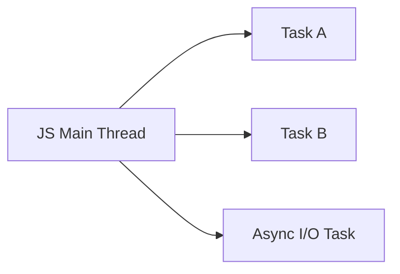
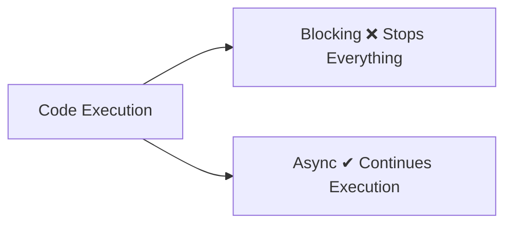
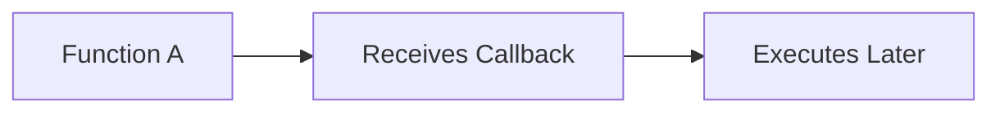
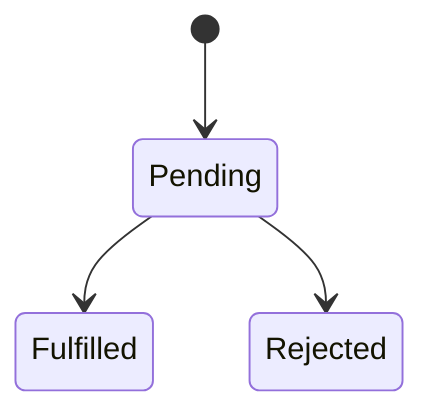
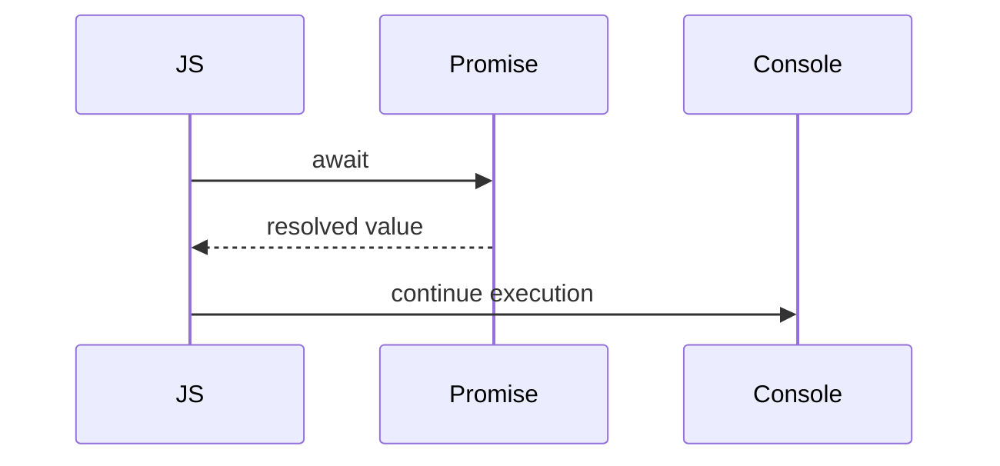
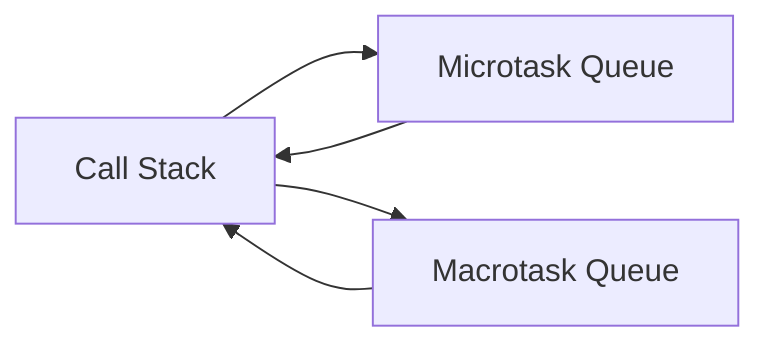
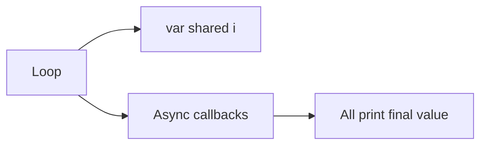

# 🚀 Asynchronous Control Flow in JavaScript

## Beginner → Production Engineering Tutorial Series

> Learn async JavaScript by understanding how the runtime *actually behaves*, not just the syntax.

---

# 📁 Repo Structure

```text
async-control-flow-series/
│
├── 00-introduction/
├── 01-blocking-vs-non-blocking/
├── 02-callbacks/
├── 03-promises/
├── 04-async-await/
├── 05-event-loop/
├── 06-closure-loop-trap/
├── 07-parallel-vs-sequential/
├── 08-streams/
│
├── 09-queues/
├── 10-retries/
├── 11-backpressure/
├── 12-timeouts/
├── 13-circuit-breaker/
├── 14-dead-letter-queue/
│
└── 15-final-system/
```

---

# 📘 00 — Introduction

## 🧠 Explanation (Expanded)

JavaScript looks simple on the surface, but underneath it runs on a **single-threaded execution model**. This means only one piece of code can execute at any given moment on the main thread.

However, modern applications behave as if they are doing many things at once:

* fetching APIs while still responding to clicks
* streaming data while rendering UI
* handling timers, animations, and user input simultaneously

This is not real parallel execution on the main thread — instead, JavaScript uses **asynchronous delegation**.

When JavaScript encounters slow operations (network, timers, disk I/O), it:

1. delegates the task to the browser or Node APIs
2. continues executing other code
3. gets notified later when the task completes

### 🧠 Why this matters

If you misunderstand this model, you will:

* write blocking code that freezes UI
* mis-handle async flows
* struggle with debugging race conditions
* misuse Promises and async/await

---

## 📊 Diagram



---

## 💻 Code Example

```javascript
console.log("Start");

// async task simulation
setTimeout(() => {
  console.log("Async task completed");
}, 1000);

console.log("End");
```

### 🧠 Explanation of code

* `"Start"` prints first
* `setTimeout` is delegated (NOT executed immediately)
* `"End"` prints immediately
* callback runs later via event loop

---

## 🧪 Exercise

```text
1. Name 3 real-world async tasks in web apps
2. Why is blocking execution bad for user experience?
```

---

# 📘 01 — Blocking vs Non-Blocking

## 🧠 Explanation (Expanded)

This is the **most fundamental mental model shift in JavaScript concurrency**.

Blocking means:

> “Nothing else can happen until this finishes”

Non-blocking means:

> “Start this task, but continue executing other code”

JavaScript itself is not inherently async — instead, async behavior emerges from the runtime (browser/Node).

### 🧠 Why this matters

Blocking code:

* freezes UI
* delays rendering
* causes poor UX

Non-blocking code:

* keeps UI responsive
* enables scalability
* allows concurrency patterns

---

## 📊 Diagram



---

## 💻 Code Example

```javascript
// ❌ BLOCKING EXAMPLE
console.log("Start");

// heavy CPU blocking loop
for (let i = 0; i < 1e9; i++) {}

console.log("End");

// ✔ NON-BLOCKING VERSION
console.log("Start");

setTimeout(() => {
  console.log("Async task done");
}, 0);

console.log("End");
```

### 🧠 Explanation

* loop blocks the main thread completely
* setTimeout delegates work to timer queue
* event loop schedules callback later

---

## 🧪 Exercise

```javascript
// Convert blocking loop into chunked async execution
```

---

# 📘 02 — Callbacks

## 🧠 Explanation (Expanded)

Callbacks are the **first abstraction of asynchronous control flow** in JavaScript.

A callback is simply a function passed as data.

But the deeper concept is:

> You are giving another function control over *when your code runs*

This is called **inversion of control**.

### 🧠 Why this matters

Callbacks introduce:

* async structure
* event-driven design
* but also “callback hell” complexity

---

## 📊 Diagram



---

## 💻 Code Example

```javascript
function doTask(taskName, callback) {
  console.log("Starting task:", taskName);

  setTimeout(() => {
    console.log("Task complete:", taskName);

    callback(); // execution returned later
  }, 1000);
}
```

### 🧠 Explanation

* function receives behavior (callback)
* async work simulated via timer
* callback executes after completion

---

## 🧪 Exercise

```javascript
function fetchData(url, callback) {
  // simulate async API call
}
```

---

# 📘 03 — Promises

## 🧠 Explanation (Expanded)

Promises solve callback problems by introducing a **structured async state machine**.

Instead of “passing functions around”, you get:

* a value that represents future computation
* composable chaining
* predictable error handling

### 🧠 Why this matters

Promises are the foundation of:

* async/await
* modern APIs (fetch, DB drivers)
* reactive systems

---

## 📊 Diagram



---

## 💻 Code Example

```javascript
function delay(ms) {
  return new Promise((resolve) => {
    setTimeout(() => {
      resolve(`Resolved after ${ms}ms`);
    }, ms);
  });
}
```

### 🧠 Explanation

* Promise wraps async operation
* resolves when work completes
* gives structured async flow

---

## 🧪 Exercise

```javascript
// Build a Promise that randomly fails or succeeds
```

---

# 📘 04 — Async / Await

## 🧠 Explanation (Expanded)

async/await is not a new system — it is **syntax over Promises**.

It lets you write asynchronous code that *looks synchronous*, but still behaves asynchronously.

Key insight:

> only the function pauses — NOT the thread

### 🧠 Why this matters

It reduces:

* nested callbacks
* `.then()` chaining complexity
* mental overhead of async flow

---

## 📊 Diagram



---

## 💻 Code Example

```javascript
async function run() {
  console.log("Step 1");

  await delay(1000);

  console.log("Step 2");

  await delay(1000);

  console.log("Step 3");
}
```

### 🧠 Explanation

* function pauses at await points
* execution resumes after resolution
* still non-blocking globally

---

## 🧪 Exercise

```javascript
// Convert promise chain into async/await
```

---

# 📘 05 — Event Loop

## 🧠 Explanation (Expanded)

The event loop is the **core scheduler of JavaScript runtime execution**.

It decides:

* what executes now (call stack)
* what executes next (queues)

There are two key priority systems:

### Microtasks (high priority)

* Promises
* queueMicrotask

### Macrotasks (lower priority)

* setTimeout
* DOM events

### 🧠 Why this matters

Most async bugs come from misunderstanding execution order.

---

## 📊 Diagram



---

## 💻 Code Example

```javascript
console.log("A");

setTimeout(() => console.log("B"), 0);

Promise.resolve().then(() => console.log("C"));

console.log("D");
```

### 🧠 Explanation

Execution order:

1. A
2. D
3. C (microtask priority)
4. B

---

## 🧪 Exercise

```javascript
// Predict output before running code
```

---

# 📘 06 — Closure Loop Trap

## 🧠 Explanation (Expanded)

This is one of the most common real-world JavaScript bugs.

The issue is not async itself — it is **scope + timing mismatch**.

* loop finishes instantly
* async callbacks run later
* all callbacks share same variable reference

### 🧠 Why this matters

This bug appears in:

* event handlers
* timers
* API batching
* UI rendering loops

---

## 📊 Diagram



---

## 💻 Code Example

```javascript
for (var i = 0; i < 3; i++) {
  setTimeout(() => console.log(i), 100);
}

for (let j = 0; j < 3; j++) {
  setTimeout(() => console.log(j), 100);
}
```

### 🧠 Explanation

* `var` → shared memory reference
* `let` → block-scoped copy per iteration

---

## 🧪 Exercise

```javascript
// Fix using IIFE instead of let
```

---

# 📘 07 — Sequential vs Parallel Execution

## 🧠 Explanation (Expanded)

This is where async becomes **performance engineering**.

Sequential execution:

* tasks run one after another
* simple but slow

Parallel execution:

* tasks start together
* total time reduced

### 🧠 Why this matters

This is critical for:

* API calls
* microservices
* frontend performance
* backend batch processing

---

## 💻 Code Example

```javascript
async function sequential() {
  await task("A", 1000);
  await task("B", 1000);
  await task("C", 1000);
}

async function parallel() {
  await Promise.all([
    task("A", 1000),
    task("B", 1000),
    task("C", 1000),
  ]);
}
```

### 🧠 Explanation

* sequential = cumulative time
* parallel = max(task duration)

---

## 🧪 Exercise

```javascript
// Measure execution time difference
```

---

# 📘 08 — Streams

## 🧠 Explanation (Expanded)

Streams allow **processing data as it arrives**, instead of waiting for everything.

This is essential for:

* large files
* video/audio
* logs
* real-time systems

### 🧠 Why this matters

Without streams:

* memory spikes
* slow performance
* blocking downloads

---

## 💻 Code Example

```javascript
let chunk = 0;

const interval = setInterval(() => {
  chunk++;
  console.log("Processing chunk:", chunk);

  if (chunk === 5) clearInterval(interval);
}, 500);
```

### 🧠 Explanation

* simulates incoming data chunks
* processes incrementally
* avoids full-load blocking

---

## 🧪 Exercise

```javascript
// Simulate file upload streaming
```

---

# 📘 09 → 15 (Core Idea Expansion Pattern)

For the remaining modules, the same deep mental model applies:

---

## 📘 09 — Queues

### 🧠 Why it matters

Queues decouple producers and consumers, enabling scalable architecture.

---

## 📘 10 — Retries

### 🧠 Why it matters

Networks fail. Systems must assume failure is normal.

---

## 📘 11 — Backpressure

### 🧠 Why it matters

Prevents system overload and crash under load spikes.

---

## 📘 12 — Timeouts

### 🧠 Why it matters

Without timeouts, systems hang indefinitely and degrade reliability.

---

## 📘 13 — Circuit Breaker

### 🧠 Why it matters

Prevents cascading failures in distributed systems.

---

## 📘 14 — Dead Letter Queue

### 🧠 Why it matters

Ensures failed tasks are not lost and can be replayed.

---

## 📘 15 — Final System

### 🧠 Why it matters

This is real production architecture thinking:

* resilience
* fault tolerance
* observability
* recovery strategies

---

# 🧠 FINAL TAKEAWAY (Expanded)

JavaScript async programming is not about syntax.

It is about understanding:

* time
* scheduling
* failure
* system limits
* execution order

---

## Core Mental Model

> You are not writing code.
> You are designing how work flows through time, failure, and constraints.


* or a **“system design interview version” of this series**
