# 🚀 Asynchronous Control Flow in JavaScript

## Beginner → Production Engineering Tutorial Series 

> Learn async JavaScript by understanding how the runtime *actually behaves*, not just the syntax.

---

# 📁 Repo Structure

```text
async-control-flow-series/
│
├── 00-introduction/
├── 01-blocking-vs-non-blocking/
├── 02-callbacks/
├── 03-promises/
├── 04-async-await/
├── 05-event-loop/
├── 06-closure-loop-trap/
├── 07-parallel-vs-sequential/
├── 08-streams/
│
├── 09-queues/
├── 10-retries/
├── 11-backpressure/
├── 12-timeouts/
├── 13-circuit-breaker/
├── 14-dead-letter-queue/
│
└── 15-final-system/
```

---

# 📘 00 — Introduction

## 🧠 Explanation

JavaScript runs on a **single thread**, meaning it can only execute one command at a time.

But modern applications need to:

* fetch data from APIs
* handle user input
* read/write files
* stream data
* process multiple tasks simultaneously

So JavaScript uses **asynchronous behavior** to simulate concurrency.

Instead of blocking, it delegates work and continues executing.

---

## 📊 Diagram

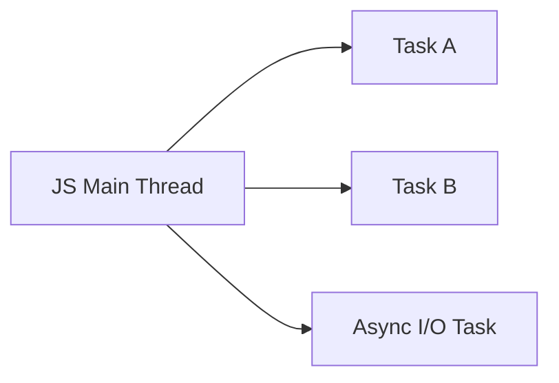

---

## 🧪 Exercise

```text
1. Name 3 real-world async tasks in web apps
2. Why is blocking execution bad for user experience?
```

---

# 📘 01 — Blocking vs Non-Blocking

## 🧠 Explanation

This module introduces the **most important mental model shift**:

> Does JavaScript WAIT or DELEGATE?

* Blocking = JS waits → everything freezes
* Non-blocking = JS delegates → continues execution

This is the foundation of async programming.

---

## 📊 Diagram

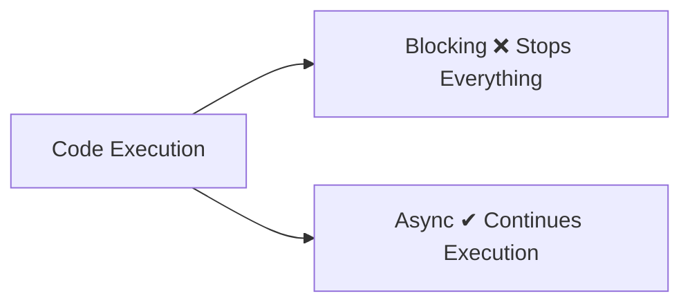

---

## 🧪 Exercise

```javascript
// Simulate blocking using a heavy loop
// Then convert it to async using setTimeout
```

---

# 📘 02 — Callbacks

## 🧠 Explanation

Callbacks are the **first async pattern in JavaScript**.

A callback is just:

> A function passed into another function to be executed later.

This introduces the idea of **inversion of control**:
you are handing execution control to another function.

---

## 📊 Diagram

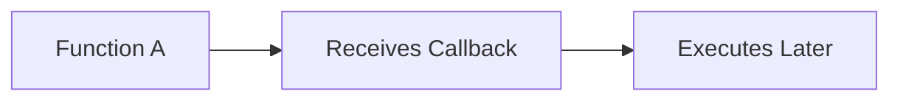

---

## 🧪 Exercise

```javascript
// Create a function doTask(task, callback)
// callback should run after task completes
```

---

# 📘 03 — Promises

## 🧠 Explanation

Promises solve callback chaos by introducing:

> A structured representation of future values.

A Promise is:

* pending
* fulfilled
* rejected

It lets you chain async steps cleanly.

---

## 📊 Diagram

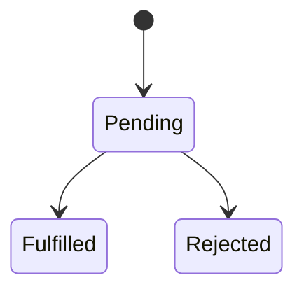

---

## 🧪 Exercise

```javascript
// Create a Promise that resolves after 2 seconds
// Print result using .then()
```

---

# 📘 04 — Async / Await

## 🧠 Explanation

Async/await is **syntactic sugar over Promises**.

It makes asynchronous code look synchronous.

Key idea:

> `await` pauses ONLY the function, not the whole program.

---

## 📊 Diagram

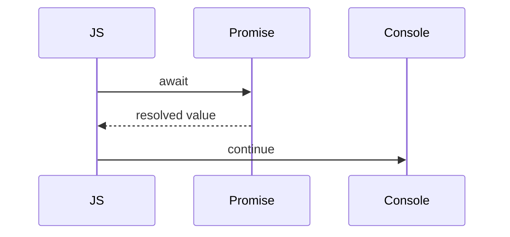

---

## 🧪 Exercise

```javascript
// Convert a Promise chain into async/await
```

---

# 📘 05 — Event Loop

## 🧠 Explanation

The event loop is the **scheduler of JavaScript execution**.

It decides:

* what runs now (call stack)
* what runs next (queues)

Two important queues:

* Microtasks (Promises)
* Macrotasks (setTimeout, events)

---

## 📊 Diagram

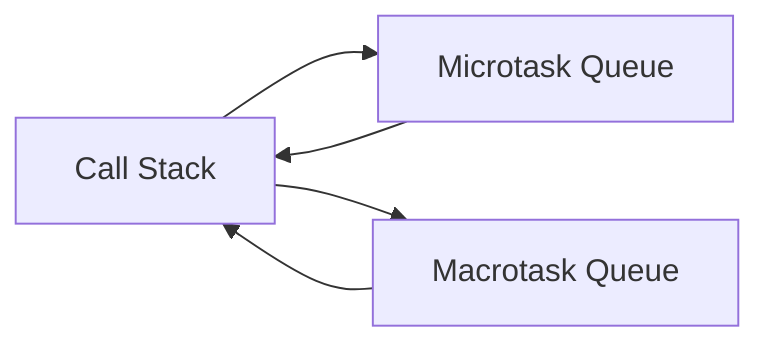

---

## 🧪 Exercise

```javascript
// Predict output order before running code
```

---

# 📘 06 — Closure Loop Trap (VERY IMPORTANT)

## 🧠 Explanation

This module explains one of the most common JS bugs.

Problem:

* `var` creates one shared variable
* `setTimeout` runs later
* all callbacks see final value

Solution:

* `let` creates block scope
* or use IIFE

---

## 📊 Diagram

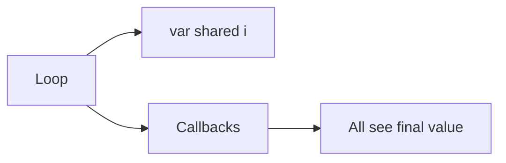

---

## 🧪 Exercise

```javascript
// Fix loop issue using:
// 1. let
// 2. IIFE
```

---

# 📘 07 — Sequential vs Parallel Execution

## 🧠 Explanation

This module introduces **performance thinking**.

* Sequential = slow (wait one-by-one)
* Parallel = fast (run together using Promise.all)

This is foundational for API optimization.

---

## 📊 Diagram

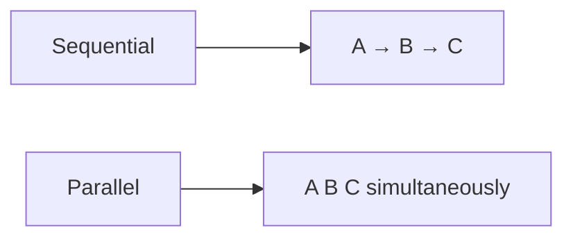

---

## 🧪 Exercise

```javascript
// Compare execution time of sequential vs parallel tasks
```

---

# 📘 08 — Streams

## 🧠 Explanation

Streams allow:

> processing data in chunks instead of waiting for full load

This is critical for:

* video
* logs
* chat
* large files

---

## 📊 Diagram

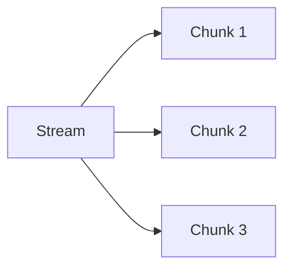

---

## 🧪 Exercise

```javascript
// Simulate streaming using setInterval
```

---

# 📘 09 — Queues

## 🧠 Explanation

Queues introduce **decoupling**:

> producers send work → consumers process later

This is how backend systems scale.

---

## 📊 Diagram

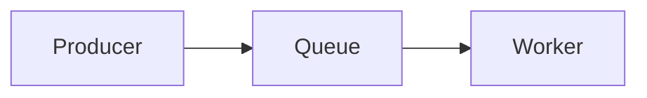

---

## 🧪 Exercise

```javascript
// Build FIFO queue system
```

---

# 📘 10 — Retries

## 🧠 Explanation

Failures are normal in distributed systems.

Retries handle:

* network failure
* API downtime
* transient errors

---

## 📊 Diagram

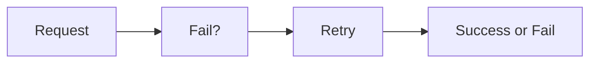

---

## 🧪 Exercise

```javascript
// Implement retry with max 3 attempts
```

---

# 📘 11 — Backpressure

## 🧠 Explanation

Backpressure prevents overload.

If system is too busy:

* slow down input
* prevent crashes

This is critical for scaling systems safely.

---

## 📊 Diagram

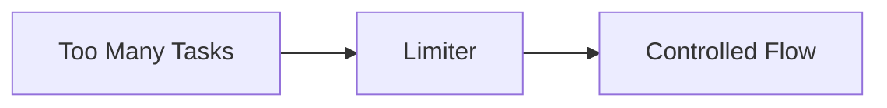

---

## 🧪 Exercise

```javascript
// Limit concurrency to 2 tasks
```

---

# 📘 12 — Timeouts

## 🧠 Explanation

Without timeouts:

* requests may hang forever

Timeout ensures:

> “fail fast instead of waiting forever”

---

## 📊 Diagram

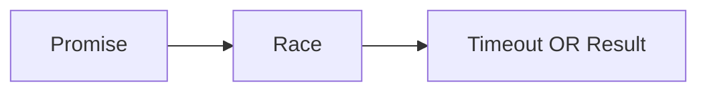

---

## 🧪 Exercise

```javascript
// Build fetch timeout wrapper
```

---

# 📘 13 — Circuit Breaker

## 🧠 Explanation

Circuit breakers prevent cascading failures.

If service is failing:

* stop calling it
* allow recovery time

---

## 📊 Diagram

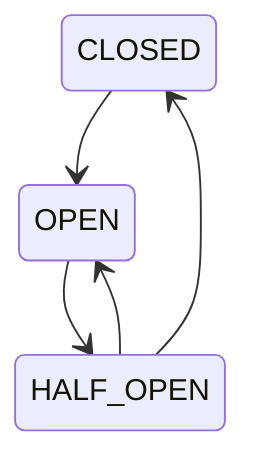

---

## 🧪 Exercise

```javascript
// Simulate failing API and trigger circuit breaker
```

---

# 📘 14 — Dead Letter Queue

## 🧠 Explanation

Some tasks fail permanently.

Instead of losing them:

> store them for inspection later

This is DLQ (dead-letter queue).

---

## 📊 Diagram

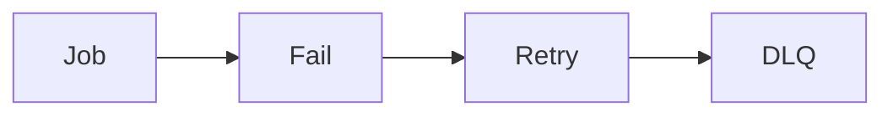

---

## 🧪 Exercise

```javascript
// Store failed jobs in DLQ array
```

---

# 📘 15 — Final System (Putting Everything Together)

## 🧠 Explanation

This is a real production-grade async pipeline:

It combines:

* queues
* retries
* timeouts
* circuit breakers
* backpressure
* DLQ

---

## 📊 Diagram

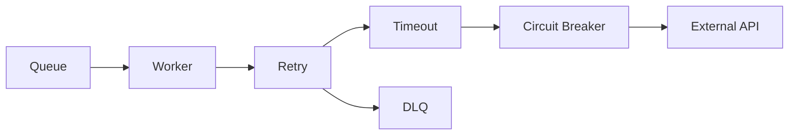

---

## 🧪 Final Exercise

```javascript
// Build a mini async pipeline with:
// queue + retry + timeout
```

---

# 🧠 FINAL TAKEAWAY

## JavaScript async is NOT just syntax.

It is:

* time control
* failure handling
* system stability
* concurrency design

---

## Core Mental Model

> You are not writing code.
> You are designing a flow of work through time, failure, and uncertainty.


Just tell me.
