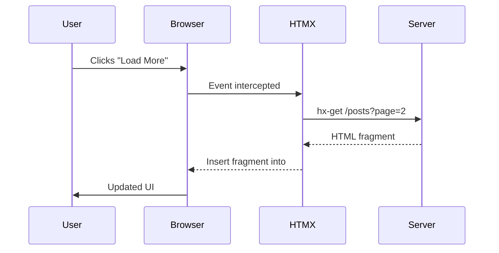
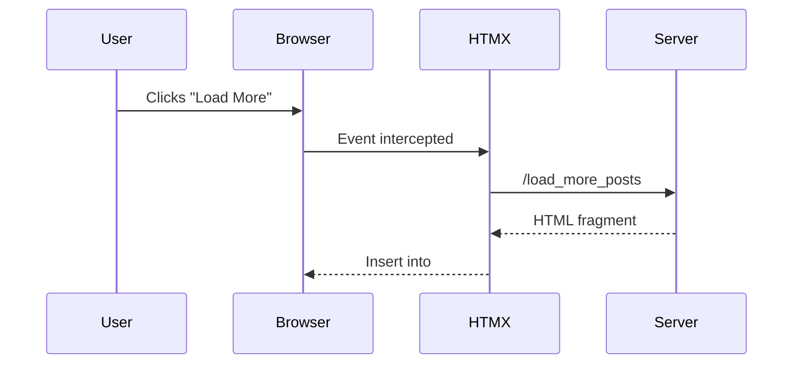
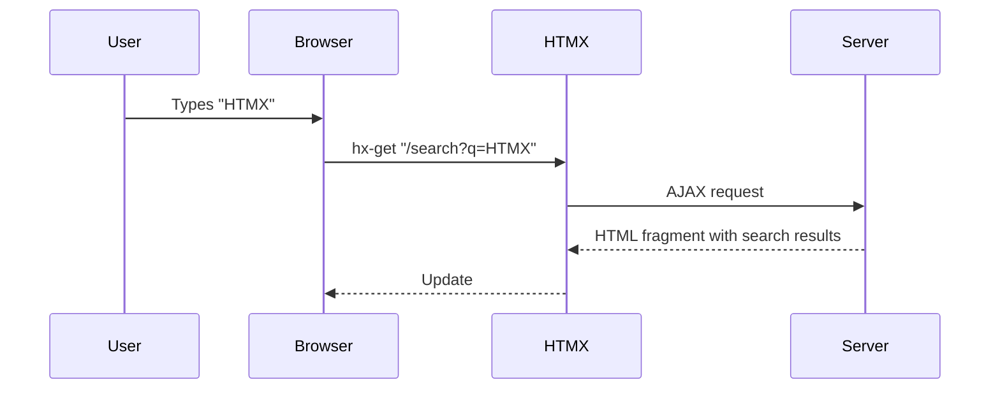
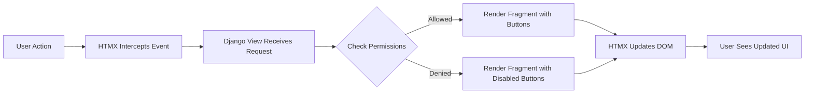
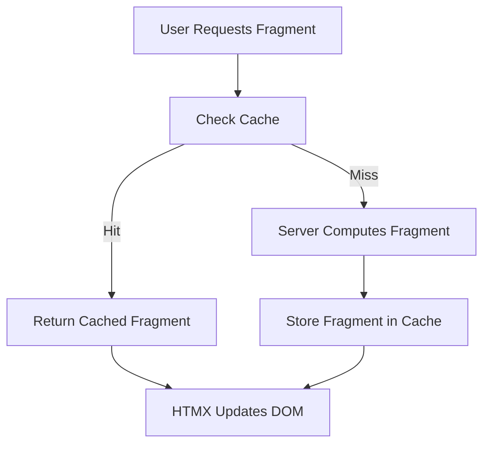
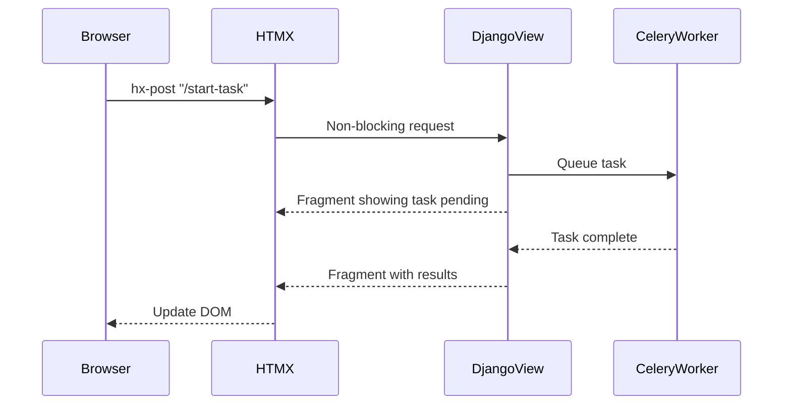
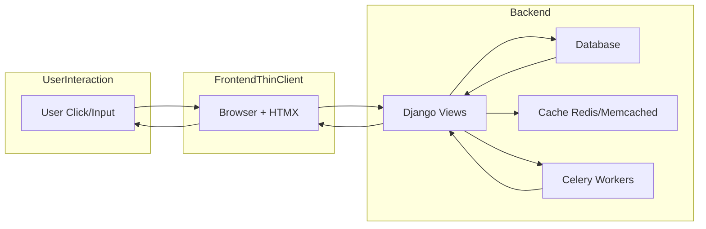

# 🏛 HTMX + Django 6 Primer: Server-Driven Reactive Apps


> **Server-driven UI with minimal JavaScript**
> This guide shows **HTMX basics**, **patterns**, and **how to integrate HTMX with Django 6**, making your web apps reactive, maintainable, and performant.

---

## 1. Introduction to HTMX

### 1.1 What is HTMX?


HTMX is a **lightweight library** that allows HTML to be **reactive and interactive** without writing complex JavaScript.

* It enables **partial page updates**: only the parts that need changing get updated.
* It makes your **server the center of logic**, rather than relying on client-side frameworks.
* It works **declaratively** using HTML attributes.

**Key HTMX concepts:**

| Concept                | Explanation                                                                |
| ---------------------- | -------------------------------------------------------------------------- |
| **hx-get**             | Fetch data from server using GET                                           |
| **hx-post**            | Send data to server using POST                                             |
| **hx-put / hx-delete** | RESTful updates or deletes                                                 |
| **hx-target**          | Where in the DOM the server response should be inserted                    |
| **hx-swap**            | How to insert the fragment (`innerHTML`, `outerHTML`, `beforebegin`, etc.) |
| **hx-trigger**         | Event that triggers the request (`click`, `keyup`, `change`)               |
| **hx-indicator**       | Show a loading spinner or status during request                            |

> HTMX is **HTML-first**, meaning you don’t need JavaScript for most interactions.

---

### 1.2 Why HTMX Exists

Before HTMX, web developers faced:

* **Manual AJAX with JS**: `XMLHttpRequest` or `fetch()` + DOM updates
* **SPAs (React, Vue, Angular)**: Heavy frameworks, complex state, build pipelines
* **Duplication of logic**: Permissions and workflows often implemented both server and client-side

HTMX solves this by:

1. Intercepting events declaratively (`hx-*` attributes)
2. Sending **AJAX requests** to the server
3. Receiving **HTML fragments** and swapping them into the DOM
4. Keeping **logic on the server** (permissions, workflows, HATEOAS)

---

### 1.3 How HTMX Works



**Explanation:**

1. User interacts (click/input)
2. HTMX intercepts the event
3. AJAX request is sent to the server
4. Server returns **HTML fragment**
5. HTMX swaps the fragment into the DOM

> Only the necessary portion of the page changes — no full reload.

---

## 2. Why Django 6 is Perfect for HTMX

Django 6 introduced improvements that **align naturally with HTMX**:

1. **Async Views & ORM**: Non-blocking operations work perfectly with fragment requests
2. **Enhanced Template System**: Easy fragment rendering, includes, and reusable components
3. **Functional Indexing**: Optimized queries for fast partial updates
4. **Improved Caching APIs**: Fragment-level caching with Redis or Memcached
5. **Simplified Middleware & Security**: HTMX’s AJAX requests inherit CSRF protection seamlessly

**In short:** Django 6 makes it easy to serve **HTML fragments, enforce permissions, and scale reactive endpoints**.

---

## 3. HTMX Patterns in Action

### 3.1 Incremental Updates / Fragment Swaps

Instead of reloading the page, update **only what changed**:

```django
<div id="posts-list">
  
    <div id="post-{{ post.id }}">
        <h2>{{ post.title }}</h2>
        <p>{{ post.body }}</p>
        <button hx-get="" hx-target="#post-{{ post.id }}">Edit</button>
    </div>
  
</div>

<button hx-get="" hx-target="#posts-list">Load More</button>
```



**Explanation:** Only the new posts are added to the page — **bandwidth and load times are reduced**.

---

### 3.2 Inline Editing

```html
<div id="comment-1">
  <p>Old comment</p>
  <button hx-get="/comments/1/edit" hx-target="#comment-1">Edit</button>
</div>
```

* Clicking "Edit" loads a **form fragment** into the same div.
* On submission, the fragment is **replaced with updated content**.

---

### 3.3 Live Search / Filtering

```html
<input type="text" hx-get="/search" hx-target="#results" hx-trigger="keyup changed delay:500ms">
<div id="results"></div>
```



* `delay:500ms` prevents excessive requests.
* Server handles filtering and permission logic.

---

### 3.4 Infinite Scrolling

```django
<div id="posts-container">
  
    <div id="post-{{ post.id }}">{{ post.title }}</div>
  
</div>

<div hx-get="" hx-trigger="revealed" hx-target="#posts-container"></div>
```

* `hx-trigger="revealed"` loads new posts when the user scrolls to the element.

---

## 4. HATEOAS: Server-Driven Actions

HATEOAS allows the **server to dictate what the client can do**:

```django

<button hx-delete="" hx-confirm="Are you sure?">Delete</button>

<button disabled>Delete</button>

```



**Key point:** Client never decides what actions are valid — **the server drives the UI**.

---

## 5. Fragment Caching



**Django 6 Example:**

```python
from django.views.decorators.cache import cache_page

@cache_page(60)
def posts_list(request):
    posts = Post.objects.select_related('author').all()
    return render(request, 'posts/list_fragment.html', {'posts': posts})
```

* Use **Redis or Memcached** for high-frequency HTMX endpoints.

---

## 6. Async Operations

HTMX keeps the UI responsive while background tasks run:



---

## 7. Django 6 Integration Examples

### 7.1 Models

```python
from django.db import models
import uuid

class Post(models.Model):
    id = models.UUIDField(default=uuid.uuid4, primary_key=True, editable=False)
    title = models.CharField(max_length=500)
    body = models.TextField()
    image = models.URLField(max_length=500)
    created = models.DateTimeField(auto_now_add=True)
```

---

### 7.2 Views

```python
from django.shortcuts import render
from .models import Post

def posts_list(request):
    posts = Post.objects.select_related('author').all()
    return render(request, 'posts/list_fragment.html', {'posts': posts})
```

---

### 7.3 Templates

```django
<div id="posts-list">

    <div id="post-{{ post.id }}">
        <h2>{{ post.title }}</h2>
        <p>{{ post.body }}</p>
        <button hx-get="" hx-target="#post-{{ post.id }}">Edit</button>
    </div>

</div>

<button hx-get="" hx-target="#posts-list">Load More</button>
```

---

## 8. Full HTMX + Django Architecture



---

## 9. Summary

* **Server-centric:** Logic and permissions stay on the server.
* **Declarative frontend:** Use HTML + HTMX attributes.
* **Fragment updates:** Minimal bandwidth, fast UI.
* **Thin client:** No heavy JS or SPA frameworks.
* **Future-ready:** Django 6 + HTMX supports async, caching, and reactive UIs.

> **Mantra:** *"Don't tell me how to do it; just give me the button to do it."*


Do you want me to do that next?
