# 🌀 HTMX + Django 6 Mastery: Server-Driven Interactivity


Django 6 is **HTMX-first friendly**: it embraces **server-driven interactivity**, **partial rendering**, and **atomic component updates** without requiring heavy client-side frameworks. HTMX complements Django 6 by:

* Leveraging **template inheritance**, context, and ORM queries directly.
* Utilizing **atomic HTML fragments** for rapid UI updates.
* Integrating seamlessly with **Django 6 middleware**, caching, and signals.

HTMX is a **lightweight (~14KB) JS library** that restores **server-driven web principles** and HATEOAS-like interactions. It shifts complexity from the client back to Django 6’s server-side logic.

---

## 1. HTMX Request-Response Flow 


| Flow      | SPA (React/Vue)   | HTMX + Django 6           |
| --------- | ----------------- | ------------------------- |
| Data      | JSON              | HTML Fragment             |
| Rendering | Client            | Server (template)         |
| Logic     | Complex JS        | Server-side Python        |
| SEO / SSR | Extra effort      | Built-in with templates   |
| Latency   | High network cost | Minimal (partial updates) |

**Mental Model:** HTMX acts as a **partial-refresh engine**. Django 6 is the **single source of truth**, sending only the DOM fragments that changed.

---

## 2. HTMX Attributes in Django 6

| Attribute     | Purpose                     | Example                                     |
| ------------- | --------------------------- | ------------------------------------------- |
| `hx-get/post` | AJAX request                | `<button hx-post="/update">`                |
| `hx-target`   | Element to swap             | `hx-target="#results"`                      |
| `hx-swap`     | How to insert               | `outerHTML`, `beforeend`, `transition:true` |
| `hx-push-url` | Update browser history      | `hx-push-url="true"`                        |
| `hx-boost`    | Convert links/forms to AJAX | `<body hx-boost="true">`                    |
| `hx-vals`     | Extra key/value payload     | `hx-vals='{"id":42}'`                       |
| `hx-confirm`  | Confirmation before request | `hx-confirm="Are you sure?"`                |

**Django 6 tip:** Use `request.htmx` to detect HTMX requests and render **partial templates** for optimal response times.

---

## 3. Trigger Modifiers

| Modifier          | Effect                     | Example Use Case    |
| ----------------- | -------------------------- | ------------------- |
| `once`            | Fires once                 | Tooltips            |
| `changed`         | Fires only on value change | Live search         |
| `delay:<time>`    | Debounce request           | Typing search input |
| `throttle:<time>` | Rate limit requests        | Buttons             |
| `from:<selector>` | Listen on another element  | Table refresh       |

**Django 6 benefit:** Minimal JS → less client-side memory footprint, more predictable server-side logic.

---

## 4. Loading State (`hx-indicator`)

HTMX provides instant feedback via `.htmx-request`:

```css
.htmx-indicator { display: none; }
.htmx-request .htmx-indicator { display: inline; }
```

```html
<button hx-get="/data" hx-indicator="#spinner">Load</button>

```

---

## 5. Advanced Patterns: Live Search, Infinite Scroll, Inline Validation

### 5.1 Live Search (Debounced Input)

```html
<input type="text"
       hx-get="/search"
       hx-trigger="keyup changed delay:500ms"
       hx-target="#results"
       hx-indicator=".spinner">
<span class="spinner">Searching...</span>
<table><tbody id="results"></tbody></table>
```

Server renders **HTML rows directly**, no JSON parsing.

---

### 5.2 Infinite Scroll

```html
<div id="user-list">
  <div class="user-card">User 8</div>
  <div class="user-card"
       hx-get="/users?page=2"
       hx-trigger="revealed"
       hx-swap="afterend">
       Load more...
  </div>
</div>
```

Django 6 can **paginate server-side**, returning **fragments only**, reducing bandwidth and improving UX.

---

### 5.3 Inline Form Validation

```html
<input type="email"
       name="email"
       hx-post="/validate-email"
       hx-trigger="change, keyup delay:200ms"
       hx-target="#email-error">
<div id="email-error"></div>
```

Server responds with **partial error messages**, dynamically updating DOM.

---

### 5.4 Polling, Lazy Loading, History

| Feature         | Trigger / Attribute     | Effect                                 |
| --------------- | ----------------------- | -------------------------------------- |
| Infinite Scroll | `hx-trigger="revealed"` | Load more content                      |
| Auto-Refresh    | `hx-trigger="every 5s"` | Periodic server updates                |
| History Support | `hx-push-url="true"`    | URL updates without full reload        |
| Lazy Loading    | `hx-trigger="load"`     | Load secondary content after page load |

---

## 6. HTMX + Django 6: MPA → SPA Experience

HTMX converts Django’s **MPA pages** into SPA-like experiences **without JS frameworks**. Django 6 optimizations:

* **Streaming responses** → send partial fragments as soon as ready
* **Template fragments** → atomic updates
* **Middleware & caching** → minimize database queries for partial updates
* **Signals** → trigger OOB updates for multiple elements

| Feature     | MPA          | HTMX + Django 6             | SPA           |
| ----------- | ------------ | --------------------------- | ------------- |
| Navigation  | Full refresh | Partial HTML + hx-push-url  | Client router |
| Data Format | Full HTML    | HTML fragment               | JSON          |
| Endpoints   | One per page | Multiple (page + fragments) | API only      |
| State       | Session / DB | Server-side                 | Client-side   |

---

### Mermaid: HTMX Lifecycle in Django 6


---

## 7. Component Communication

### 7.1 HX-Trigger (Pub/Sub)

```html
<!-- Sidebar Listener -->
<div id="cart-counter"
     hx-get="/cart/count"
     hx-trigger="cartUpdated from:body">
  Cart: 0
</div>

<!-- Trigger -->
<button hx-post="/cart/add/42" hx-swap="none">Add to Cart</button>
```

**Django 6 View:**

```python
from django.http import HttpResponse

def add_to_cart(request, product_id):
    response = HttpResponse("Added!")
    response["HX-Trigger"] = "cartUpdated"
    return response
```

---

### 7.2 Out-of-Band (OOB) Swaps

```html
<form hx-post="/add-comment" hx-target="#comment-list" hx-swap="beforeend">
  <textarea name="comment"></textarea>
  <button>Post</button>
</form>

<div id="comment-count">Total: 10</div>
<ul id="comment-list"></ul>
```

**Server Response:**

```html
<li>New comment!</li>
<div id="comment-count" hx-swap-oob="true">Total: 11</div>
```

---

## 8. Animations & UX Feedback

HTMX lifecycle classes:

| Class             | When           | Example  |
| ----------------- | -------------- | -------- |
| `.htmx-indicator` | Request active | Spinner  |
| `.htmx-swapping`  | Before swap    | Fade-out |
| `.htmx-settling`  | After swap     | Fade-in  |

```css
.fade-in { opacity: 0; transition: opacity 0.5s ease-in; }
.htmx-settling .fade-in { opacity: 1; }
```

---

## 9. Django 6 Integration

```bash
pip install django-htmx
```

**Settings:**

```python
INSTALLED_APPS = ["django_htmx"]
MIDDLEWARE = ["django_htmx.middleware.HtmxMiddleware"]
```

**Hybrid View Example:**

```python
def task_list(request):
    tasks = Task.objects.all()
    context = {"tasks": tasks}
    if request.htmx:
        return render(request, "partials/task_table_rows.html", context)
    return render(request, "task_list.html", context)
```

---

### 10. Chronological HTMX Swap Timeline

```mermaid
sequenceDiagram
    participant U as User
    participant H as HTMX
    participant S as DjangoServer
    participant D as DOM_Page

    Note over U,H: Scenario: Add product to cart
    Note over S,D: Update sidebar & DOM

    U->>H: Click "Add to Cart"
    H->>H: Parse hx-post, hx-swap, hx-indicator
    H->>D: Show Loading Indicator

    H->>S: POST /cart/add/42
    S->>S: Add item to cart
    S-->>H: Return "Added!" + HX-Trigger: cartUpdated
    H->>H: Fire HX-Trigger
    H->>S: GET /cart/count (sidebar listener)
    S-->>H: Return HTML fragment
    H->>D: Update Cart Counter

    H->>D: Hide Loading Indicator
    D->>D: Apply htmx-swapping → swap → htmx-settling
    D->>D: Activate nested HTMX elements

    Note over H,D: Optional OOB update
    S-->>H: Return additional OOB HTML
    H->>D: Insert OOB content

    Note over U,D: End result: UI reflects server state instantly
```



---

## ✅ Core Mental Models

* **Server as Source of Truth** → Django 6 templates + fragments
* **Partial Refresh Engine** → only changed DOM updated
* **Pub/Sub** → HX-Trigger for decoupled updates
* **OOB = atomic multi-element updates**
* **Hybrid Views** → Same endpoint, full page vs. fragment

---

### ⚡ When to Use Full SPA

HTMX + Django 6 is ideal, except when:

* Offline-first apps are required
* Ultra-fast client-side interactivity
* Millisecond-critical operations (high-frequency trading, gaming)


