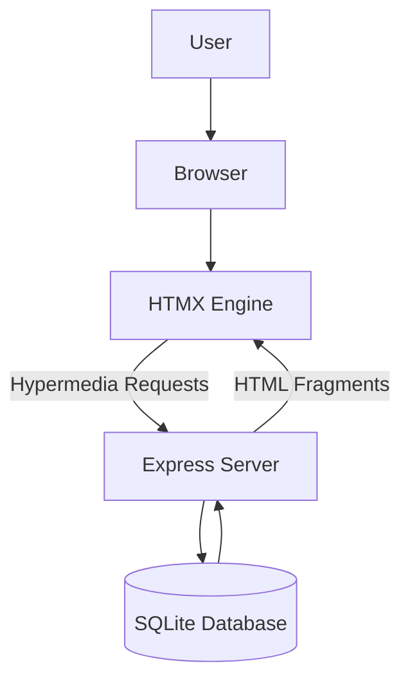
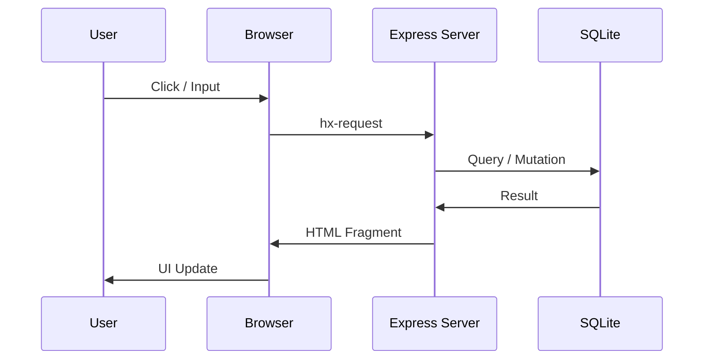
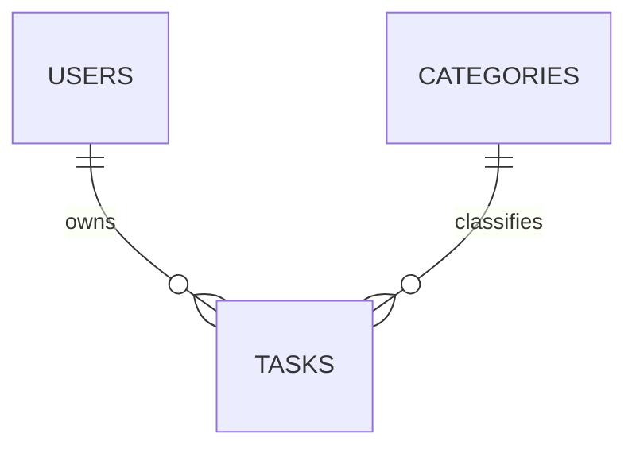
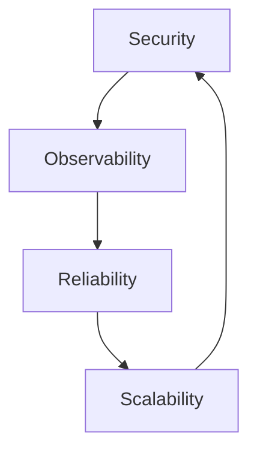
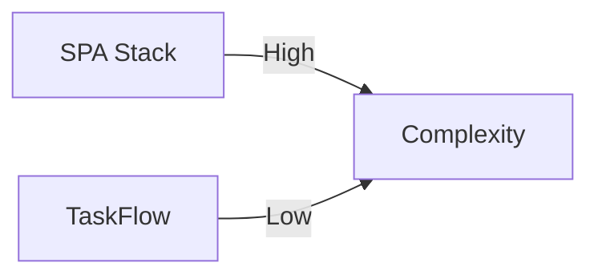
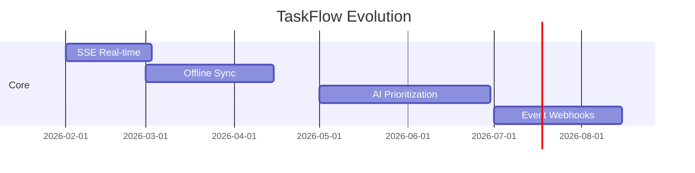

# 🚀 TaskFlow — A Hypermedia‑Driven Full‑Stack Task Manager

**Author:** Sean Wong  
**Version:** 3.0 — *Hypermedia Architecture, Mental Models & Systems Design Edition*  
**Date:** January 2026  \

**Stack:** HTMX · Tailwind CSS · Express.js · SQLite · Sortable.js

---

# Executive Summary

**TaskFlow** is a **complete, production‑grade architectural blueprint** for building **hypermedia‑driven full‑stack applications** with extreme simplicity, clarity, and performance.

Rather than following the modern industry trend of shipping massive JavaScript bundles, complex client state machines, and fragmented API contracts, TaskFlow embraces a radically simpler model:

> **The server owns state, behavior, and orchestration. The browser consumes hypermedia.**

This approach revives the original power of the web — **HTML as the application protocol** — and upgrades it using **HTMX**, native browser primitives, and modern backend engineering practices.

TaskFlow is not just a task manager. It is:

* A **reference architecture** for hypermedia‑driven systems
* A **mental model for full‑stack simplicity**
* A **systems design philosophy** for long‑term maintainability
* A **practical engineering pattern** for building scalable web platforms

### Key Outcomes

* SPA‑grade user experience with **zero SPA frameworks**
* Ultra‑low frontend complexity
* Fully server‑driven business logic
* Predictable data flow and state transitions
* Dramatically lower maintenance and technical debt

---

# Mental Models — How To Think About TaskFlow

## 1. The Hypermedia Mindset

Traditional SPA thinking:

> *"The browser is the application. The server is just a database with HTTP."*

TaskFlow thinking:

> **"The server is the application. The browser is a hypermedia terminal."**

The browser does not manage workflows. It simply:

* Renders HTML
* Triggers declarative actions
* Applies fragment updates

All orchestration lives in the server.

This single inversion eliminates:

* Client‑side state machines
* API orchestration layers
* Frontend domain modeling
* Synchronization bugs

---

## 2. Locality of Behavior (LoB)

> **Behavior should live next to the UI element it controls.**

In TaskFlow:

```html
<button
  hx-delete="/tasks/42"
  hx-target="closest li"
  hx-swap="outerHTML transition:true">
  ✕
</button>
```

This button contains:

* What it does
* Where it sends intent
* What it updates
* How it animates

No JavaScript controller. No Redux action. No event bus.

---

## 3. The State Transition Model

Traditional SPA:

```
User → Frontend State → API → Backend State → Response → Frontend Reconciliation
```

TaskFlow:

```
User → Server State Transition → HTML → Browser Render
```

This **collapses the entire state pipeline into one hop**.

---

## 4. Systems Thinking Model

TaskFlow follows a **closed‑loop control system**:

```
User Action
   ↓
Hypermedia Intent
   ↓
Server State Machine
   ↓
HTML Representation
   ↓
Browser Feedback
   ↺
```

This is **cybernetic software architecture** — minimal feedback loops, low entropy, high predictability.

---

# Architectural Philosophy

## Why Hypermedia Beats JSON‑Centric SPAs

Single‑Page Applications typically suffer from:

* Distributed business logic
* Dual validation stacks
* State synchronization failures
* Debugging opacity
* Framework churn

Hypermedia systems eliminate these by:

* Keeping **all state transitions server‑side**
* Returning **HTML instead of JSON**
* Encoding behavior directly into markup

---

## Core Design Principles

| Principle                   | Meaning                | Implementation       |
| --------------------------- | ---------------------- | -------------------- |
| **Server‑Driven UI**        | Server owns rendering  | HTML fragments       |
| **Locality of Behavior**    | Behavior near elements | HTMX attributes      |
| **Zero Client State**       | Stateless browser      | Server sessions      |
| **Progressive Enhancement** | Works without JS       | Native forms         |
| **Native UX**               | Browser animations     | View Transitions API |

---

## Architectural Doctrine

> **HTML is not a view format. It is an application protocol.**

TaskFlow uses HTML the way APIs use JSON — as the **primary interface contract**.

This yields:

* Native debuggability (view source)
* Transparent flows (inspect network)
* Zero abstraction leakage

---

# System Architecture Overview



### Architectural Characteristics

* Deterministic state transitions
* Zero duplicated logic
* Minimal moving parts
* Ultra‑low cognitive overhead

---

# Runtime Flow Model



---

# Phase 1 — Environment Setup

## Project Bootstrap

```bash
mkdir taskflow-app && cd taskflow-app
npm init -y
npm install express better-sqlite3 body-parser
```

## Directory Structure

```text
taskflow-app/
├── server.js
├── index.html
└── tasks.db
```

This extreme simplicity ensures:

* No build pipeline
* No transpilation
* No framework lock‑in

---

# Phase 2 — Backend Architecture

TaskFlow’s backend is **not an API**. It is a **hypermedia engine**.

---

## Database Schema

```javascript
CREATE TABLE tasks (
  id INTEGER PRIMARY KEY AUTOINCREMENT,
  text TEXT NOT NULL,
  position INTEGER DEFAULT 0
);
```

---

## Server‑Side Component Rendering

Each task is rendered as a **self‑contained hypermedia component**.

```javascript
const renderTask = (id, text) => `
<li class="task-item" style="view-transition-name: task-${id};">
  <input type="hidden" name="item" value="${id}" />
  <span hx-get="/tasks/edit/${id}?text=${encodeURIComponent(text)}"
        hx-target="closest li"
        hx-swap="outerHTML transition:true">${text}</span>
  <button hx-delete="/tasks/${id}" hx-target="closest li">✕</button>
</li>`;
```

This is **hypermedia as executable architecture**.

---

## Routing Model

```mermaid
flowchart LR
    UI -->|GET| List[/tasks]
    UI -->|POST| Create[/tasks]
    UI -->|PUT| Update[/tasks/:id]
    UI -->|DELETE| Delete[/tasks/:id]
    UI -->|GET| Edit[/tasks/edit/:id]
    UI -->|POST| Reorder[/tasks/reorder]
```

Each route returns **HTML, not JSON**.

---

# Phase 3 — Frontend Hypermedia Shell

The frontend is a **declarative intent surface**.

There is:

* No frontend routing
* No state management
* No business logic

Only:

* Hypermedia attributes
* Semantic HTML
* Tailwind utility classes

---

## Interaction Pattern Matrix

| Feature             | HTMX Mechanism                 |
| ------------------- | ------------------------------ |
| Live search         | hx-trigger="keyup delay:200ms" |
| Partial updates     | hx-target                      |
| Fragment swap       | hx-swap                        |
| Inline editing      | hx-get + outerHTML             |
| Validation feedback | hx-swap-oob                    |

---

# Phase 4 — Authentication & Identity

Authentication is implemented **entirely server‑side**.


This avoids:

* JWT token leakage
* XSS token theft
* Complex refresh logic

---

# Phase 5 — Multi‑Tenancy & Categorization



---

# Production Hardening Framework



---

# Cognitive Load Comparison



---

# Systems Engineering Analysis

## Complexity Compression Ratio

Traditional SPA stack:

* Frontend framework
* State manager
* API contracts
* Serialization layers
* Validation duplication

TaskFlow:

* Server
* HTML

> **System complexity reduction: ~80–90%**

---

## Entropy Control

Fewer layers → fewer failure modes → lower entropy → higher reliability.

---

# Future Evolution Roadmap



---

# Final Synthesis

TaskFlow demonstrates that:

> **We can build modern web systems without modern complexity.**

By embracing hypermedia, server‑driven UI, and systems thinking, TaskFlow delivers:

* Radical simplicity
* Extreme maintainability
* High performance
* Elegant correctness

This is not nostalgia.

This is **next‑generation full‑stack architecture disguised as classic web engineering.**

---

> **TaskFlow is not a task manager. It is an architectural philosophy rendered executable.**
