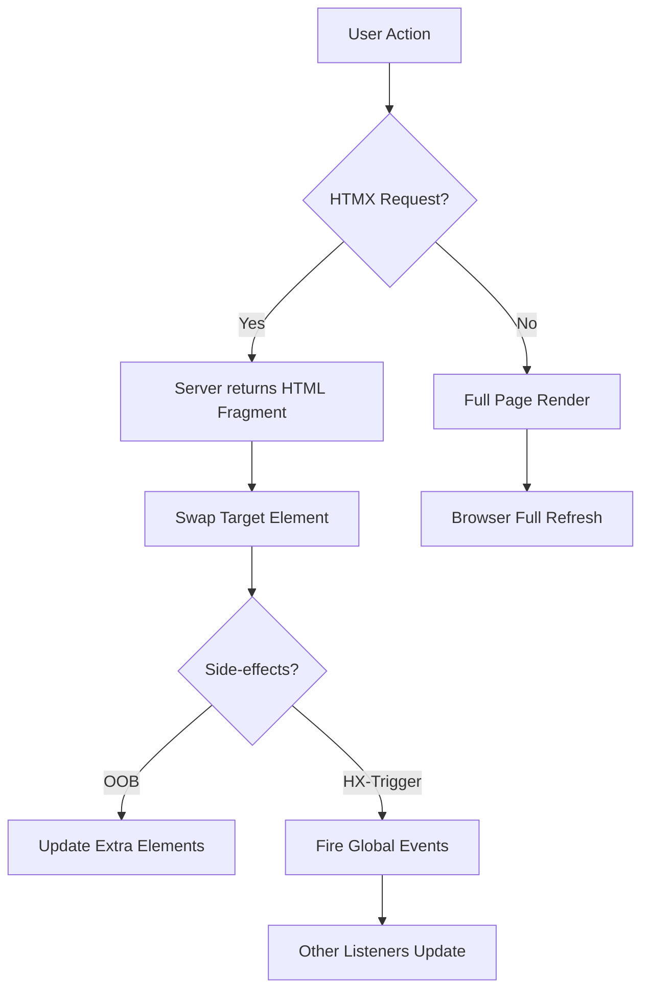
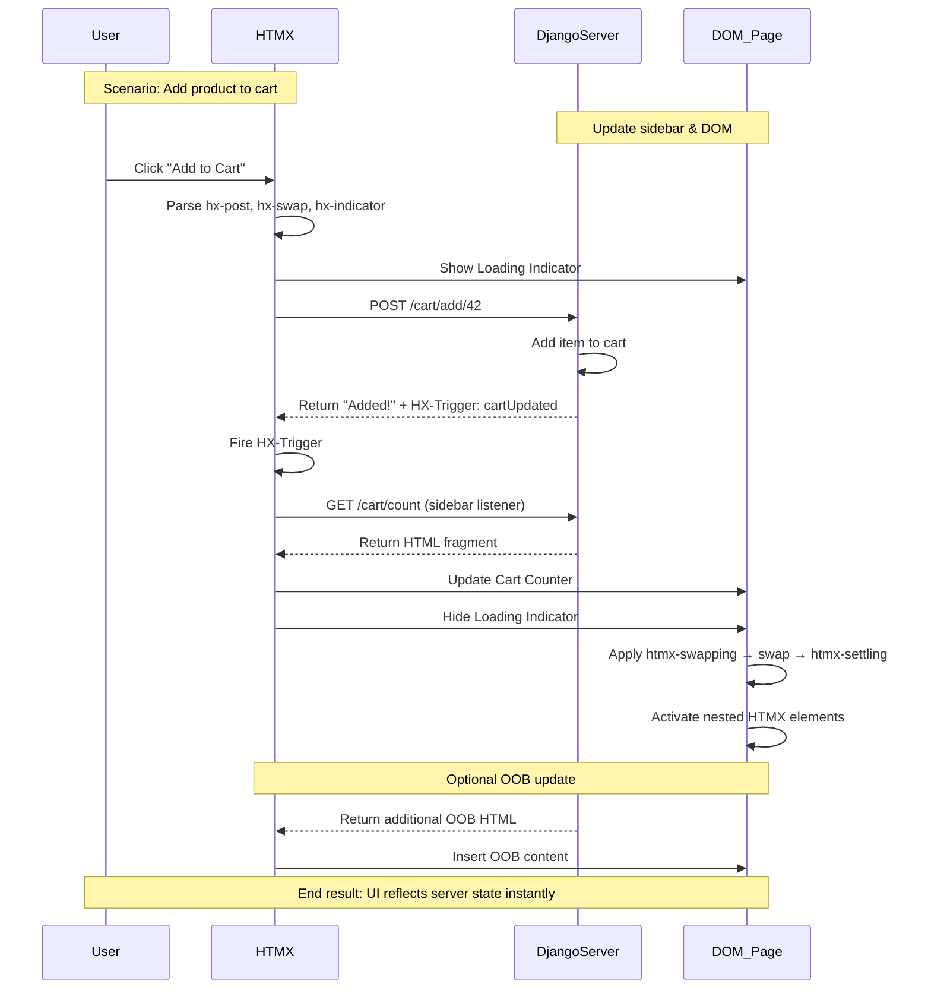

# 🌀 HTMX + Django Mastery: Server-Driven Interactivity

HTMX is a **lightweight JavaScript library (~14KB)** that restores the **server-driven nature of the web**, embracing **HATEOAS principles**. It moves complexity from client-side state management back to the server, letting developers leverage existing templates and business logic.

HTMX allows HTML to:

* Trigger HTTP requests (`GET`, `POST`, `PUT`, `PATCH`, `DELETE`)
* Update DOM elements with **server-rendered fragments**
* Provide rich interactivity **without heavy JS frameworks**

This guide covers **basic concepts, advanced triggers, events, OOB swaps, animations, and Django integration**.

---

## 1. HTMX Request-Response Flow

Unlike traditional SPAs:

* **SPA:** JSON → Client → Render
* **HTMX:** HTML Fragment → Server → DOM

**Mental Model:** HTMX is a **partial-refresh engine**. The server remains the source of truth.

| Feature        | SPA (React/Vue) | HTMX                 |
| -------------- | --------------- | -------------------- |
| Data format    | JSON            | HTML Fragment        |
| Rendering      | Client          | Server               |
| Frontend logic | Complex JS      | Minimal JS           |
| Learning curve | High            | Low                  |
| SEO / SSR      | Extra effort    | Works out-of-the-box |

---

## 2. Advanced HTMX Attributes

| Attribute     | Purpose                     | Example                                     |
| ------------- | --------------------------- | ------------------------------------------- |
| `hx-get/post` | AJAX request                | `<button hx-post="/update">`                |
| `hx-target`   | Element to swap             | `hx-target="#results"`                      |
| `hx-swap`     | How to insert               | `outerHTML`, `beforeend`, `transition:true` |
| `hx-push-url` | Update browser history      | `hx-push-url="true"`                        |
| `hx-boost`    | Convert forms/links to AJAX | `<body hx-boost="true">`                    |
| `hx-vals`     | Extra key/value payload     | `hx-vals='{"id": 42}'`                      |
| `hx-confirm`  | Confirmation before request | `hx-confirm="Are you sure?"`                |

**Mental Model:** `hx-*` = declarative **server interaction**, not client-side state.

---

## 3. Trigger Modifiers

`hx-trigger` handles event logic with modifiers:

| Modifier          | Description               | Use Case                              |
| ----------------- | ------------------------- | ------------------------------------- |
| `once`            | Runs request once         | Tooltips, first-time prompts          |
| `changed`         | Fires if value changes    | Search bars, form inputs              |
| `delay:<time>`    | Debounce request          | Search-as-you-type                    |
| `throttle:<time>` | Limit request rate        | Prevent double-click                  |
| `from:<selector>` | Listen on another element | Refresh table from a different button |

---

## 4. Loading State (`hx-indicator`)

HTMX adds `.htmx-request` during active requests.

```css
.htmx-indicator { display: none; }
.htmx-request .htmx-indicator { display: inline; }
```

```html
<button hx-get="/data" hx-indicator="#spinner">Load</button>

```

**Mental Model:** Instant **user feedback** reduces perceived latency.

---

## 5. Advanced Interaction Patterns

### 5.1 Live Search (Debounced Input)

```html
<input type="text" name="q"
       hx-get="/search"
       hx-trigger="keyup changed delay:500ms"
       hx-target="#results"
       hx-indicator=".spinner">
<span class="spinner">Searching...</span>
<table><tbody id="results"></tbody></table>
```

Server returns HTML rows directly.

---

### 5.2 Infinite Scroll

```html
<div id="user-list">
  <div class="user-card">User 8</div>
  <div class="user-card"
       hx-get="/users?page=2"
       hx-trigger="revealed"
       hx-swap="afterend">
       Load more...
  </div>
</div>
```

* `hx-trigger="revealed"` → triggers when element enters viewport
* `hx-swap="afterend"` → appends content

---

### 5.3 Inline Form Validation

```html
<input type="email"
       name="email"
       hx-post="/validate-email"
       hx-trigger="change, keyup delay:200ms"
       hx-target="#email-error">
<div id="email-error"></div>
```

Server returns error snippet or empty string for success.

---

### 5.4 Infinite Scroll, Polling, Lazy Loading

| Feature         | Attribute / Trigger     | Effect                        |
| --------------- | ----------------------- | ----------------------------- |
| Infinite Scroll | `hx-trigger="revealed"` | Loads content as user scrolls |
| Auto-Refresh    | `hx-trigger="every 5s"` | Poll server periodically      |
| History Support | `hx-push-url="true"`    | Browser history updates       |
| Lazy Loading    | `hx-trigger="load"`     | Load content after main page  |

---

## 6. HTMX Architecture & MPA → SPA Pattern

HTMX transforms MPA into SPA-like experiences. **More endpoints** are a feature, not a bug:

* `/profile/` → Full page shell
* `/profile/email-form/` → Partial snippet
* `/profile/stats-card/` → Widget fragment

| Feature     | Standard MPA | HTMX Architecture       | SPA (React/Vue) |
| ----------- | ------------ | ----------------------- | --------------- |
| Navigation  | Full refresh | AJAX + `hx-push-url`    | Client router   |
| Data Format | Full HTML    | HTML Fragments          | JSON            |
| Endpoints   | One per page | Many (page + fragments) | API endpoints   |
| State       | Session/DB   | Server-side             | Client-side     |

**Mental Model:** **Server is the single source of truth**, DOM fragments are **atomic units of state**.

---

### Mermaid: MPA → SPA-like HTMX Flow



---

## 7. Component Communication

### 7.1 Events (`HX-Trigger`)

**Scenario:** Update a sidebar cart when adding a product.

**Listener (Sidebar)**

```html
<div id="cart-counter"
     hx-get="/cart/count"
     hx-trigger="cartUpdated from:body">
  Cart: 0
</div>
```

**Trigger (Main)**

```html
<button hx-post="/cart/add/42" hx-swap="none">Add to Cart</button>
```

**Server (Django)**

```python
from django.http import HttpResponse

def add_to_cart(request, product_id):
    response = HttpResponse("Added!")
    response["HX-Trigger"] = "cartUpdated"
    return response
```

**Mental Model:** `HX-Trigger` = publish-subscribe pattern for DOM fragments.

---

### 7.2 Out-of-Band (OOB) Swaps

Update multiple elements in a single response:

```html
<form hx-post="/add-comment" hx-target="#comment-list" hx-swap="beforeend">
  <textarea name="comment"></textarea>
  <button>Post</button>
</form>

<div id="comment-count">Total: 10</div>
<ul id="comment-list"></ul>
```

**Server Response:**

```html
<li>New comment!</li>
<div id="comment-count" hx-swap-oob="true">Total: 11</div>
```

**Mental Model:** OOB = send extras along for atomic updates.

---

### Events vs. OOB

| Approach            | Server Work | Requests | Flexibility           |
| ------------------- | ----------- | -------- | --------------------- |
| Events (HX-Trigger) | Light       | 2+       | High (many listeners) |
| OOB (hx-swap-oob)   | Heavier     | 1        | Low (fixed IDs)       |

---

## 8. Animations & UX

HTMX classes:

| Class             | Timing                  | Use Case |
| ----------------- | ----------------------- | -------- |
| `.htmx-indicator` | While request is active | Spinner  |
| `.htmx-swapping`  | Before swap             | Fade-out |
| `.htmx-settling`  | After swap              | Fade-in  |

### Example: Fade-in New Content

```css
.fade-in { opacity: 0; transition: opacity 0.5s ease-in; }
.htmx-settling .fade-in { opacity: 1; }
```

```html
<div class="fade-in">Hello World!</div>
```

### Smooth Delete

```html
<div id="item" hx-delete="/items/1" hx-target="this" hx-swap="outerHTML swap:500ms">Delete</div>
```

```css
.htmx-swapping { opacity:0; transition: opacity 500ms ease-out; }
```

---

## 9. Django Integration

**Install `django-htmx`:**

```bash
pip install django-htmx
```

**Settings:**

```python
INSTALLED_APPS = ["django_htmx"]
MIDDLEWARE = ["django_htmx.middleware.HtmxMiddleware"]
```

**Hybrid View Example:**

```python
def task_list(request):
    tasks = Task.objects.all()
    context = {"tasks": tasks}
    if request.htmx:
        return render(request, "partials/task_table_rows.html", context)
    return render(request, "task_list.html", context)
```

**Templates:**

`task_list.html`

```django


<input type="text" hx-get="" hx-target="#task-body" hx-trigger="keyup changed delay:300ms">
<table>
  <tbody id="task-body"></tbody>
</table>

```

`partials/task_table_rows.html`

```django

<tr><td>{{ task.name }}</td><td>{{ task.due_date }}</td></tr>

```

**CSRF:**

```html
<body hx-headers='{"X-CSRFToken": "{{ csrf_token }}"}'>
```

---

## 10. Chronological HTMX Swap Timeline



---

### ✅ Core Mental Models

* **Server as Source of Truth** → HTML fragments = state
* **Partial Refresh Engine** → update only what matters
* **Publish-Subscribe** → HX-Trigger for decoupled updates
* **OOB = “send extras along”** → single request, multiple updates
* **Hybrid Views** → Same endpoint, conditional full/partial response

---

### ⚡ Pro Tip: When Not to Use HTMX

Use a full SPA framework when:

* Offline-first behavior is required
* Complex, immediate client-side interactivity
* Millisecond-critical operations (e.g., high-frequency trading)

---

This document now serves as a **complete, reference-ready HTMX + Django guide**:

* Attributes, triggers, and advanced patterns
* SPA-like MPA architecture
* Events & OOB swaps
* CSS animation lifecycle
* Django hybrid views
* Mental models
* Mermaid diagrams for architecture, lifecycle, and sequence timelines

