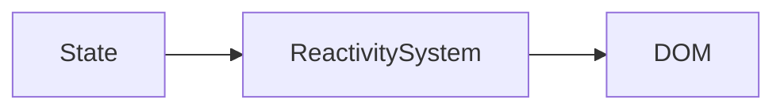
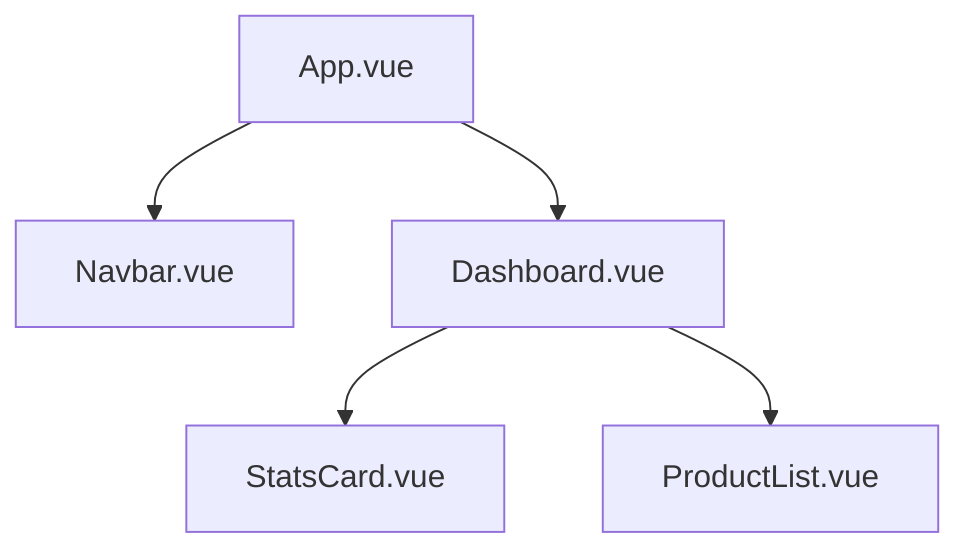
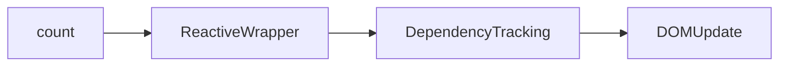
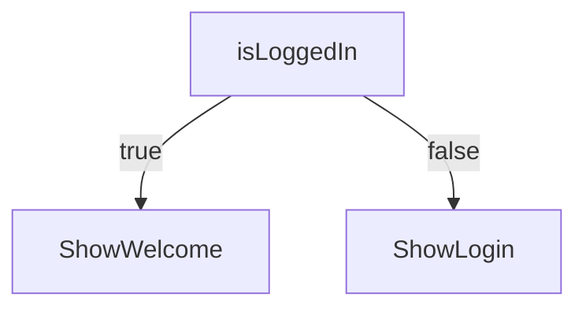
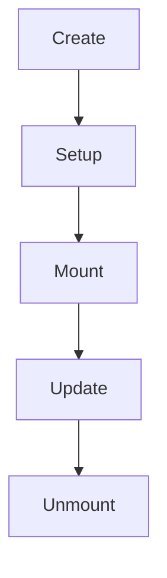
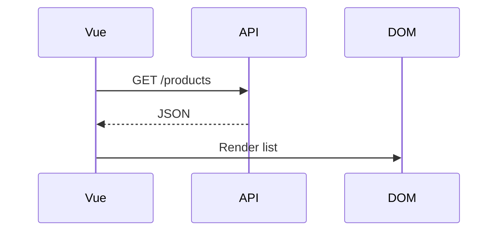
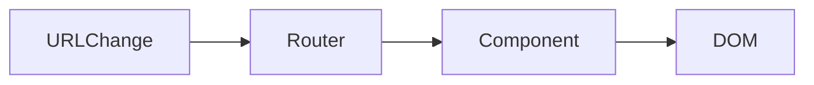
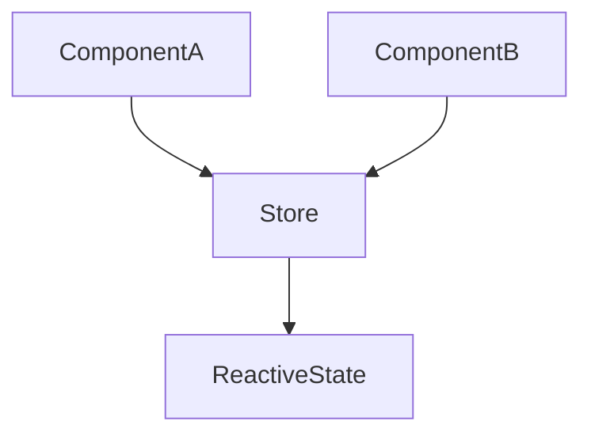
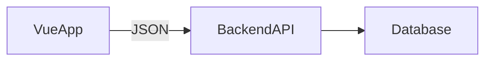

# 🚀 Vue 3 for Beginners

# A Mental-Model-First Guide to Building Real Applications

Modern frontend can feel overwhelming.

React. Hooks. Signals. State managers. Hydration. SSR. Build tools.

But Vue 3 takes a different approach:

> It gives you power without overwhelming you.

This guide will:

* Explain how Vue *actually works*
* Give you strong mental models
* Show diagrams of what’s happening
* Build progressively
* End with step-by-step instructions to build a real working app

No magic. Just clarity.

---

# 🧠 Part 1 — Understanding the Core Mental Model

## Mental Model #1: The DOM Is Expensive to Manage Manually

Without frameworks:

```html
<div>
  <p id="counter">0</p>
  <button onclick="increment()">Increment</button>
</div>

<script>
let count = 0
function increment() {
  count++
  document.getElementById("counter").innerText = count
}
</script>
```

This works.

But as apps grow:

* Multiple components
* Conditional UI
* Async API calls
* Shared state
* Complex forms

Manual DOM updates become fragile.

---

## Mental Model #2: Vue Is a Reactive State Machine

Instead of:

> “Change the DOM.”

Vue says:

> “Change the data.”

Diagram:



When state changes:

1. Vue detects change
2. Vue figures out what depends on it
3. Vue updates only those DOM parts

You never manually re-render.

---

# 🧠 Mental Model #3: A Vue App Is a Tree of Components

Think in trees.



Each component:

* Has its own template
* Has its own state
* Has its own logic

Apps are just nested reusable pieces.

---

# 🧠 Part 2 — Core Vue 3 Concepts Explained Clearly

---

# 1️⃣ Reactivity in Vue 3

Vue 3 uses proxies internally.

You don’t need to understand proxies deeply, but understand this:

> Vue tracks what your template reads.

When that value changes, Vue updates it.

---

## `ref()` — For Primitive Values

```vue
<script setup>
import { ref } from 'vue'

const count = ref(0)

function increment() {
  count.value++
}
</script>

<template>
  <p>{{ count }}</p>
  <button @click="increment">Increment</button>
</template>
```

### Why `.value`?

Because `ref()` wraps your value in a reactive container.

Internally:



---

## `reactive()` — For Objects

```js
import { reactive } from 'vue'

const state = reactive({
  name: "Sean",
  loggedIn: false
})
```

No `.value` needed.

Use:

* `ref()` → primitives
* `reactive()` → objects

---

# 2️⃣ Template Syntax = Declarative UI

In Vue:

```vue
<p>{{ count }}</p>
```

You’re saying:

> “This paragraph depends on `count`.”

Vue tracks it automatically.

---

## Conditionals

```vue
<p v-if="isLoggedIn">Welcome back</p>
<p v-else>Please log in</p>
```

Diagram:



---

## Loops

```vue
<li v-for="product in products" :key="product.id">
  {{ product.name }}
</li>
```

Important: always use `:key`.

---

# 3️⃣ Lifecycle Hooks

Vue components go through phases.



Most common:

```js
import { onMounted } from 'vue'

onMounted(() => {
  console.log("Component mounted")
})
```

Use it for:

* Fetching data
* Initial setup
* Subscriptions

---

# 4️⃣ Fetching Data (API Calls)

Install Axios:

```bash
npm install axios
```

Example:

```vue
<script setup>
import { ref, onMounted } from 'vue'
import axios from 'axios'

const products = ref([])

onMounted(async () => {
  const response = await axios.get('http://localhost:8000/api/products/')
  products.value = response.data
})
</script>
```

Flow:



---

# 5️⃣ Routing (Single Page Applications)

Vue Router allows multiple pages without reloading.

Install during project creation.

Example router:

```js
import { createRouter, createWebHistory } from 'vue-router'
import Home from '../views/Home.vue'
import Dashboard from '../views/Dashboard.vue'

const routes = [
  { path: '/', component: Home },
  { path: '/dashboard', component: Dashboard }
]

export default createRouter({
  history: createWebHistory(),
  routes
})
```

In `App.vue`:

```vue
<template>
  <router-view />
</template>
```

Routing diagram:



---

# 6️⃣ Global State (Pinia)

When multiple components need shared state:



Install:

```bash
npm install pinia
```

Store example:

```js
import { defineStore } from 'pinia'

export const useUserStore = defineStore('user', {
  state: () => ({
    token: null,
    username: null
  })
})
```

---

# 🏗 Part 3 — Architecture: Vue + Backend

Typical architecture:



Vue:

* UI
* Routing
* State

Backend:

* Auth
* Business logic
* Database

---

# 🚀 Part 4 — Build a Fully Working Vue 3 App (Step-by-Step)

We will build:

> 📝 A Task Manager App
> With:

* Add tasks
* Delete tasks
* Mark complete
* Routing
* State management

---

# 🛠 Step 1 — Create Project

```bash
npm create vue@latest
```

Select:

* Vue 3
* Router: Yes
* Pinia: Yes

Then:

```bash
cd task-app
npm install
npm run dev
```

---

# 🛠 Step 2 — Create Task Store

`stores/task.js`

```js
import { defineStore } from 'pinia'

export const useTaskStore = defineStore('tasks', {
  state: () => ({
    tasks: []
  }),
  actions: {
    addTask(title) {
      this.tasks.push({
        id: Date.now(),
        title,
        completed: false
      })
    },
    toggleTask(id) {
      const task = this.tasks.find(t => t.id === id)
      task.completed = !task.completed
    },
    deleteTask(id) {
      this.tasks = this.tasks.filter(t => t.id !== id)
    }
  }
})
```

---

# 🛠 Step 3 — Create Home View

`views/Home.vue`

```vue
<script setup>
import { ref } from 'vue'
import { useTaskStore } from '@/stores/task'

const store = useTaskStore()
const newTask = ref('')

function add() {
  if (newTask.value.trim()) {
    store.addTask(newTask.value)
    newTask.value = ''
  }
}
</script>

<template>
  <div>
    <h1>Task Manager</h1>

    <input v-model="newTask" placeholder="New task" />
    <button @click="add">Add</button>

    <ul>
      <li v-for="task in store.tasks" :key="task.id">
        <span 
          :style="{ textDecoration: task.completed ? 'line-through' : 'none' }"
          @click="store.toggleTask(task.id)"
        >
          {{ task.title }}
        </span>
        <button @click="store.deleteTask(task.id)">❌</button>
      </li>
    </ul>
  </div>
</template>
```

---

# 🛠 Step 4 — Add Router Page

`views/About.vue`

```vue
<template>
  <div>
    <h1>About This App</h1>
    <p>Built with Vue 3 + Pinia + Router</p>
  </div>
</template>
```

Update router:

```js
{ path: '/about', component: () => import('../views/About.vue') }
```

---

# 🛠 Step 5 — Add Navigation

In `App.vue`:

```vue
<template>
  <nav>
    <router-link to="/">Home</router-link>
    |
    <router-link to="/about">About</router-link>
  </nav>

  <router-view />
</template>
```

---

# 🎉 You Now Have

* Reactive state
* Component architecture
* Routing
* Global store
* Working CRUD UI

All in ~100 lines.

---

# 🧠 Final Mental Model Recap

Vue is:

* A reactivity engine
* A template compiler
* A component system
* A router
* A state manager

You:

1. Define state
2. Bind state to template
3. Update state
4. Vue updates DOM

That’s the loop.


