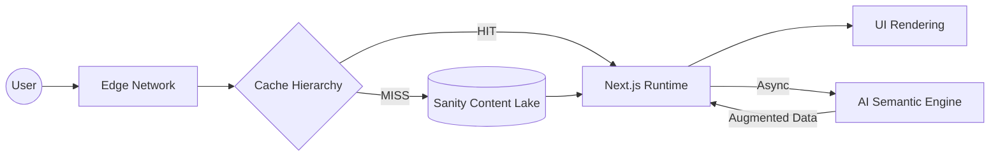
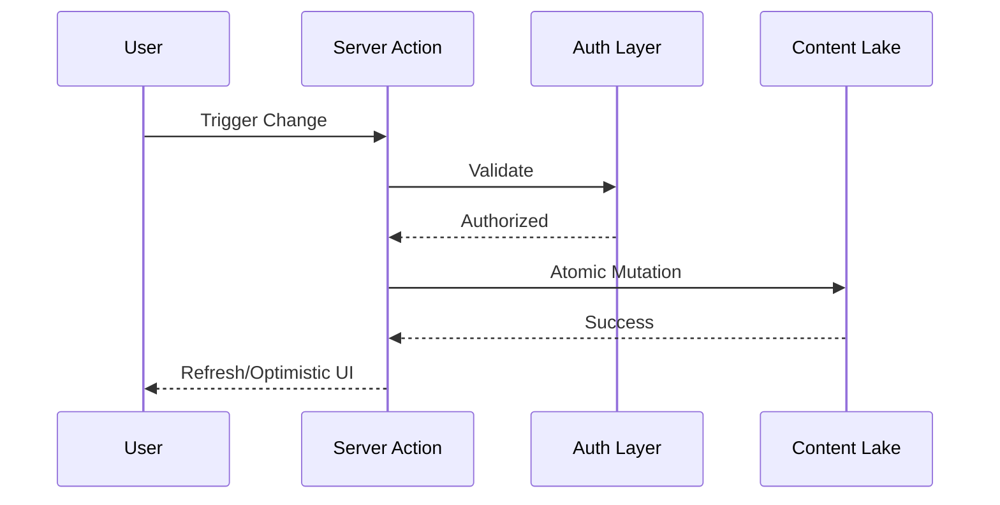
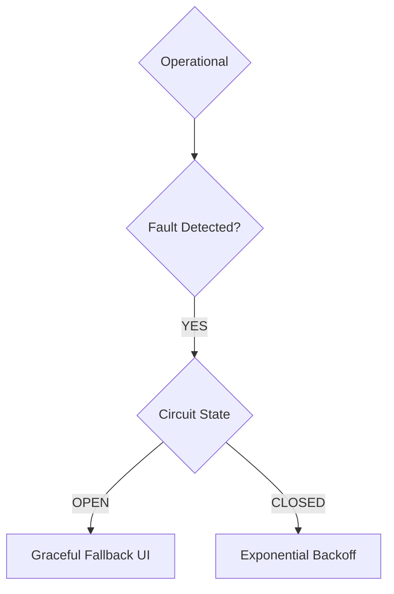

# Appendix L: System Design of GreyMatter Journal — The Architecture of Reality

---

## 1. The Distributed Reality: Beyond the Static Artifact

Software is not a static artifact; it is a **distributed illusion**. GreyMatter Journal exists simultaneously as a fluctuating state across global edge networks, server runtimes, browser memory, and high-dimensional vector databases.

The architecture is a **living organism**. To survive, it must:

* **Sense:** Use observability and telemetry to monitor system health in real-time.
* **Respond:** Execute secure mutations that maintain integrity across boundaries.
* **Adapt:** Employ intelligent caching layers that negotiate the trade-off between absolute freshness and user-perceived speed.
* **Survive:** Utilize circuit breakers and fallback mechanisms to ensure graceful degradation.

---

## 2. The Ten-Layer Architectural Stack

| Layer | Responsibility | Theoretical Constraint |
| --- | --- | --- |
| **1. Browser** | Client Engine | **Boundary:** The final trust/execution domain. |
| **2. Edge Network** | Latency Killer | **Physics:** The speed of light in signal routing. |
| **3. Next.js Runtime** | Orchestrator | **Control:** Conductor of stream resolution. |
| **4. RSC** | Rendering Paradigm | **Efficiency:** Payload vs. Interactivity. |
| **5. Server Actions** | Secure Gateway | **Atomicity:** Collapsing intent into execution. |
| **6. Authentication** | Trust Layer | **Boundary:** Identity verification. |
| **7. Content Lake** | Source of Truth | **Decoupling:** Storage vs. Presentation. |
| **8. Caching Hierarchy** | Memory System | **Consistency:** Managing the CAP trade-off. |
| **9. AI Layer** | Semantic Engine | **Meaning:** High-dimensional interpretation. |
| **10. Observability** | Reality Reconstructor | **Insight:** Post-failure diagnosis. |

---

## 3. Visualization: The Flow of Reality

### The Read Path (Data Convergence)



### The Mutation Path (Atomic Integrity)



### The Survival Path (Failure/Degradation)



---

## 4. Engineering Mandates for Resilience

1. **Idempotency by Default:** Every mutation must be idempotent. Use `x-request-id` to prevent duplicate state corruption.
2. **Circuit Breaker Logic:** If the AI Vector Database or Sanity CMS fails, "trip the circuit" to serve cached content rather than crashing the UI.
3. **Observability-Driven Development (ODD):** Use distributed `trace-id` headers for every request to map the path of data across all ten layers.

---

## 5. The Immune System: Robust Orchestration

Simple `fetch` is technical debt. Your orchestration layer acts as the system's immune system.

```typescript
export async function resilientFetch(url: string, options: RequestInit, { retries = 3, backoff = 1000 } = {}) {
  const correlationId = crypto.randomUUID();
  try {
    const res = await fetch(url, { ...options, headers: { 'x-trace-id': correlationId } });
    if (res.status >= 500) throw new Error("Transient Server Error");
    return res;
  } catch (e) {
    if (retries > 0) {
      await new Promise(res => setTimeout(res, backoff));
      return resilientFetch(url, options, { retries: retries - 1, backoff: backoff * 2 });
    }
    throw e;
  }
}

```

---

## 6. The Sensory System: Heartbeat Monitor

To move from passive to active observability, we implement a background probe that tracks the "vitals" of your architecture.

### Implementation: `system-health.ts`

```typescript
export async function checkSystemHealth(): Promise<SystemHealth> {
  const check = async (url: string) => {
    try {
      const res = await fetch(url, { method: 'HEAD' });
      return res.ok ? 'healthy' : 'degraded';
    } catch { return 'offline'; }
  };
  return {
    sanitry: await check(process.env.SANITY_ENDPOINT!),
    aiEngine: await check(process.env.AI_API_ENDPOINT!),
    authProvider: await check(process.env.AUTH_ENDPOINT!),
    lastChecked: new Date(),
  };
}

```

### The Feedback Loop: Notification Webhook

To complete the "Survival" requirement, we integrate an automated notification agent. When the `Heartbeat Monitor` detects an `offline` or `degraded` state, it triggers a webhook to your agentic notification layer:

```typescript
// orchestration/notifier.ts
export async function notifyOnFailure(status: SystemHealth) {
  const isDown = Object.values(status).includes('offline');
  if (isDown) {
    await fetch(process.env.AGENT_WEBHOOK!, {
      method: 'POST',
      body: JSON.stringify({ message: "CRITICAL: System degradation detected", status })
    });
  }
}

```

---

## 7. Philosophy of Shared Reality: Convergence

GreyMatter Journal is an exercise in maintaining a **Shared Model of Reality**. In a distributed system, there is no single state—only a series of converging views.

* **Convergence:** Minimize the delta between the *User's Reality* and the *Server's Truth*.
* **Optimistic UI:** Update the client immediately to hide network latency, while the server handles reconciliation in the background.

**You are no longer a developer building a web app.**
**You are a systems architect designing a distributed reality.**
