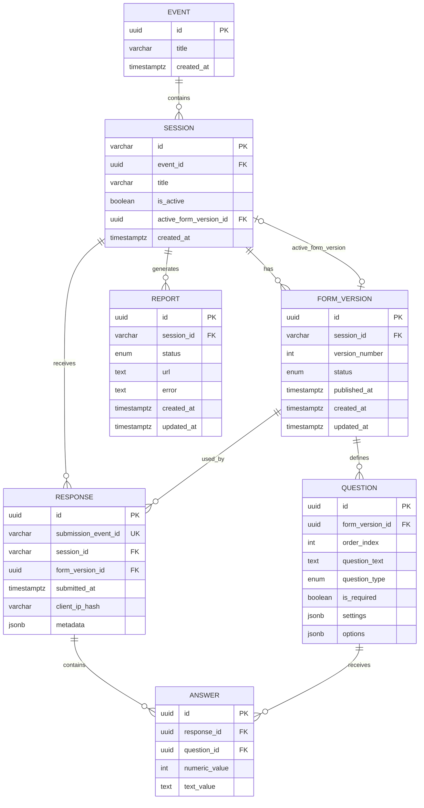

# GreyMatter Feedback Data Model and ERD Narration

## 1. Data Model Overview

GreyMatter Feedback uses a relational data model designed for:

- Different forms per event, course, or session.
- Draft and published form workflows.
- Historical reporting accuracy.
- Anonymous participant responses.
- Question-level analytics.
- Asynchronous report generation.

The core model is:

```text
Event
  └── Session
        ├── FormVersion
        │     └── Question
        │
        ├── Response
        │     └── Answer
        │
        └── Report
```

The most important architectural principle is:

> A participant response is permanently linked to the exact form version and questions that the participant saw.

---

# 2. Entity Relationship Diagram

## 2.1 Logical ERD

```text
┌───────────────────────────────┐
│             EVENT             │
├───────────────────────────────┤
│ PK id                         │
│    title                      │
│    created_at                 │
└───────────────┬───────────────┘
                │ 1
                │
                │ has many
                │
                ▼ many
┌─────────────────────────────────────────────┐
│                   SESSION                   │
├─────────────────────────────────────────────┤
│ PK id                                       │
│ FK event_id                                 │
│    title                                    │
│    is_active                                │
│ FK active_form_version_id  nullable         │
│    created_at                               │
└───────┬──────────────────────┬──────────────┘
        │                      │
        │ 1                    │ 1
        │                      │
        │ has many             │ has many
        ▼ many                 ▼ many
┌─────────────────────┐   ┌─────────────────────────┐
│    FORM_VERSION     │   │         RESPONSE        │
├─────────────────────┤   ├─────────────────────────┤
│ PK id               │   │ PK id                   │
│ FK session_id       │   │ UQ submission_event_id  │
│    version_number   │   │ FK session_id           │
│    status           │   │ FK form_version_id      │
│    published_at     │   │    submitted_at         │
│    created_at       │   │    client_ip_hash       │
│    updated_at       │   │    metadata             │
└─────────┬───────────┘   └───────────┬─────────────┘
          │ 1                         │ 1
          │                           │
          │ has many                  │ has many
          ▼ many                      ▼ many
┌─────────────────────┐   ┌─────────────────────────┐
│      QUESTION       │   │          ANSWER         │
├─────────────────────┤   ├─────────────────────────┤
│ PK id               │   │ PK id                   │
│ FK form_version_id  │   │ FK response_id          │
│    order_index      │   │ FK question_id          │
│    question_text    │   │    numeric_value        │
│    question_type    │   │    text_value           │
│    is_required      │   └───────────┬─────────────┘
│    settings         │               │ many
│    options          │               │
└─────────────────────┘               │ belongs to
                                      ▼ 1
                             ┌─────────────────────┐
                             │      QUESTION       │
                             └─────────────────────┘

┌─────────────────────────┐
│         REPORT          │
├─────────────────────────┤
│ PK id                   │
│ FK session_id           │
│    status               │
│    url                  │
│    error                │
│    created_at           │
│    updated_at           │
└───────────┬─────────────┘
            │ many
            │
            │ belongs to
            ▼ 1
       ┌─────────────┐
       │   SESSION   │
       └─────────────┘
```

---

## 2.2 Mermaid ERD

Use this in Markdown tools that support Mermaid.



---

# 3. ERD Narration

## 3.1 Event

An **Event** is the top-level container.

It represents a broad activity such as:

```text
React Summit 2026
Leadership Essentials Course
Annual Customer Conference
New Manager Training Program
```

One event can contain many sessions.

```text
React Summit 2026
├── Opening Keynote
├── Server Components Workshop
├── Advanced React Patterns
└── Closing Panel
```

### Relationship

```text
One Event → Many Sessions
```

The `sessions.event_id` foreign key identifies which event owns each session.

---

## 3.2 Session

A **Session** is the individual feedback target.

It can represent:

```text
A conference talk
A workshop
A course lesson
A training module
A course evaluation
A company town hall
A retrospective meeting
```

Example:

```text
Session title:
Advanced React Patterns

Session ID:
REACT-2026-Q3
```

The session ID is deliberately human-readable because it appears in public participant URLs and QR codes:

```text
/e/REACT-2026-Q3
```

A session owns:

```text
Form versions
Participant responses
PDF reports
```

### Session state

The `is_active` flag controls whether new participant feedback is accepted.

```text
is_active = true
→ Participant form may accept feedback.

is_active = false
→ Participant sees “Feedback is closed.”
```

A session can remain in the database after it is closed. Closing does not delete responses, reports, or historical form versions.

---

## 3.3 FormVersion

A **FormVersion** is a snapshot of a session feedback form.

It exists to protect historical accuracy.

Example session:

```text
REACT-2026-Q3
```

Example form versions:

```text
Version 1 — Archived
Version 2 — Published
Version 3 — Draft
```

### Status meanings

| Status | Meaning |
|---|---|
| `DRAFT` | Editable by administrators; hidden from participants |
| `PUBLISHED` | Available to participants through the session URL |
| `ARCHIVED` | Historical version retained for reporting |

### Why it matters

Suppose Version 1 asked:

```text
How useful was this workshop?
```

Later, an administrator wants Version 2 to ask:

```text
How useful were the hands-on exercises?
```

These questions do not measure exactly the same thing. Form versions prevent old answers from being relabeled under the newer wording.

### Relationship

```text
One Session → Many FormVersions
One FormVersion → Many Questions
One FormVersion → Many Responses
```

The `session.active_form_version_id` field points to the currently live form version for participants.

---

## 3.4 Question

A **Question** belongs to one specific form version.

It stores everything necessary to render and validate one participant field:

```text
Question text
Question type
Display order
Required flag
Type-specific settings
Choice options
```

Example rating question:

```text
How useful was this workshop?

Type: RATING
Required: Yes

Settings:
Minimum: 1
Maximum: 5
Minimum label: Not useful
Maximum label: Extremely useful
```

Example choice question:

```text
Which topic was most valuable?

Type: CHOICE

Options:
- Server Components
- Data fetching patterns
- Performance optimization
- Testing strategies
```

### Relationship

```text
One FormVersion → Many Questions
One Question → Many Answers
```

The `order_index` field determines the display order.

```text
Question 1
Question 2
Question 3
```

The system enforces one order position per form version:

```text
Unique(form_version_id, order_index)
```

---

## 3.5 Response

A **Response** represents one completed participant form submission.

One participant might submit:

```text
How useful was this workshop?              5
How likely are you to recommend it?        9
Which topic was most valuable?             Server Components
What should we improve?                    Add more exercise time.
```

The system creates:

```text
One Response record
Four Answer records
```

A response stores:

```text
Session ID
Form version ID
Submission timestamp
Privacy-aware IP hash
Safe technical metadata
Submission idempotency key
```

### Important: `form_version_id`

The response must store the precise form version shown to the participant.

```text
Response
└── form_version_id = Version 1
```

This allows reporting to preserve the historical question wording, settings, and options.

### Important: submission event ID

The baseline tutorial schema calls this field:

```text
event_id
```

However, this name can be confusing because GreyMatter Feedback already has an `Event` entity.

For production clarity, the recommended database and Prisma field name is:

```text
submission_event_id
```

or:

```text
idempotency_key
```

Its purpose is not to point to the `events` table. Its purpose is to store the unique submission identifier created by the participant browser and used by Inngest.

Recommended naming:

```text
Prisma field:
submissionEventId

PostgreSQL column:
submission_event_id
```

Example:

```text
6b9f6b86-8fc0-4e54-b064-2b60b848ac31
```

This unique value prevents duplicate responses if a request or background job is retried.

### Relationship

```text
One Session → Many Responses
One FormVersion → Many Responses
One Response → Many Answers
```

---

## 3.6 Answer

An **Answer** represents one response to one question.

It links:

```text
One Response
        +
One Question
```

The answer stores either a numeric value or a text value.

| Question Type | `numeric_value` | `text_value` |
|---|---:|---:|
| Rating | Yes | No |
| NPS | Yes | No |
| Choice | No | Yes |
| Text | No | Yes |

Example rating answer:

```text
Question:
How useful was this workshop?

numeric_value:
5
```

Example text answer:

```text
Question:
What should we improve?

text_value:
Add more time for hands-on exercises.
```

The following database constraint ensures a response cannot answer the same question twice:

```text
Unique(response_id, question_id)
```

---

## 3.7 Report

A **Report** represents a requested PDF summary.

It does not directly contain the PDF binary data. Instead, it tracks report generation and stores the generated file location.

Example lifecycle:

```text
Administrator requests PDF
        ↓
Report created: QUEUED
        ↓
Inngest starts job: PROCESSING
        ↓
PDF generated and uploaded
        ↓
Report becomes: COMPLETE
        ↓
Report URL becomes available
```

Possible status values:

| Status | Meaning |
|---|---|
| `QUEUED` | Request created and waiting for background processing |
| `PROCESSING` | PDF is being generated |
| `COMPLETE` | PDF file is available |
| `FAILED` | Generation or storage failed |

### Relationship

```text
One Session → Many Reports
```

A session can have many reports because administrators may generate updated reports as more responses arrive.

---

# 4. Cardinality Summary

| Parent Entity | Child Entity | Relationship |
|---|---|---|
| Event | Session | One-to-many |
| Session | FormVersion | One-to-many |
| FormVersion | Question | One-to-many |
| Session | Response | One-to-many |
| FormVersion | Response | One-to-many |
| Response | Answer | One-to-many |
| Question | Answer | One-to-many |
| Session | Report | One-to-many |
| Session | Active FormVersion | Zero-or-one to zero-or-one reference |

---

# 5. Participant Submission Data Flow

```text
Participant scans QR code
        ↓
Participant route loads Session
        ↓
Session points to activeFormVersionId
        ↓
Published FormVersion loads Questions
        ↓
Participant submits answers
        ↓
Response is created with:
- session_id
- form_version_id
- submission_event_id
        ↓
Answer records are created with:
- response_id
- question_id
- numeric_value or text_value
```

---

# 6. Form Publishing Data Flow

```text
Administrator creates Draft FormVersion
        ↓
Administrator creates Questions in draft
        ↓
Administrator publishes draft
        ↓
Current published version becomes ARCHIVED
        ↓
Draft becomes PUBLISHED
        ↓
Session.active_form_version_id points to new published version
        ↓
Participant QR route renders new version
```

---

# 7. Analytics Data Flow

```text
Session
        ↓
Responses for session
        ↓
Answers for responses
        ↓
Questions linked to answers
        ↓
Group by:
- question ID
- form version number
- question type
        ↓
Calculate:
- response total
- rating average
- rating distribution
- NPS
- choice counts
- written comments
```

---

# 8. Recommended Production ERD Enhancement

For production readiness, use this naming improvement in the `Response` entity:

```text
Current baseline name:
event_id

Recommended name:
submission_event_id
```

Recommended Prisma model excerpt:

```prisma
model Response {
  id                String   @id @default(uuid()) @db.Uuid
  submissionEventId String   @unique @map("submission_event_id") @db.VarChar(128)
  sessionId         String   @map("session_id") @db.VarChar(64)
  formVersionId     String   @map("form_version_id") @db.Uuid
  submittedAt       DateTime @default(now()) @map("submitted_at")
  clientIpHash      String?  @map("client_ip_hash") @db.VarChar(64)
  metadata          Json     @default("{}")

  session           Session     @relation(fields: [sessionId], references: [id], onDelete: Cascade)
  formVersion       FormVersion @relation(fields: [formVersionId], references: [id], onDelete: Restrict)
  answers           Answer[]

  @@index([sessionId, submittedAt])
  @@index([formVersionId])
  @@map("responses")
}
```

This avoids confusion between:

```text
Event entity:
events table

Submission event:
Inngest feedback/submitted event
```

---

# 9. Final ERD Narrative Summary

GreyMatter Feedback starts with an **Event**, such as a course or conference. Each event contains one or more **Sessions**, such as workshops, talks, or course modules.

Each session can have multiple **FormVersions**. Only one version is active and published at a time. Every form version contains its own ordered **Questions**.

When a participant submits feedback, the application stores one **Response**. That response is linked to the specific session and the exact form version that the participant completed. Each individual participant response is stored as an **Answer**, linked to both the response and its original question.

Administrators can request multiple **Reports** for a session. Each report tracks asynchronous PDF generation status and stores the resulting file location after completion.

This structure provides flexibility for different feedback forms while preserving accurate historical reporting.
