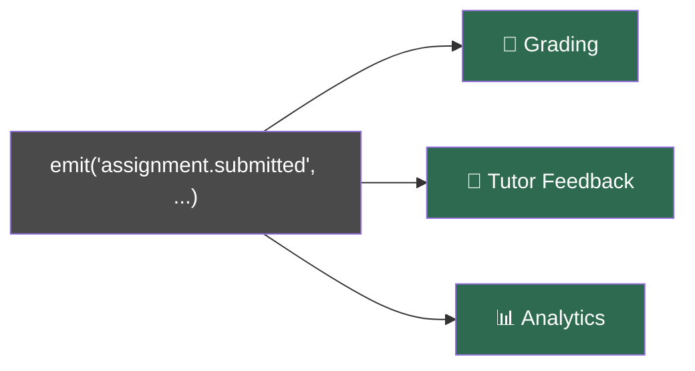
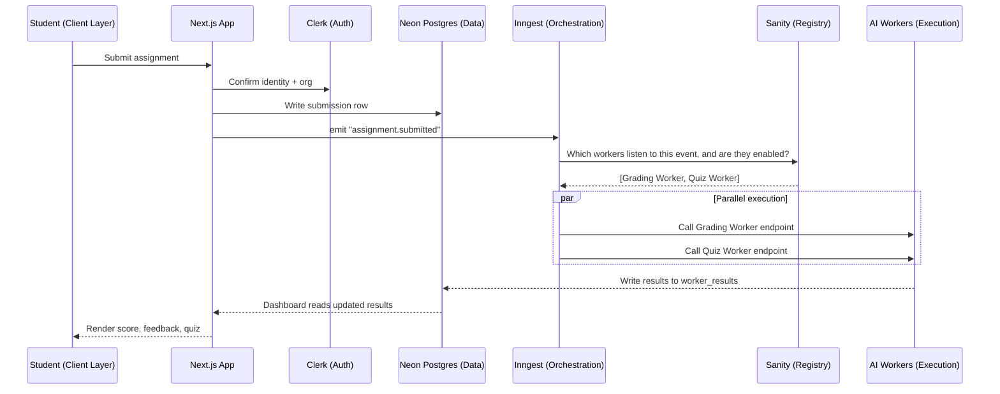
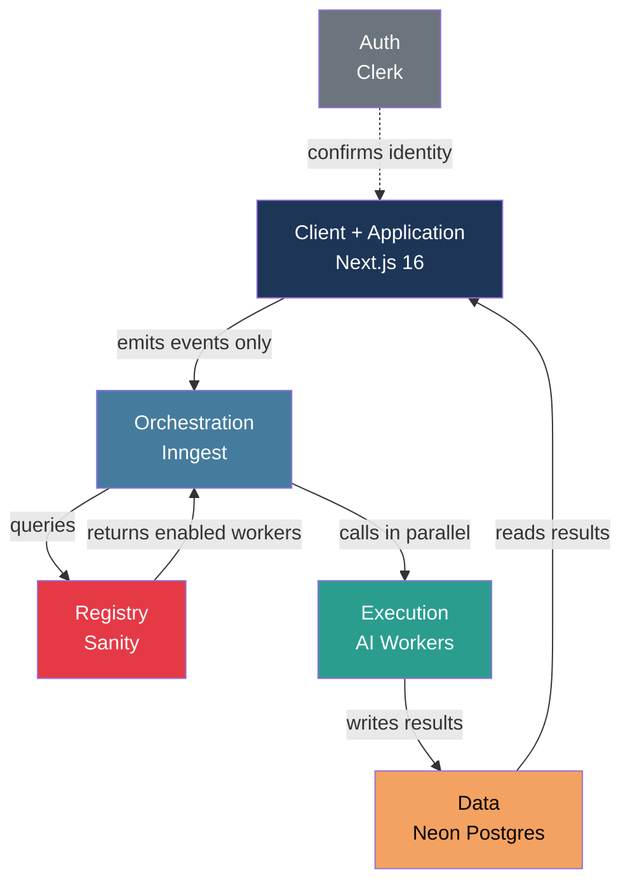
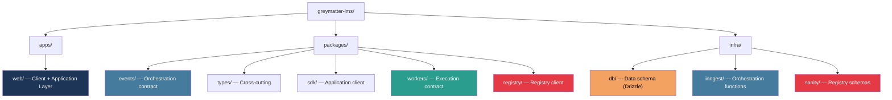
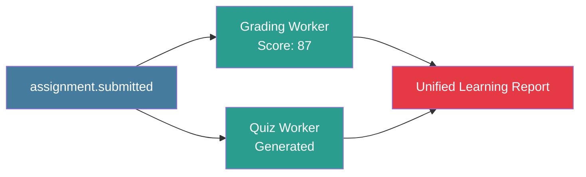
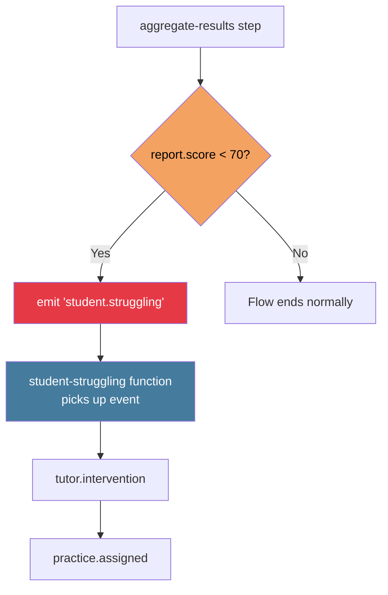
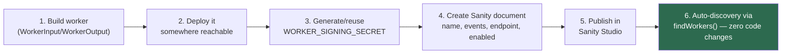
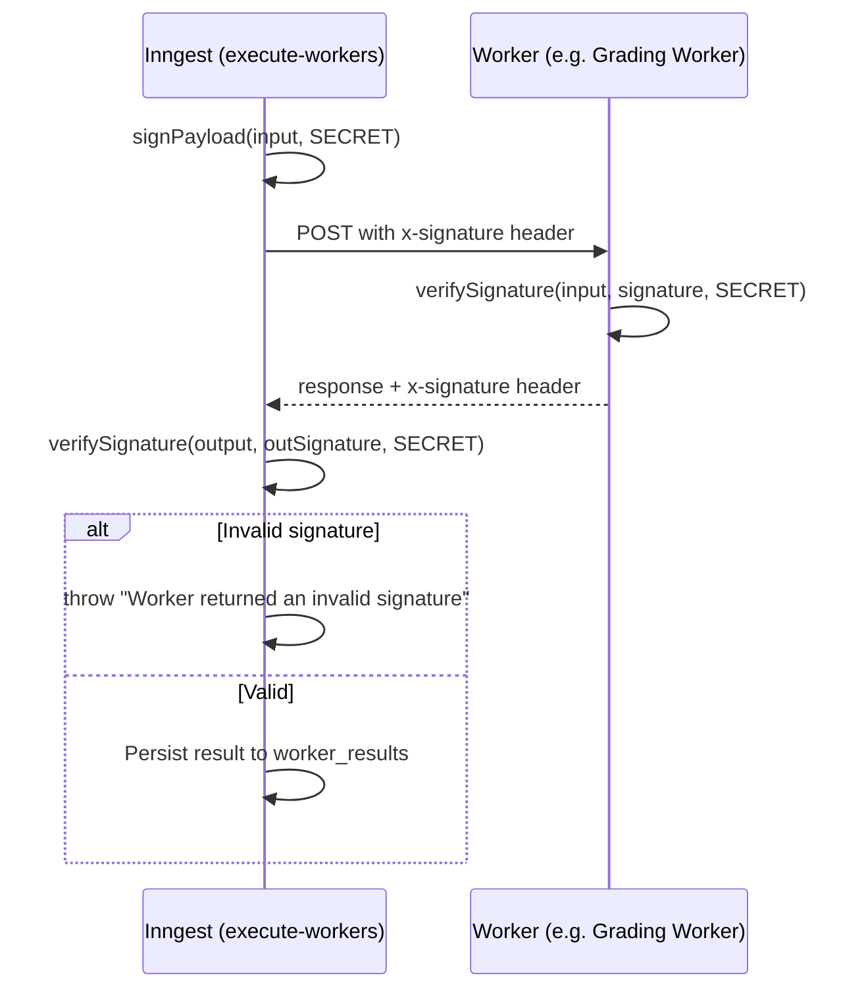
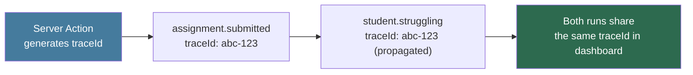
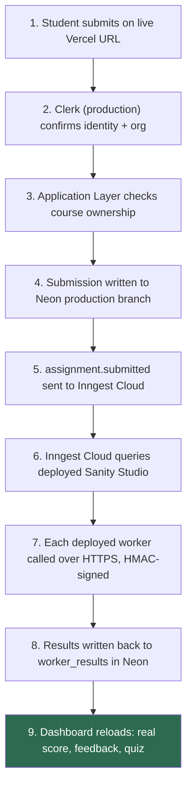

# Appendix A — System Architecture Reference

## A.1 The Foundational Principle

A Server Action should never call an AI model directly and skip Inngest — doing so would mean the Application Layer owns retry logic, worker discovery, and failure handling itself, recreating the "feature landfill" problem the series opens with [13]. Keeping AI execution behind the Orchestration and Registry layers is what lets a worker be disabled with zero code changes, and lets new AI workers be added later with zero core changes [12].

This traces back to a 10-line `emit()` simulation in Part 0:

```javascript
// One action, three independent reactions
emit("assignment.submitted", { submissionId: "sub_123", studentId: "stu_456" });
```

One `emit()` call fires three independent reactions — grading, tutor feedback, analytics — none of which know about each other, and a fourth could be added or removed without touching the others [13]. Everything built from Part 5 onward with Inngest is a durable, production-grade version of that same function [13].



The common confusion at this stage is worth stating directly: this demo is trivial, so why does the real system need Inngest, Sanity, HMAC signing, and observability at all? Because a toy `emit()` function doesn't survive contact with production — it can't retry a failed worker, can't discover new workers without a code change, can't verify a request wasn't forged, and can't tell you *why* something failed [13]. Parts 5 through 10 exist to turn this simple idea into something durable enough to actually run, with real AI workers added in Part 11 with zero changes to the core [13].

---

## A.2 The Five Architectural Layers

Greymatter LMS is built from five layers, each with one job and a strict rule about who it's allowed to talk to [12]:

* **Client + Application Layer** — Next.js 16 (React 19). Renders UI, runs Server Actions, and emits events. Never runs AI logic directly [12].
* **Auth** — Clerk. Handles authentication and org membership [12].
* **Data Layer** — Neon Postgres via Drizzle ORM. Stores courses, submissions, and worker results. Never decides *what* runs [12].
* **Orchestration Layer** — Inngest. The event bus and workflow engine. The only place that decides "this event happened, go run these workers" [12].
* **Registry Layer** — Sanity. The only place that knows which workers exist and what events they listen to [12].
* **Execution Layer** — independently deployed AI Workers. The only place AI logic actually lives [12].

Tracing one event end-to-end: Inngest queries Sanity to discover which workers listen to `assignment.submitted` and are enabled (Registry Layer), then calls each matching worker's endpoint independently and in parallel (Execution Layer), each worker's result is written back into Neon Postgres in a shared `worker_results` table (Data Layer), and the student's dashboard reads those updated results and renders them (Client Layer) [12].



The Registry Layer — not the frontend, and not Inngest itself — decides which workers run for a given event; Inngest only queries the registry [12]. A useful self-check: without looking back at the steps above, try to answer which layer decides *which* workers run for a given event. The answer is the Registry Layer, Sanity — this distinction is exactly what Part 6 builds [4][12].



**🩹 Common confusion:** "Why can't a Server Action just call the AI model directly and skip Inngest entirely — wouldn't that be faster?" It would be faster to write, but it would also mean the Application Layer now owns retry logic, worker discovery, and failure handling itself — exactly the "feature landfill" problem from Part 0 [13]. Keeping AI execution behind the Orchestration and Registry layers is what lets Part 6 disable a worker with zero code changes, and Part 11 add real AI workers with zero core changes [10][12].

---

## A.3 Monorepo Structure

Boundaries are enforced by folders, not just convention: `apps/web`, `packages/*`, and `infra/*` [8]. Turborepo wires scripts to run across every package at once via a root `turbo.json` and matching `dev`/`build` scripts [8].

Mapping the folder structure onto the five layers makes clear why each package exists [8][12]:

| Folder | Layer it serves | Why it's separate |
|---|---|---|
| `apps/web` | Client + Application | The only place UI renders and Server Actions run [8] |
| `packages/events` | Orchestration (contract) | Shared event shape — imported by both the frontend and Inngest functions later, so neither one "owns" it [8] |
| `packages/types` | Cross-cutting | Shared TypeScript types used across the app and workers [8] |
| `packages/sdk` | Application | A client SDK for interacting with Greymatter LMS [8] |
| `packages/workers` | Execution (contract) | The `WorkerInput`/`WorkerOutput` shape and signing helpers every worker implements, starting in Part 7 [8] |
| `packages/registry` | Registry | The client used to query the Sanity worker registry, starting in Part 6 [8] |
| `infra/db` | Data | Drizzle schema, shared by both the app and any Inngest functions that persist worker results [8] |
| `infra/inngest` | Orchestration | The actual event functions/workflows, built starting in Part 5 [8] |
| `infra/sanity` | Registry | Worker registry schemas, built starting in Part 6 [8] |



**🩹 Common confusion:** "Why is `infra/db` separate from `apps/web` if the app is the only thing querying the database right now?" Because starting in Part 5, Inngest workers will *also* need to read/write to Neon Postgres to persist worker results. Keeping schema definitions in their own package means both the Application Layer and the Orchestration Layer share one source of truth, instead of each maintaining its own copy that can drift out of sync [8].

---

## A.4 Multi-Tenant Isolation (`orgId`) — completing the Threat Model Summary

| Threat | Where it enters | Greymatter LMS defense |
|---|---|---|
| Spoofed events hitting `/api/inngest` directly | Orchestration Layer | Inngest's signing key + our own event-origin checks [1] |
| Forged worker responses | Execution Layer | HMAC request signing, built in Part 7 [1] |
| Cross-tenant data leakage | Data Layer | Manual `orgId` checks in every query (Part 4), now reinforced inside Inngest steps [1] |
| Disabled/malicious worker still executing | Registry Layer | `enabled` flag check in the registry query (Part 6) [1] |
| Unauthorized Server Action calls | Application Layer | `auth()` re-check inside every Server Action (Part 3) [1] |

Notice this table maps directly onto the flowchart above it — each of the three rejection branches (`Reject1`, `Reject2`, `Reject3`) corresponds to one of these five named threats, closing the loop between the diagram and the actual defense-by-defense breakdown [1].

---

## A.5 Fan-Out — Multiple Workers, One Event

We now have two workers registered in Sanity — the Grading Worker and the Quiz Worker — and Part 7's real signed-execution pattern already handles calling more than one [2][3]. Fan-out simply means: when `assignment.submitted` fires, every matching worker runs at the same time, not one after another [2].



The `execute-workers` step from Part 7 already does this implicitly via `Promise.all` [2][3] — this part just makes the aggregation explicit and visible, matching the unified-report pattern from the original design [2].

---

## A.6 Conditional Branching — The Struggling-Student Path

Real adaptive behavior requires branching: if a student's grade is low, something different should happen than if it's high [2]. Critically, this decision lives in Inngest (Orchestration), never in the frontend or in a worker — respecting the exact boundary set back in Part 1 [2][12].



This is what creates the adaptive learning loop referenced throughout Part 8: `assignment.submitted → grading.completed → student.struggling → tutor.intervention → practice.assigned` [2].

**🩹 Common confusion:** "If anyone can call `inngest.send({ name: 'student.struggling', ... })` from anywhere, what stops a fake event from triggering a real tutor intervention?" — Nothing, at this stage, and that's intentional so the chaining mechanism itself stays simple to learn first. Part 9 closes this gap directly by restricting which internal events can be sent from where, as part of its full threat model [2].

---

## A.7 Worker Registration — The Six-Step Flow

Adding a new AI capability should never require touching `apps/web` or `infra/inngest`. This is the exact repeatable sequence every future worker — Quiz Worker, Tutor Worker, Summary Worker in Part 11 — follows [3]:



This six-step flow is what Part 6 proves concretely: toggling `enabled` to `false` on the Grading Worker's Sanity document, publishing with no code touched, and confirming `discover-workers` returns an empty array — then flipping it back and confirming the worker is discovered again [4][3].

---

## A.8 HMAC Signing — Request and Response Verification

Every worker call is signed on the way out and verified on the way back, using an `x-signature` header on both the request and response [3]:



**✅ Checkpoint:** With the Grading Worker running (`localhost:4000`) and its Sanity registry document still pointing at that URL, resubmit an assignment through the dashboard. In the Inngest dashboard, confirm `execute-workers` shows a real score in its output — not the placeholder `{}` from Part 5 — and confirm `persist-results` writes that score into `worker_results` in Neon [3].

---

## A.9 Observability — Trace IDs Across the Whole Chain

Since Part 8 introduced fan-out execution and multi-step event chains, a single student action can silently touch five or six independent systems [11]. The core mechanism introduced to fix this is a trace ID: one identifier generated at the start of a request, threaded through every downstream event, worker call, and log line — even across function boundaries [11].



**✅ Checkpoint:** Force a low score (as in Part 8's conditional-branch checkpoint) and resubmit. In the Inngest dashboard, open both the `assignment-submitted` and `student-struggling` runs, and confirm the exact same `traceId` value appears in each run's event payload — proving they're now provably linked, not just adjacent in time [11].

---

## A.10 Production Deployment — The Full End-to-End Trace

With every layer deployed, the original nine-step request lifecycle from Part 1 runs one final time, on real infrastructure [9][12]:



---

## Series Complete

Starting from a 10-line `emit()` simulation in Part 0 [13], the series builds, in order: a five-layer architecture [12], a boundary-enforcing monorepo [8], a Clerk-authenticated Next.js frontend [7], a full Neon/Drizzle schema [6], a real Inngest orchestration pipeline [5], a live Sanity worker registry [4], a signed Worker SDK [3], fan-out/fan-in/event chaining [2], a hardened threat model [1], a full observability pipeline [11], real AI-native features [10], and a complete production deployment [9] — proving the philosophy the series opened with: **events, not features** [13].
