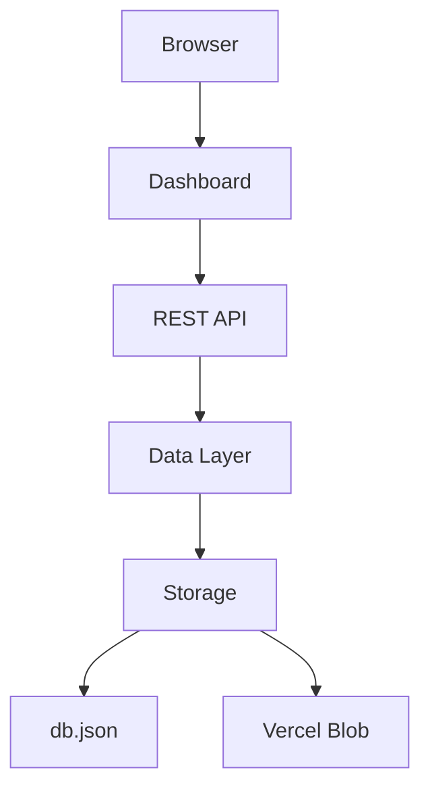
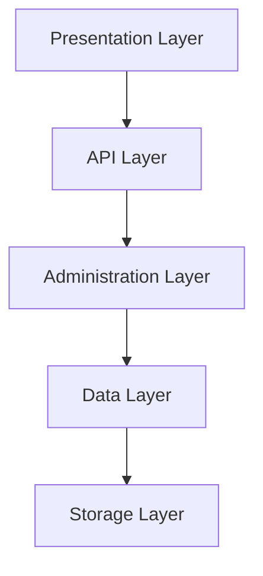
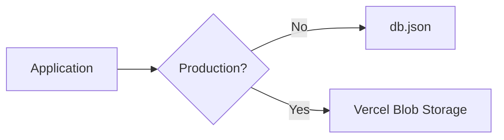

# Building Greymatter API Server with Next.js 16

## Part 0 – Introduction

> Build a modern mock REST API server using **Next.js 16**, **App Router**, and **Vercel Blob Storage**.

---

# Welcome

Welcome to the second edition of **Building Greymatter API Server**.

In this tutorial series, you will build a fully functional mock REST API server from scratch using **Next.js 16** and the **App Router** architecture.

Unlike traditional mock API servers that rely on Express, JSON Server, or LowDB, Greymatter is designed as a modern serverless application that can run locally during development or be deployed directly to **Vercel** without changing the code.

By the end of this series you will have built a complete API platform featuring:

* Generic REST endpoints
* Automatic CRUD operations
* Browser-based administration dashboard
* JSON dataset management
* Upload and download capabilities
* Preset datasets
* Dataset viewer
* Health monitoring
* Local JSON persistence
* Vercel Blob Storage persistence
* Automatic environment detection

Most importantly, you'll understand *why* the application is designed this way and how each component works together.

---

# Why Build Another Mock API Server?

Frontend developers often need an API before the real backend has been completed.

Typical solutions include:

* JSON Server
* Mockoon
* Postman Mock Server
* Beeceptor
* Express applications

While these tools are useful, they also have limitations.

Many require separate installations, custom middleware, or local-only execution. Others are difficult to deploy as serverless applications.

Greymatter was created to solve these problems.

Instead of treating a mock API as a temporary development tool, Greymatter provides a reusable REST platform that can run both locally and in production.

---

# What is Greymatter?

Greymatter is a lightweight REST API server built with **Next.js**.

It allows you to create collections of JSON data and automatically exposes those collections as REST endpoints.

For example, creating a collection named:

```text
users
```

immediately provides a REST API:

```text
GET    /api/users
POST   /api/users
GET    /api/users/1
PUT    /api/users/1
PATCH  /api/users/1
DELETE /api/users/1
```

No additional coding is required.

---

# What We'll Build

Throughout this series we'll construct the application layer by layer.



By the end of the course you'll understand every layer of this architecture.

---

# The Application Architecture

Greymatter follows a layered architecture.



Each layer has a single responsibility.

This separation makes the application easier to maintain, test, and extend.

---

# Major Features

The completed application includes the following capabilities.

## Generic CRUD Engine

Instead of creating one controller for every resource, Greymatter uses a single generic CRUD engine capable of serving every collection.

Adding a new collection automatically creates a complete REST API.

---

## Browser Dashboard

The dashboard allows users to:

* Browse collections
* Create collections
* Delete collections
* View datasets
* Upload JSON
* Download datasets
* Load demo data
* Monitor server status

All operations occur through the same REST API exposed to external clients.

---

## Flexible Storage

During development Greymatter stores data in a local JSON file.

When deployed to Vercel the same code automatically switches to Vercel Blob Storage.



No application code needs to change when deploying.

---

# Technologies Used

Throughout the tutorial we'll work with:

| Technology          | Purpose              |
| ------------------- | -------------------- |
| Next.js 16          | Full-stack framework |
| React               | User interface       |
| App Router          | Routing              |
| Route Handlers      | REST API             |
| JavaScript (ES2023) | Application code     |
| Vercel Blob         | Cloud storage        |
| JSON                | Data persistence     |
| Git                 | Version control      |

No prior knowledge of Next.js is required, although basic JavaScript and HTTP concepts are assumed.

---

# What You'll Learn

By completing this tutorial you will learn how to:

* Build REST APIs using Route Handlers
* Design a generic CRUD engine
* Build reusable data access layers
* Persist data using JSON
* Persist data using Vercel Blob Storage
* Build an administration dashboard
* Upload and download datasets
* Design RESTful APIs
* Deploy to Vercel
* Structure a production-quality Next.js application

---

# Who Is This Tutorial For?

This tutorial is intended for:

* Frontend developers
* Backend developers
* Students learning REST APIs
* JavaScript developers
* Next.js beginners
* Educators
* Anyone interested in API design

---

# Source Code

The completed application is available in the Greymatter API Server repository.

Each part of this tutorial builds toward that final implementation.

You are encouraged to compare your solution with the finished project after completing each chapter.

---

# Tutorial Roadmap

This second edition consists of the following parts.

| Part | Topic                              |
| ---- | ---------------------------------- |
| 0    | Introduction                       |
| 1    | Creating the Next.js Project       |
| 2    | Project Structure                  |
| 3    | Building the Data Layer            |
| 4    | Creating the Generic CRUD API      |
| 5    | Query Parameters and Relationships |
| 6    | Building the Administration API    |
| 7    | Building the Dashboard             |
| 8    | Dataset Viewer                     |
| 9    | Uploads and Presets                |
| 10   | Products API                       |
| 11   | Health Monitoring                  |
| 12   | Storage Abstraction                |
| 13   | Deployment to Vercel               |
| 14   | Testing                            |
| 15   | Architecture Review                |
| 16   | Future Improvements                |

---

# In the Next Part

In Part 1 we'll create the project using **Next.js 16**, explore the App Router directory structure, install the required dependencies, and prepare the foundation for the Greymatter API Server.

By the end of the next chapter you'll have a running Next.js application ready to evolve into a complete mock REST API platform.
