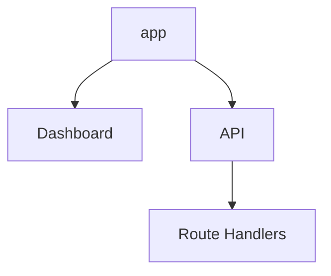
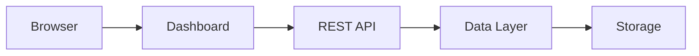

# Building Greymatter API Server with Next.js 16

## Part 1 – Creating the Project

In Part 0, we explored the goals and architecture of Greymatter API Server. In this chapter, we'll create the project, examine the directory structure, and prepare the foundation for the REST API we'll build throughout this series.

By the end of this chapter you will have:

* A running Next.js 16 application
* A clean project structure
* An understanding of the App Router
* Git initialized
* The dependencies needed for the remainder of the tutorial

---

# Learning Objectives

After completing this chapter you should be able to:

* Create a Next.js application
* Understand the App Router directory structure
* Start the development server
* Navigate the project layout
* Understand where the REST API and dashboard will live

---

# Why Next.js?

The original version of Greymatter was built using Express and JSON Server.

Although that architecture worked well locally, it was difficult to deploy as a serverless application.

Next.js provides several advantages:

* Full-stack framework
* Built-in React support
* File-based routing
* API Route Handlers
* Server Components
* Excellent Vercel integration
* Zero configuration deployment

Most importantly, the frontend dashboard and REST API live in the same project.

---

# Prerequisites

Before continuing, ensure the following software is installed.

| Software           | Recommended Version |
| ------------------ | ------------------: |
| Node.js            |     18 LTS or later |
| npm                |              Latest |
| Git                |              Latest |
| Visual Studio Code |              Latest |

Verify your installation.

```bash
node --version
npm --version
git --version
```

---

# Creating the Project

Create the project using Create Next App.

```bash
npx create-next-app@latest greymatter-api-server
```

When prompted, choose:

| Option        | Value |
| ------------- | ----- |
| TypeScript    | No    |
| ESLint        | Yes   |
| Tailwind CSS  | No    |
| src directory | No    |
| App Router    | Yes   |
| Turbopack     | Yes   |
| Import alias  | No    |

After installation, change into the project directory.

```bash
cd greymatter-api-server
```

---

# Running the Development Server

Start the application.

```bash
npm run dev
```

Open your browser.

```text
http://localhost:3000
```

You should see the default Next.js welcome page.

Congratulations—you now have a running full-stack application.

---

# Project Structure

The generated project looks similar to this.

```text
greymatter-api-server/
│
├── app/
│   ├── favicon.ico
│   ├── globals.css
│   ├── layout.js
│   └── page.js
│
├── public/
│
├── .gitignore
├── package.json
├── next.config.js
└── README.md
```

As the tutorial progresses, we'll expand this structure.

---

# Understanding the App Router

Unlike the old Pages Router, the App Router organizes the application around folders.

Every folder represents part of your application.

For example:

```text
app/
```

contains the user interface.

Later we'll add:

```text
app/api/
```

which will contain our REST API.

The dashboard and API will therefore live side by side inside the same application.



---

# Route Handlers

Traditional Express applications define routes like this:

```javascript
app.get("/users", handler);
```

In Next.js, routes are represented by folders.

For example:

```text
app/api/users/route.js
```

automatically becomes:

```text
GET /api/users
```

No router configuration is required.

We'll use this feature extensively throughout the tutorial.

---

# Initializing Git

Create a Git repository if one wasn't created automatically.

```bash
git init
```

Create your first commit.

```bash
git add .
git commit -m "Initial Next.js project"
```

Making frequent commits throughout the tutorial makes it easier to experiment and recover from mistakes.

---

# Installing Additional Packages

Greymatter requires only a small number of additional packages.

Install them now.

```bash
npm install @vercel/blob
```

Later chapters may introduce additional dependencies, but we'll keep the project lightweight.

---

# Planning the Project Structure

By the end of the tutorial, your project will evolve into something like this.

```text
greymatter-api-server/
│
├── app/
│   ├── api/
│   ├── admin/
│   ├── globals.css
│   ├── layout.js
│   └── page.js
│
├── lib/
│   └── db.js
│
├── presets/
│
├── public/
│
├── db.json
│
├── package.json
└── next.config.js
```

Each directory has a specific purpose.

| Folder       | Purpose                    |
| ------------ | -------------------------- |
| `app/`       | Dashboard and API routes   |
| `app/api/`   | Generic REST API           |
| `app/admin/` | Administration endpoints   |
| `lib/`       | Shared business logic      |
| `presets/`   | Demo datasets              |
| `public/`    | Static assets              |
| `db.json`    | Local development database |

---

# Application Overview

By the end of the series, requests will flow through the application like this.



Although only a few files exist today, this architecture will gradually emerge as we build each layer.

---

# What We've Accomplished

In this chapter you have:

* Created a Next.js 16 project
* Started the development server
* Explored the App Router
* Learned how Route Handlers replace Express routes
* Installed the first project dependency
* Planned the final project structure

At this point, the application doesn't yet provide any API endpoints—but the foundation is ready.

---

# Exercises

1. Create the project from scratch.
2. Run the development server.
3. Open the application in your browser.
4. Explore the generated files.
5. Identify where new Route Handlers will be created.
6. Commit your work to Git.

---

# Summary

Next.js gives us a modern full-stack foundation where the frontend dashboard and backend API coexist within a single application.

Instead of manually configuring Express routes, middleware, and deployment scripts, we'll use the App Router and Route Handlers to build a clean, serverless-friendly architecture.

This foundation will make the rest of the tutorial significantly simpler than the original Express-based implementation.

---

# Next Up

In **Part 2 – Project Structure**, we'll reorganize the generated project into the architecture used by Greymatter API Server. We'll create the `lib` directory, introduce the `presets` folder, prepare the `db.json` database, and establish the project layout that every remaining chapter will build upon.
