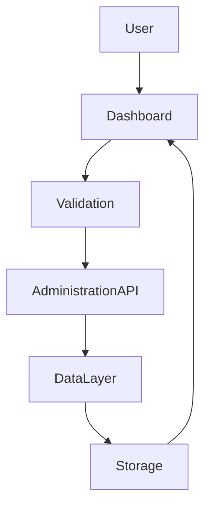
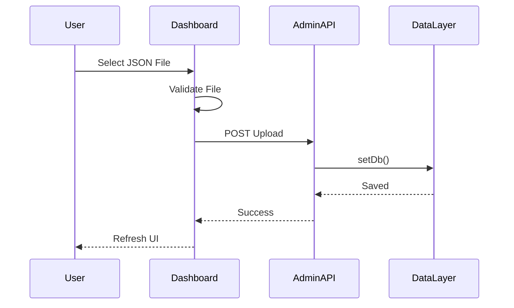

# Building Greymatter API Server with Next.js 16

## Part 10 – Importing and Exporting Data

In the previous chapter, we built the Dataset Viewer, allowing developers to inspect every collection directly from the browser.

The next major capability of Greymatter is **data portability**. Mock APIs are most valuable when developers can quickly import existing datasets, share data with teammates, create reusable demos, and back up their work.

In this chapter, we'll build Greymatter's import and export system, one of the features that distinguishes it from a simple mock server.

By the end of this chapter you will have:

* JSON file uploads
* Clipboard JSON import
* Preset loading
* Collection downloads
* Full database export
* Automatic validation
* Dashboard refresh after imports

---

# Learning Objectives

After completing this chapter you will be able to:

* Import JSON datasets
* Validate uploaded data
* Replace the active database safely
* Export collections
* Build reusable demo datasets
* Design data portability features

---

# Why Import and Export?

Frontend development rarely starts with an empty database.

Developers often need to:

* Import existing test data
* Share datasets with teammates
* Create reusable demonstrations
* Restore backups
* Reset development environments

Greymatter provides these capabilities directly through the browser.

---

# Supported Import Methods

The dashboard supports three ways to load data.

| Method           | Purpose                            |
| ---------------- | ---------------------------------- |
| Upload JSON File | Import a local dataset             |
| Paste JSON       | Import directly from the clipboard |
| Load Preset      | Load bundled demonstration data    |

Although they appear different in the UI, all three ultimately replace the current database.

---

# Overall Import Architecture



Every import follows the same workflow regardless of its source.

---

# Understanding the Dataset Format

Greymatter stores all data inside a single JSON document.

Example:

```json
{
  "users": [
    {
      "id": 1,
      "name": "Alice"
    }
  ],
  "posts": [
    {
      "id": 1,
      "title": "Hello",
      "userId": 1
    }
  ],
  "products": [
    {
      "id": 1,
      "name": "Laptop",
      "price": 1499
    }
  ]
}
```

Each top-level property becomes a REST collection.

---

# Uploading a JSON File

The most common import method is uploading a JSON document.

The dashboard accepts:

```text
database.json
```

or any valid JSON file with the correct structure.

The uploaded file replaces the existing database.

---

# Upload Workflow



The dashboard automatically reloads after a successful upload.

---

# Validating Uploaded Data

Before replacing the database, Greymatter validates the uploaded document.

The uploaded file must:

* Be valid JSON
* Have a JSON object as its root
* Use collection names as top-level properties
* Store arrays as collection values

Valid:

```json
{
  "users": [],
  "posts": []
}
```

Invalid:

```json
[
  {
    "id": 1
  }
]
```

The root element must always be an object.

---

# Paste JSON

Sometimes the data already exists in the clipboard.

Instead of saving a file first, users can paste JSON directly into the dashboard.

```mermaid
flowchart LR

Clipboard

-->

Dashboard

-->

Validation

-->

Administration API

-->

Database Updated
```

The validation process is identical to file uploads.

---

# Loading Presets

Greymatter ships with predefined datasets stored in the repository.

Examples include:

```text
presets/

├── full-demo.json
├── ecommerce.json
├── blog.json
```

Loading a preset immediately replaces the active database.

This provides developers with realistic data for testing and demonstrations.

---

# Preset Workflow

```mermaid
flowchart LR

User

-->

Choose Preset

-->

Read Preset

-->

setDb()

-->

Refresh Dashboard
```

Because presets are ordinary JSON documents, they use the same Data Layer as uploads.

---

# Exporting Collections

Developers often need to save only one collection.

For example:

```text
users
```

becomes:

```text
users.json
```

The exported file contains only that collection.

This is useful when sharing individual datasets.

---

# Download Workflow

```mermaid
flowchart LR

Dashboard

-->

Administration API

-->

Read Collection

-->

Generate JSON

-->

Download File
```

No changes are made to the database during export.

---

# Downloading the Entire Database

The dashboard also supports exporting every collection.

Example:

```text
users.json

posts.json

products.json
```

or, depending on the implementation, a complete database export.

This provides a simple backup mechanism.

---

# Data Replacement

An important design decision in Greymatter is that imports replace the existing database.

```mermaid
flowchart TD

Old Database

-->

Upload

-->

New Database

-->

Refresh Dashboard
```

This avoids complicated merge logic and guarantees predictable results.

---

# Why Replace Instead of Merge?

Merging imported data introduces several challenges:

* Duplicate IDs
* Conflicting records
* Partial imports
* Broken relationships

Replacing the database avoids these problems entirely.

For developers using mock APIs, deterministic behaviour is usually more valuable than complex merging.

---

# Automatic Refresh

After every successful import:

* Collection cards refresh
* Quick Start commands regenerate
* Dataset Viewer reloads
* Record counts update
* Status information refreshes

No manual browser refresh is necessary.

---

# Error Handling

Common validation failures include:

| Error                 | Result           |
| --------------------- | ---------------- |
| Invalid JSON          | Import rejected  |
| Root is not an object | Import rejected  |
| Corrupted file        | Import rejected  |
| Network failure       | Upload cancelled |

Clear error messages help users correct problems quickly.

---

# Code Walkthrough

In the production Greymatter codebase, every import method ultimately calls the same persistence mechanism.

Whether the source is:

* A JSON file
* Clipboard text
* A bundled preset

the workflow is identical.

1. Validate the input.
2. Parse the JSON.
3. Replace the current database.
4. Persist the changes using the Data Layer.
5. Refresh the dashboard.

Similarly, export operations retrieve the current database from the Data Layer and serialize it back to JSON without modifying any stored data.

This reuse of the Data Layer keeps the implementation compact and consistent.

---

# User Workflow

A typical workflow looks like this.

```mermaid
flowchart LR

Open Dashboard

-->

Load Demo Data

-->

Modify Dataset

-->

Download Backup

-->

Share Dataset

-->

Import Later
```

This enables developers to move seamlessly between projects.

---

# Testing Import and Export

Verify the following:

* Upload a valid JSON file.
* Upload an invalid JSON file.
* Paste JSON from the clipboard.
* Load each bundled preset.
* Download a collection.
* Download the complete dataset.
* Confirm that the dashboard refreshes automatically.
* Confirm that REST endpoints reflect the imported data.

---

# Exercises

1. Build the Upload JSON component.
2. Add drag-and-drop support.
3. Implement Paste JSON.
4. Validate uploaded documents.
5. Implement preset loading.
6. Add Download Collection.
7. Add Download All.
8. Verify automatic dashboard refresh.
9. Test invalid input.
10. Commit your work to Git.

---

# Summary

In this chapter, we added Greymatter's import and export capabilities.

By supporting JSON uploads, clipboard imports, bundled presets, and data exports, Greymatter becomes far more than a simple mock API. Developers can quickly move datasets between projects, create repeatable demonstrations, and back up their work with minimal effort.

These features significantly improve the developer experience while continuing to leverage the same Data Layer used throughout the application.

---

# Next Up

In **Part 11 – Managing Collections**, we'll build the collection management features that allow developers to create and delete REST resources dynamically. You'll learn how Greymatter automatically exposes new collections as API endpoints without requiring additional routes, controllers, or configuration, demonstrating one of the framework's most powerful architectural features.
