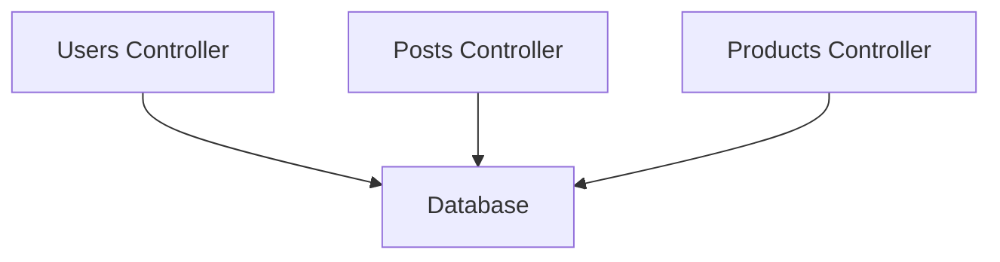
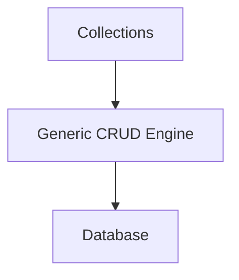
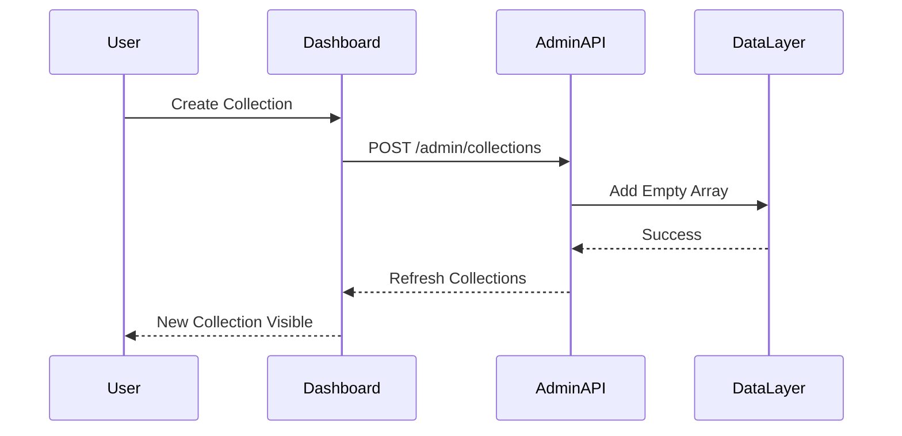
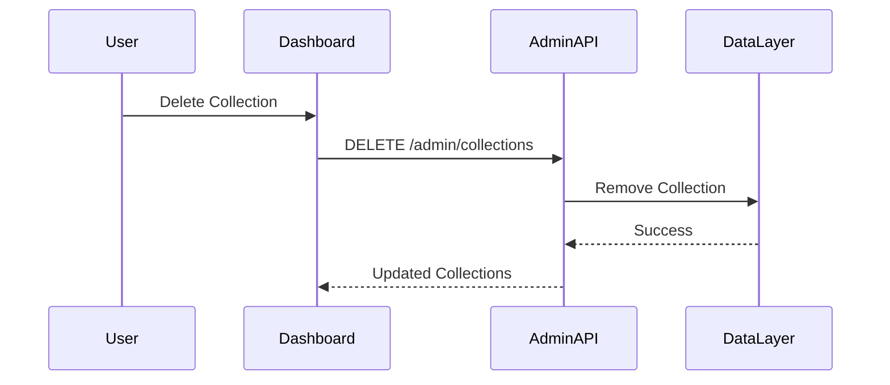

# Building Greymatter API Server with Next.js 16

## Part 11 – Dynamic Collection Management

Throughout this book, we've worked with collections such as `users`, `posts`, and `products`. One of Greymatter's defining features is that these collections are **not hardcoded** into the application.

Instead, collections are treated as **data**, not application code.

This means developers can create entirely new REST resources without modifying the server, adding routes, or writing controllers.

In this chapter, we'll build Greymatter's dynamic collection management system—the feature that makes the Generic CRUD Engine truly generic.

By the end of this chapter you will have:

* Dynamic collection creation
* Collection deletion
* Automatic REST endpoint generation
* Dashboard integration
* Collection validation
* Automatic UI updates

---

# Learning Objectives

After completing this chapter you will be able to:

* Design dynamic resources
* Create collections programmatically
* Remove collections safely
* Validate collection names
* Generate REST endpoints automatically
* Keep the dashboard synchronized

---

# Collections Are Data

Unlike most REST frameworks, Greymatter does not define resources in code.

Traditional APIs might contain:

```text
/users
/posts
/products
/comments
```

Each resource requires:

* A controller
* Routes
* Models
* Tests

Greymatter eliminates all of this.

Collections exist only inside the database.

Example:

```json
{
  "users": [],
  "posts": [],
  "products": []
}
```

Every property becomes a REST resource.

---

# Traditional REST Architecture

Most REST applications look like this.



Every new resource requires another controller.

---

# Greymatter Architecture

Greymatter uses a completely different approach.



The Generic CRUD Engine works with **any collection**.

---

# Creating a Collection

Suppose a developer creates:

```text
reviews
```

The database changes from:

```json
{}
```

to:

```json
{
  "reviews": []
}
```

Immediately the following endpoints become available:

```text
GET     /api/reviews

POST    /api/reviews

GET     /api/reviews/:id

PUT     /api/reviews/:id

PATCH   /api/reviews/:id

DELETE  /api/reviews/:id
```

No application restart is required.

---

# Collection Creation Workflow



The dashboard updates automatically after creation.

---

# Why Empty Arrays?

Every collection begins life as an empty array.

```json
{
  "reviews": []
}
```

This provides several benefits:

* Consistent data structure
* Immediate API availability
* No placeholder records
* Predictable CRUD operations

As records are added, the array grows naturally.

---

# Naming Rules

Collection names should follow a few simple conventions.

Recommended:

```text
users

orders

blog-posts

reviews
```

Avoid:

```text
User Data

My Collection!

123collection
```

Good naming conventions improve URL readability and consistency.

---

# Validation

Before creating a collection, Greymatter validates:

* Name is not empty
* Name does not already exist
* Name contains valid characters
* Reserved names are rejected (where applicable)

If validation fails, the Administration API returns an error instead of modifying the database.

---

# Deleting Collections

Deleting a collection removes the entire resource.

Example:

Before:

```json
{
  "users": [],
  "reviews": [],
  "products": []
}
```

After deleting `reviews`:

```json
{
  "users": [],
  "products": []
}
```

The REST endpoint disappears automatically.

---

# Deletion Workflow



---

# Confirmation Dialog

Deleting an entire collection removes every record.

For this reason the dashboard asks for confirmation before continuing.

```text
Delete collection "reviews"?

This action cannot be undone.

[Cancel] [Delete]
```

This prevents accidental data loss.

---

# Automatic Endpoint Discovery

One of Greymatter's most powerful features is that the REST API never needs updating.

Suppose a developer creates:

```text
books
```

Immediately the Generic CRUD Engine recognizes:

```text
/api/books
```

The Route Handler simply loads:

```text
database["books"]
```

No routing table changes are required.

---

# Endpoint Lifecycle

```mermaid
flowchart LR

Create Collection

-->

Database Updated

-->

Generic CRUD

-->

New REST Endpoint

-->

Frontend Ready
```

The API grows dynamically as the database changes.

---

# Dashboard Synchronization

After every successful operation, the dashboard refreshes.

Updated components include:

* Collection cards
* Record counts
* Quick Start examples
* Dataset Viewer
* Status information

Users never need to reload the browser.

---

# Empty State

When the final collection is removed:

```json
{}
```

The dashboard automatically hides:

* Collection cards
* Quick Start
* Dataset Viewer

The interface returns to its initial state.

---

# Behind the Scenes

The collection management system is surprisingly small.

Creating a collection involves:

1. Load the database.
2. Add a new property.
3. Assign an empty array.
4. Save the database.

Deleting follows the reverse process:

1. Load the database.
2. Remove the property.
3. Save the database.

Everything else—the REST API, dashboard, and Dataset Viewer—updates automatically because they derive their state from the database.

---

# Code Walkthrough

In the production Greymatter repository, collection management is implemented through the Administration API.

Rather than creating routes dynamically, the Generic CRUD Engine reads the available collections directly from the current database each time a request is processed.

This design has several advantages:

* No route registration
* No code generation
* No application restart
* Unlimited collections
* Consistent CRUD behaviour

The dashboard simply displays whatever collections currently exist.

This keeps both the frontend and backend remarkably simple.

---

# Real-World Example

Imagine you're building an e-commerce prototype.

Day 1:

```text
users

products
```

Day 2:

```text
users

products

orders

reviews

wishlists
```

Day 3:

```text
users

products

orders

reviews

wishlists

coupons

inventory

suppliers
```

The server never changes.

Only the data changes.

This is exactly the type of rapid iteration Greymatter was designed to support.

---

# Testing Collection Management

Verify the following:

Create a collection.

```bash
curl -X POST http://localhost:3000/admin/collections \
-H "Content-Type: application/json" \
-d '{"name":"reviews"}'
```

Confirm:

```text
GET /api/reviews
```

works immediately.

Delete the collection.

```bash
curl -X DELETE "http://localhost:3000/admin/collections?name=reviews"
```

Verify:

```text
GET /api/reviews
```

returns:

```http
404 Not Found
```

---

# Exercises

1. Implement collection creation.
2. Validate collection names.
3. Prevent duplicate collections.
4. Implement collection deletion.
5. Add confirmation dialogs.
6. Refresh the dashboard automatically.
7. Verify REST endpoints appear immediately.
8. Verify deleted endpoints disappear.
9. Test with multiple collections.
10. Commit your work to Git.

---

# Summary

In this chapter, we implemented Greymatter's dynamic collection management system.

Unlike traditional REST frameworks that require controllers and routing configuration for every resource, Greymatter treats collections as data. Creating or deleting a collection immediately changes the available REST endpoints without modifying the application itself.

This architecture is one of Greymatter's greatest strengths. It enables developers to prototype APIs rapidly, experiment with new resources, and evolve their data model without touching the server code.

Together with the Generic CRUD Engine, this approach allows Greymatter to scale from a simple mock API to a flexible backend prototyping platform.

---

# Next Up

In **Part 12 – Storage Abstraction and Deployment**, we'll explore one of the most important architectural improvements in the current Greymatter codebase: the storage abstraction layer. You'll learn how the same application seamlessly switches between local `db.json` storage during development and Vercel Blob Storage in production, enabling the API to run both locally and in a serverless cloud environment without changing application code.
