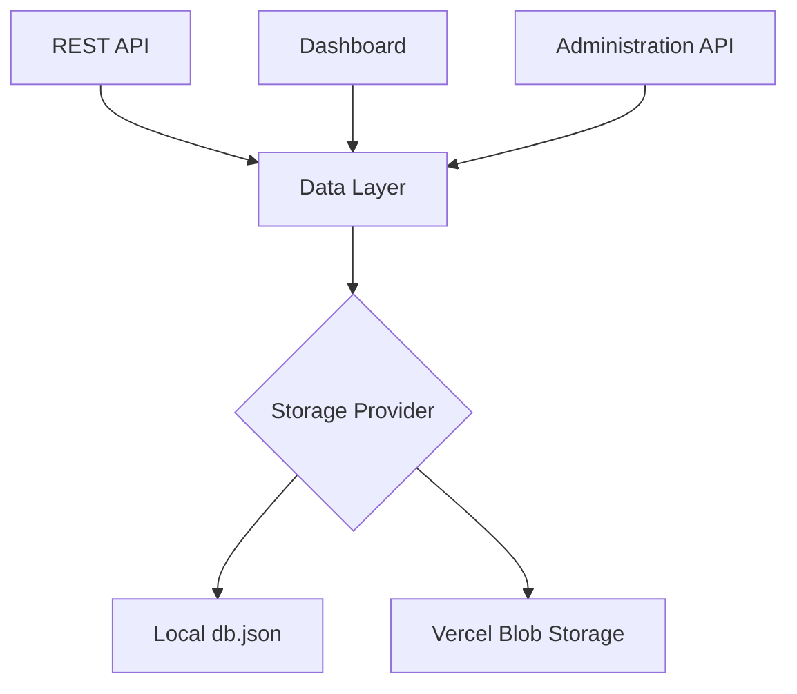
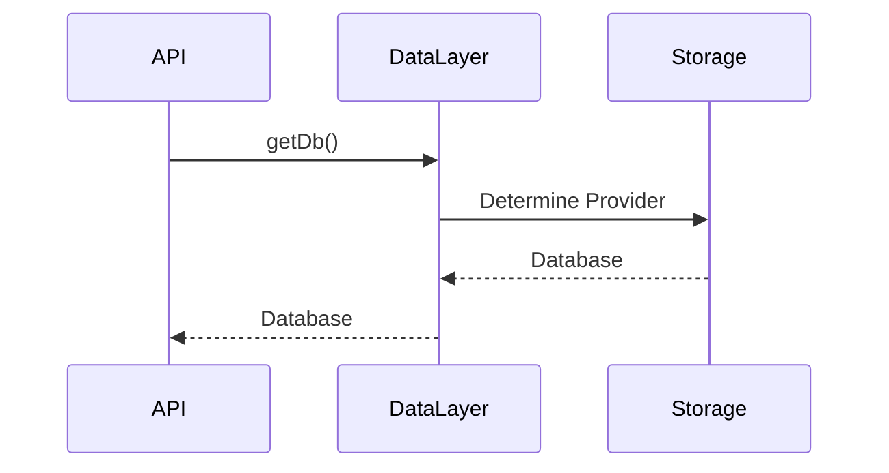

# Building Greymatter API Server with Next.js 16

## Part 12 – Storage Abstraction and Deploying to Vercel

In previous chapters, we've built a fully functional mock REST API with a browser dashboard, dynamic collections, data import/export, and a generic CRUD engine.

So far we've treated persistence as a solved problem—we simply called functions such as `getDb()`, `saveDb()`, and `setDb()`.

In reality, one of the biggest architectural changes in the modern Greymatter codebase is that the application **no longer depends on a local `db.json` file**.

Instead, the same application can run:

* locally using a JSON file
* in production using **Vercel Blob Storage**

without changing any application code.

This chapter explains how that works.

---

# Learning Objectives

After completing this chapter you will be able to:

* Understand storage abstraction
* Separate business logic from persistence
* Support multiple storage providers
* Deploy a stateful application to Vercel
* Design applications for cloud deployment
* Build portable data layers

---

# The Problem

The original Greymatter tutorial stored everything in:

```text
db.json
```

This works perfectly on your own computer.

However, serverless platforms like Vercel have an important limitation.

The filesystem is **read-only**.

This means code like:

```javascript
fs.writeFile(...)
```

works locally but fails in production.

---

# Why Serverless Changes Everything

A traditional server has persistent storage.

```mermaid
flowchart TD

Application

-->

Local Disk

-->

db.json
```

A serverless deployment is different.

```mermaid
flowchart TD

Application

-->

Ephemeral File System

Application

-->

Cloud Storage
```

Local files may disappear whenever a function is restarted.

Persistent data must therefore live outside the application.

---

# Introducing the Data Layer

Earlier in the book we created a dedicated Data Layer.

Instead of allowing Route Handlers to read files directly, every component communicates through three functions.

```javascript
await getDb()

await saveDb(database)

await setDb(database)
```

Everything else in the application depends on these functions.

Nothing else knows where the data is stored.

---

# Why This Matters

Consider the Generic CRUD Engine.

Instead of writing:

```javascript
read db.json

modify database

write db.json
```

it simply performs:

```javascript
const db = await getDb()

...

await saveDb(db)
```

The CRUD engine has no idea whether data comes from:

* a JSON file
* Vercel Blob
* PostgreSQL
* Redis

This is the essence of abstraction.

---

# Architecture Overview



Every component communicates with the Data Layer.

Only the Data Layer knows which storage provider is active.

---

# Selecting the Storage Provider

The production code determines which storage backend to use during runtime.

```mermaid
flowchart LR

Start

-->

Check Configuration

-->

Storage Available?

Storage Available?

-- Yes -->

Use Blob Storage

Storage Available?

-- No -->

Use db.json
```

This decision is completely transparent to the rest of the application.

---

# Local Development

During development the application uses:

```text
db.json
```

Advantages include:

* Fast
* Simple
* Easy to inspect
* Easy to reset
* No cloud configuration

Developers can begin building immediately without additional infrastructure.

---

# Production Deployment

When deployed to Vercel, Greymatter stores its database inside:

```text
Vercel Blob Storage
```

Advantages include:

* Persistent storage
* Cloud availability
* No local filesystem dependency
* Works with serverless functions
* Survives deployments

This enables Greymatter to function as a true cloud-hosted service.

---

# Runtime Decision

The Data Layer makes a single decision.



Every other operation follows the same pattern.

---

# Saving Data

Saving data is identical regardless of the storage provider.

```mermaid
flowchart LR

Modified Database

-->

saveDb()

-->

Storage Provider

-->

Persist Data
```

Neither the dashboard nor the CRUD engine needs special logic for cloud deployments.

---

# Benefits of Storage Abstraction

Separating persistence from business logic provides several important benefits.

### Cleaner Architecture

Route Handlers contain only API logic.

### Easier Testing

Storage implementations can be replaced during testing.

### Future Flexibility

Additional storage providers can be added later.

Examples include:

* PostgreSQL
* SQLite
* MongoDB
* Redis
* Amazon S3

without changing the API layer.

---

# Deploying to Vercel

Deployment is now straightforward.

```bash
npm install

npm run build
```

Push the project to GitHub.

Import the repository into Vercel.

Configure the required environment variables.

Deploy.

Because persistence is handled by the Data Layer, no code changes are necessary.

---

# Deployment Architecture

```mermaid
flowchart TD

Developer

-->

GitHub

-->

Vercel

-->

Greymatter

Greymatter

-->

Vercel Blob
```

Every deployment automatically uses cloud storage.

---

# Environment Configuration

During deployment, environment variables determine which storage provider is available.

Conceptually the application behaves like this:

```text
Blob configured?

Yes  → Use Blob Storage

No   → Use db.json
```

This allows a single codebase to support both local development and cloud deployment.

---

# Failure Handling

The Data Layer also centralizes error handling.

Possible failures include:

| Situation            | Behaviour                     |
| -------------------- | ----------------------------- |
| Missing local file   | Create or initialize database |
| Blob unavailable     | Return an appropriate error   |
| Invalid JSON         | Reject the operation          |
| Network interruption | Report persistence failure    |

Centralizing persistence makes these situations much easier to manage.

---

# Code Walkthrough

One of the most significant improvements in the current Greymatter codebase is the introduction of the storage abstraction layer.

The rest of the application—including:

* Generic CRUD Engine
* Administration API
* Dashboard
* Dataset Viewer

never interacts directly with storage.

Instead, every component relies on the Data Layer through:

```javascript
await getDb()
await saveDb(database)
await setDb(database)
```

This design follows the **Dependency Inversion Principle** from SOLID architecture.

High-level modules depend on an abstraction rather than a specific implementation.

As a result, migrating from a local JSON file to Vercel Blob required changes almost exclusively within the Data Layer.

The remainder of the application continued to function without modification.

---

# Testing Both Storage Providers

Before deployment, verify both execution modes.

## Local Mode

* Start the server.
* Create collections.
* Add records.
* Restart the server.
* Confirm data persists in `db.json`.

## Cloud Mode

* Deploy to Vercel.
* Create collections.
* Add records.
* Refresh the application.
* Confirm data persists in Blob Storage.

The user experience should be identical in both environments.

---

# Exercises

1. Refactor persistence behind a Data Layer.
2. Remove direct filesystem access from Route Handlers.
3. Implement `getDb()`.
4. Implement `saveDb()`.
5. Implement `setDb()`.
6. Add support for Vercel Blob Storage.
7. Test local storage.
8. Deploy to Vercel.
9. Verify persistence after deployment.
10. Commit your work to Git.

---

# Summary

In this chapter, we completed one of Greymatter's most important architectural evolutions.

By introducing a dedicated Data Layer, we decoupled the application's business logic from its storage implementation. This allows the same codebase to operate seamlessly with a local `db.json` file during development and Vercel Blob Storage in production.

This architecture not only enables cloud deployment but also positions Greymatter for future enhancements, such as supporting relational databases or object storage services without requiring changes to the REST API or dashboard.

The result is a cleaner, more maintainable, and far more portable application.

---

# Next Up

In **Part 13 – Testing and Future Enhancements**, we'll bring everything together. We'll verify the complete Greymatter platform through automated and manual testing, review the finished architecture, explore extension points for plugins and custom storage providers, and discuss future improvements that could evolve Greymatter from a mock API server into a full backend development platform.
