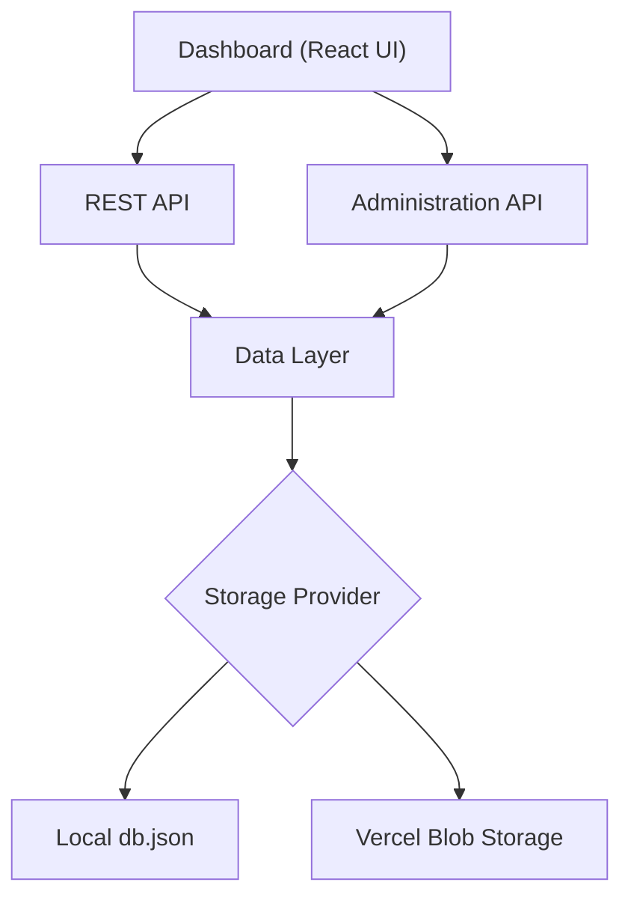
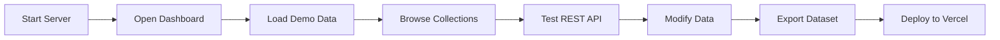
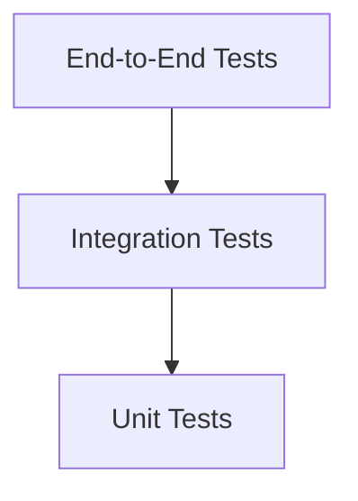
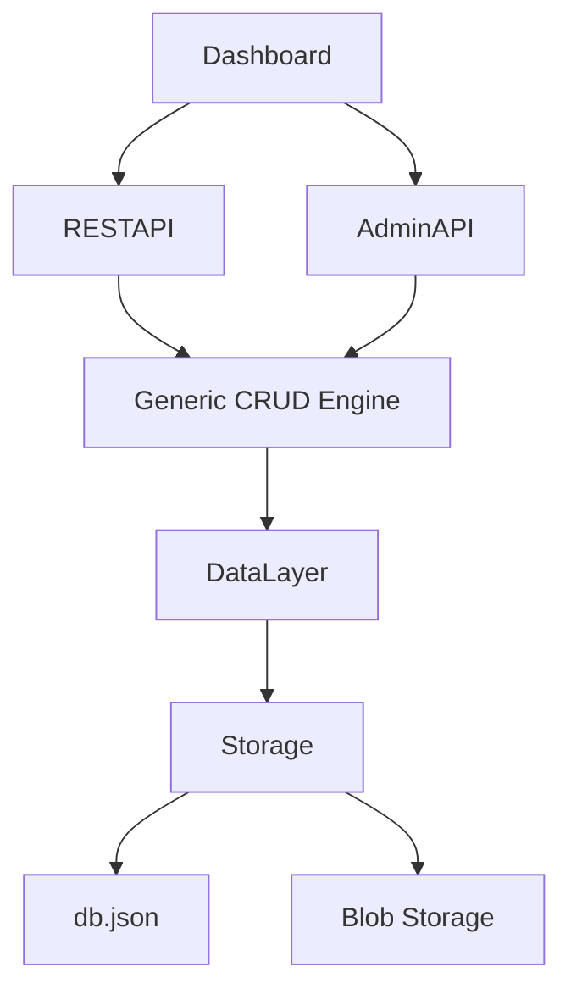

# Building Greymatter API Server with Next.js 16

## Part 13 – Testing, Deployment, and Future Enhancements

Over the course of this tutorial, we've transformed Greymatter from a simple JSON-backed mock server into a modern cloud-ready development platform.

Along the way we've built:

* A generic REST API
* A reusable Data Layer
* Dynamic collections
* Advanced query support
* A browser dashboard
* Dataset management
* Import and export
* Storage abstraction
* Vercel deployment

In this final chapter, we'll verify the complete application, review the finished architecture, and discuss where Greymatter can evolve in future releases.

---

# Learning Objectives

After completing this chapter you will be able to:

* Test every major subsystem
* Validate end-to-end workflows
* Verify cloud deployment
* Review the complete architecture
* Identify extension points
* Plan future enhancements

---

# The Completed Architecture

Greymatter has evolved into a layered application.



Each layer has a clearly defined responsibility.

---

# Architectural Principles

Throughout this project we've consistently followed several design principles.

## Separation of Concerns

Each layer performs a single responsibility.

| Layer              | Responsibility         |
| ------------------ | ---------------------- |
| Dashboard          | User Interface         |
| REST API           | CRUD Operations        |
| Administration API | Dataset Management     |
| Data Layer         | Persistence            |
| Storage            | Local or Cloud Storage |

---

## Single Source of Truth

Every component reads and writes through the Data Layer.

There is no duplicated persistence logic.

---

## Generic Design

Instead of writing resource-specific controllers, Greymatter treats collections as data.

Adding a collection automatically creates a REST API.

---

## Storage Independence

Business logic never depends on the storage provider.

Changing persistence requires modifying only the Data Layer.

---

# End-to-End Workflow

A typical development session now looks like this.



Every step uses the same application.

---

# Manual Testing Checklist

Before deployment, verify the following functionality.

## Dashboard

* Dashboard loads successfully
* Status indicator displays correctly
* Collection cards render
* Dataset Viewer opens
* Quick Start commands are generated

---

## CRUD API

Verify every HTTP method.

```bash
GET /api/users

POST /api/users

PUT /api/users/1

PATCH /api/users/1

DELETE /api/users/1
```

Ensure each returns the expected status code.

---

## Query Features

Test:

```text
_sort

_order

_start

_end

_embed
```

Verify pagination headers.

Confirm embedded relationships.

---

## Administration API

Verify:

* Create collection
* Delete collection
* Upload dataset
* Paste JSON
* Load preset
* Download collection
* Download all
* Empty storage

---

## Storage

Verify both storage modes.

### Local

* Data persists in `db.json`

### Cloud

* Data persists in Blob Storage

The application should behave identically.

---

# Automated Testing

As Greymatter grows, manual testing becomes insufficient.

Consider adding automated tests.

Recommended areas include:

* Data Layer
* CRUD Engine
* Query processing
* Collection management
* Dashboard components

---

# Example Testing Pyramid



A balanced testing strategy catches defects early while maintaining confidence during refactoring.

---

# Performance Testing

Greymatter is intended primarily for development and prototyping.

Nevertheless, basic performance testing is valuable.

Measure:

* Response time
* Upload speed
* Dataset loading
* Pagination performance
* Dashboard rendering

Useful tools include:

* Browser Developer Tools
* Lighthouse
* k6
* ApacheBench

---

# Security Considerations

Although Greymatter is designed as a development tool, several security practices still apply.

Examples include:

* Validate uploaded JSON
* Sanitize collection names
* Limit upload sizes
* Validate request bodies
* Return meaningful HTTP errors

If deploying publicly, consider adding:

* Authentication
* Authorization
* Rate limiting
* CORS configuration
* Audit logging

---

# Current Limitations

The current architecture intentionally remains simple.

Examples include:

* Single JSON database
* No authentication
* No transactions
* No concurrent editing
* Limited relationship support

These trade-offs keep Greymatter lightweight and easy to understand.

---

# Possible Future Enhancements

Because of the modular architecture, many new features can be added without major refactoring.

Ideas include:

### Authentication

Protect administrative endpoints.

---

### OpenAPI Support

Generate Swagger/OpenAPI documentation automatically.

---

### GraphQL API

Expose collections through GraphQL alongside REST.

---

### WebSockets

Push live updates to connected dashboards.

---

### Search Indexing

Support full-text search across collections.

---

### Plugins

Allow developers to install custom collection processors.

---

### Database Providers

Support additional persistence layers.

Examples:

* PostgreSQL
* MySQL
* SQLite
* MongoDB
* Redis

---

### Role-Based Access Control

Allow different permissions for developers, testers, and administrators.

---

### Versioned APIs

Support multiple API versions simultaneously.

---

### Dataset Snapshots

Allow rollback to previous database states.

---

# Lessons Learned

Building Greymatter demonstrates several important software engineering principles.

* Build abstractions early.
* Separate UI from business logic.
* Treat persistence as an implementation detail.
* Prefer generic solutions over duplicated code.
* Design for extension.
* Keep components focused on a single responsibility.

These principles apply far beyond mock API servers.

---

# Final Code Review

Looking back at the finished application:



Every component has a clear dependency chain.

No component bypasses the Data Layer.

This results in a maintainable, testable, and extensible architecture.

---

# Final Exercises

Complete the following before considering the project finished.

* Deploy Greymatter to Vercel.
* Import the demo dataset.
* Create a new collection.
* Add records.
* Test every CRUD operation.
* Test pagination.
* Test sorting.
* Export the dataset.
* Clear storage.
* Reload the preset.
* Commit the final version to GitHub.

---

# Congratulations!

You have successfully built **Greymatter API Server**.

Starting from an empty Next.js project, you've developed a complete mock backend platform capable of:

* Serving dynamic REST APIs
* Managing datasets through a browser dashboard
* Importing and exporting JSON
* Supporting advanced query features
* Creating collections dynamically
* Running locally or in the cloud
* Deploying seamlessly to Vercel

More importantly, you've learned how to design a modern, layered web application using sound architectural principles such as abstraction, separation of concerns, and dependency inversion.

These concepts extend well beyond Greymatter and form the foundation of scalable software systems.

---

# Where to Go Next

Now that you've completed Greymatter, consider extending it with one of the following projects:

1. **Authentication & User Management**

   * Secure the Administration API with login and role-based access control.

2. **OpenAPI & Swagger**

   * Automatically generate interactive API documentation for every collection.

3. **GraphQL Gateway**

   * Build a GraphQL endpoint on top of the Generic CRUD Engine.

4. **Plugin System**

   * Allow developers to register middleware, hooks, and custom collection processors.

5. **Database Providers**

   * Add PostgreSQL, MongoDB, or SQLite as interchangeable storage backends.

6. **Live Collaboration**

   * Use WebSockets or Server-Sent Events to synchronize multiple dashboards in real time.

Each of these projects builds naturally on the architecture you've created throughout this tutorial.

---

# Thank You

Thank you for following this tutorial.

I hope it has given you not only a working understanding of the Greymatter API Server, but also a deeper appreciation for clean architecture, reusable design, and modern full-stack development with Next.js.

Happy coding!
