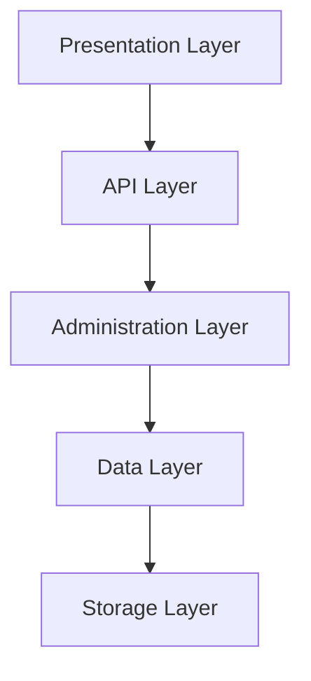
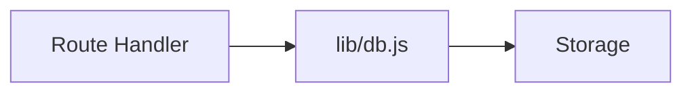
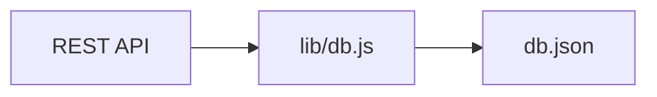
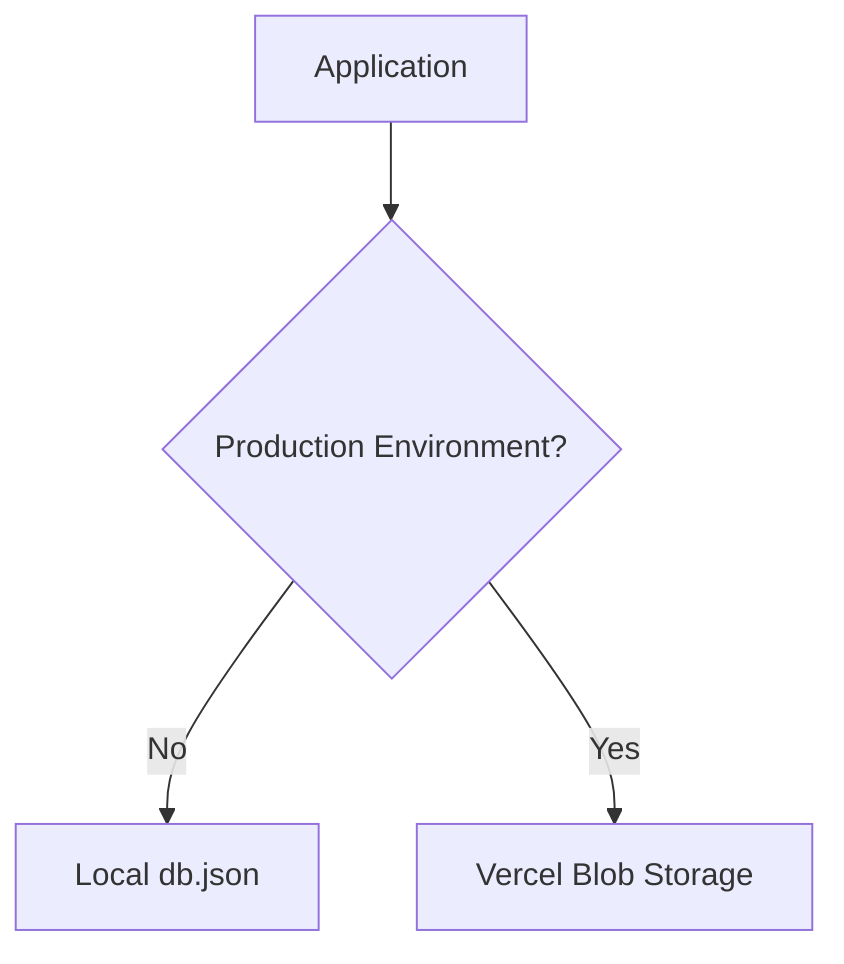

# Building Greymatter API Server with Next.js 16

## Part 2 – Organizing the Project Structure

In Part 1, we created a new Next.js application and explored the App Router. Although the generated project works, it isn't yet organized for a production-quality API server.

In this chapter we'll reorganize the project into the architecture used by Greymatter API Server. This structure separates the user interface, REST API, data layer, and storage, making the application easier to understand and maintain.

By the end of this chapter you will have:

* A clean project structure
* A local JSON database
* A shared data layer directory
* A presets directory for demo datasets
* A clear understanding of the application's architecture

---

# Learning Objectives

After completing this chapter you should be able to:

* Organize a Next.js application
* Understand the purpose of each directory
* Separate application layers
* Prepare the project for future expansion

---

# Why Project Structure Matters

As applications grow, poor organization quickly becomes difficult to maintain.

Instead of placing everything inside the `app` directory, Greymatter separates responsibilities into logical layers.



Each layer performs one job.

This makes the application easier to extend and test.

---

# Our Target Structure

By the end of this chapter the project will look like this.

```text
greymatter-api-server/
│
├── app/
│   ├── api/
│   ├── admin/
│   ├── globals.css
│   ├── layout.js
│   └── page.js
│
├── lib/
│   └── db.js
│
├── presets/
│
├── public/
│
├── db.json
│
├── package.json
└── next.config.js
```

Most of these directories are empty for now, but we'll begin using them in the next few chapters.

---

# The app Directory

The `app` directory is the heart of every App Router application.

```text
app/
```

It contains:

* Pages
* Layouts
* Route Handlers
* Global styles

Later it will also contain:

```text
app/
├── api/
└── admin/
```

The dashboard and REST API will therefore live together inside a single application.

---

# Creating the API Directory

Create a directory named:

```text
app/api
```

Although it is empty today, every REST endpoint we build throughout this tutorial will live here.

Eventually, it will contain Route Handlers such as:

```text
app/api/
├── [...path]/
├── health/
└── products/
```

Each folder automatically becomes a REST endpoint.

---

# Creating the Admin Directory

Next, create:

```text
app/admin
```

This directory contains endpoints used exclusively by the dashboard.

Examples include:

* Upload datasets
* Download datasets
* Create collections
* Delete collections
* Load presets

Separating administrative operations from public REST endpoints keeps the application organized.

---

# Creating the lib Directory

Business logic should not be duplicated across multiple Route Handlers.

Create:

```text
lib/
```

Shared modules belong here.

Our first shared module will be:

```text
lib/db.js
```

This file will become the application's persistence layer.

Every Route Handler will communicate with the database through this single module.



Keeping persistence logic in one place makes future changes much easier.

---

# Creating the Presets Directory

Next, create:

```text
presets/
```

This directory stores demo datasets that users can load from the dashboard.

For example:

```text
presets/
└── full-demo.json
```

Instead of manually creating collections every time the application starts, users can simply click **Load Default Data**.

We'll build this feature later in the tutorial.

---

# Creating db.json

Create a file named:

```text
db.json
```

Initially, it should contain:

```json
{}
```

This empty JSON object represents an empty database.

Later, collections will be stored as top-level properties.

Example:

```json
{
  "users": [],
  "posts": [],
  "products": []
}
```

Each property represents a REST resource.

---

# Understanding Collections

Greymatter stores data as collections.

A collection is simply an array of JSON objects.

For example:

```json
{
  "users": [
    {
      "id": 1,
      "name": "Alice"
    },
    {
      "id": 2,
      "name": "Bob"
    }
  ]
}
```

This automatically becomes:

```text
GET /api/users
POST /api/users
GET /api/users/1
PUT /api/users/1
PATCH /api/users/1
DELETE /api/users/1
```

No additional configuration is required.

---

# Planning the Data Layer

Although `db.json` stores the data, the application should never access it directly.

Instead, every request will use a shared data layer.



Later we'll replace `db.json` with Vercel Blob Storage without changing any Route Handlers.

This is one of the most important design decisions in Greymatter.

---

# Development vs Production

Greymatter automatically chooses the correct storage backend.



Notice that the application itself doesn't care where the data is stored.

It always communicates with the data layer.

---

# Creating Placeholder Files

Create the following files.

```text
lib/db.js
```

```text
db.json
```

The contents can remain empty for now.

We'll implement them in the next chapter.

---

# Updated Project Structure

Your project should now resemble:

```text
greymatter-api-server/
│
├── app/
│   ├── admin/
│   ├── api/
│   ├── globals.css
│   ├── layout.js
│   └── page.js
│
├── lib/
│   └── db.js
│
├── presets/
│
├── public/
│
├── db.json
│
├── package.json
└── next.config.js
```

Don't worry if several directories are still empty—they will gradually fill as we build the application.

---

# Exercises

1. Create the `app/api` directory.
2. Create the `app/admin` directory.
3. Create the `lib` directory.
4. Create the `presets` directory.
5. Create an empty `db.json` containing `{}`.
6. Create an empty `lib/db.js`.
7. Commit your changes to Git.

---

# Summary

In this chapter, we transformed the default Next.js project into the foundation of a production-ready API server.

We created a clear separation between:

* Presentation
* REST API
* Administration
* Data Layer
* Storage

Although no business logic has been written yet, the application's architecture is now in place.

This organization will allow us to build new features without creating tightly coupled code.

---

# Next Up

In **Part 3 – Building the Data Layer**, we'll implement `lib/db.js`, the module responsible for loading, saving, and updating data. We'll also introduce the storage abstraction that allows Greymatter to use either a local `db.json` file during development or Vercel Blob Storage in production without changing the rest of the application.
