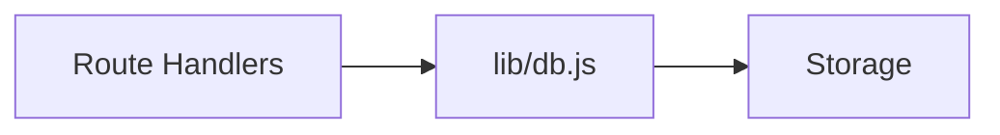
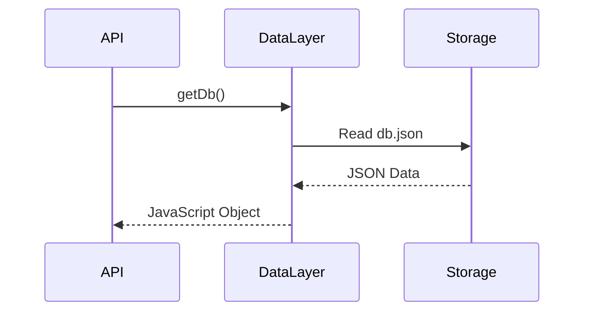
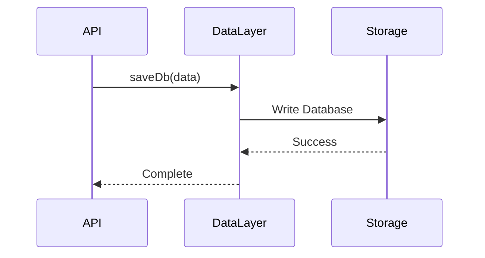
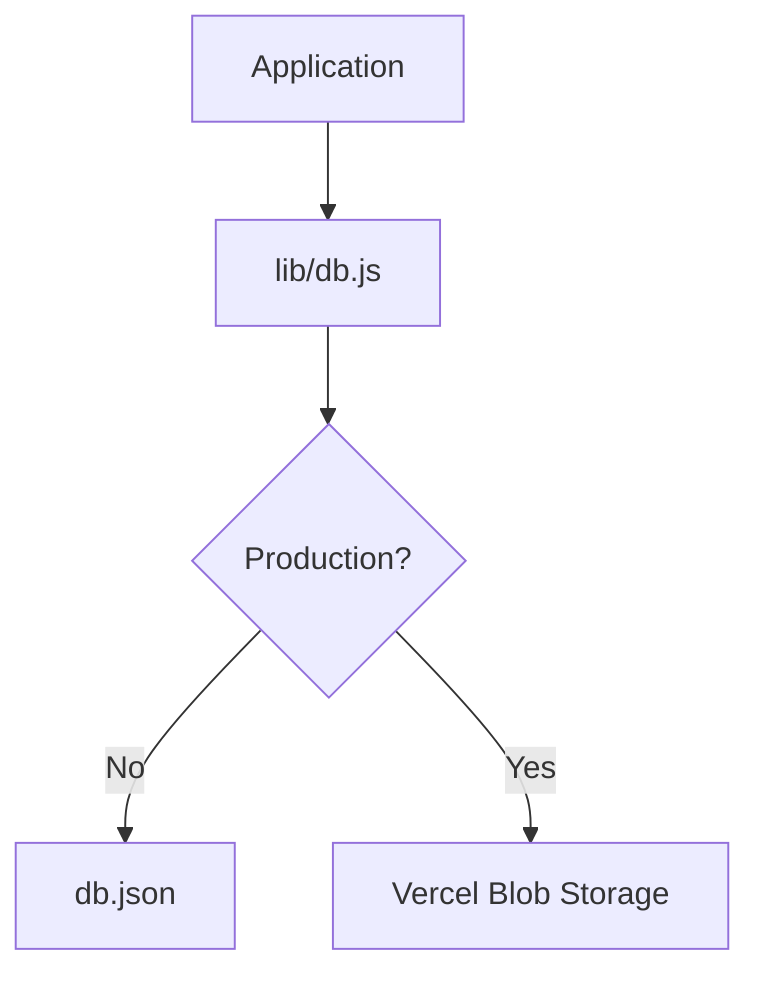
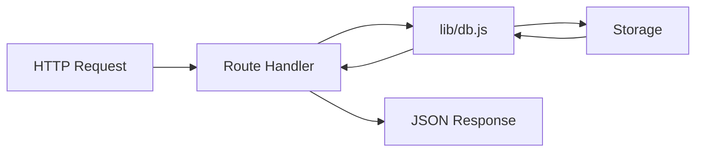
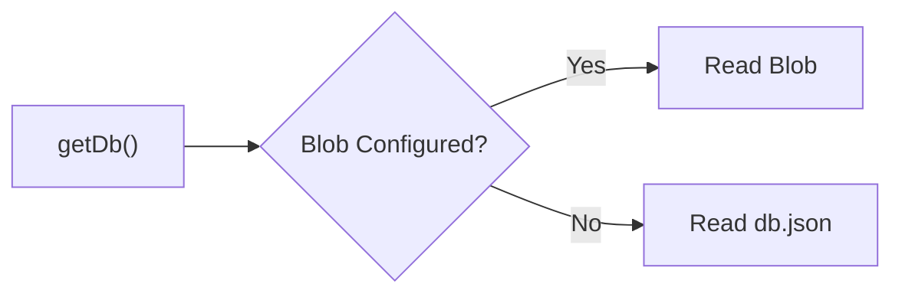

# Building Greymatter API Server with Next.js 16

## Part 3 – Building the Data Layer

In the previous chapter, we organized the project into logical layers and created the basic directory structure. The next step is to build the heart of Greymatter—the **Data Layer**.

Rather than allowing every API endpoint to read and write directly to storage, we'll introduce a dedicated module responsible for all persistence operations.

This layer becomes the single source of truth for application data and allows us to switch seamlessly between local development and cloud deployment.

By the end of this chapter you will have:

* A reusable data access module
* Local JSON persistence
* Automatic storage abstraction
* The foundation for every API endpoint

---

# Learning Objectives

After completing this chapter you will be able to:

* Build a reusable data layer
* Read and write JSON files
* Abstract persistence from business logic
* Prepare an application for multiple storage backends

---

# Why a Data Layer?

A common mistake is allowing every API endpoint to read and write files directly.

For example:

```javascript
const db = JSON.parse(fs.readFileSync("db.json"));
```

If every Route Handler performs its own file operations:

* Code is duplicated.
* Bugs become harder to fix.
* Storage technology becomes tightly coupled to the API.
* Migrating to cloud storage requires changing every endpoint.

Instead, Greymatter centralizes persistence into a single module.



Only the data layer knows how data is stored.

---

# Responsibilities of the Data Layer

The data layer has four responsibilities:

* Load data
* Save data
* Replace data
* Hide storage implementation

Every API endpoint communicates with these functions instead of accessing storage directly.

---

# Creating lib/db.js

Create:

```text
lib/db.js
```

Initially we'll expose three functions:

```javascript
export async function getDb() {}

export async function saveDb(data) {}

export async function setDb(data) {}
```

These functions will become the public interface for the application's persistence layer.

---

# Designing the API

Rather than exposing file operations, we'll expose business operations.

| Function       | Purpose                     |
| -------------- | --------------------------- |
| `getDb()`      | Load the current database   |
| `saveDb(data)` | Persist changes             |
| `setDb(data)`  | Replace the entire database |

Notice that callers never need to know whether the data is stored in a file or in cloud storage.

---

# Local Storage

During development Greymatter stores data inside:

```text
db.json
```

Example:

```json
{
  "users": [
    {
      "id": 1,
      "name": "Alice"
    }
  ],
  "posts": []
}
```

This makes development simple because the database is human-readable.

---

# Reading the Database

The first responsibility is reading the database.



The caller receives a normal JavaScript object.

It doesn't care how the data was retrieved.

---

# Saving the Database

Writing follows the opposite process.



Every write operation passes through the same function.

This guarantees consistent behavior throughout the application.

---

# Replacing the Database

Sometimes the application needs to replace the entire dataset.

Examples include:

* Upload JSON
* Load demo presets
* Reset storage

Instead of deleting collections individually, the dashboard simply calls:

```javascript
await setDb(newDatabase);
```

This operation becomes extremely useful later when we implement uploads.

---

# Storage Abstraction

One of Greymatter's key design goals is to support multiple storage backends without changing the application code.



Every Route Handler calls the same functions regardless of where the data is actually stored.

---

# Why This Matters

Imagine we wrote every Route Handler like this:

```text
Read db.json

↓

Modify Object

↓

Write db.json
```

Later, when deploying to Vercel, every endpoint would need to be rewritten.

Instead, only **one file** changes:

```text
lib/db.js
```

This dramatically reduces maintenance.

---

# Data Flow

Every request follows the same path.



This architecture keeps business logic separate from persistence.

---

# Preparing for Cloud Storage

Later in the tutorial we'll deploy Greymatter to Vercel.

The data layer will automatically detect whether Blob Storage is available.



The remainder of the application will remain completely unchanged.

---

# Benefits of This Design

Our data layer provides several advantages.

* Single source of truth
* No duplicated persistence logic
* Easier testing
* Easier maintenance
* Cleaner Route Handlers
* Cloud-ready architecture

This pattern is common in production applications because it separates business logic from infrastructure.

---

# Exercises

1. Create `lib/db.js`.
2. Add placeholder implementations for:

   * `getDb()`
   * `saveDb()`
   * `setDb()`
3. Create `db.json` if you haven't already.
4. Sketch the request flow from a Route Handler to storage.
5. Commit your work to Git.

---

# Summary

In this chapter, we designed the persistence layer that every other part of Greymatter will depend on.

Rather than coupling our API to a specific storage technology, we introduced a reusable abstraction that hides the implementation details behind three simple functions:

* `getDb()`
* `saveDb(data)`
* `setDb(data)`

This architecture allows the application to evolve from a simple local JSON file to Vercel Blob Storage without changing the API itself.

At this stage, the project still doesn't expose any REST endpoints—but the foundation is now in place for building them.

---

# Next Up

In **Part 4 – Building the Generic CRUD API**, we'll create the first Route Handler using the Next.js App Router. Rather than writing separate controllers for every resource, we'll build a single generic CRUD engine capable of serving any collection stored in the database.
