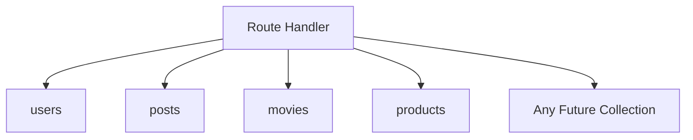
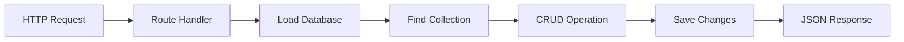
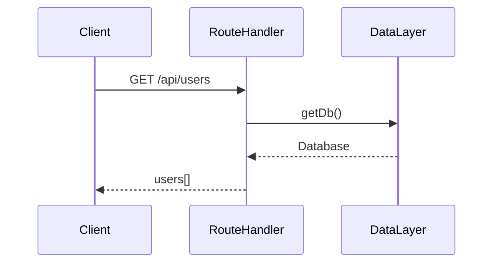
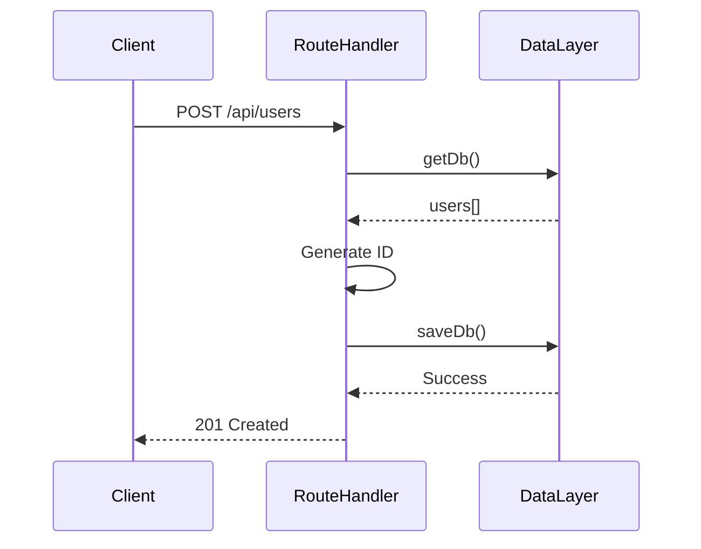
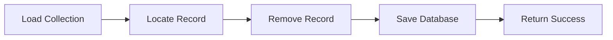

# Building Greymatter API Server with Next.js 16

## Part 4 – Building the Generic CRUD API

In the previous chapter, we designed the data layer that abstracts persistence from the rest of the application. Although we can now load and save data, there is still no way for clients to access it.

In this chapter, we'll build one of the most important components in Greymatter—the **Generic CRUD Engine**.

Unlike traditional REST applications that create separate controllers for every resource (`users`, `posts`, `products`, `movies`, and so on), Greymatter uses a **single Route Handler** capable of serving every collection in the database.

This dramatically reduces duplicated code while making the API infinitely extensible.

By the end of this chapter you will have:

* Your first Route Handler
* Dynamic API routing
* A generic CRUD engine
* Support for all HTTP methods
* Automatic collection discovery

---

# Learning Objectives

After completing this chapter you will be able to:

* Build REST APIs using Route Handlers
* Use dynamic routes in the App Router
* Design a generic CRUD engine
* Parse URL parameters
* Implement RESTful operations

---

# Traditional REST APIs

Most REST applications create one controller per resource.

For example:

```text
/controllers
├── users.js
├── products.js
├── movies.js
├── posts.js
└── comments.js
```

Each controller often contains nearly identical code.

```text
Read database

↓

Find collection

↓

Perform CRUD

↓

Save database

↓

Return JSON
```

As more resources are added, the amount of duplicated code grows rapidly.

---

# Greymatter's Approach

Greymatter treats collections as **data**, not code.

Instead of creating one Route Handler per collection, we'll create one Route Handler that works for every collection.



Creating a new collection automatically creates a new REST endpoint.

No new JavaScript files are required.

---

# Dynamic Route Handlers

Next.js supports dynamic routes using folders enclosed in square brackets.

For Greymatter we'll create:

```text
app/api/[...path]/route.js
```

The catch-all segment (`[...path]`) captures every request beneath `/api`.

Examples:

| URL              | Captured Path     |
| ---------------- | ----------------- |
| `/api/users`     | `["users"]`       |
| `/api/users/1`   | `["users","1"]`   |
| `/api/posts`     | `["posts"]`       |
| `/api/movies/25` | `["movies","25"]` |

This gives us one entry point for the entire REST API.

---

# Understanding the Request

Every incoming request contains enough information to determine:

* Collection name
* Record ID (if present)
* HTTP method
* Query parameters

For example:

```text
GET /api/users/15
```

becomes:

```text
Collection: users

Record ID: 15

Method: GET
```

This information is all we need to build a generic CRUD engine.

---

# Request Flow

Every request follows the same lifecycle.



Notice that every collection follows exactly the same process.

---

# CRUD Operations

Our Route Handler will support all standard REST operations.

| Method | Purpose                   |
| ------ | ------------------------- |
| GET    | Retrieve records          |
| POST   | Create a record           |
| PUT    | Replace a record          |
| PATCH  | Partially update a record |
| DELETE | Remove a record           |

Every operation works regardless of the collection name.

---

# Reading Collections

Example request:

```text
GET /api/users
```

Execution flow:



If the collection exists, the Route Handler simply returns its contents.

---

# Reading Individual Records

Requests may include an ID.

Example:

```text
GET /api/users/3
```

The Route Handler:

1. Loads the collection.
2. Searches for the matching ID.
3. Returns the matching object.

If no record exists, the API returns:

```text
404 Not Found
```

---

# Creating Records

Creating records follows a consistent workflow.



The server automatically assigns the next available numeric ID.

Clients do not need to generate IDs themselves.

---

# Updating Records

Greymatter supports both update methods.

## PUT

Replaces the existing record completely.

```text
PUT /api/users/3
```

---

## PATCH

Updates only the supplied properties.

```text
PATCH /api/users/3
```

PATCH is useful when only a few fields need to change.

---

# Deleting Records

Deleting follows the same pattern as every other operation.



---

# Why Generic CRUD Works

Collections all share the same structure.

```json
{
  "users": [],
  "posts": [],
  "movies": [],
  "products": []
}
```

Each property contains an array of objects.

That means every collection can use exactly the same CRUD logic.

This is the key idea behind Greymatter.

---

# Adding a New Collection

Suppose the dashboard creates a collection called:

```text
reviews
```

Immediately, the API supports:

```text
GET    /api/reviews
POST   /api/reviews
GET    /api/reviews/1
PUT    /api/reviews/1
PATCH  /api/reviews/1
DELETE /api/reviews/1
```

No Route Handlers need to be added.

No routing configuration changes.

No controller files.

The API grows automatically.

---

# Error Handling

A robust API should return appropriate status codes.

| Situation        | Status                    |
| ---------------- | ------------------------- |
| Success          | 200 OK                    |
| Record Created   | 201 Created               |
| Invalid Request  | 400 Bad Request           |
| Record Not Found | 404 Not Found             |
| Server Error     | 500 Internal Server Error |

Returning consistent status codes makes the API easier to consume.

---

# Benefits of the Generic CRUD Engine

Compared with traditional REST architectures, this approach offers several advantages.

* Minimal duplicated code
* Unlimited collections
* Automatic endpoint creation
* Easier maintenance
* Simpler testing
* Consistent behavior across all resources

Adding data becomes a configuration task rather than a programming task.

---

# Exercises

1. Create the `app/api/[...path]` directory.
2. Add an empty `route.js` file.
3. Identify how the Route Handler will determine:

   * Collection name
   * Record ID
   * HTTP method
4. Draw the CRUD request lifecycle.
5. Commit your work to Git.

---

# Summary

In this chapter, we designed the core of Greymatter's REST API—the Generic CRUD Engine.

Rather than writing separate controllers for every resource, we used a single dynamic Route Handler capable of serving any collection in the database.

This design makes Greymatter highly extensible. Adding a new collection automatically creates a complete REST API without requiring additional code.

Although the Route Handler is not fully implemented yet, we've established the architecture and request lifecycle that every API operation will follow.

---

# Next Up

In **Part 5 – Implementing CRUD Operations**, we'll begin writing the actual Route Handler. We'll implement each HTTP method (`GET`, `POST`, `PUT`, `PATCH`, and `DELETE`), connect the Route Handler to the data layer, and expose our first fully functional REST endpoints.
